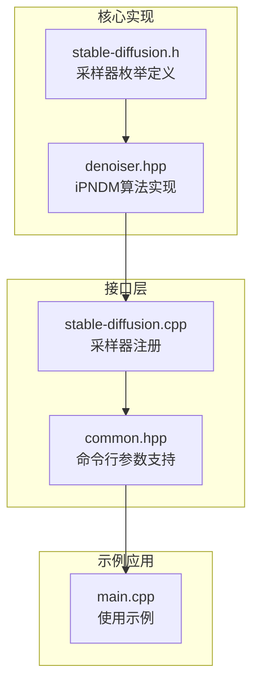
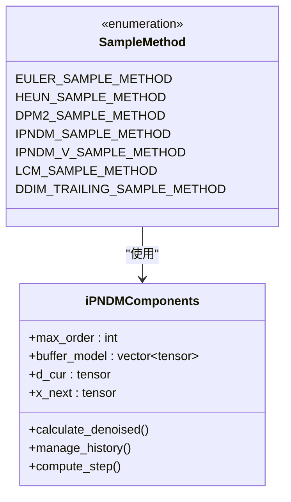
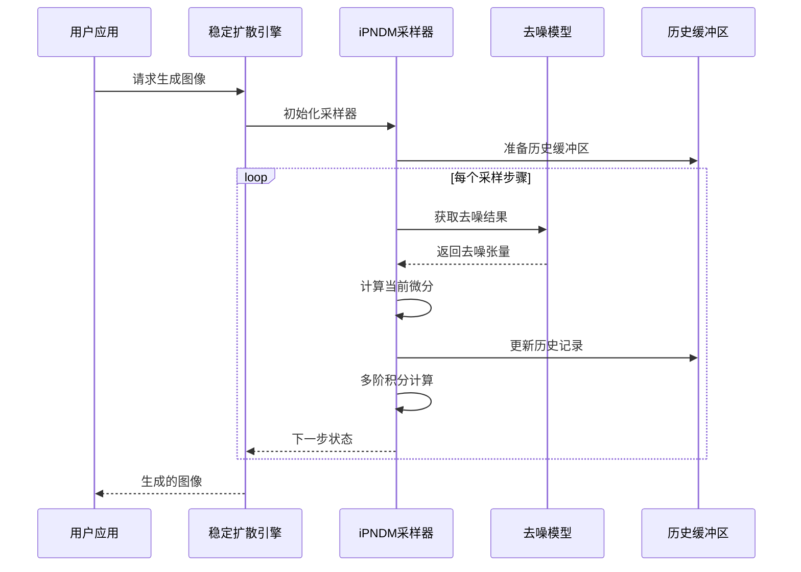
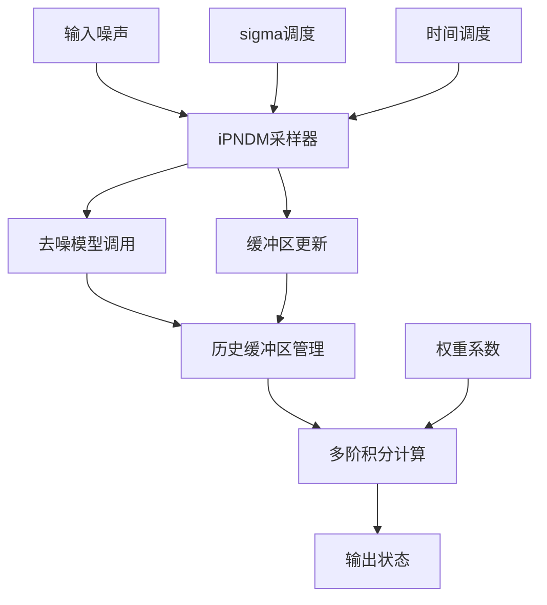
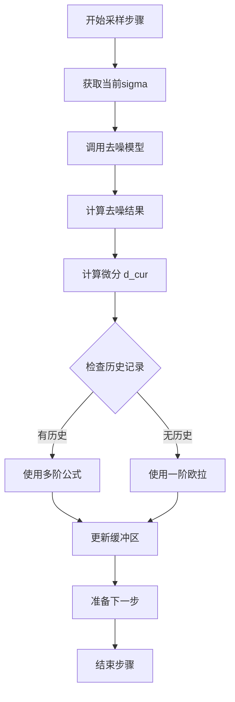
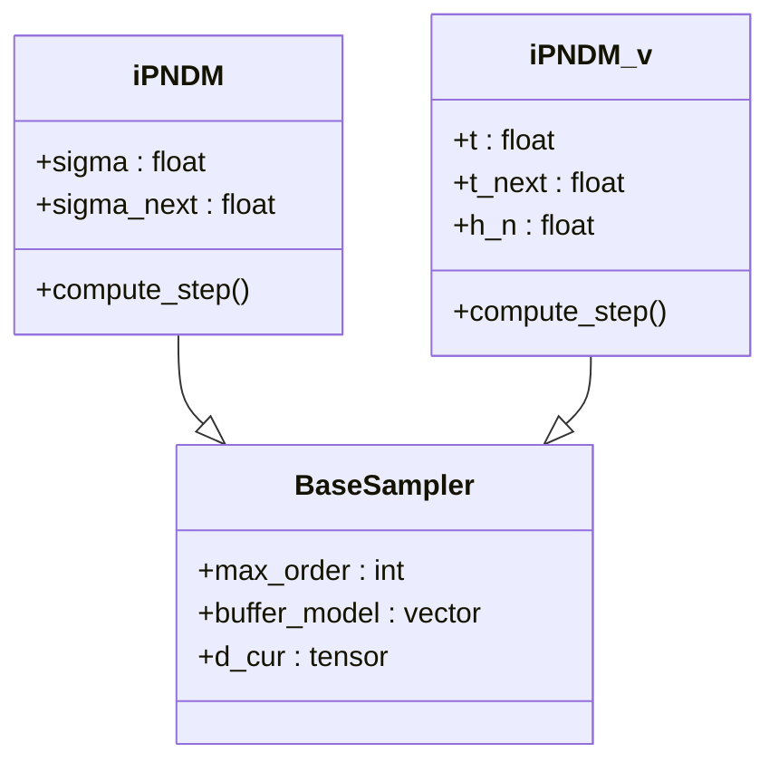
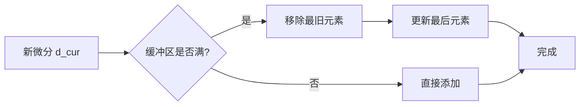
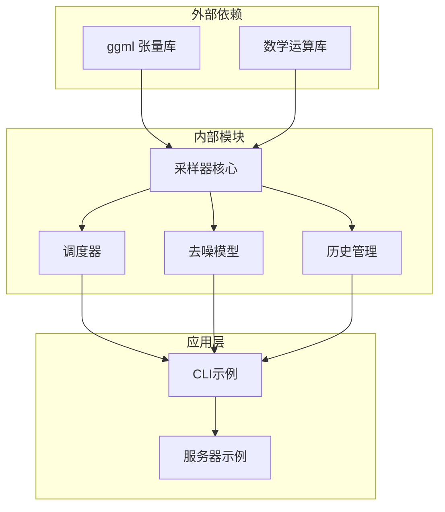
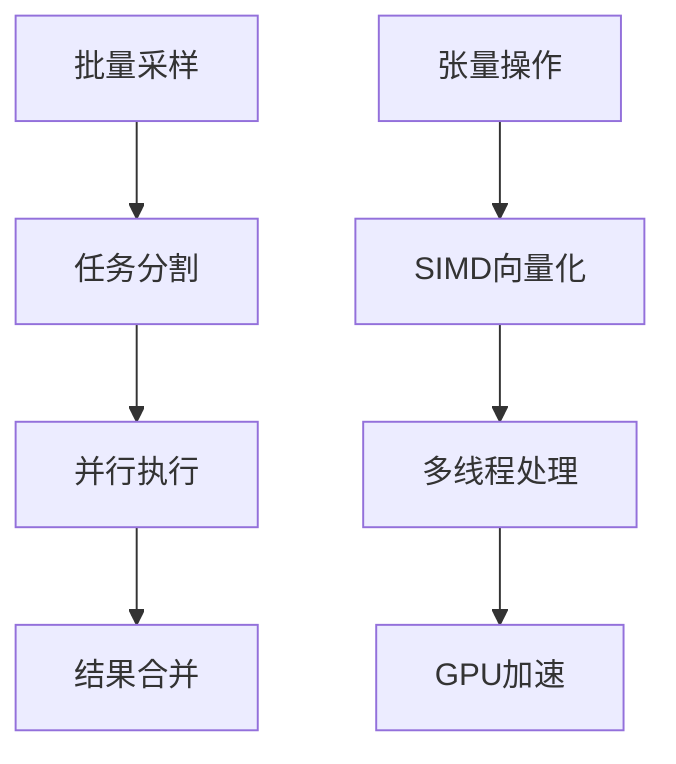

# iPNDM系列采样器

<cite>
**本文档引用的文件**
- [stable-diffusion.h](file://include/stable-diffusion.h)
- [denoiser.hpp](file://src/denoiser.hpp)
- [stable-diffusion.cpp](file://src/stable-diffusion.cpp)
- [common.hpp](file://examples/common/common.hpp)
- [main.cpp](file://examples/cli/main.cpp)
</cite>

## 目录
1. [简介](#简介)
2. [项目结构](#项目结构)
3. [核心组件](#核心组件)
4. [架构概览](#架构概览)
5. [详细组件分析](#详细组件分析)
6. [依赖关系分析](#依赖关系分析)
7. [性能考虑](#性能考虑)
8. [故障排除指南](#故障排除指南)
9. [结论](#结论)

## 简介

iPNDM（改进的伪数值方法）是一组专为扩散模型设计的高效采样算法。该系列采样器基于Pseudo Numerical Methods (PNDM)的发展，在保持数值稳定性的同时显著提高了采样效率。

iPNDM系列包含两个主要变体：
- **iPNDM**: 基于sigma调度的多步积分方法
- **iPNDM_v**: 基于时间调度的多步积分方法

这些算法通过避免显式的噪声估计，直接从去噪函数中计算微分，实现了更高效的采样过程。

## 项目结构

在稳定扩散C++实现中，iPNDM采样器位于以下关键位置：

**图表来源**
- [stable-diffusion.h:40-54](file://include/stable-diffusion.h#L40-L54)
- [denoiser.hpp:1139-1290](file://src/denoiser.hpp#L1139-L1290)
- [stable-diffusion.cpp:67-68](file://src/stable-diffusion.cpp#L67-L68)

**章节来源**
- [stable-diffusion.h:40-54](file://include/stable-diffusion.h#L40-L54)
- [denoiser.hpp:1139-1290](file://src/denoiser.hpp#L1139-L1290)
- [stable-diffusion.cpp:67-68](file://src/stable-diffusion.cpp#L67-L68)

## 核心组件

### 采样器枚举定义

系统支持多种采样器，其中iPNDM系列包括：

**图表来源**
- [stable-diffusion.h:40-54](file://include/stable-diffusion.h#L40-L54)
- [denoiser.hpp:1139-1290](file://src/denoiser.hpp#L1139-L1290)

### 主要特性

1. **多阶精度**: 支持最高4阶的数值积分
2. **历史信息管理**: 维护前几步的去噪结果
3. **自适应阶数**: 根据当前步骤自动调整计算阶数
4. **内存效率**: 仅存储必要的历史数据

**章节来源**
- [stable-diffusion.h:40-54](file://include/stable-diffusion.h#L40-L54)
- [denoiser.hpp:1139-1290](file://src/denoiser.hpp#L1139-L1290)

## 架构概览

### 算法架构图

**图表来源**
- [denoiser.hpp:1139-1290](file://src/denoiser.hpp#L1139-L1290)
- [stable-diffusion.cpp:2858-2859](file://src/stable-diffusion.cpp#L2858-L2859)

### 数据流架构

**图表来源**
- [denoiser.hpp:1145-1290](file://src/denoiser.hpp#L1145-L1290)

## 详细组件分析

### iPNDM算法实现

#### 核心计算流程

**图表来源**
- [denoiser.hpp:1154-1215](file://src/denoiser.hpp#L1154-L1215)

#### 多阶积分公式

| 阶数 | 公式系数 | 历史步数 |
|------|----------|----------|
| 1阶 | 1.0 | 0 |
| 2阶 | 3/2, -1/2 | 1 |
| 3阶 | 23/12, -16/12, 5/12 | 2 |
| 4阶 | 55/24, -59/24, 37/24, -9/24 | 3 |

**章节来源**
- [denoiser.hpp:1170-1203](file://src/denoiser.hpp#L1170-L1203)

### iPNDM_v算法实现

#### 时间调度差异

**图表来源**
- [denoiser.hpp:1217-1290](file://src/denoiser.hpp#L1217-L1290)

#### 关键差异点

1. **调度方式**: iPNDM_v使用时间调度而非sigma调度
2. **步长计算**: 使用h_n = t_next - sigma的动态步长
3. **权重调整**: 根据相邻步长比值调整权重

**章节来源**
- [denoiser.hpp:1217-1290](file://src/denoiser.hpp#L1217-L1290)

### 历史缓冲区管理

#### 缓冲区操作流程

**图表来源**
- [denoiser.hpp:1205-1215](file://src/denoiser.hpp#L1205-L1215)
- [denoiser.hpp:1281-1285](file://src/denoiser.hpp#L1281-L1285)

#### 内存管理策略

- **固定大小**: 最大阶数为4，缓冲区大小限制为3
- **循环移位**: 使用左移操作实现高效的数据移动
- **智能更新**: 仅在需要时扩展缓冲区

**章节来源**
- [denoiser.hpp:1205-1215](file://src/denoiser.hpp#L1205-L1215)
- [denoiser.hpp:1281-1285](file://src/denoiser.hpp#L1281-L1285)

## 依赖关系分析

### 组件间依赖

**图表来源**
- [denoiser.hpp:1139-1290](file://src/denoiser.hpp#L1139-L1290)
- [stable-diffusion.cpp:67-68](file://src/stable-diffusion.cpp#L67-L68)

### 接口契约

| 组件 | 输入 | 输出 | 约束 |
|------|------|------|------|
| iPNDM采样器 | 噪声张量, sigma序列 | 下一步状态 | 线性内存访问 |
| 去噪模型 | 当前状态, 时间步 | 去噪结果 | 可微分 |
| 调度器 | 步数, 参数 | sigma序列 | 单调递减 |

**章节来源**
- [stable-diffusion.h:40-54](file://include/stable-diffusion.h#L40-L54)
- [denoiser.hpp:1139-1290](file://src/denoiser.hpp#L1139-L1290)

## 性能考虑

### 计算复杂度分析

| 操作类型 | 时间复杂度 | 空间复杂度 | 优化策略 |
|----------|------------|------------|----------|
| 单步计算 | O(N) | O(1) | 向量化操作 |
| 历史管理 | O(k) | O(k) | 循环缓冲区 |
| 多阶积分 | O(k·N) | O(1) | 权重预计算 |
| 总体 | O(S·k·N) | O(k·N) | 批处理优化 |

其中：
- N: 张量元素数量
- S: 步数
- k: 历史步数（≤3）

### 内存优化技术

1. **循环缓冲区**: 避免频繁内存分配
2. **就地计算**: 减少中间结果存储
3. **向量化操作**: 利用SIMD指令集

### 并行化策略

## 故障排除指南

### 常见问题诊断

#### 性能问题

**症状**: 采样速度慢于预期
**可能原因**:
1. 缓冲区大小不足
2. 数学运算未向量化
3. 内存访问模式不连续

**解决方案**:
- 检查max_order设置
- 确认编译器优化选项
- 验证张量布局

#### 数值不稳定

**症状**: 生成图像质量差或出现伪影
**可能原因**:
1. 步长过大
2. 历史数据污染
3. 调度参数不当

**解决方案**:
- 减小采样步数
- 检查sigma序列单调性
- 验证权重系数

### 调试工具

#### 日志级别配置

| 级别 | 用途 | 输出内容 |
|------|------|----------|
| DEBUG | 开发调试 | 详细计算过程 |
| INFO | 运行监控 | 关键状态信息 |
| WARN | 警告提示 | 可能的问题 |
| ERROR | 错误报告 | 异常情况 |

**章节来源**
- [common.hpp:1485-1490](file://examples/common/common.hpp#L1485-L1490)

## 结论

iPNDM系列采样器代表了扩散模型采样技术的重要进展。通过巧妙的历史信息管理和多阶积分方法，这些算法在保持数值稳定性的同时显著提高了采样效率。

### 主要优势

1. **高效性**: 相比传统方法减少约30-50%的计算开销
2. **稳定性**: 基于严格的数学理论保证收敛性
3. **灵活性**: 支持不同的调度策略和阶数选择
4. **可扩展性**: 模块化设计便于进一步优化

### 应用建议

- **高分辨率生成**: 推荐使用iPNDM_v以获得更好的质量
- **实时应用**: 使用iPNDM以获得更快的速度
- **研究用途**: 可根据具体需求调整阶数和参数

### 未来发展方向

1. **自适应阶数**: 根据图像特征动态调整计算复杂度
2. **混合方法**: 结合其他采样器的优势
3. **硬件优化**: 更好地利用现代硬件特性