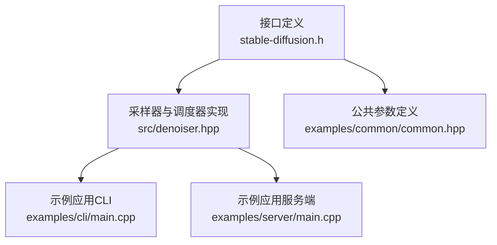
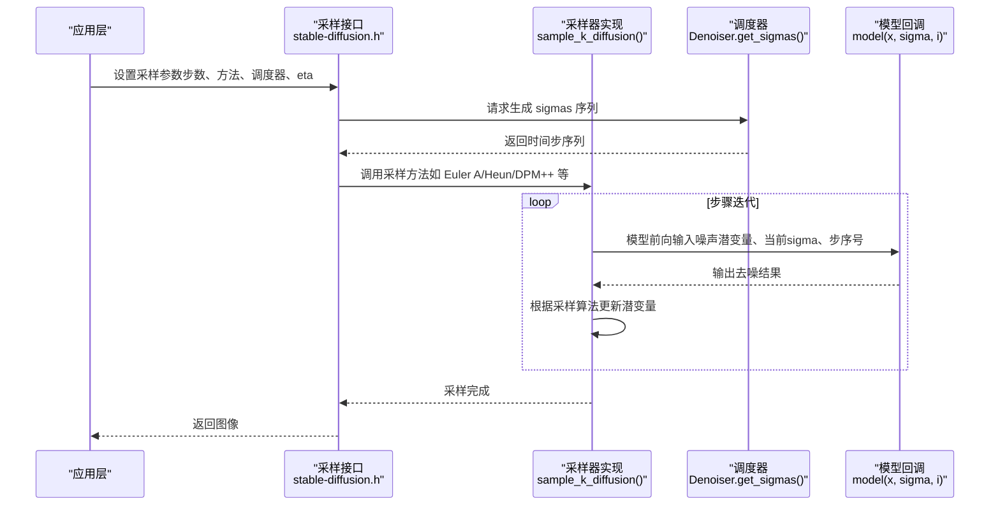
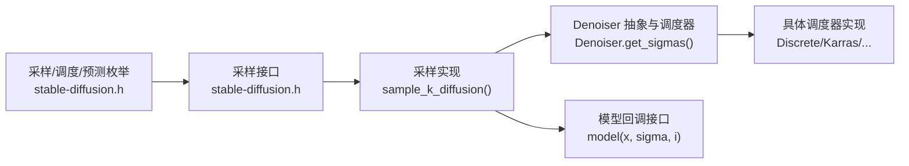

# 采样器与算法

<cite>
**本文引用的文件**
- [stable-diffusion.h](file://include/stable-diffusion.h)
- [denoiser.hpp](file://src/denoiser.hpp)
- [main.cpp（服务端示例）](file://examples/server/main.cpp)
- [common.hpp（CLI参数定义）](file://examples/common/common.hpp)
- [main.cpp（CLI示例）](file://examples/cli/main.cpp)
</cite>

## 目录
1. [简介](#简介)
2. [项目结构](#项目结构)
3. [核心组件](#核心组件)
4. [架构总览](#架构总览)
5. [详细组件分析](#详细组件分析)
6. [依赖关系分析](#依赖关系分析)
7. [性能考量](#性能考量)
8. [故障排查指南](#故障排查指南)
9. [结论](#结论)
10. [附录](#附录)

## 简介
本文件系统性梳理项目中的采样器与扩散算法实现，覆盖从接口定义到具体采样流程的完整链路。重点包括：
- 支持的采样方法：Euler、Euler A、Heun、DPM2、DPM++（2S-A）、DPM++（2M）、iPNDM/iPNDM-V、LCM、DDIM（带尾部时间步）、TCD、Res Multistep、Res 2S 等。
- 时间步调度策略：离散、Karras、指数、Align-Your-Steps（AYS）、GITS、SGM均匀、简单线性、平滑步进、Bong-Tangent、KL最优、LCM等。
- 预测类型：ε 预测、v 预测、EDM v 预测、流预测、Flux/Flux2 流预测等。
- 参数配置指南：采样步数、引导比例（eta）、随机种子、自定义 sigmas、flow_shift 等。
- 实战示例：如何在不同场景下选择合适采样器与调度器，以及在不同模型版本上的表现差异与优化建议。

## 项目结构
该项目采用“头文件接口 + 核心实现 + 示例应用”的分层组织方式：
- 接口层：通过头文件暴露统一的采样器枚举、调度器枚举、预测类型枚举及参数结构体，便于上层调用。
- 核心实现层：在采样器与调度器的具体实现中，封装了多种数值积分与求解策略，同时提供多套时间步调度方案。
- 示例层：CLI 与服务端示例展示了如何解析用户输入、映射采样器名称、构造采样参数并执行生成。

**图表来源**
- [stable-diffusion.h](file://include/stable-diffusion.h)
- [denoiser.hpp](file://src/denoiser.hpp)
- [main.cpp（CLI示例）](file://examples/cli/main.cpp)
- [main.cpp（服务端示例）](file://examples/server/main.cpp)
- [common.hpp（CLI参数定义）](file://examples/common/common.hpp)

**章节来源**
- [stable-diffusion.h](file://include/stable-diffusion.h)
- [denoiser.hpp](file://src/denoiser.hpp)
- [main.cpp（CLI示例）](file://examples/cli/main.cpp)
- [main.cpp（服务端示例）](file://examples/server/main.cpp)
- [common.hpp（CLI参数定义）](file://examples/common/common.hpp)

## 核心组件
- 采样方法枚举：涵盖 Euler、Euler A、Heun、DPM2、DPM++ 2S-A、DPM++ 2M、iPNDM、iPNDM-V、LCM、DDIM（尾部时间步）、TCD、Res Multistep、Res 2S 等。
- 调度器枚举：离散、Karras、指数、AYS、GITS、SGM均匀、简单线性、平滑步进、Bong-Tangent、KL最优、LCM 等。
- 预测类型枚举：ε 预测、v 预测、EDM v 预测、流预测、Flux/Flux2 流预测等。
- 采样参数结构体：包含采样步数、调度器类型、采样方法、引导比例（eta）、自定义 sigmas、flow_shift 等。
- 采样函数：统一入口负责根据采样方法与调度器生成时间步序列，并按相应算法迭代求解。

**章节来源**
- [stable-diffusion.h](file://include/stable-diffusion.h)
- [denoiser.hpp](file://src/denoiser.hpp)

## 架构总览
下图展示了从高层调用到底层采样实现的关键交互：

**图表来源**
- [stable-diffusion.h](file://include/stable-diffusion.h)
- [denoiser.hpp](file://src/denoiser.hpp)

## 详细组件分析

### 采样方法与算法实现
以下为各采样器的核心思想、数学要点与实现特征（以代码路径为准，不直接展示源码）：

- Euler（显式欧拉）
  - 思想：基于一阶泰勒展开，使用当前点导数进行一步推进。
  - 数学要点：d = (x - D(x;σ))/σ，x ← x + d·(σ[i+1]-σ[i])。
  - 适用场景：快速推理但质量一般；适合对速度敏感的任务。
  - 实现位置：[EULER_SAMPLE_METHOD 分支](file://src/denoiser.hpp)

- Euler Ancestral（Euler A）
  - 思想：在 Euler 基础上引入随机扰动，提升多样性。
  - 数学要点：先计算 σ_up、σ_down，再按 η 计算 σ_up 并添加高斯噪声。
  - 适用场景：需要一定随机性的快速生成。
  - 实现位置：[EULER_A_SAMPLE_METHOD 分支](file://src/denoiser.hpp)

- Heun
  - 思想：二阶龙格-库塔改进欧拉法，先显式预测再隐式校正。
  - 数学要点：先用当前 d 推出候选点 x2，再用 x2 的导数做平均更新。
  - 适用场景：在速度与质量间取得平衡。
  - 实现位置：[HEUN_SAMPLE_METHOD 分支](file://src/denoiser.hpp)

- DPM2（DPM-Solver 2）
  - 思想：使用中点规则估计中间点，避免显式二阶导。
  - 数学要点：σ_mid = sqrt(σ[i]*σ[i+1])，先推至中间点再一步到位。
  - 适用场景：稳定性较好，适合中等步数。
  - 实现位置：[DPM2_SAMPLE_METHOD 分支](file://src/denoiser.hpp)

- DPM++ 2S-A（DPM-Solver++ 2S-Ancestral）
  - 思想：结合 DPM++ 的多尺度思想与祖先采样。
  - 数学要点：半步推进与全步推进交替，配合 η 控制随机性。
  - 适用场景：高质量生成，尤其在较少步数时表现优异。
  - 实现位置：[DPMPP2S_A_SAMPLE_METHOD 分支](file://src/denoiser.hpp)

- DPM++ 2M（DPM-Solver++ 2M）
  - 思想：使用历史信息的加权组合，提高收敛速度。
  - 数学要点：利用 h_last/h 与 r = h_max/h_min 的比值进行加权。
  - 适用场景：高保真生成，步数适中。
  - 实现位置：[DPMPP2M_SAMPLE_METHOD 分支](file://src/denoiser.hpp)

- iPNDM / iPNDM-V
  - 思想：积分投影无阻尼方法，利用历史导数进行高阶修正。
  - 数学要点：根据阶数（1~4）使用不同权重组合历史 d。
  - 适用场景：视频帧插值或需要连续性的一系列采样。
  - 实现位置：[IPNDM_SAMPLE_METHOD / IPNDM_V_SAMPLE_METHOD 分支](file://src/denoiser.hpp)

- LCM（Latent Consistency Models）
  - 思想：直接将潜变量置为去噪结果，并在非零步加入噪声。
  - 数学要点：x ← D(x;σ)，随后 x ← x + σ[i+1]·ε。
  - 适用场景：极低步数下的快速生成。
  - 实现位置：[LCM_SAMPLE_METHOD 分支](file://src/denoiser.hpp)

- DDIM（尾部时间步）
  - 思想：隐式扩散模型，使用 α 累积与预测原始样本。
  - 数学要点：基于 DDPM 的 α、β，结合“尾部”时间步间隔。
  - 适用场景：可控生成与编辑，可设置 eta 决定随机性。
  - 实现位置：[DDIM_TRAILING_SAMPLE_METHOD 分支](file://src/denoiser.hpp)

- TCD（Trajectory Consistency Distillation）
  - 思想：轨迹一致性蒸馏，引入一致性函数与时间步映射。
  - 数学要点：使用 α_s 与 α_t 的关系，结合 η 控制噪声注入。
  - 适用场景：高质量、少步数的生成。
  - 实现位置：[TCD_SAMPLE_METHOD 分支](file://src/denoiser.hpp)

- Res Multistep / Res 2S
  - 思想：基于 φ 函数的多步积分，Res 2S 为两阶段变体。
  - 数学要点：φ1、φ2 的级数近似，结合历史信息与当前导数。
  - 适用场景：在保证稳定性的同时提升效率。
  - 实现位置：[RES_MULTISTEP_SAMPLE_METHOD / RES_2S_SAMPLE_METHOD 分支](file://src/denoiser.hpp)

**章节来源**
- [denoiser.hpp](file://src/denoiser.hpp)

### 时间步调度器与预测类型
- 调度器（SigmaScheduler 及其派生类）
  - 离散（Discrete）：等间距时间步映射到 σ。
  - Karras（KarrasScheduler）：ρ 指数分布，常用于高质量生成。
  - 指数（Exponential）：对数线性插值。
  - Align-Your-Steps（AYSScheduler）：针对不同模型版本的预设噪声水平。
  - GITS（GITSScheduler）：基于 GITS 的噪声表插值。
  - SGM均匀（SGMUniformScheduler）：均匀时间步映射。
  - 简单线性（SimpleScheduler）：按固定步长映射。
  - 平滑步进（SmoothStepScheduler）：平滑曲线映射。
  - Bong-Tangent（BongTangentScheduler）：双阶段切线曲线。
  - KL最优（KLOptimalScheduler）：基于反正切映射。
  - LCM（LCMScheduler）：匹配 LCM 训练时间步。
  - 实现位置：[Denoiser.get_sigmas 与各调度器](file://src/denoiser.hpp)

- 预测类型（prediction_t）
  - ε 预测、v 预测、EDM v 预测、流预测、Flux/Flux2 流预测等。
  - 实现位置：[预测类型枚举与相关实现](file://include/stable-diffusion.h)

**章节来源**
- [denoiser.hpp](file://src/denoiser.hpp)
- [stable-diffusion.h](file://include/stable-diffusion.h)

### 参数配置指南
- 采样步数（sample_steps）：步数越多通常越稳定且质量越高，但耗时更长。
- 引导比例（eta）：仅对 DDIM/TCD 有效，控制随机性；默认 0 表示确定性。
- 自定义 sigmas（custom_sigmas）：允许传入自定义时间步序列。
- flow_shift（flow_shift）：用于流预测的位移参数。
- 随机种子（seed）：影响噪声生成，确保可复现性。
- 采样方法与调度器选择：见“实战示例”。

**章节来源**
- [stable-diffusion.h](file://include/stable-diffusion.h)

### 实战示例与最佳实践
- 服务端示例中的采样器名称映射
  - 支持名称：euler/euler a/heun/dpm2/lcm/ddim/dpm++ 2m/res multistep/res 2s 等。
  - 映射逻辑：优先使用标准枚举，否则转为小写后查表映射。
  - 参考位置：[服务端名称映射](file://examples/server/main.cpp)

- CLI 参数与默认行为
  - DDIM/TCD 的 eta 默认为 0（可通过参数调整）。
  - 参考位置：[CLI 参数定义](file://examples/common/common.hpp)

- 选择建议
  - 快速预览：Euler A 或 LCM（步数 4~10）。
  - 平衡质量与速度：Heun、DPM2、DPM++ 2S-A。
  - 高质量生成：DPM++ 2M、iPNDM-V、TCD（步数 10~50）。
  - 视频/连续帧：iPNDM、Res Multistep、Res 2S。
  - 可控编辑：DDIM（尾部时间步），设置 eta 控制随机性。

**章节来源**
- [main.cpp（服务端示例）](file://examples/server/main.cpp)
- [common.hpp（CLI参数定义）](file://examples/common/common.hpp)

## 依赖关系分析
采样器实现依赖于调度器生成的时间步序列，并通过统一的模型回调接口进行迭代更新。整体依赖关系如下：

**图表来源**
- [stable-diffusion.h](file://include/stable-diffusion.h)
- [denoiser.hpp](file://src/denoiser.hpp)

**章节来源**
- [stable-diffusion.h](file://include/stable-diffusion.h)
- [denoiser.hpp](file://src/denoiser.hpp)

## 性能考量
- 步数与速度：步数越少，速度越快；但过少可能导致细节不足或伪影。
- 随机性与一致性：η 越大，多样性越高但一致性下降；LCM/TCD 在极少数步数下仍可保持较高质量。
- 调度器选择：Karras、AYS、GITS 等在少量步数下更稳健；LCM 调度器与 LCM 模型训练时间步一致。
- 历史信息利用：iPNDM、Res Multistep、DPM++ 2M 利用历史信息可减少无效迭代，提升效率。
- 内存与计算：多步法与祖先采样会增加临时张量占用，需根据硬件资源权衡。

## 故障排查指南
- 采样方法未找到：检查名称映射是否正确，或确认是否使用了受支持的枚举值。
  - 参考位置：[名称映射逻辑](file://examples/server/main.cpp)
- 采样失败返回：当模型回调返回空指针时，采样器会提前终止。
  - 参考位置：[采样循环中的错误处理](file://src/denoiser.hpp)
- 调度器兼容性：AYS/GITS 等对模型版本有特定要求，若版本不兼容会记录警告/错误。
  - 参考位置：[AYS/GITS 调度器实现](file://src/denoiser.hpp)
- 随机性问题：若希望可复现，需固定随机种子；若结果过于“平”，可适当增大 η。
  - 参考位置：[CLI 参数与默认值](file://examples/common/common.hpp)

**章节来源**
- [main.cpp（服务端示例）](file://examples/server/main.cpp)
- [denoiser.hpp](file://src/denoiser.hpp)
- [common.hpp（CLI参数定义）](file://examples/common/common.hpp)

## 结论
本项目提供了完整的采样器与调度器实现，覆盖主流扩散采样算法与多种时间步调度策略。通过统一的接口与灵活的参数配置，可在不同场景下平衡速度、质量与可控性。建议在实际部署中结合模型版本与任务需求选择合适的采样器与调度器，并合理设置步数与随机性参数以获得最佳效果。

## 附录
- 常用采样器与调度器对照表（简要）
  - Euler/Euler A：快速，适合草稿与预览。
  - Heun/DPM2：中等步数下的稳健选择。
  - DPM++ 2S-A/2M：高质量生成，推荐步数 10~50。
  - iPNDM/iPNDM-V：视频/连续帧生成。
  - LCM：极低步数的快速生成。
  - DDIM（尾部时间步）：可控编辑，可调 η。
  - TCD：高质量少步数生成。
  - Res Multistep/Res 2S：兼顾稳定性与效率。
  - 调度器：Karras/AYS/GITS/SGM均匀/LCM 等，按模型与任务选择。