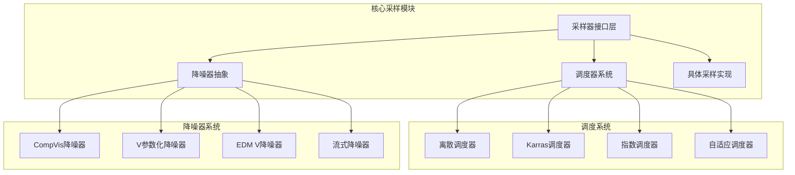
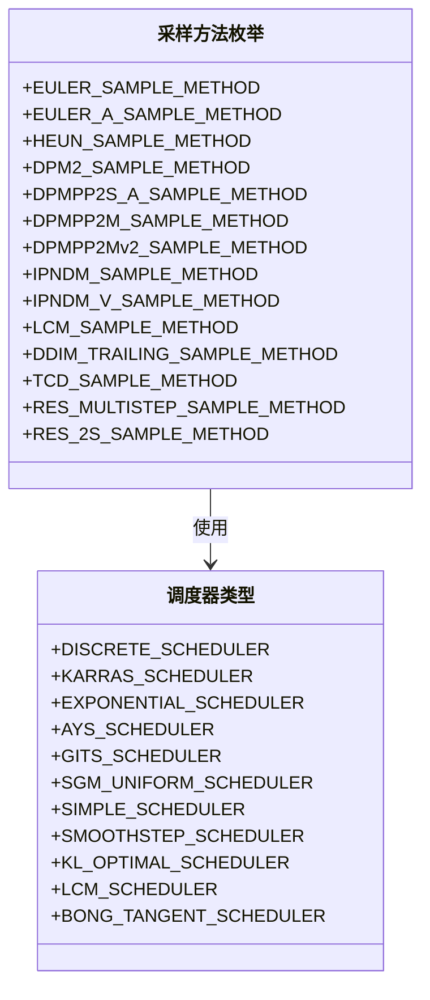
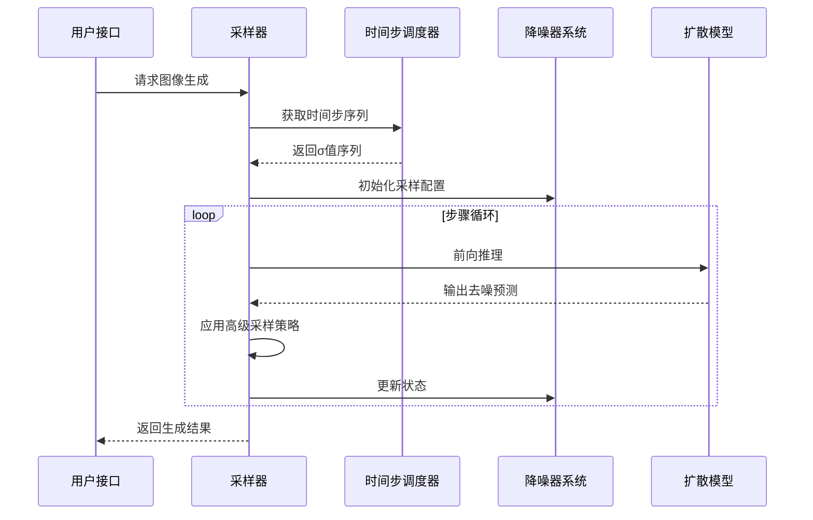
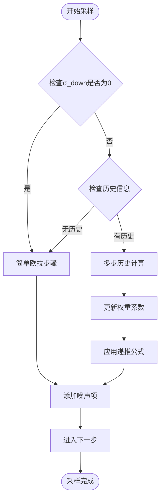
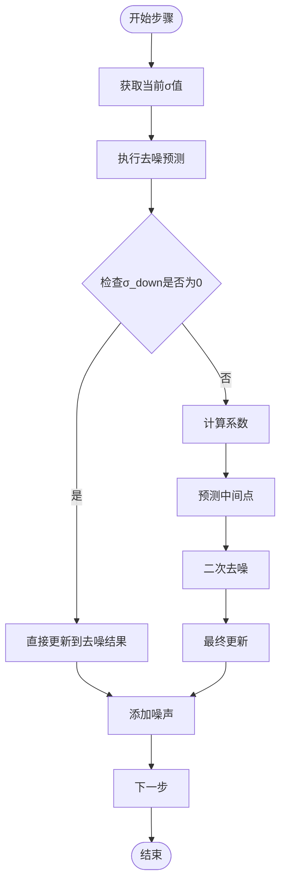
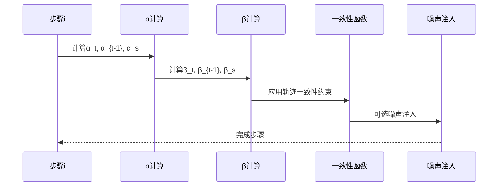
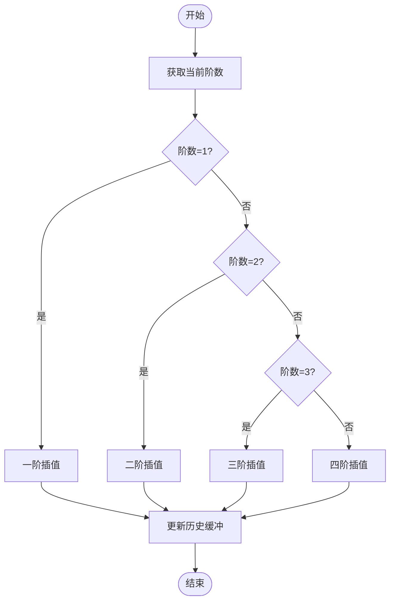
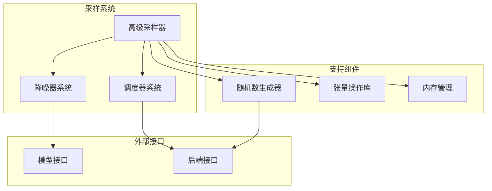

# 高级采样方法

<cite>
**本文档引用的文件**
- [stable-diffusion.cpp](file://src/stable-diffusion.cpp)
- [denoiser.hpp](file://src/denoiser.hpp)
- [stable-diffusion.h](file://include/stable-diffusion.h)
- [performance.md](file://docs/performance.md)
</cite>

## 目录
1. [简介](#简介)
2. [项目结构](#项目结构)
3. [核心组件](#核心组件)
4. [架构概览](#架构概览)
5. [详细组件分析](#详细组件分析)
6. [依赖关系分析](#依赖关系分析)
7. [性能考虑](#性能考虑)
8. [故障排除指南](#故障排除指南)
9. [结论](#结论)

## 简介

本文件详细介绍稳定扩散模型中的高级采样技术，重点涵盖Res Multistep、Res 2s、TCD（Trajectory Consistency Distillation）和iPNDM_v等先进采样方法。这些方法通过结合多步历史信息、自适应时间步调度和一致性约束，在保证生成质量的同时显著提升采样效率。

高级采样方法的核心思想是：
- 利用多步历史信息进行更精确的时间积分
- 采用非均匀时间步调度以优化采样路径
- 引入一致性约束确保轨迹的稳定性
- 结合噪声注入策略平衡确定性和随机性

## 项目结构

该项目采用模块化设计，高级采样功能主要集中在以下组件：



**图表来源**
- [denoiser.hpp:480-544](file://src/denoiser.hpp#L480-L544)
- [stable-diffusion.cpp:59-74](file://src/stable-diffusion.cpp#L59-L74)

**章节来源**
- [stable-diffusion.cpp:59-74](file://src/stable-diffusion.cpp#L59-L74)
- [denoiser.hpp:480-544](file://src/denoiser.hpp#L480-L544)

## 核心组件

### 采样方法枚举定义

项目支持14种不同的采样方法，其中高级采样技术包括：



**图表来源**
- [stable-diffusion.h:38-69](file://include/stable-diffusion.h#L38-L69)
- [stable-diffusion.h:56-69](file://include/stable-diffusion.h#L56-L69)

### 采样器接口设计

采样器采用统一接口设计，支持多种采样策略：

| 采样方法 | 类型标识 | 特点描述 |
|---------|---------|----------|
| Res Multistep | RES_MULTISTEP_SAMPLE_METHOD | 多步Res采样，结合历史信息 |
| Res 2s | RES_2S_SAMPLE_METHOD | 二步Res采样，高效确定性 |
| TCD | TCD_SAMPLE_METHOD | 轨迹一致性蒸馏 |
| iPNDM_v | IPNDM_V_SAMPLE_METHOD | 改进的PNDM变体 |

**章节来源**
- [stable-diffusion.h:38-54](file://include/stable-diffusion.h#L38-L54)
- [stable-diffusion.cpp:59-74](file://src/stable-diffusion.cpp#L59-L74)

## 架构概览

高级采样方法的整体架构采用分层设计：



**图表来源**
- [denoiser.hpp:764-771](file://src/denoiser.hpp#L764-L771)
- [stable-diffusion.cpp:3489-3533](file://src/stable-diffusion.cpp#L3489-L3533)

## 详细组件分析

### Res Multistep 采样器

Res Multistep是基于多步历史信息的高级采样方法，通过引入历史导数信息提升采样精度。

#### 数学原理

该方法使用以下递推关系：

```
当 σ_down = 0 时:
    x_{n+1} = x_n + h * (x_n - D(x_n, σ_n)) / σ_n

当 σ_down > 0 且存在历史信息时:
    x_{n+1} = σ_h * x_n + h * (b1 * D_n + b2 * D_{n-1})
```

其中：
- `σ_h = exp(-h)` 是衰减因子
- `h = t_{n+1} - t_n` 是时间步长
- `b1, b2` 是基于历史信息的权重系数

#### 实现特点



**图表来源**
- [denoiser.hpp:1690-1797](file://src/denoiser.hpp#L1690-L1797)

#### 关键算法实现

1. **时间函数定义**：
   - `t_fn(σ) = -ln(σ)`
   - `σ_fn(t) = exp(-t)`

2. **辅助函数**：
   - `φ1(t) = (e^t - 1) / t`
   - `φ2(t) = (φ1(t) - 1) / t`

3. **权重计算**：
   - `c2 = 0.5`
   - `b1 = φ1(-hc2) - φ2(-h) / c2`
   - `b2 = φ2(-h) / c2`

**章节来源**
- [denoiser.hpp:1690-1797](file://src/denoiser.hpp#L1690-L1797)

### Res 2s 采样器

Res 2s是Res Multistep的简化版本，专注于两步计算的高效实现。

#### 计算流程



**图表来源**
- [denoiser.hpp:1798-1899](file://src/denoiser.hpp#L1798-L1899)

#### 数学公式

对于两步计算：
1. 中间点预测：`x2 = x0 + h * a21 * (D(x0, σ1) - x0)`
2. 权重系数：`a21 = c2 * φ1(-h * c2)`
3. 最终更新：`x = x0 + h * (b1 * (D(x0, σ1) - x0) + b2 * (D(x2, σc2) - x0))`

**章节来源**
- [denoiser.hpp:1798-1899](file://src/denoiser.hpp#L1798-L1899)

### TCD（Trajectory Consistency Distillation）采样器

TCD通过轨迹一致性约束实现高效的单步采样。

#### 算法步骤



**图表来源**
- [denoiser.hpp:1520-1689](file://src/denoiser.hpp#L1520-L1689)

#### 核心实现逻辑

1. **时间步映射**：
   ```
   timestep = ⌊(1 - i * original_steps / steps)⌋
   timestep_s = ⌊(1 - η) * prev_timestep⌋
   ```

2. **轨迹一致性计算**：
   ```
   x_{pred} = (x/√(σ²+1) - √β_t * D(x,σ)) / √α_t
   x = √α_s * x_{pred} + √β_s * D(x,σ)
   ```

3. **噪声注入**：
   ```
   x = √(α_{t-1}/α_s) * x + √(1 - α_{t-1}/α_s) * ε
   ```

**章节来源**
- [denoiser.hpp:1520-1689](file://src/denoiser.hpp#L1520-L1689)

### iPNDM_v 采样器

iPNDM_v是改进的PNDM（Pseudo Numerical Methods for Diffusion）变体，结合了历史信息和自适应权重。

#### 实现特征

该采样器支持最大阶数为4的历史信息缓冲，根据当前阶数选择相应的插值公式：



**图表来源**
- [denoiser.hpp:1217-1215](file://src/denoiser.hpp#L1217-L1215)

#### 插值公式

- 一阶：`x_{n+1} = x_n + (σ_{n+1} - σ_n) * D_n`
- 二阶：`x_{n+1} = x_n + (σ_{n+1} - σ_n) * (3*D_n - D_{n-1}) / 2`
- 三阶：`x_{n+1} = x_n + (σ_{n+1} - σ_n) * (23*D_n - 16*D_{n-1} + 5*D_{n-2}) / 12`
- 四阶：`x_{n+1} = x_n + (σ_{n+1} - σ_n) * (55*D_n - 59*D_{n-1} + 37*D_{n-2} - 9*D_{n-3}) / 24`

**章节来源**
- [denoiser.hpp:1217-1215](file://src/denoiser.hpp#L1217-L1215)

## 依赖关系分析

高级采样方法与系统其他组件的依赖关系如下：



**图表来源**
- [denoiser.hpp:762-771](file://src/denoiser.hpp#L762-L771)
- [stable-diffusion.cpp:118-123](file://src/stable-diffusion.cpp#L118-L123)

### 组件耦合分析

1. **低耦合设计**：采样器通过统一接口与调度器和降噪器交互
2. **可扩展性**：新的采样方法可通过继承接口轻松集成
3. **资源管理**：采样过程中的内存和计算资源得到优化管理

**章节来源**
- [denoiser.hpp:762-771](file://src/denoiser.hpp#L762-L771)
- [stable-diffusion.cpp:118-123](file://src/stable-diffusion.cpp#L118-L123)

## 性能考虑

### 内存优化策略

高级采样方法在内存使用方面具有显著优势：

| 采样方法 | 内存占用 | 计算复杂度 | 适用场景 |
|---------|----------|------------|----------|
| Res Multistep | 中等 | O(n) | 高质量生成 |
| Res 2s | 较低 | O(n) | 实时应用 |
| TCD | 最低 | O(1) | 单步快速生成 |
| iPNDM_v | 中等 | O(n) | 历史信息丰富场景 |

### 加速技术

1. **Flash Attention**：启用后可减少内存使用并提升CUDA后端性能
2. **权重卸载**：支持将权重迁移到CPU以节省显存
3. **量化技术**：通过模型量化进一步降低内存需求

**章节来源**
- [performance.md:1-26](file://docs/performance.md#L1-L26)

## 故障排除指南

### 常见问题及解决方案

#### 采样失败问题

**症状**：采样过程中出现错误或结果异常
**可能原因**：
1. 时间步参数设置不当
2. 历史缓冲区溢出
3. 数值稳定性问题

**解决方法**：
1. 检查采样步数设置
2. 验证调度器配置
3. 调整η参数值

#### 性能问题

**症状**：采样速度慢或内存使用过高
**解决策略**：
1. 选择合适的采样方法（TCD适合快速生成）
2. 启用Flash Attention优化
3. 使用权重卸载功能

**章节来源**
- [stable-diffusion.cpp:2261](file://src/stable-diffusion.cpp#L2261)
- [performance.md:20-26](file://docs/performance.md#L20-L26)

## 结论

高级采样方法通过引入多步历史信息、自适应权重和一致性约束，在稳定扩散模型中实现了质量与效率的双重提升。Res Multistep和Res 2s提供了灵活的多步采样策略，TCD实现了高效的单步生成，而iPNDM_v则结合了历史信息的高精度特性。

这些方法的成功应用需要：
1. 对采样参数的深入理解
2. 合适的硬件资源配置
3. 根据应用场景选择最优的采样策略

通过合理选择和调优，高级采样方法能够显著改善生成质量和用户体验，为稳定扩散技术的实际应用提供了强有力的技术支撑。