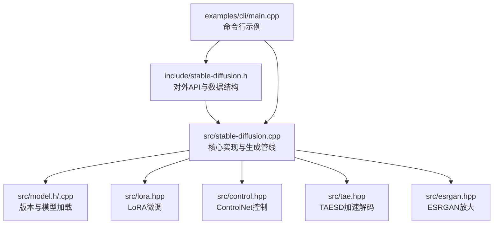
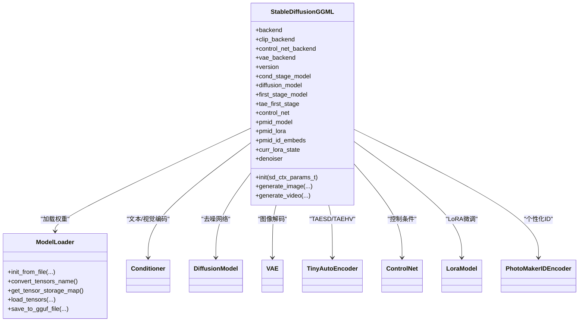
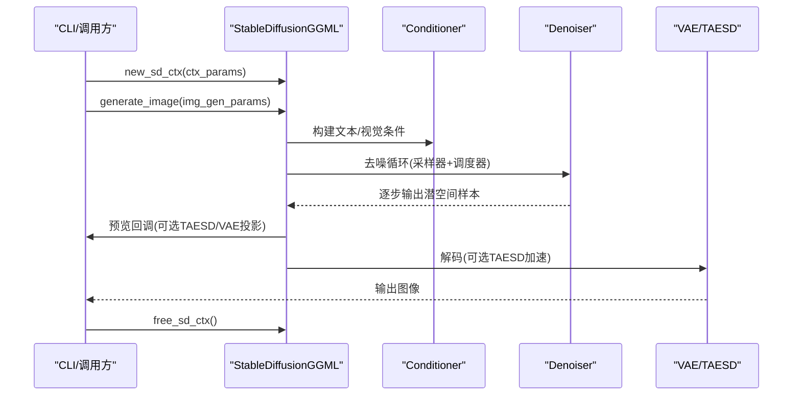
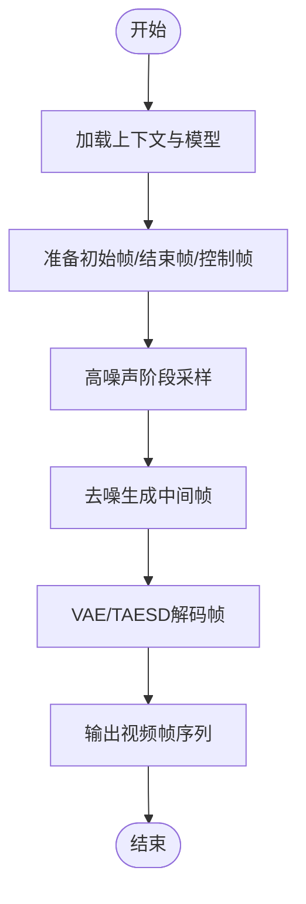
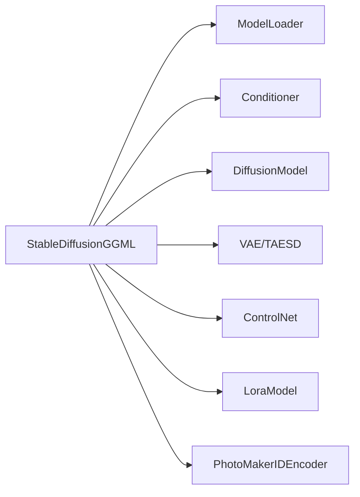

# 核心功能

<cite>
**本文引用的文件**
- [include/stable-diffusion.h](file://include/stable-diffusion.h)
- [src/stable-diffusion.cpp](file://src/stable-diffusion.cpp)
- [src/model.h](file://src/model.h)
- [src/model.cpp](file://src/model.cpp)
- [examples/cli/main.cpp](file://examples/cli/main.cpp)
- [src/lora.hpp](file://src/lora.hpp)
- [src/control.hpp](file://src/control.hpp)
- [src/esrgan.hpp](file://src/esrgan.hpp)
- [src/tae.hpp](file://src/tae.hpp)
</cite>

## 目录
1. [简介](#简介)
2. [项目结构](#项目结构)
3. [核心组件](#核心组件)
4. [架构总览](#架构总览)
5. [详细组件分析](#详细组件分析)
6. [依赖关系分析](#依赖关系分析)
7. [性能考量](#性能考量)
8. [故障排查指南](#故障排查指南)
9. [结论](#结论)
10. [附录](#附录)

## 简介
本文件系统性梳理稳定扩散.cpp（C++）的核心功能与实现，覆盖以下主题：
- 图像生成：文本到图像、图像到图像（修复/重绘）、Instruct-Pix2Pix、LoRA微调、ControlNet控制、TAESD加速、预览回调、缓存策略
- 视频生成：基于扩散模型的视频生成流程与参数
- 模型转换：权重类型转换、名称映射、GGUF导出
- 图像放大：ESRGAN超分辨率推理
- 高级特性：PhotoMaker个性化、TAESD加速、ESRGAN放大等

同时给出API接口说明、参数定义、返回值与错误处理策略，并提供可复现的使用路径与扩展建议。

## 项目结构
- 头文件与对外API集中在 include/stable-diffusion.h，定义了上下文参数、采样参数、生成参数、回调函数、以及图像/视频生成、ESRGAN放大、模型转换等接口
- 核心实现位于 src/stable-diffusion.cpp，负责模型加载、版本识别、后端初始化、调度器与采样器选择、LoRA/ControlNet/TAESD/ESRGAN集成、生成管线执行
- 模型与版本信息在 src/model.h/.cpp 中定义，包含版本枚举、张量存储、模型加载器等
- 示例在 examples/cli/main.cpp，展示命令行模式下的完整工作流
- 高级特性模块分别在 src/lora.hpp、src/control.hpp、src/tae.hpp、src/esrgan.hpp 中实现

图示来源
- [include/stable-diffusion.h](file://include/stable-diffusion.h)
- [src/stable-diffusion.cpp](file://src/stable-diffusion.cpp)
- [src/model.h](file://src/model.h)
- [src/lora.hpp](file://src/lora.hpp)
- [src/control.hpp](file://src/control.hpp)
- [src/tae.hpp](file://src/tae.hpp)
- [src/esrgan.hpp](file://src/esrgan.hpp)
- [examples/cli/main.cpp](file://examples/cli/main.cpp)

章节来源
- [include/stable-diffusion.h](file://include/stable-diffusion.h)
- [src/stable-diffusion.cpp](file://src/stable-diffusion.cpp)
- [src/model.h](file://src/model.h)
- [src/model.cpp](file://src/model.cpp)
- [examples/cli/main.cpp](file://examples/cli/main.cpp)

## 核心组件
- 上下文与模型加载
  - 通过 sd_ctx_params_t 初始化运行时上下文，支持多后端（CPU/CUDA/Metal/Vulkan/OpenCL/SYCL），可指定权重类型、LoRA应用时机、Flash Attention开关、循环卷积、VAE/CLIP/ControlNet/TAESD等位置与参数
  - 版本识别与模型加载：根据模型文件自动识别版本（SD1.x/SDXL/SD3/Flux/Flux.2/Wan/Qwen/Anima/Z-Image/Ovis等），并按前缀加载对应子模块权重
- 采样与调度
  - 支持多种采样器（Euler/Euler A/Heun/DPM2/DPM++系列/iPNDM/LCM/DDIM/TCD/ResMultistep/Res2s）
  - 支持多种调度器（离散/Karras/指数/Ays/Gits/SGM/简单/平滑步长/KL最优/LCM/邦 tang等）
  - 支持预测类型（ε预测、v预测、EDM v预测、流预测、Flux/Flux.2/Chroma等）
- 生成参数
  - 文本到图像/视频：prompt/negative_prompt、CFG强度、CLIP跳层、初始图像/结束图像、掩码、控制图/控制帧、LoRA列表、采样步数、种子、批量数、缩放强度、视频帧数、帧率等
  - 视频生成：高噪声阶段采样参数、MoE边界、VA-CE强度等
- 预览与进度
  - 预览回调：可选TAESD/VAE投影预览，支持“仅去噪输出”或“含噪声输入”
  - 进度回调：每步耗时统计
  - 日志回调：统一日志级别

章节来源
- [include/stable-diffusion.h](file://include/stable-diffusion.h)
- [src/stable-diffusion.cpp](file://src/stable-diffusion.cpp)
- [src/model.h](file://src/model.h)
- [src/model.cpp](file://src/model.cpp)

## 架构总览
整体架构围绕 StableDiffusionGGML 类展开，负责：
- 后端初始化与设备选择
- 条件编码器（CLIP/Flux/T5/LLM等）与扩散模型（UNet/MMDiT/Flux/Wan/Qwen/Anima/Z-Image等）构建
- VAE/TAESD/ControlNet/LoRA/PhotoMakerID等模块接入
- 生成管线：条件嵌入→时间步嵌入→扩散去噪→VAE/TAESD解码→输出

图示来源
- [src/stable-diffusion.cpp](file://src/stable-diffusion.cpp)
- [src/model.h](file://src/model.h)
- [src/model.cpp](file://src/model.cpp)

## 详细组件分析

### 图像生成（文本到图像/修复/重绘）
- 关键接口
  - new_sd_ctx / free_sd_ctx：创建/销毁上下文
  - generate_image：执行文本到图像生成，返回图像数组
  - sd_set_preview_callback / sd_set_progress_callback / sd_set_log_callback：设置预览/进度/日志回调
- 参数要点
  - 采样参数：采样器、调度器、采样步数、ETA、自定义sigmas、flow_shift
  - 引导参数：txt_cfg/img_cfg/distilled_guidance、可选SLG（skip layers/guide）
  - 初始图像/掩码/参考图像：支持inpaint/pix2pix/修复场景
  - 控制图与强度：配合ControlNet
  - LoRA：多LoRA叠加，支持不同权重倍率
  - PhotoMaker：ID嵌入与风格强度
  - VAE/TAESD：可开启TAESD加速解码
  - 缓存：可配置缓存模式与阈值
- 流程示意

图示来源
- [include/stable-diffusion.h](file://include/stable-diffusion.h)
- [src/stable-diffusion.cpp](file://src/stable-diffusion.cpp)
- [examples/cli/main.cpp](file://examples/cli/main.cpp)

章节来源
- [include/stable-diffusion.h](file://include/stable-diffusion.h)
- [src/stable-diffusion.cpp](file://src/stable-diffusion.cpp)
- [examples/cli/main.cpp](file://examples/cli/main.cpp)

### 视频生成（文本到视频/图像到视频）
- 关键接口
  - generate_video：执行视频生成，返回帧数组与帧数
- 参数要点
  - 初始帧/结束帧：用于插值/过渡
  - 控制帧序列：逐帧控制
  - 高噪声阶段采样参数：提升视频质量与稳定性
  - MoE边界、VA-CE强度：针对特定模型（如Wan）优化
- 流程示意

图示来源
- [include/stable-diffusion.h](file://include/stable-diffusion.h)
- [src/stable-diffusion.cpp](file://src/stable-diffusion.cpp)

章节来源
- [include/stable-diffusion.h](file://include/stable-diffusion.h)
- [src/stable-diffusion.cpp](file://src/stable-diffusion.cpp)

### 模型转换（权重格式转换与导出）
- 接口
  - convert：将模型与VAE权重转换为指定类型（如GGUF），支持张量类型规则与名称转换
- 应用场景
  - 将ckpt/safetensors/gguf等格式统一转换为目标精度，便于部署或跨平台迁移
- 实现要点
  - ModelLoader 支持从不同格式读取张量元信息与数据偏移
  - 名称转换与类型覆盖逻辑在加载器中完成
  - 可保存为GGUF文件，便于后续直接加载

章节来源
- [include/stable-diffusion.h](file://include/stable-diffusion.h)
- [src/model.cpp](file://src/model.cpp)

### 图像放大（ESRGAN）
- 接口
  - new_upscaler_ctx / free_upscaler_ctx：创建/销毁放大器上下文
  - upscale：对输入图像进行上采样（默认4倍）
  - get_upscale_factor：查询当前模型上采样因子
- 实现要点
  - 自动检测模型规模（1/2/4倍）与块数，构造RRDBNet
  - 支持分块推理以降低显存占用
  - 支持外部权重文件加载与参数缓冲区管理

章节来源
- [include/stable-diffusion.h](file://include/stable-diffusion.h)
- [src/esrgan.hpp](file://src/esrgan.hpp)

### LoRA微调支持
- 功能概述
  - 加载LoRA权重，按需融合到扩散模型/条件编码器/VAE权重中
  - 支持Lora/HADA/LOKR等多种适配器差异计算
  - 可在量化权重场景下延迟融合或立即融合
- 关键点
  - LoraModel::build_lora_graph：构建融合图，按张量名匹配并加权求和
  - 支持diff/lora_up/down/lora_mid/alpha/scale等参数
  - apply_lora_immediately由上下文参数与量化状态决定

章节来源
- [src/lora.hpp](file://src/lora.hpp)
- [src/stable-diffusion.cpp](file://src/stable-diffusion.cpp)

### PhotoMaker个性化
- 功能概述
  - 通过ID嵌入与LoRA权重实现人物风格迁移
  - 支持v1/v2版本差异
- 实现要点
  - PhotoMakerIDEncoder与pmid_lora加载
  - 在生成时注入ID嵌入与风格强度

章节来源
- [src/stable-diffusion.cpp](file://src/stable-diffusion.cpp)

### ControlNet控制
- 功能概述
  - 通过额外的控制分支引导扩散过程，保持结构一致性
- 实现要点
  - ControlNetBlock：ResBlock/Attention/DownSample组合，带hint分支
  - 控制特征缓存：首次计算后复用，加速推理
  - 支持SD1.x/SD2.x/SDXL/SVD等版本差异

章节来源
- [src/control.hpp](file://src/control.hpp)
- [src/stable-diffusion.cpp](file://src/stable-diffusion.cpp)

### TAESD加速
- 功能概述
  - 使用小型解码器替代完整VAE，显著降低解码开销
- 实现要点
  - TinyAutoEncoder/TAESD/TAEHV：图像/视频专用轻量解码器
  - Flux/Flux.2/Wan等模型可启用patchify/unpatchify以适配通道数

章节来源
- [src/tae.hpp](file://src/tae.hpp)
- [src/stable-diffusion.cpp](file://src/stable-diffusion.cpp)

## 依赖关系分析
- 组件耦合
  - StableDiffusionGGML 对各子模块（Conditioner/DiffusionModel/VAE/TAESD/ControlNet/Lora/PhotoMaker）存在依赖注入与参数传递
  - ModelLoader 负责张量元信息解析与权重加载，贯穿所有模块
- 外部依赖
  - ggml及其后端（CUDA/Metal/Vulkan/OpenCL/SYCL/CPU）
  - 文件格式：GGUF/safetensors/ckpt/diffusers目录
- 循环依赖
  - 无直接循环；模块间通过指针与共享智能指针连接

图示来源
- [src/stable-diffusion.cpp](file://src/stable-diffusion.cpp)
- [src/model.h](file://src/model.h)

章节来源
- [src/stable-diffusion.cpp](file://src/stable-diffusion.cpp)
- [src/model.h](file://src/model.h)

## 性能考量
- 后端选择
  - GPU后端（CUDA/Metal/Vulkan/OpenCL/SYCL）优先；CPU作为回退
- 内存与显存
  - 分块/分片与offload参数至CPU可缓解显存不足
  - TAESD/TAEHV可显著降低解码成本
  - ESRGAN支持tile_size控制，避免OOM
- 计算优化
  - Flash Attention与Direct Conv可在满足兼容性的前提下提升吞吐
  - 缓存策略（EasyCache/UCache/TaylorSeer/CacheDIT/Spectrum）按场景选择
- 并行度
  - n_threads影响张量加载与计算图执行并行度

## 故障排查指南
- 常见问题
  - 模型加载失败：检查模型路径、格式（GGUF/safetensors/ckpt/diffusers目录）、前缀是否正确
  - LoRA融合异常：确认LoRA权重文件与模型张量名匹配；量化模型可能需要延迟融合
  - ControlNet不生效：确认控制图尺寸与输入一致，且已正确传入strength
  - TAESD解码异常：确认启用taesd_path与preview模式匹配
  - ESRGAN放大失败：检查权重文件完整性与tile_size设置
- 定位手段
  - 使用日志回调查看详细信息
  - 逐步缩小参数范围（禁用LoRA/ControlNet/TAESD/缓存）定位瓶颈
  - 检查后端初始化与设备选择

章节来源
- [include/stable-diffusion.h](file://include/stable-diffusion.h)
- [src/stable-diffusion.cpp](file://src/stable-diffusion.cpp)
- [src/model.cpp](file://src/model.cpp)

## 结论
稳定扩散.cpp提供了从模型加载、条件编码、扩散去噪到解码/放大的完整链路，支持多后端、多模型版本与高级特性（LoRA/ControlNet/TAESD/ESRGAN）。通过清晰的API与可配置参数，开发者可在不同硬件与场景下高效实现图像/视频生成与扩展定制。

## 附录

### API接口与参数说明（摘要）
- 上下文与模型
  - new_sd_ctx / free_sd_ctx：创建/释放上下文
  - sd_ctx_params_t：包含模型路径、CLIP/VAE/ControlNet/LoRA/TAESD、权重类型、随机数类型、Flash Attention、循环卷积、缓存策略等
  - sd_ctx_params_init / sd_ctx_params_to_str：参数初始化与字符串化
- 采样与生成
  - sd_sample_params_t：采样器、调度器、采样步数、ETA、自定义sigmas、flow_shift
  - sd_img_gen_params_t / sd_vid_gen_params_t：图像/视频生成参数（prompt/negative_prompt、CFG、初始/结束图像、掩码、控制图/帧、LoRA、种子、批量、视频帧数、缓存等）
  - generate_image / generate_video：执行生成，返回图像/帧数组
- 预览与进度
  - sd_set_preview_callback：预览回调（支持TAESD/VAE投影）
  - sd_set_progress_callback：进度回调（步数/总步数/耗时）
  - sd_set_log_callback：日志回调
- 模型转换与放大
  - convert：权重转换与导出
  - new_upscaler_ctx / free_upscaler_ctx / upscale / get_upscale_factor：ESRGAN放大

章节来源
- [include/stable-diffusion.h](file://include/stable-diffusion.h)
- [src/stable-diffusion.cpp](file://src/stable-diffusion.cpp)
- [src/esrgan.hpp](file://src/esrgan.hpp)

### 使用示例（路径指引）
- 命令行示例
  - CLI入口：examples/cli/main.cpp
  - 支持模式：img_gen/vid_gen/upscale/convert
  - 参数解析与生成流程：参见主函数中的参数解析、资源加载、生成调用与结果保存
- 代码路径参考
  - 图像生成：[examples/cli/main.cpp](file://examples/cli/main.cpp)
  - 视频生成：同上，VID_GEN分支
  - ESRGAN放大：同上，UPSCALE分支
  - 模型转换：同上，CONVERT分支

章节来源
- [examples/cli/main.cpp](file://examples/cli/main.cpp)