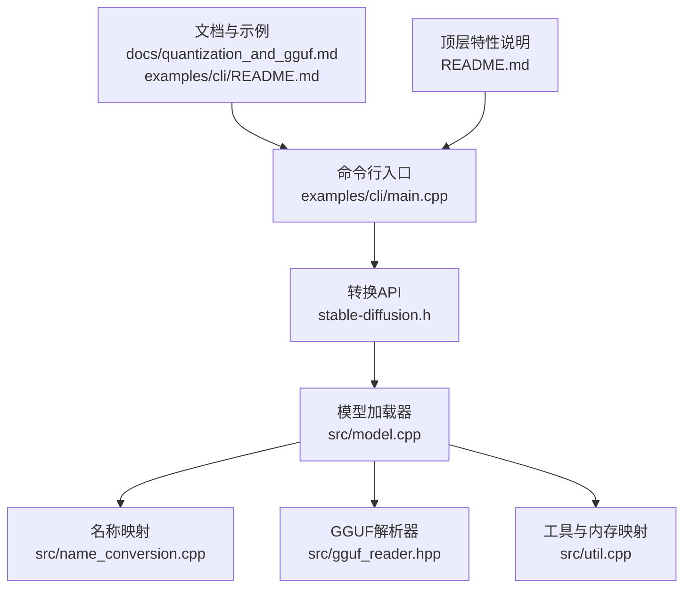
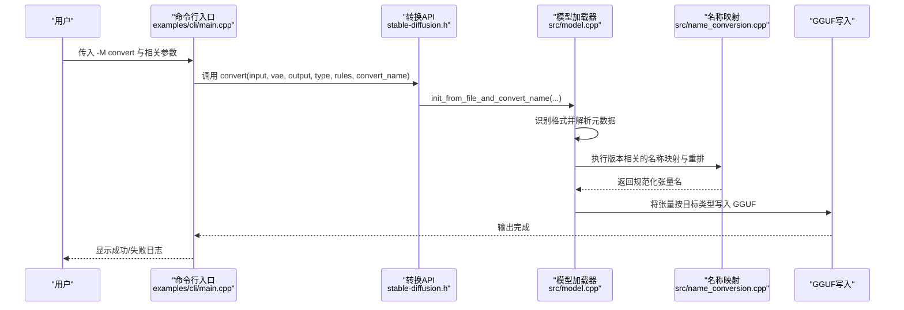
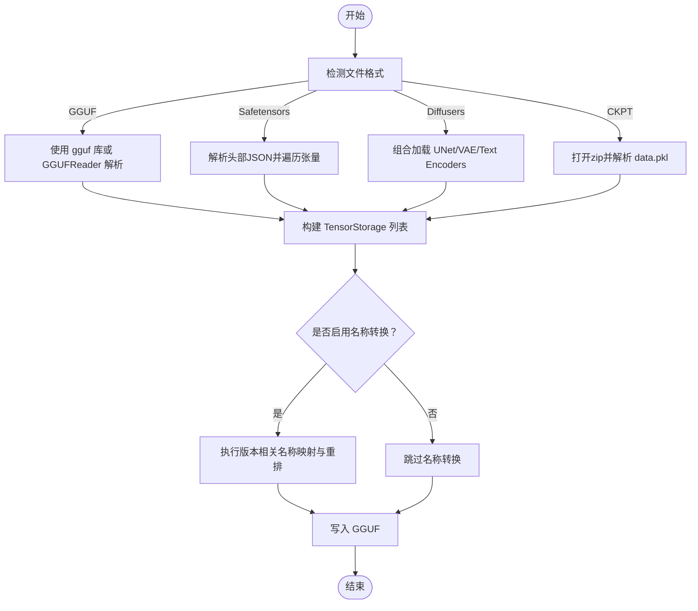
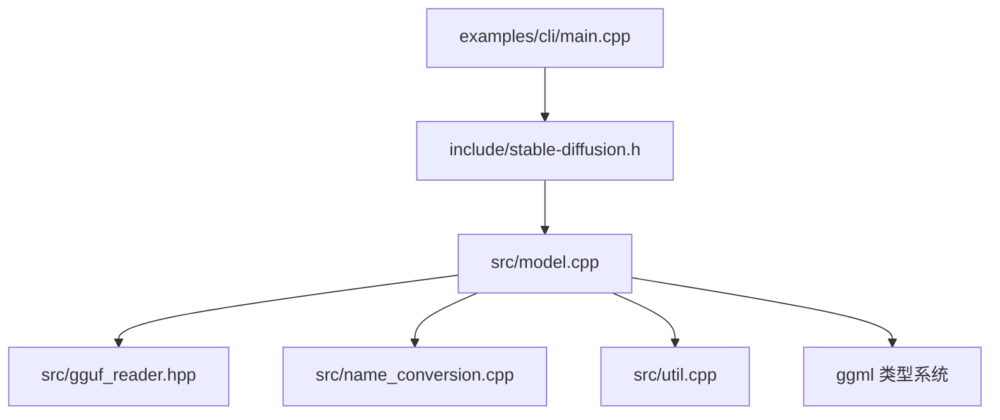

# 模型转换

<cite>
**本文引用的文件**
- [README.md](file://README.md)
- [quantization_and_gguf.md](file://docs/quantization_and_gguf.md)
- [stable-diffusion.h](file://include/stable-diffusion.h)
- [model.cpp](file://src/model.cpp)
- [gguf_reader.hpp](file://src/gguf_reader.hpp)
- [name_conversion.cpp](file://src/name_conversion.cpp)
- [util.cpp](file://src/util.cpp)
- [main.cpp](file://examples/cli/main.cpp)
- [README.md](file://examples/cli/README.md)
</cite>

## 目录
1. [简介](#简介)
2. [项目结构](#项目结构)
3. [核心组件](#核心组件)
4. [架构总览](#架构总览)
5. [详细组件分析](#详细组件分析)
6. [依赖关系分析](#依赖关系分析)
7. [性能考量](#性能考量)
8. [故障排除指南](#故障排除指南)
9. [结论](#结论)
10. [附录](#附录)

## 简介
本文件系统性阐述 stable-diffusion.cpp 的“模型转换”能力：如何将来自不同框架与格式的权重（如 PyTorch ckpt、safetensors、Diffusers 目录、GGUF）统一转换为本地可加载的 GGUF 格式，并在转换过程中完成权重类型量化、张量名称映射与重排、以及内存与并发优化。文档同时给出命令行接口说明、批量与增量策略、性能优化建议与常见问题排查方法。

## 项目结构
围绕模型转换的关键模块与文件如下：
- 命令行入口与模式分发：examples/cli/main.cpp
- 转换对外 API：include/stable-diffusion.h 中的 convert(...) 函数
- 模型加载与转换实现：src/model.cpp（含多种格式解析、类型转换、张量读取与写入）
- GGUF 解析工具：src/gguf_reader.hpp
- 名称映射与张量重排：src/name_conversion.cpp
- 工具函数与内存映射：src/util.cpp
- 文档与示例：docs/quantization_and_gguf.md、examples/cli/README.md
- 顶层特性与支持格式：README.md

图示来源
- [main.cpp:521-541](file://examples/cli/main.cpp#L521-L541)
- [stable-diffusion.h:401-406](file://include/stable-diffusion.h#L401-L406)
- [model.cpp:361-407](file://src/model.cpp#L361-L407)
- [gguf_reader.hpp:173-229](file://src/gguf_reader.hpp#L173-L229)
- [name_conversion.cpp:664-679](file://src/name_conversion.cpp#L664-L679)
- [util.cpp:184-220](file://src/util.cpp#L184-L220)
- [README.md:75-78](file://README.md#L75-L78)
- [quantization_and_gguf.md:19-27](file://docs/quantization_and_gguf.md#L19-L27)
- [README.md:1-151](file://examples/cli/README.md#L1-L151)

章节来源
- [README.md:75-78](file://README.md#L75-L78)
- [README.md:102-124](file://README.md#L102-L124)
- [quantization_and_gguf.md:1-27](file://docs/quantization_and_gguf.md#L1-L27)
- [README.md:1-151](file://examples/cli/README.md#L1-L151)

## 核心组件
- 转换入口与模式
  - 命令行模式 -M/--mode convert 启动转换流程；convert-name 参数控制是否进行张量名转换。
  - 对外 API convert(...) 接收输入路径、VAE 路径、输出路径、目标类型、张量类型规则与名称转换开关。
- 模型加载器
  - 自动识别输入格式：GGUF、safetensors、Diffusers 目录、PyTorch ckpt(zip)。
  - 统一构建 TensorStorage 列表，记录张量名、形状、类型、偏移等元信息。
- 类型转换与量化
  - 支持 F32/F16 与多种整数量化类型；自动处理 F8/E4M3、F8/E5M2、F64、I64 等特殊类型到 F16/F32 的转换。
  - 可按张量正则规则覆盖特定张量的目标类型，避免对 bias/scale/embedding 等不必要转换。
- 名称映射与张量重排
  - 针对不同版本（SD1.x/SD2.x、SDXL、SD3/Flux/Flux2/Z-Image/Anima 等）执行名称映射与层级重排。
  - 支持从 Diffusers UNet/VAE/CLIP 到原版权重命名的双向映射。
- 内存与并发
  - 支持 mmap 加速大文件读取；多线程并行读取与转换；按需拷贝至后端缓冲区。
  - 提供 VAE 并行瓦片处理参数以降低显存占用。

章节来源
- [main.cpp:521-541](file://examples/cli/main.cpp#L521-L541)
- [stable-diffusion.h:401-406](file://include/stable-diffusion.h#L401-L406)
- [model.cpp:361-407](file://src/model.cpp#L361-L407)
- [model.cpp:232-281](file://src/model.cpp#L232-L281)
- [model.cpp:1677-1708](file://src/model.cpp#L1677-L1708)
- [name_conversion.cpp:664-679](file://src/name_conversion.cpp#L664-L679)
- [util.cpp:184-220](file://src/util.cpp#L184-L220)

## 架构总览
下图展示从命令行到最终 GGUF 输出的完整转换链路：

图示来源
- [main.cpp:521-541](file://examples/cli/main.cpp#L521-L541)
- [stable-diffusion.h:401-406](file://include/stable-diffusion.h#L401-L406)
- [model.cpp:398-407](file://src/model.cpp#L398-L407)
- [name_conversion.cpp:664-679](file://src/name_conversion.cpp#L664-L679)

## 详细组件分析

### 组件A：命令行与模式分发
- 模式选择
  - -M/--mode convert：进入转换模式；默认输出扩展名为 .gguf。
  - --convert-name：启用张量名转换（名称映射与重排）。
- 关键参数
  - -m/--model：输入模型路径（支持 ckpt/safetensors/diffusers/GGUF）。
  - -o/--output：输出 GGUF 文件路径。
  - --type：目标权重类型（f32/f16/q4_0/q4_1/q5_0/q5_1/q8_0 等）。
  - --tensor-type-rules：按正则覆盖特定张量的目标类型。
  - --vae：指定 VAE 路径（用于某些模型的 VAE 合并与解码）。
- 行为
  - 调用 convert(...) 完成转换；失败时返回非零退出码。

章节来源
- [README.md:1-151](file://examples/cli/README.md#L1-L151)
- [main.cpp:521-541](file://examples/cli/main.cpp#L521-L541)

### 组件B：对外转换 API
- 函数原型
  - bool convert(const char* input_path, const char* vae_path, const char* output_path, enum sd_type_t output_type, const char* tensor_type_rules, bool convert_name)
- 功能要点
  - 输入路径可为 ckpt、safetensors、diffusers 目录或 GGUF。
  - 输出为 GGUF；可指定目标类型与张量类型规则。
  - 可选进行名称转换（convert_name=true）。

章节来源
- [stable-diffusion.h:401-406](file://include/stable-diffusion.h#L401-L406)

### 组件C：模型加载与格式解析
- 自动格式识别
  - init_from_file(...) 根据文件头判断 GGUF、safetensors、Diffusers 目录或 ckpt(zip)。
  - init_from_gguf_file(...) 使用 gguf 库或 GGUFReader 读取张量元信息与数据偏移。
  - init_from_safetensors_file(...) 解析头部 JSON，提取张量名、形状、偏移与类型。
  - init_from_ckpt_file(...) 解析 zip 内 data.pkl，重建张量存储。
  - init_from_diffusers_file(...) 组合加载 unet/vae/text_encoder。
- 张量存储
  - TensorStorage 记录张量名、类型、维度、文件索引与偏移，便于后续读取与转换。
- 特殊类型处理
  - F8/E4M3、F8/E5M2、F64、I64 在读取后转换为 F16/F32，再按目标类型量化。

图示来源
- [model.cpp:361-407](file://src/model.cpp#L361-L407)
- [model.cpp:411-477](file://src/model.cpp#L411-L477)
- [model.cpp:502-640](file://src/model.cpp#L502-L640)
- [model.cpp:644-666](file://src/model.cpp#L644-L666)
- [model.cpp:993-1027](file://src/model.cpp#L993-L1027)
- [gguf_reader.hpp:173-229](file://src/gguf_reader.hpp#L173-L229)
- [name_conversion.cpp:664-679](file://src/name_conversion.cpp#L664-L679)

章节来源
- [model.cpp:361-407](file://src/model.cpp#L361-L407)
- [model.cpp:411-477](file://src/model.cpp#L411-L477)
- [model.cpp:502-640](file://src/model.cpp#L502-L640)
- [model.cpp:644-666](file://src/model.cpp#L644-L666)
- [model.cpp:993-1027](file://src/model.cpp#L993-L1027)
- [gguf_reader.hpp:173-229](file://src/gguf_reader.hpp#L173-L229)

### 组件D：类型转换与量化
- 转换路径
  - 若源类型与目标类型相同，直接复制。
  - 若源为 F32：目标为 F16 或任意量化类型时，走 ggml_fp32_to_fp16_row 或 ggml_quantize_chunk。
  - 若目标为 F32：根据 ggml 类型特征表反量化。
  - 其他情况：先反量化为 F32，再量化为目标类型。
- 特殊类型处理
  - F8(E4M3/E5M2)：转为 F16。
  - F64/I64：转为 F32/I32。
- 类型覆盖规则
  - set_wtype_override(...) 支持基于正则表达式的张量类型覆盖。
  - tensor_should_be_converted(...) 过滤掉 bias/scale/embedding 等无需转换的张量。

章节来源
- [model.cpp:232-281](file://src/model.cpp#L232-L281)
- [model.cpp:1286-1340](file://src/model.cpp#L1286-L1340)
- [model.cpp:1677-1708](file://src/model.cpp#L1677-L1708)

### 组件E：名称映射与张量重排
- 面向版本的映射
  - SD1.x/SD2.x → Diffusers UNet/VAE/CLIP 命名映射。
  - SDXL → 不同 UNet/VAE/CLIP 命名映射。
  - SD3 → DiT 命名映射。
  - Flux/Flux2 → 双流/单流 DiT 命名映射。
  - Z-Image、Anima 等 → 特定命名映射。
- 通用映射
  - convert_tensor_name(...) 根据版本选择对应映射函数。
  - convert_diffusers_vae_to_original_sd1(...) 适配 VAE 命名差异。

章节来源
- [name_conversion.cpp:180-279](file://src/name_conversion.cpp#L180-L279)
- [name_conversion.cpp:283-397](file://src/name_conversion.cpp#L283-L397)
- [name_conversion.cpp:399-503](file://src/name_conversion.cpp#L399-L503)
- [name_conversion.cpp:505-616](file://src/name_conversion.cpp#L505-L616)
- [name_conversion.cpp:618-654](file://src/name_conversion.cpp#L618-L654)
- [name_conversion.cpp:664-679](file://src/name_conversion.cpp#L664-L679)
- [name_conversion.cpp:681-784](file://src/name_conversion.cpp#L681-L784)

### 组件F：内存管理与并发
- 内存映射
  - MmapWrapper::create(...) 在支持平台上使用 mmap 加速大文件读取。
- 并发加载
  - 多线程遍历张量，按文件分组并行读取；zip 文件强制串行。
  - 读取完成后按需进行类型转换与拷贝至后端缓冲区。
- 时间统计
  - 统计 process/read/memcpy/convert/copy_to_backend 各阶段耗时，便于性能分析。

章节来源
- [util.cpp:184-220](file://src/util.cpp#L184-L220)
- [model.cpp:1342-1599](file://src/model.cpp#L1342-L1599)

## 依赖关系分析
- 模块耦合
  - CLI 仅通过 convert(...) 与模型加载器交互，职责清晰。
  - 模型加载器内部依赖 gguf_reader、name_conversion、util 等模块。
- 外部依赖
  - gguf 库用于 GGUF 文件解析与张量元信息读取。
  - zip 库用于 ckpt 的 data.pkl 解析。
  - ggml 类型系统与量化/反量化函数用于类型转换。

图示来源
- [main.cpp:521-541](file://examples/cli/main.cpp#L521-L541)
- [stable-diffusion.h:401-406](file://include/stable-diffusion.h#L401-L406)
- [model.cpp:361-407](file://src/model.cpp#L361-L407)
- [gguf_reader.hpp:173-229](file://src/gguf_reader.hpp#L173-L229)
- [name_conversion.cpp:664-679](file://src/name_conversion.cpp#L664-L679)
- [util.cpp:184-220](file://src/util.cpp#L184-L220)

章节来源
- [model.cpp:361-407](file://src/model.cpp#L361-L407)
- [gguf_reader.hpp:173-229](file://src/gguf_reader.hpp#L173-L229)
- [name_conversion.cpp:664-679](file://src/name_conversion.cpp#L664-L679)
- [util.cpp:184-220](file://src/util.cpp#L184-L220)

## 性能考量
- 量化策略
  - 使用 --type 指定目标类型，提前量化可减少首次加载开销。
  - 通过 --tensor-type-rules 为特定张量设置更合适的类型，平衡精度与体积。
- I/O 与并发
  - 启用 mmap 可显著提升大文件读取速度。
  - 多线程并行读取与转换，线程数默认取物理核数，可通过上下文参数调整。
- 内存与显存
  - VAE 并行瓦片处理参数可降低显存占用，适合大分辨率生成。
- 实战建议
  - 将常用模型预先转换为 GGUF 并量化，避免每次启动重复转换。
  - 对于大模型，优先使用 mmap 与多线程；必要时开启 VAE 瓦片处理。

章节来源
- [quantization_and_gguf.md:1-27](file://docs/quantization_and_gguf.md#L1-L27)
- [README.md:44-79](file://examples/cli/README.md#L44-L79)
- [README.md:126-151](file://README.md#L126-L151)

## 故障排除指南
- 常见错误与定位
  - “未知格式/文件不存在”：检查输入路径与扩展名；确认文件存在且可读。
  - “无法打开 zip/GGUF/safetensors”：确认文件未损坏，权限正确。
  - “类型不支持/反量化不可用”：检查目标类型是否受 ggml 支持；必要时改用 f16/f32。
  - “名称映射失败”：确认 convert-name 开关与模型版本匹配。
- 日志与调试
  - 使用 -v/--verbose 获取详细日志；结合 --color 着色区分级别。
  - 查看各阶段耗时统计，定位瓶颈（读取/转换/拷贝）。
- 建议操作
  - 先用小模型验证转换流程，再扩展到大模型。
  - 如遇内存不足，尝试降低线程数、启用 mmap、开启 VAE 瓦片处理。
  - 对于 ckpt，确保包含 data.pkl；对于 Diffusers，确保目录结构完整。

章节来源
- [model.cpp:361-407](file://src/model.cpp#L361-L407)
- [model.cpp:1342-1599](file://src/model.cpp#L1342-L1599)
- [README.md:1-151](file://examples/cli/README.md#L1-L151)

## 结论
stable-diffusion.cpp 的模型转换能力以“统一格式 + 可控量化 + 名称映射 + 并发 I/O”为核心，既能兼容多样化的输入格式，又能产出高性能的本地 GGUF 文件。通过命令行参数与 API 的灵活组合，用户可以实现从 PyTorch/ckpt/safetensors/Diffusers 到 GGUF 的一键转换，并在转换过程中完成类型优化与名称重排，满足不同平台与部署场景的需求。

## 附录

### 命令行接口与参数说明
- 模式与输出
  - -M/--mode convert：进入转换模式；默认输出扩展名为 .gguf。
  - -o/--output：输出文件路径。
- 输入与类型
  - -m/--model：输入模型路径（ckpt/safetensors/diffusers/GGUF）。
  - --type：目标权重类型（f32/f16/q4_0/q4_1/q5_0/q5_1/q8_0 等）。
  - --tensor-type-rules：按逗号分隔的“张量名正则=类型”列表。
  - --vae：指定 VAE 路径（用于合并/解码）。
- 名称转换
  - --convert-name：启用张量名转换（名称映射与重排）。
- 并发与 I/O
  - -t/--threads：线程数（<=0 时自动取物理核数）。
  - --mmap：启用内存映射。
- 其他
  - -v/--verbose：打印额外信息。
  - --color：按日志级别着色。

章节来源
- [README.md:1-151](file://examples/cli/README.md#L1-L151)
- [main.cpp:521-541](file://examples/cli/main.cpp#L521-L541)

### 支持的转换目标格式与优缺点
- GGUF
  - 优点：统一格式、便于跨平台部署、支持量化、元数据丰富。
  - 缺点：需要一次转换成本。
- PyTorch ckpt
  - 优点：通用、易获取。
  - 缺点：体积较大、加载慢；需解析 zip 与 data.pkl。
- Safetensors
  - 优点：安全、无执行风险、元数据明确。
  - 缺点：需解析头部 JSON。
- Diffusers 目录
  - 优点：模块化清晰、易于扩展。
  - 缺点：文件较多、路径复杂。

章节来源
- [README.md:75-78](file://README.md#L75-L78)
- [quantization_and_gguf.md:19-27](file://docs/quantization_and_gguf.md#L19-L27)
- [model.cpp:361-407](file://src/model.cpp#L361-L407)

### 权重名称映射与张量重排机制
- 针对不同版本（SD1.x/SD2.x、SDXL、SD3、Flux/Flux2、Z-Image、Anima 等）采用专用映射表与前缀替换逻辑。
- VAE 命名映射独立处理，保证编码/解码一致性。
- 通过 convert_tensor_name(...) 统一调度，确保不同模型族的张量布局一致。

章节来源
- [name_conversion.cpp:180-279](file://src/name_conversion.cpp#L180-L279)
- [name_conversion.cpp:283-397](file://src/name_conversion.cpp#L283-L397)
- [name_conversion.cpp:399-503](file://src/name_conversion.cpp#L399-L503)
- [name_conversion.cpp:505-616](file://src/name_conversion.cpp#L505-L616)
- [name_conversion.cpp:618-654](file://src/name_conversion.cpp#L618-L654)
- [name_conversion.cpp:664-679](file://src/name_conversion.cpp#L664-L679)
- [name_conversion.cpp:681-784](file://src/name_conversion.cpp#L681-L784)

### 批量转换与增量转换策略
- 批量转换
  - 通过命令行循环调用 convert(...)，逐个处理多个输入模型。
- 增量转换
  - 仅对新增或变更的张量重新转换；当前实现未内置增量缓存，建议在外部脚本中维护已转换清单并按需触发。
- 建议
  - 使用 --tensor-type-rules 为特定张量设定类型，减少重复工作量。
  - 将常用模型预转为 GGUF，避免频繁转换。

章节来源
- [README.md:1-151](file://examples/cli/README.md#L1-L151)
- [model.cpp:1286-1340](file://src/model.cpp#L1286-L1340)

### 内存管理与性能优化
- mmap：加速大文件读取，减少拷贝次数。
- 并发：按文件分组并行读取，zip 强制串行；线程数自适应。
- 类型转换：在内存中进行行级转换，避免多次 IO。
- VAE 瓦片：通过瓦片大小与重叠参数降低显存占用。

章节来源
- [util.cpp:184-220](file://src/util.cpp#L184-L220)
- [model.cpp:1342-1599](file://src/model.cpp#L1342-L1599)
- [README.md:126-151](file://README.md#L126-L151)