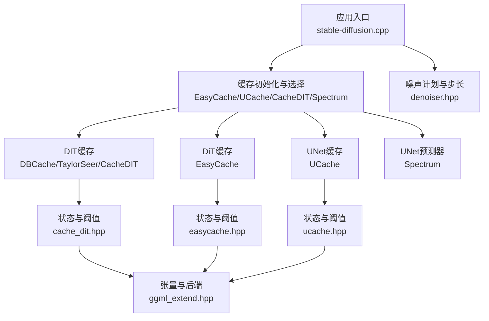
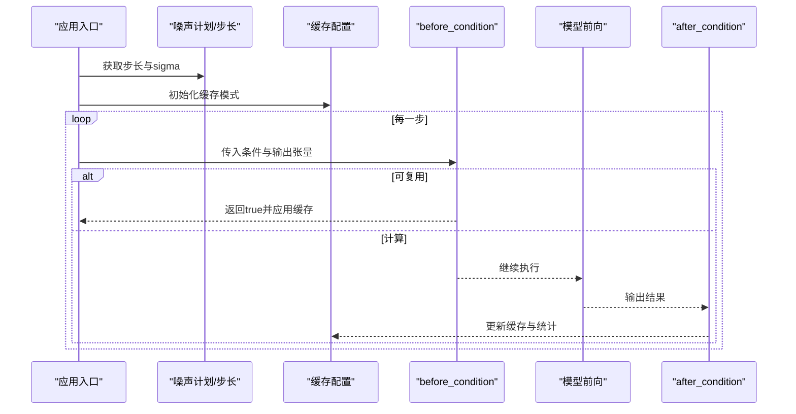
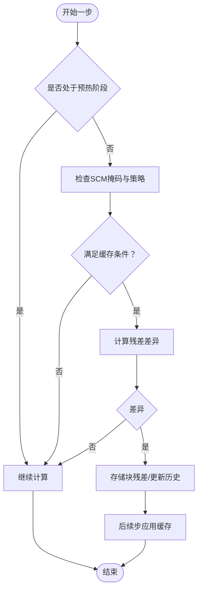
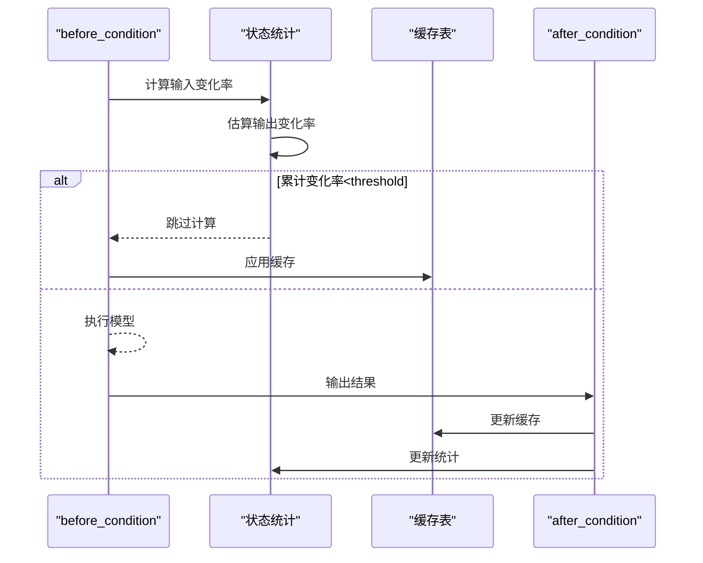
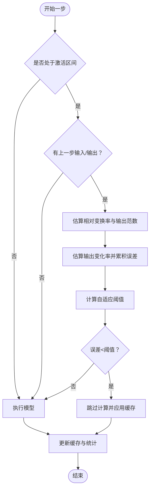
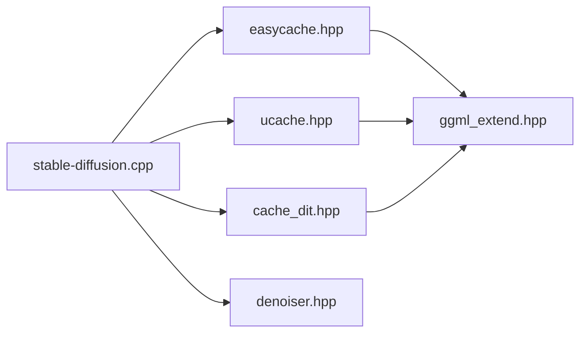

# 缓存系统

<cite>
**本文引用的文件**
- [src/cache_dit.hpp](file://src/cache_dit.hpp)
- [src/easycache.hpp](file://src/easycache.hpp)
- [src/ucache.hpp](file://src/ucache.hpp)
- [src/denoiser.hpp](file://src/denoiser.hpp)
- [src/ggml_extend.hpp](file://src/ggml_extend.hpp)
- [src/stable-diffusion.cpp](file://src/stable-diffusion.cpp)
- [docs/caching.md](file://docs/caching.md)
</cite>

## 目录
1. [简介](#简介)
2. [项目结构](#项目结构)
3. [核心组件](#核心组件)
4. [架构总览](#架构总览)
5. [详细组件分析](#详细组件分析)
6. [依赖关系分析](#依赖关系分析)
7. [性能考量](#性能考量)
8. [故障排除指南](#故障排除指南)
9. [结论](#结论)
10. [附录](#附录)

## 简介
本文件系统性阐述稳定扩散.cpp中的缓存体系，覆盖多级缓存策略与实现细节，重点包括：
- DIT缓存（DBCache + TaylorSeer + CacheDIT）
- EasyCache（DiT模型条件级缓存）
- UCache（UNet模型条件级缓存）
- 生命周期管理、失效策略与内存回收
- 配置指南、命中率优化与性能调优
- 不同硬件后端上的表现差异
- 性能分析与故障排除

## 项目结构
缓存系统主要由以下模块构成：
- 缓存算法与状态：cache_dit.hpp、easycache.hpp、ucache.hpp
- 推理调度与噪声计划：denoiser.hpp
- 张量与后端抽象：ggml_extend.hpp
- 应用入口与集成：stable-diffusion.cpp
- 文档与参数说明：docs/caching.md

图表来源
- [src/stable-diffusion.cpp:1680-1879](file://src/stable-diffusion.cpp#L1680-L1879)
- [src/cache_dit.hpp:1-200](file://src/cache_dit.hpp#L1-L200)
- [src/easycache.hpp:1-120](file://src/easycache.hpp#L1-L120)
- [src/ucache.hpp:1-120](file://src/ucache.hpp#L1-L120)
- [src/denoiser.hpp:1-120](file://src/denoiser.hpp#L1-L120)
- [src/ggml_extend.hpp:1-120](file://src/ggml_extend.hpp#L1-L120)

章节来源
- [src/stable-diffusion.cpp:1680-1879](file://src/stable-diffusion.cpp#L1680-L1879)
- [docs/caching.md:1-150](file://docs/caching.md#L1-L150)

## 核心组件
- DBCache（块级残差阈值）：基于前一时刻残差与当前残差的L1范数差异判断是否缓存块输出，支持前后端块固定计算以保证稳定性。
- TaylorSeer（泰勒近似）：利用导数序列进行时间外推，跳过部分步的计算。
- CacheDIT（组合模式）：同时启用DBCache与TaylorSeer，并提供预设与步骤掩码控制。
- EasyCache（DiT条件级缓存）：在DiT模型中按条件缓存输出差异，基于输入变化阈值决定复用。
- UCache（UNet条件级缓存）：在UNet模型中缓存输出差异，具备自适应阈值、误差衰减与重置策略。

章节来源
- [src/cache_dit.hpp:13-126](file://src/cache_dit.hpp#L13-L126)
- [src/easycache.hpp:9-79](file://src/easycache.hpp#L9-L79)
- [src/ucache.hpp:12-162](file://src/ucache.hpp#L12-L162)
- [docs/caching.md:1-150](file://docs/caching.md#L1-L150)

## 架构总览
缓存系统在推理主循环中通过“before_condition/after_condition”钩子接入，根据当前sigma（噪声强度）与步索引决定是否跳过模型计算或复用缓存。不同缓存模式对条件对象（如文本/图像条件）进行区分与缓存。

图表来源
- [src/stable-diffusion.cpp:1909-2164](file://src/stable-diffusion.cpp#L1909-L2164)
- [src/easycache.hpp:152-212](file://src/easycache.hpp#L152-L212)
- [src/ucache.hpp:267-355](file://src/ucache.hpp#L267-L355)
- [src/cache_dit.hpp:366-528](file://src/cache_dit.hpp#L366-L528)
- [src/denoiser.hpp:16-65](file://src/denoiser.hpp#L16-L65)

## 详细组件分析

### DIT缓存（DBCache + TaylorSeer + CacheDIT）
- 设计要点
  - 块级缓存：将双分支（图像/文本）与单分支（输出）的残差缓存为独立条目，支持前后端块固定计算，避免关键区域不稳定。
  - 残差阈值：比较前一步与当前步残差的L1归一化差异，低于阈值则缓存。
  - 泰勒近似：维护导数序列，基于阶乘与幂次进行外推，结合步间间隔估计当前步输出。
  - 步骤掩码（SCM）：通过“计算/可缓存”掩码与动态/静态策略控制缓存时机。
- 关键接口
  - DBCache：检查缓存决策、更新历史残差、存储/应用块残差与Bn缓冲区。
  - TaylorSeer：更新导数、判断可近似、进行泰勒外推。
  - CacheDIT：统一配置与状态，汇总统计与日志。
- 生命周期与失效
  - 运行时重置：每轮生成重置累计差异、连续缓存计数、缓存步列表等。
  - 失效策略：超过最大累计差异、连续缓存步上限、或未满足阈值即停止缓存。
- 内存回收
  - 缓存条目按块维度分配，随状态重置清空；无显式LRU淘汰，依赖运行时阈值与上限控制容量。

图表来源
- [src/cache_dit.hpp:243-389](file://src/cache_dit.hpp#L243-L389)
- [src/cache_dit.hpp:397-515](file://src/cache_dit.hpp#L397-L515)

章节来源
- [src/cache_dit.hpp:13-554](file://src/cache_dit.hpp#L13-L554)
- [src/stable-diffusion.cpp:1759-1798](file://src/stable-diffusion.cpp#L1759-L1798)
- [docs/caching.md:58-121](file://docs/caching.md#L58-L121)

### EasyCache（DiT条件级缓存）
- 设计要点
  - 条件级缓存：以条件对象为键缓存输出-输入差异向量。
  - 输入变化阈值：比较当前输入与上一步输入的平均绝对变化，低于阈值则复用缓存。
  - 自适应：记录相对变换率与输出范数，用于估算输出变化并累积阈值。
- 生命周期与失效
  - 每步begin_step重置状态；仅在指定sigma区间内激活；首次步锚定条件。
  - 若累计变化率低于阈值则跳过计算并应用缓存，否则更新缓存并记录统计。
- 内存回收
  - 使用哈希表按条件键存储差异向量，随状态重置清理。

图表来源
- [src/easycache.hpp:152-212](file://src/easycache.hpp#L152-L212)
- [src/easycache.hpp:214-265](file://src/easycache.hpp#L214-L265)

章节来源
- [src/easycache.hpp:9-265](file://src/easycache.hpp#L9-L265)
- [src/stable-diffusion.cpp:1711-1731](file://src/stable-diffusion.cpp#L1711-L1731)
- [docs/caching.md:42-57](file://docs/caching.md#L42-L57)

### UCache（UNet条件级缓存）
- 设计要点
  - 与EasyCache类似，但引入误差累积与衰减、自适应阈值（基于进度与相对范数）、EMA输出变化率。
  - 支持“reset error on compute”策略，避免长期累积导致误判。
- 生命周期与失效
  - 激活区间由sigma百分比控制；记录累计误差与连续跳过次数；达到阈值则复用缓存。
- 内存回收
  - 条件键到差异向量映射，随状态重置清理。

图表来源
- [src/ucache.hpp:267-355](file://src/ucache.hpp#L267-L355)
- [src/ucache.hpp:357-420](file://src/ucache.hpp#L357-L420)

章节来源
- [src/ucache.hpp:12-432](file://src/ucache.hpp#L12-L432)
- [src/stable-diffusion.cpp:1732-1758](file://src/stable-diffusion.cpp#L1732-L1758)
- [docs/caching.md:16-41](file://docs/caching.md#L16-L41)

### 缓存配置与使用
- 参数与默认值
  - EasyCache：阈值、起止百分比
  - UCache：阈值、起止百分比、误差衰减、相对阈值、自适应、重置策略
  - CacheDIT：Fn/Bn块数、阈值、预热步、最大缓存步、连续缓存步、SCM掩码与策略
- 预设与掩码
  - 提供slow/medium/fast/ultra预设及对应阈值、预热步、Fn/Bn块数
  - 支持SCM掩码与动态/静态策略
- CLI示例
  - 参考文档中的命令行示例与参数说明

章节来源
- [docs/caching.md:16-150](file://docs/caching.md#L16-L150)
- [src/cache_dit.hpp:606-686](file://src/cache_dit.hpp#L606-L686)
- [src/stable-diffusion.cpp:1716-1794](file://src/stable-diffusion.cpp#L1716-L1794)

## 依赖关系分析
- 缓存系统依赖ggml张量与后端抽象，确保跨后端一致性。
- 缓存状态依赖噪声计划提供的sigma与步长信息，决定激活区间与跳过策略。
- CacheDIT同时依赖DBCache与TaylorSeer两套逻辑，形成组合策略。

图表来源
- [src/stable-diffusion.cpp:1680-1879](file://src/stable-diffusion.cpp#L1680-L1879)
- [src/easycache.hpp:1-20](file://src/easycache.hpp#L1-L20)
- [src/ucache.hpp:1-20](file://src/ucache.hpp#L1-L20)
- [src/cache_dit.hpp:1-20](file://src/cache_dit.hpp#L1-L20)
- [src/ggml_extend.hpp:1-60](file://src/ggml_extend.hpp#L1-L60)
- [src/denoiser.hpp:1-44](file://src/denoiser.hpp#L1-L44)

章节来源
- [src/stable-diffusion.cpp:1680-1879](file://src/stable-diffusion.cpp#L1680-L1879)
- [src/ggml_extend.hpp:1-120](file://src/ggml_extend.hpp#L1-L120)
- [src/denoiser.hpp:1-120](file://src/denoiser.hpp#L1-L120)

## 性能考量
- 命中率优化
  - 降低阈值提升缓存机会但可能影响质量；提高阈值更激进地跳过计算。
  - 合理设置Fn/Bn块数与预热步，平衡稳定性与速度。
  - 利用SCM掩码在关键步强制计算，减少误差传播。
- 硬件后端差异
  - CUDA/Metal/Vulkan/OpenCL/SYCL等后端下，缓存带来的收益取决于张量拷贝与核函数开销的权衡。
  - 在高带宽后端（如CUDA），条件级缓存（EasyCache/UCache）通常更易获得稳定加速。
  - 在低延迟后端，DBCache/TaylorSeer的块级外推可能带来更大收益。
- 监控与调优
  - 通过日志统计“跳过的步数/总步数”、“缓存块比例”、“累计差异”等指标评估效果。
  - 结合采样器类型与模型版本调整参数，例如euler_a更适合保守的UCache策略。

[本节为通用指导，无需特定文件引用]

## 故障排除指南
- 缓存未生效
  - 检查模型类型与缓存模式兼容性（DiT仅支持EasyCache/CacheDIT，UNet仅支持UCache/Spectrum）。
  - 核对起止百分比与sigma区间是否正确设置。
- 质量下降
  - 适当提高阈值或增加预热步，减少早期不稳定步的缓存。
  - 对于UCache，尝试关闭“reset error on compute”以更保守地累积误差。
- 性能不升反降
  - 减少Fn/Bn块数，避免过度固定计算导致瓶颈。
  - 调整SCM掩码，确保关键步不被缓存。
  - 在高带宽后端优先考虑条件级缓存而非块级缓存。

章节来源
- [src/stable-diffusion.cpp:1712-1714](file://src/stable-diffusion.cpp#L1712-L1714)
- [src/stable-diffusion.cpp:1733-1735](file://src/stable-diffusion.cpp#L1733-L1735)
- [src/stable-diffusion.cpp:1762-1764](file://src/stable-diffusion.cpp#L1762-L1764)
- [docs/caching.md:144-150](file://docs/caching.md#L144-L150)

## 结论
稳定扩散.cpp的缓存系统通过条件级与块级两种路径，在不同模型与后端上实现了灵活高效的推理加速。合理配置阈值、预热步与SCM策略，结合硬件特性进行调优，可在保证质量的前提下显著提升吞吐。建议从默认参数起步，逐步微调并持续监控关键指标以获得最佳效果。

[本节为总结性内容，无需特定文件引用]

## 附录

### 缓存模式对比与适用场景
- EasyCache：DiT模型条件级缓存，适合输入变化较小的场景。
- UCache：UNet模型条件级缓存，支持自适应阈值与误差衰减，适合多种采样器。
- DBCache/TaylorSeer/CacheDIT：DiT模型块级缓存与外推，适合高步数与稳定性的场景。
- Spectrum：UNet模型输出预测，适合长序列或视频生成。

章节来源
- [docs/caching.md:5-15](file://docs/caching.md#L5-L15)
- [src/stable-diffusion.cpp:1799-1820](file://src/stable-diffusion.cpp#L1799-L1820)