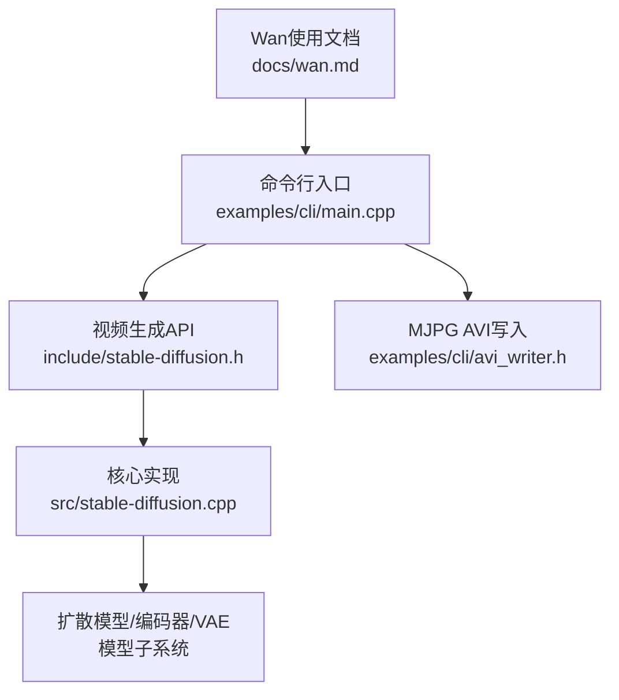
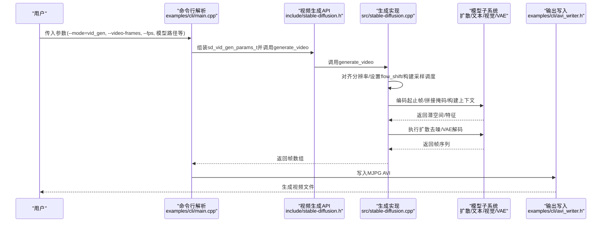
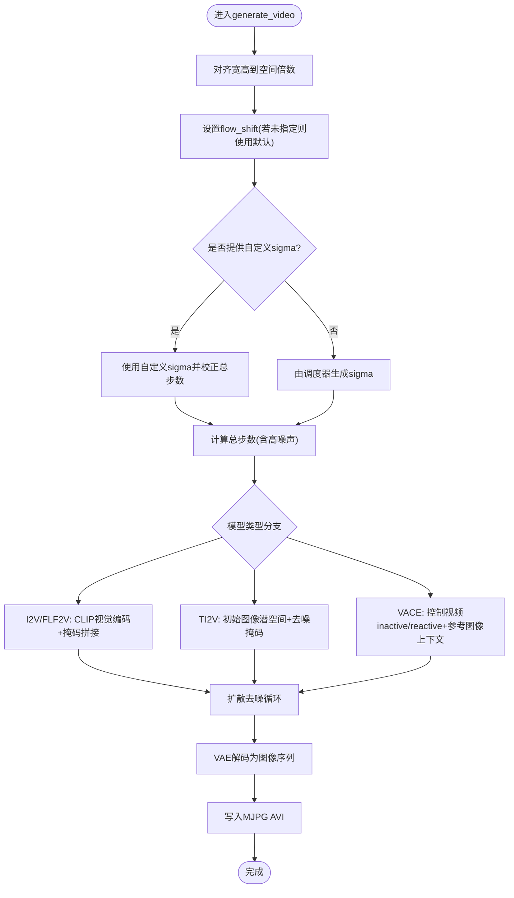
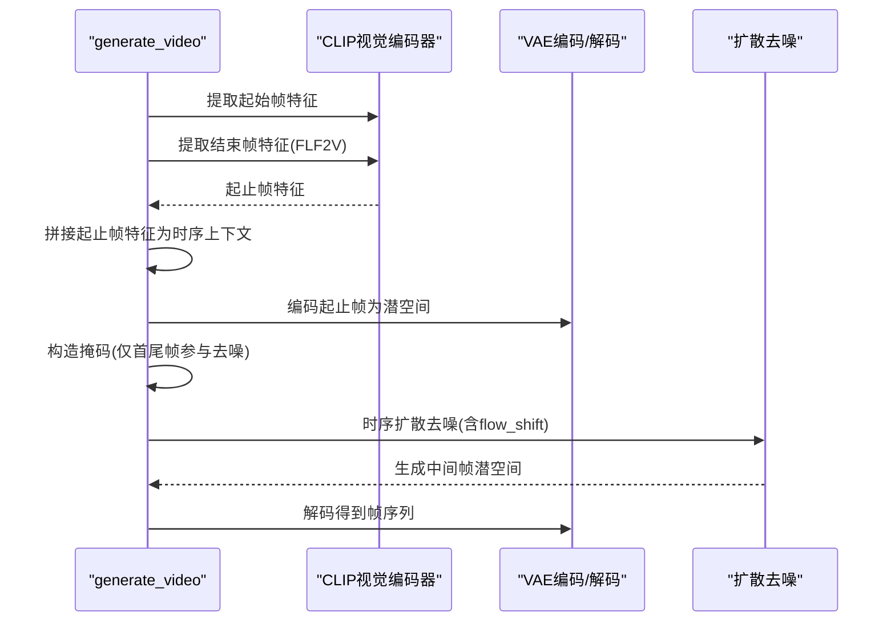
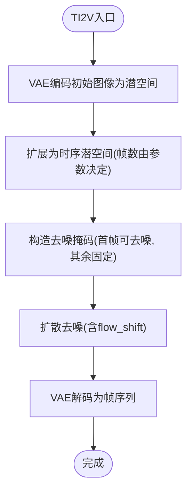
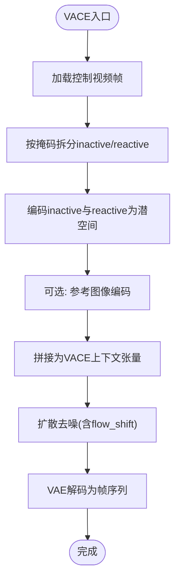
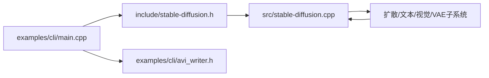

# 视频生成

<cite>
**本文引用的文件**
- [README.md](file://README.md)
- [docs/wan.md](file://docs/wan.md)
- [src/stable-diffusion.cpp](file://src/stable-diffusion.cpp)
- [include/stable-diffusion.h](file://include/stable-diffusion.h)
- [examples/cli/main.cpp](file://examples/cli/main.cpp)
- [examples/cli/README.md](file://examples/cli/README.md)
- [examples/cli/avi_writer.h](file://examples/cli/avi_writer.h)
</cite>

## 目录
1. [简介](#简介)
2. [项目结构](#项目结构)
3. [核心组件](#核心组件)
4. [架构总览](#架构总览)
5. [详细组件分析](#详细组件分析)
6. [依赖关系分析](#依赖关系分析)
7. [性能考量](#性能考量)
8. [故障排查指南](#故障排查指南)
9. [结论](#结论)
10. [附录](#附录)

## 简介
本文件系统性阐述稳定扩散.cpp在视频生成方向的能力与实现，重点覆盖以下方面：
- 技术原理：时空一致性保持、帧间插值与运动估计的工程化落地
- 支持模型：Wan2.1/Wan2.2 系列（T2V/I2V/FLF2V/VACE/TI2V 等变体）
- 与图像生成差异：时间维度处理、采样调度、掩码与上下文拼接策略
- 参数配置：帧数、时长、运动强度、采样步数、调度器与flow-shift等
- 实战示例与最佳实践：命令行用法、内存管理与性能优化
- 性能优化与硬件要求：显存/内存占用、量化与分块解码

## 项目结构
围绕视频生成的关键文件与职责如下：
- 核心实现：src/stable-diffusion.cpp 提供 generate_video 主流程与各模型分支逻辑
- 头文件接口：include/stable-diffusion.h 定义视频生成参数结构体与API
- 命令行入口：examples/cli/main.cpp 解析参数、调用生成函数、保存结果
- 文档与示例：docs/wan.md 提供Wan系列权重下载与典型命令行示例
- 输出封装：examples/cli/avi_writer.h 将序列帧写入MJPG AVI容器

图示来源
- [examples/cli/main.cpp:759-784](file://examples/cli/main.cpp#L759-L784)
- [include/stable-diffusion.h:315-336](file://include/stable-diffusion.h#L315-L336)
- [src/stable-diffusion.cpp:3919-4373](file://src/stable-diffusion.cpp#L3919-L4373)
- [examples/cli/avi_writer.h:68-115](file://examples/cli/avi_writer.h#L68-L115)
- [docs/wan.md:1-208](file://docs/wan.md#L1-L208)

章节来源
- [README.md:39-67](file://README.md#L39-L67)
- [docs/wan.md:1-208](file://docs/wan.md#L1-L208)
- [examples/cli/main.cpp:759-784](file://examples/cli/main.cpp#L759-L784)
- [include/stable-diffusion.h:315-336](file://include/stable-diffusion.h#L315-L336)

## 核心组件
- 视频生成参数结构体
  - sd_vid_gen_params_t：包含提示词、尺寸、采样参数、高噪声采样参数、MoE边界、强度、随机种子、帧数、VACE强度、VAE分块参数、缓存策略等
- 生成主函数
  - generate_video：统一调度不同模型路径，构建工作图、执行扩散去噪、VAE解码为图像序列
- 模型适配
  - 针对Wan2.1 I2V/FLF2V：使用CLIP视觉编码器提取起止帧特征，拼接潜空间与掩码
  - 针对Wan2.2 TI2V：以初始图像生成起始潜空间，设置去噪掩码
  - 针对Wan2.1 VACE：将控制视频按掩码拆分为inactive/reactive两路，拼接参考图像上下文
- 输出与容器
  - 将生成的帧序列写入MJPG AVI，便于快速播放与后处理

章节来源
- [include/stable-diffusion.h:315-336](file://include/stable-diffusion.h#L315-L336)
- [src/stable-diffusion.cpp:3919-4373](file://src/stable-diffusion.cpp#L3919-L4373)
- [examples/cli/README.md:99-100](file://examples/cli/README.md#L99-L100)
- [examples/cli/avi_writer.h:68-115](file://examples/cli/avi_writer.h#L68-L115)

## 架构总览
下图展示从命令行到生成结果的整体流程，以及关键数据流与模块交互。

图示来源
- [examples/cli/main.cpp:759-784](file://examples/cli/main.cpp#L759-L784)
- [include/stable-diffusion.h:384](file://include/stable-diffusion.h#L384)
- [src/stable-diffusion.cpp:3919-4373](file://src/stable-diffusion.cpp#L3919-L4373)
- [examples/cli/avi_writer.h:68-115](file://examples/cli/avi_writer.h#L68-L115)

## 详细组件分析

### 视频生成主流程与时空一致性
- 分辨率对齐：根据VAE与扩散模型下采样因子对宽高向上对齐，确保张量维度兼容
- 采样调度：支持自定义sigma或由调度器生成；可叠加高噪声阶段（Wan2.2 MoE）
- 流场偏移：通过flow_shift影响Flow类预测器的时间步映射，平衡运动强度与稳定性
- 时序约束：帧数按4的倍数对齐，保证时序卷积/池化的整除性

图示来源
- [src/stable-diffusion.cpp:3938-4014](file://src/stable-diffusion.cpp#L3938-L4014)
- [src/stable-diffusion.cpp:4034-4200](file://src/stable-diffusion.cpp#L4034-L4200)
- [src/stable-diffusion.cpp:4200-4373](file://src/stable-diffusion.cpp#L4200-L4373)

章节来源
- [src/stable-diffusion.cpp:3919-4373](file://src/stable-diffusion.cpp#L3919-L4373)

### I2V/FLF2V：基于CLIP视觉编码的时空上下文
- 输入：起始帧与结束帧（FLF2V需结束帧），经CLIP视觉编码器提取特征
- 上下文拼接：将起止帧特征沿时间维拼接，形成时序上下文
- 掩码机制：仅在首尾帧参与去噪，中间帧通过掩码约束，实现“起止驱动”的时序生成
- 适用模型：Wan2.1 I2V、Wan2.1 FLF2V、Wan2.2 I2V（A14B）

图示来源
- [src/stable-diffusion.cpp:4034-4100](file://src/stable-diffusion.cpp#L4034-L4100)
- [src/stable-diffusion.cpp:4100-4130](file://src/stable-diffusion.cpp#L4100-L4130)

章节来源
- [src/stable-diffusion.cpp:4034-4130](file://src/stable-diffusion.cpp#L4034-L4130)

### TI2V：以图像为起点的时序生成
- 输入：初始图像，先编码为潜空间，再扩展为时序潜空间
- 掩码策略：将首帧置零（可去噪），其余帧置一（固定），实现“图像驱动”的时序扩散
- 适用模型：Wan2.2 TI2V 5B

图示来源
- [src/stable-diffusion.cpp:4100-4130](file://src/stable-diffusion.cpp#L4100-L4130)

章节来源
- [src/stable-diffusion.cpp:4100-4130](file://src/stable-diffusion.cpp#L4100-L4130)

### VACE：基于控制视频的反应/非反应区域建模
- 输入：控制视频（inactive/reactive两路）、可选参考图像
- 处理：将控制视频按掩码拆分为inactive与reactive两部分，分别编码为潜空间
- 上下文：将inactive、reactive与可选参考图像拼接为VACE上下文张量
- 适用模型：Wan2.1 VACE 1.3B/14B、Wan2.2 VACE（通过TI2V路径复用）

图示来源
- [src/stable-diffusion.cpp:4130-4200](file://src/stable-diffusion.cpp#L4130-L4200)

章节来源
- [src/stable-diffusion.cpp:4130-4200](file://src/stable-diffusion.cpp#L4130-L4200)

### 帧间插值与运动估计（工程化实现）
- 插值策略：通过时序潜空间与扩散去噪，在起止帧之间生成中间帧，实现自然过渡
- 运动建模：flow_shift与采样调度共同影响运动强度与稳定性；掩码约束限制可去噪区域
- 时间对齐：帧数按4对齐，有利于时序卷积/池化与运动建模的一致性

章节来源
- [src/stable-diffusion.cpp:3938-4014](file://src/stable-diffusion.cpp#L3938-L4014)

### 参数配置指南（关键项）
- 基础参数
  - --video-frames：视频帧数（内部会按4对齐）
  - --fps：帧率，用于预览与AVI写入
  - --width/--height：分辨率，内部会按空间倍数对齐
- 采样与调度
  - --steps：采样步数
  - --high-noise-steps：高噪声阶段步数（Wan2.2 MoE）
  - --sampling-method/--scheduler：采样方法与调度器
  - --sigmas：自定义sigma序列
- 运动与上下文
  - --flow-shift：Flow类模型的时间步偏移，调节运动强度
  - --moe-boundary：Wan2.2 MoE切换边界
  - --control-video：控制视频目录（inactive/reactive区域）
  - --init-img/--end-img：起止帧（I2V/FLF2V）
  - --vace-strength：VACE强度（Wan2.1 VACE）
- 设备与内存
  - --offload-to-cpu：将权重卸载至CPU以节省显存
  - --vae-tiling/--vae-tile-overlap：VAE分块解码降低显存占用
  - --diffusion-fa/--fa：启用Flash Attention优化

章节来源
- [examples/cli/README.md:99-100](file://examples/cli/README.md#L99-L100)
- [examples/cli/README.md:113-125](file://examples/cli/README.md#L113-L125)
- [examples/cli/README.md:124-125](file://examples/cli/README.md#L124-L125)
- [examples/cli/README.md:47-48](file://examples/cli/README.md#L47-L48)
- [examples/cli/README.md:50-51](file://examples/cli/README.md#L50-L51)
- [examples/cli/README.md:55-56](file://examples/cli/README.md#L55-L56)

### 命令行示例与最佳实践
- Wan2.1 I2V 14B（480p）
  - 使用CLIP视觉编码器与起止帧，设置--flow-shift提升运动强度
- Wan2.2 TI2V 5B
  - 以初始图像为起点，设置--video-frames与--flow-shift
- Wan2.1 FLF2V 14B
  - 同时提供起止帧，强调时序连贯性
- VACE路径
  - 准备控制视频与掩码，结合参考图像进行反应/非反应区域建模

章节来源
- [docs/wan.md:73-79](file://docs/wan.md#L73-L79)
- [docs/wan.md:115-131](file://docs/wan.md#L115-L131)
- [docs/wan.md:133-148](file://docs/wan.md#L133-L148)
- [docs/wan.md:150-207](file://docs/wan.md#L150-L207)

## 依赖关系分析
- CLI依赖API接口与实现，实现依赖模型子系统（扩散/文本/视觉/VAE）
- 输出依赖AVI写入工具，将帧序列打包为MJPG AVI
- 参数解析与生成流程耦合度高，但模型分支通过条件判断解耦

图示来源
- [examples/cli/main.cpp:759-784](file://examples/cli/main.cpp#L759-L784)
- [include/stable-diffusion.h:384](file://include/stable-diffusion.h#L384)
- [src/stable-diffusion.cpp:3919-4373](file://src/stable-diffusion.cpp#L3919-L4373)
- [examples/cli/avi_writer.h:68-115](file://examples/cli/avi_writer.h#L68-L115)

章节来源
- [examples/cli/main.cpp:759-784](file://examples/cli/main.cpp#L759-L784)
- [include/stable-diffusion.h:315-336](file://include/stable-diffusion.h#L315-L336)
- [src/stable-diffusion.cpp:3919-4373](file://src/stable-diffusion.cpp#L3919-L4373)

## 性能考量
- 显存优化
  - 启用VAE分块解码（--vae-tiling/--vae-tile-overlap），显著降低峰值显存
  - 权重卸载（--offload-to-cpu）可在显存紧张时运行大模型
  - Flash Attention（--fa/--diffusion-fa）减少注意力计算内存占用
- 计算效率
  - 适当减少--video-frames与--steps，缩短生成时长
  - 选择更稳定的采样方法（如Euler A）与合适的调度器
- I/O吞吐
  - MJPG AVI写入避免PNG序列写盘开销，适合实时预览与批量处理

章节来源
- [examples/cli/README.md:47-48](file://examples/cli/README.md#L47-L48)
- [examples/cli/README.md:50-51](file://examples/cli/README.md#L50-L51)
- [examples/cli/README.md:55-56](file://examples/cli/README.md#L55-L56)
- [examples/cli/README.md:113-125](file://examples/cli/README.md#L113-L125)

## 故障排查指南
- 帧数异常
  - 若--video-frames小于等于4，CLI会调整输出格式；大于4时自动写入AVI
- 分辨率对齐告警
  - 当宽高无法被空间倍数整除时，内部会向上对齐并打印警告
- flow_shift设置
  - Flow类模型（如Wan2.2）可通过--flow-shift调节运动强度；默认值由模型决定
- VAE显存不足
  - 启用VAE分块解码与TAESD（轻量VAE）作为替代方案
- 高噪声MoE切换
  - 未显式设置--high-noise-steps时，内部根据moe-boundary自动切换

章节来源
- [examples/cli/main.cpp:487-500](file://examples/cli/main.cpp#L487-L500)
- [src/stable-diffusion.cpp:3938-3944](file://src/stable-diffusion.cpp#L3938-L3944)
- [src/stable-diffusion.cpp:3994-4002](file://src/stable-diffusion.cpp#L3994-L4002)
- [examples/cli/README.md:113-125](file://examples/cli/README.md#L113-L125)

## 结论
稳定扩散.cpp在视频生成方面提供了完善的框架与多模型支持，尤其在Wan2.1/Wan2.2系列上实现了从图像到视频的自然过渡。通过合理的参数配置（帧数、时长、运动强度、采样步数与调度器）与内存优化策略（VAE分块、权重卸载、Flash Attention），可在多种硬件环境下获得稳定且高质量的视频生成效果。建议优先采用MJPG AVI输出以兼顾速度与兼容性，并结合控制视频与掩码策略实现更精细的时空建模。

## 附录
- 命令行参数速查
  - --mode=vid_gen：启用视频生成模式
  - --video-frames：目标帧数（内部按4对齐）
  - --fps：输出帧率
  - --flow-shift：运动强度调节
  - --vae-tiling/--vae-tile-overlap：VAE分块解码
  - --offload-to-cpu：权重卸载
  - --fa/--diffusion-fa：启用Flash Attention
- 输出格式
  - MJPG AVI：适用于快速播放与批处理

章节来源
- [examples/cli/README.md:19](file://examples/cli/README.md#L19)
- [examples/cli/README.md:99-100](file://examples/cli/README.md#L99-L100)
- [examples/cli/README.md:113-125](file://examples/cli/README.md#L113-L125)
- [examples/cli/README.md:47-48](file://examples/cli/README.md#L47-L48)
- [examples/cli/README.md:50-51](file://examples/cli/README.md#L50-L51)
- [examples/cli/README.md:55-56](file://examples/cli/README.md#L55-L56)
- [examples/cli/avi_writer.h:68-115](file://examples/cli/avi_writer.h#L68-L115)