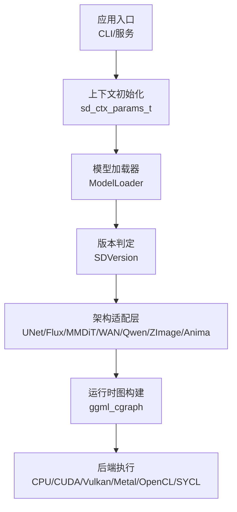
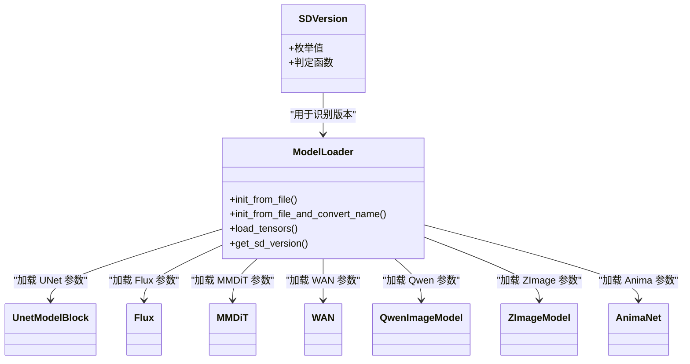
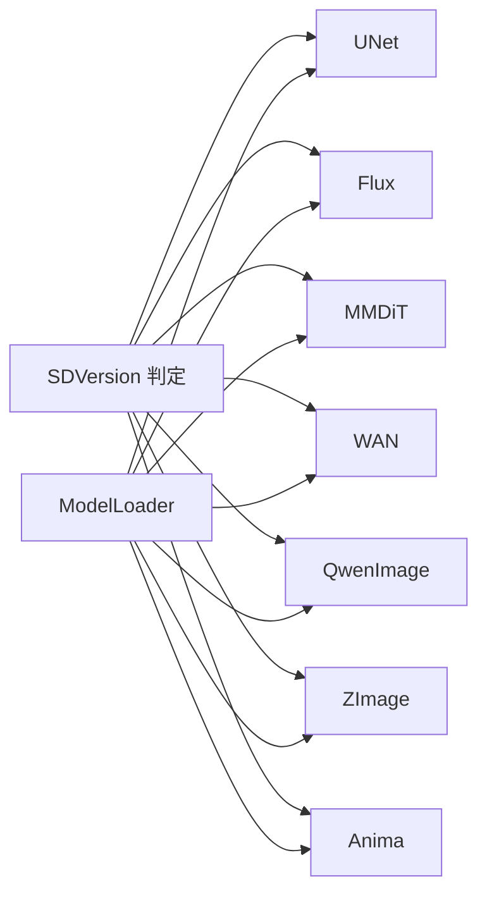

# 模型支持

<cite>
**本文档引用的文件**
- [README.md](file://README.md)
- [stable-diffusion.h](file://include/stable-diffusion.h)
- [model.h](file://src/model.h)
- [model.cpp](file://src/model.cpp)
- [flux.hpp](file://src/flux.hpp)
- [unet.hpp](file://src/unet.hpp)
- [mmdit.hpp](file://src/mmdit.hpp)
- [wan.hpp](file://src/wan.hpp)
- [qwen_image.hpp](file://src/qwen_image.hpp)
- [z_image.hpp](file://src/z_image.hpp)
- [anima.hpp](file://src/anima.hpp)
</cite>

## 目录
1. [简介](#简介)
2. [项目结构](#项目结构)
3. [核心组件](#核心组件)
4. [架构总览](#架构总览)
5. [详细组件分析](#详细组件分析)
6. [依赖关系分析](#依赖关系分析)
7. [性能考量](#性能考量)
8. [故障排查指南](#故障排查指南)
9. [结论](#结论)
10. [附录](#附录)

## 简介
本文件系统化梳理 stable-diffusion.cpp 支持的各类扩散模型，覆盖 SD1.x/SD2.x、SDXL、SD3/SD3.5、FLUX 系列、Wan 系列、Qwen 系列、Z-Image、Ovis-Image、Anima 等，并对权重格式与加载机制、性能与内存特征、配置参数与使用示例、模型迁移与兼容性进行说明，帮助用户在不同硬件与平台下做出合理选择。

## 项目结构
项目采用模块化设计，以“版本枚举 + 架构适配层 + 运行时图构建”的方式组织模型支持：
- 版本识别：通过统一的版本枚举与判定函数区分不同模型家族与变体
- 架构适配：针对 UNet、DiT、MMDiT、WAN、QwenImage、ZImage、Anima 等分别实现专用前向计算块
- 权重加载：统一的 ModelLoader 支持 ckpt、safetensors、GGUF 三种格式，自动识别与转换张量命名
- 推理执行：基于 ggml 的计算图构建与后端调度，支持多后端（CPU/CUDA/Vulkan/Metal/OpenCL/SYCL）

**图表来源**
- [stable-diffusion.h](file://include/stable-diffusion.h)
- [model.h](file://src/model.h)
- [model.cpp](file://src/model.cpp)

**章节来源**
- [README.md](file://README.md)
- [stable-diffusion.h](file://include/stable-diffusion.h)
- [model.h](file://src/model.h)

## 核心组件
- 版本枚举与判定
  - 统一的 SDVersion 枚举涵盖 SD1/SD2/SDXL/SD3/Flux/Flux2/WAN/Qwen/ZImage/Ovis/Anima 等
  - 提供 sd_version_is_* 系列内联函数用于快速判定模型类型与架构族
- 模型加载器
  - 自动识别 ckpt/safetensors/GGUF，解析张量元信息，按需转换张量名
  - 支持 mmap 与类型覆盖，便于量化与跨后端优化
- 架构适配层
  - UNet：SD/SDXL/SDV/Inpaint/Pix2Pix 等
  - Flux：Flux/Flux2/Chroma/Ovis 等
  - MMDiT：SD3/SD3.5 等
  - WAN：视频扩散（3D 卷积、时序采样）
  - QwenImage：视觉-语言双流
  - ZImage：多注意力与 AdaLN 调制
  - Anima：LLM 适配器 + 双流注意力
- 推理接口
  - 统一的推理参数结构体与回调接口，支持进度、预览、日志输出

**章节来源**
- [model.h](file://src/model.h)
- [model.cpp](file://src/model.cpp)
- [stable-diffusion.h](file://include/stable-diffusion.h)

## 架构总览
以下类图展示核心模型类与其依赖关系，体现“版本 → 架构 → 块组合”的层次化设计：

**图表来源**
- [model.h](file://src/model.h)
- [unet.hpp](file://src/unet.hpp)
- [flux.hpp](file://src/flux.hpp)
- [mmdit.hpp](file://src/mmdit.hpp)
- [wan.hpp](file://src/wan.hpp)
- [qwen_image.hpp](file://src/qwen_image.hpp)
- [z_image.hpp](file://src/z_image.hpp)
- [anima.hpp](file://src/anima.hpp)

## 详细组件分析

### SD1.x/SD2.x 与 SDXL
- 架构要点
  - 使用 UNet 作为主干，支持多分辨率残差块与空间 Transformer 注意力
  - SDXL 引入 ADM 注入与更大通道数，Inpaint/Pix2Pix 支持额外输入通道
- 关键参数
  - 输入/输出通道、注意力分辨率、通道倍率、时间步嵌入维度
- 性能与内存
  - UNet 计算图规模较大，显存占用高；可通过控制采样步数与分辨率平衡
- 兼容性
  - 支持 ckpt/safetensors/GGUF；SDXL 需要更大的文本编码器维度

**章节来源**
- [unet.hpp](file://src/unet.hpp)
- [model.h](file://src/model.h)

### SD3/SD3.5
- 架构要点
  - DiT（扩散 Transformer）为主，PatchEmbed + 多层 JointTransformerBlock + FinalLayer
  - 支持 KV 规范化与可选自注意力分支
- 关键参数
  - 隐藏维度、注意力头数、MLP 扩展比、位置编码维度
- 性能与内存
  - 对大模型更友好，但注意力复杂度随序列长度增长
- 兼容性
  - 与 MMDiT 实现共享部分组件（如 PatchEmbed、位置编码生成）

**章节来源**
- [mmdit.hpp](file://src/mmdit.hpp)
- [model.h](file://src/model.h)

### FLUX 系列（含 Chroma、Ovis）
- 架构要点
  - 双流 Transformer（图像与文本），AdaIN/Modulation 调制，RMSNorm + SiLU/GELU
  - 支持 Chroma 近似器与 Nerf/GLU 块
- 关键参数
  - 双流层数、注意力头数、MLP 比例、QK 规范化开关
- 性能与内存
  - 注意力并行度高，适合 GPU 加速；长序列注意掩码与位置编码开销
- 兼容性
  - 支持 Chroma 近似与 Ovis 变体；位置编码生成与 Rope 工具复用

**章节来源**
- [flux.hpp](file://src/flux.hpp)
- [model.h](file://src/model.h)

### Wan 系列（视频扩散）
- 架构要点
  - 3D 因果卷积、时序下采样/上采样、残差块堆叠、注意力模块
  - 支持时序缓存与分块处理，降低显存峰值
- 关键参数
  - 时间/空间下采样标志、残差层数、时序卷积核大小
- 性能与内存
  - 3D 卷积计算量大，建议启用分块与缓存策略
- 兼容性
  - 与 Flux/MMDiT 共享基础块（RMSNorm、线性层等）

**章节来源**
- [wan.hpp](file://src/wan.hpp)
- [model.h](file://src/model.h)

### Qwen 系列（Qwen-Image/编辑）
- 架构要点
  - 双流注意力（图像+文本），条件调制（AdaLayerNorm）、可选零条件时间步
  - 支持参考潜变量拼接与位置编码扩展
- 关键参数
  - 层数、注意力头数、注意力头维度、是否启用零条件时间步
- 性能与内存
  - 注意力规模与位置编码向量较大，量化与 Flash-Attn 可提升稳定性
- 兼容性
  - 与 Flux/MMDiT 共享位置编码与调制模块

**章节来源**
- [qwen_image.hpp](file://src/qwen_image.hpp)
- [model.h](file://src/model.h)

### Z-Image
- 架构要点
  - 多头注意力（含 KV 头）、FFN、AdaLN 调制、噪声与上下文精炼层
  - 支持序列对齐到固定倍数，位置编码按分辨率动态裁剪
- 关键参数
  - 隐藏维度、注意力头数/头维度、MLP 扩展、KV 头数
- 性能与内存
  - 精炼层减少后续负担，但序列填充带来额外开销
- 兼容性
  - 与 MMDiT/Flux 共享位置编码与调制工具

**章节来源**
- [z_image.hpp](file://src/z_image.hpp)
- [model.h](file://src/model.h)

### Anima
- 架构要点
  - 图像嵌入 + 时间步嵌入 + AdaLayerNormZero 调制 + 双流注意力 + LLM 适配器
  - 支持 T5 文本权重融合与位置编码 NTK 外推
- 关键参数
  - 图像/文本嵌入维度、注意力头数、层数、LLM 适配器层数
- 性能与内存
  - LLM 适配器引入额外注意力与投影，建议控制上下文长度
- 兼容性
  - 与 Flux/Qwen 共享注意力与调制模块

**章节来源**
- [anima.hpp](file://src/anima.hpp)
- [model.h](file://src/model.h)

## 依赖关系分析
- 版本到架构映射
  - SD1/SD2/SDXL → UNet
  - SD3/SD3.5 → MMDiT
  - FLUX/FLUX2/Chroma/Ovis → Flux
  - SD3/SD3.5/Chroma/Z-Image/Anima → MMDiT/Flux 共享组件
  - Wan 系列 → 专用 3D 卷积与时序块
- 权重加载依赖
  - ModelLoader → GGUFReader/safetensors 解析 → 张量命名转换 → ggml 类型推断
- 后端与加速
  - ggml 后端抽象统一调度；Flash-Attn 与量化类型影响稳定性与精度

**图表来源**
- [model.h](file://src/model.h)
- [model.cpp](file://src/model.cpp)

**章节来源**
- [model.h](file://src/model.h)
- [model.cpp](file://src/model.cpp)

## 性能考量
- 采样步数与分辨率
  - 步数越多、分辨率越高，显存与计算需求越大
- 注意力与位置编码
  - 注意力复杂度与序列长度相关；位置编码规模与分辨率/patch 尺寸相关
- 量化与后端
  - 量化类型影响数值稳定性；CUDA/Vulkan 等后端在大模型上优势明显
- 分块与缓存
  - 对视频模型（WAN）与长序列（Qwen/Z-Image/Anima）尤为关键

[本节为通用指导，不直接分析具体文件]

## 故障排查指南
- 权重格式问题
  - 若未知格式或文件不存在，加载器会记录警告；请确认路径与扩展名
- 张量命名与类型
  - 加载器会尝试转换张量名并推断类型；若出现 dtype 不支持，检查权重来源
- 数值异常（NaN/Inf）
  - 在某些后端与量化组合下可能出现；建议切换后端或调整量化类型
- 显存不足
  - 降低分辨率、减少采样步数、启用分块/缓存、关闭非必要模块

**章节来源**
- [model.cpp](file://src/model.cpp)

## 结论
stable-diffusion.cpp 通过统一的版本识别与加载器，为多种扩散模型提供了清晰的架构适配与高效的推理执行路径。用户可根据任务类型（图像/视频/多模态）与硬件能力（显存/算力）选择合适模型与配置，在保证质量的同时获得最佳性价比。

[本节为总结性内容，不直接分析具体文件]

## 附录

### 模型选择与最佳实践
- 图像生成（通用）
  - SDXL：高质量、可控强，适合高分辨率与精细细节
  - SD3/SD3.5：更稳定的扩散流程，适合多样化风格
  - FLUX/FLUX2：速度与质量兼顾，适合实时/批量
- 视频生成
  - Wan 系列：3D 卷积与时序建模，适合视频扩散任务
- 多模态/编辑
  - Qwen-Image/编辑：支持文本引导与参考潜变量，适合定制化编辑
  - Anima：LLM 适配器增强理解，适合复杂指令
- 资源受限
  - 优先选择较小模型（如 SD1.x/SDXL-Turbo 或 FLUX.1-schnell），降低分辨率与步数

[本节为通用指导，不直接分析具体文件]

### 配置参数与使用示例（概览）
- 基础参数
  - 模型路径、采样方法、调度器、采样步数、CFG 引导强度、分辨率
- 进阶参数
  - 量化类型、后端选择、Flash-Attn 开关、VAE/TAESD、LoRA、控制提示/参考潜变量
- 示例路径
  - CLI 使用与参数说明：[README.md](file://README.md)
  - 推理参数结构体与回调：[stable-diffusion.h](file://include/stable-diffusion.h)

**章节来源**
- [README.md](file://README.md)
- [stable-diffusion.h](file://include/stable-diffusion.h)

### 权重格式与加载机制
- 支持格式
  - PyTorch checkpoint（ckpt/pt）、safetensors、GGUF
- 加载流程
  - 自动识别 → 解析元数据 → 构造 TensorStorage → 名称转换 → 类型推断 → 参数缓冲分配
- 量化与类型
  - 支持多种 ggml 类型；可覆盖期望类型以适配后端

**章节来源**
- [model.cpp](file://src/model.cpp)
- [model.h](file://src/model.h)