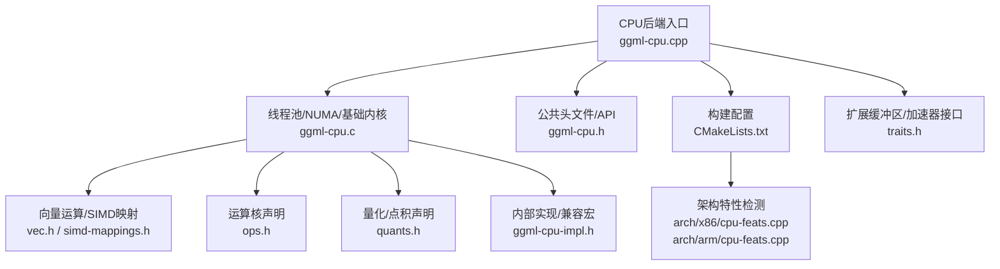
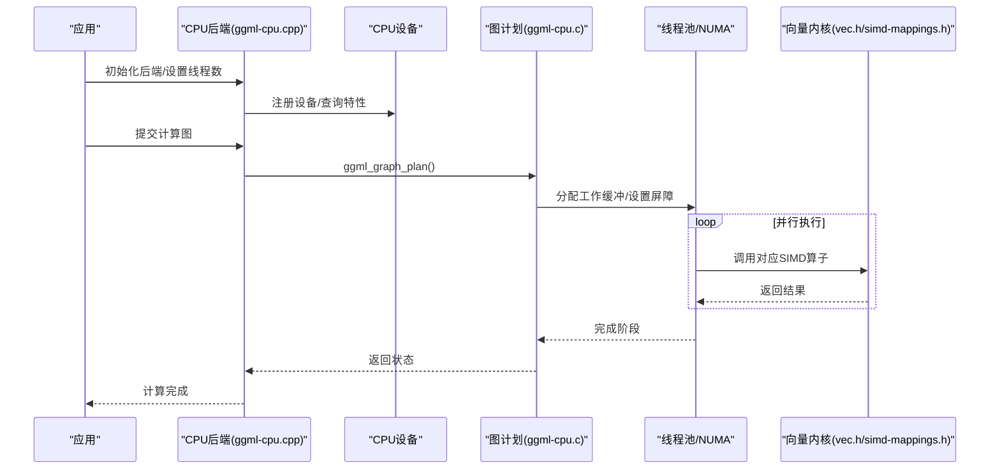
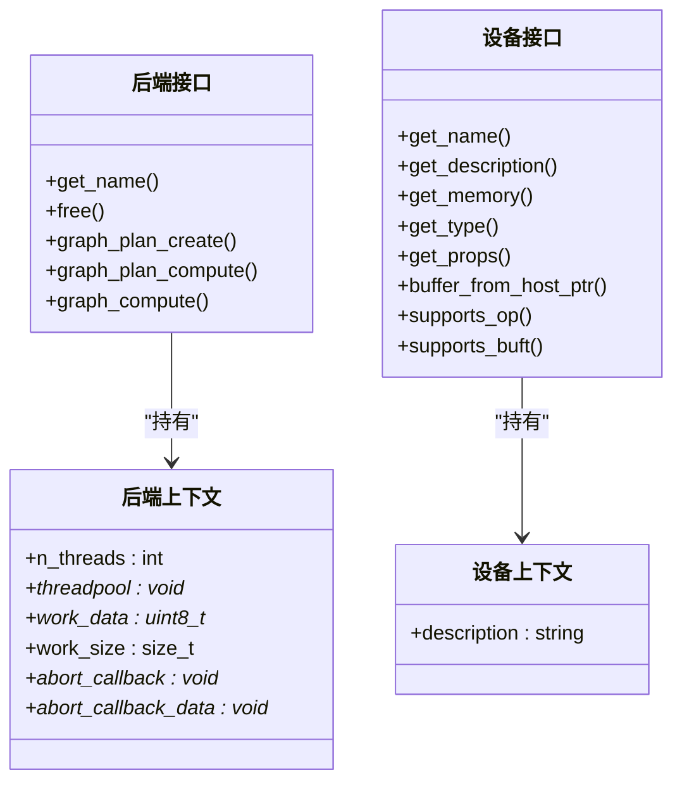
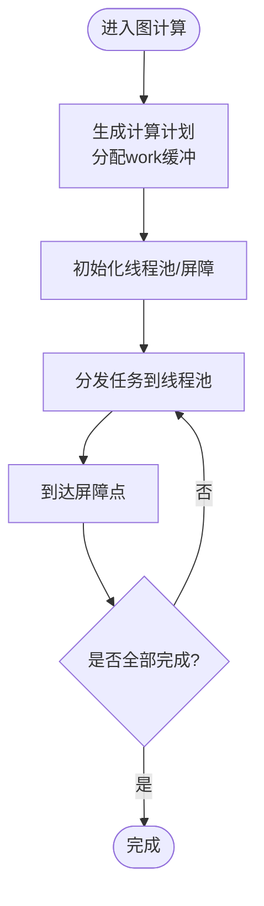
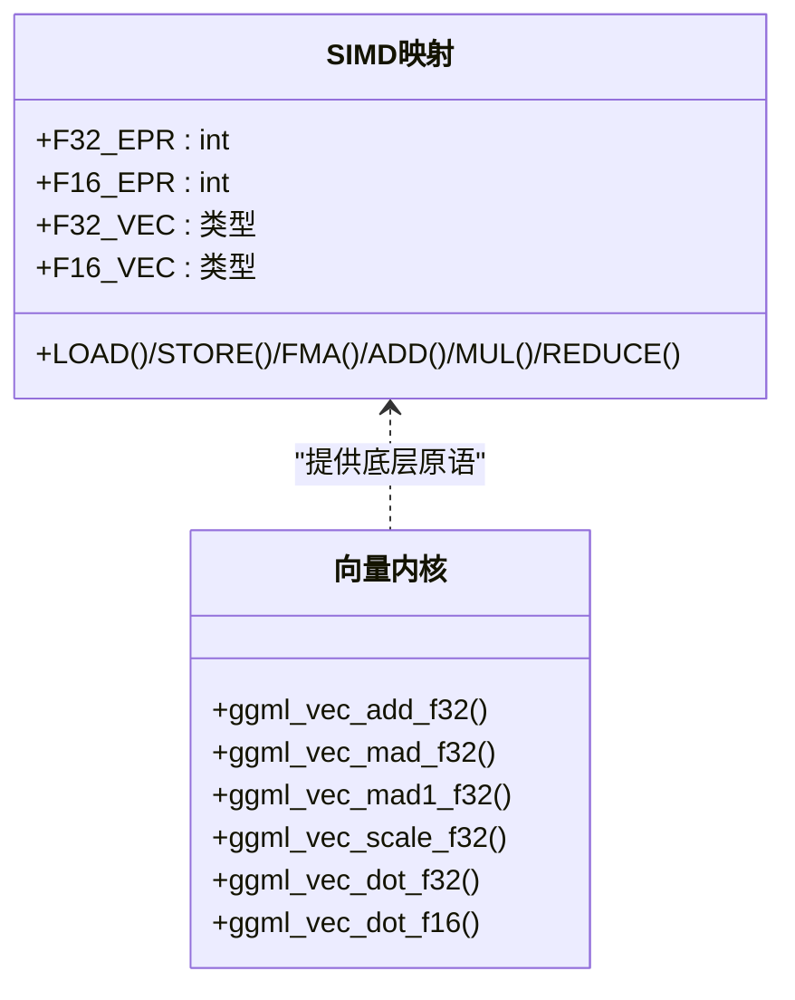
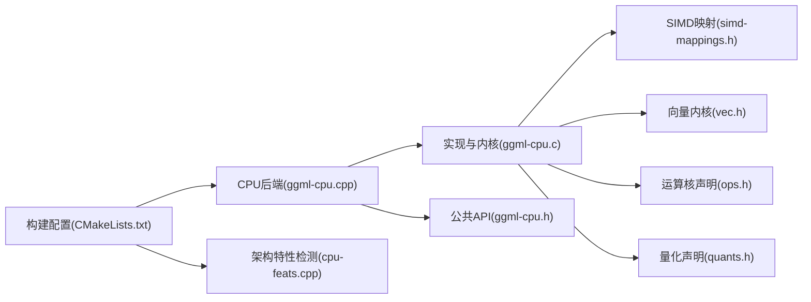

# CPU后端

<cite>
**本文档引用的文件**
- [ggml-cpu.cpp](file://ggml/src/ggml-cpu/ggml-cpu.cpp)
- [ggml-cpu.c](file://ggml/src/ggml-cpu/ggml-cpu.c)
- [ggml-cpu.h](file://ggml/include/ggml-cpu.h)
- [CMakeLists.txt](file://ggml/src/ggml-cpu/CMakeLists.txt)
- [cpu-feats.cpp (x86)](file://ggml/src/ggml-cpu/arch/x86/cpu-feats.cpp)
- [cpu-feats.cpp (ARM)](file://ggml/src/ggml-cpu/arch/arm/cpu-feats.cpp)
- [vec.h](file://ggml/src/ggml-cpu/vec.h)
- [simd-mappings.h](file://ggml/src/ggml-cpu/simd-mappings.h)
- [ops.h](file://ggml/src/ggml-cpu/ops.h)
- [quants.h](file://ggml/src/ggml-cpu/quants.h)
- [traits.h](file://ggml/src/ggml-cpu/traits.h)
- [ggml-cpu-impl.h](file://ggml/src/ggml-cpu/ggml-cpu-impl.h)
</cite>

## 目录
1. [简介](#简介)
2. [项目结构](#项目结构)
3. [核心组件](#核心组件)
4. [架构总览](#架构总览)
5. [详细组件分析](#详细组件分析)
6. [依赖关系分析](#依赖关系分析)
7. [性能考量](#性能考量)
8. [故障排查指南](#故障排查指南)
9. [结论](#结论)
10. [附录](#附录)

## 简介
本文件系统性阐述稳定扩散.cpp项目中CPU后端的实现原理、性能优化与配置方法。CPU后端基于ggml框架，通过动态后端注册、特征检测与多架构SIMD指令集映射，实现跨x86、ARM、RISC-V、PowerPC、S390x、LoongArch、WASM等平台的高效向量化计算。文档重点覆盖：
- 基于AVX、AVX2、AVX512、NEON、SVE、RVV、VSX、VXE等指令集的向量化实现
- 线程池调度、NUMA感知与工作缓冲区管理
- 编译配置选项、运行时特性查询与性能调优
- 不同CPU架构的适配差异与性能对比建议
- 无专用GPU场景下的部署与优化实践

## 项目结构
CPU后端位于ggml子模块的ggml-cpu目录，采用“按架构分层 + SIMD映射 + 运算核”的组织方式：
- 后端接口与设备注册：ggml-cpu.cpp
- 线程池、NUMA、类型特性与基础内核：ggml-cpu.c
- 公共头文件与API声明：ggml-cpu.h
- 构建脚本与多架构编译配置：CMakeLists.txt
- 架构特性检测：arch/x86/cpu-feats.cpp、arch/arm/cpu-feats.cpp
- 向量运算与SIMD映射：vec.h、simd-mappings.h
- 运算核声明：ops.h
- 量化与点积实现声明：quants.h
- 扩展缓冲区与额外加速器接口：traits.h
- 内部实现与兼容性宏：ggml-cpu-impl.h

**图表来源**
- [ggml-cpu.cpp](file://ggml/src/ggml-cpu/ggml-cpu.cpp)
- [ggml-cpu.c](file://ggml/src/ggml-cpu/ggml-cpu.c)
- [ggml-cpu.h](file://ggml/include/ggml-cpu.h)
- [CMakeLists.txt](file://ggml/src/ggml-cpu/CMakeLists.txt)
- [cpu-feats.cpp (x86)](file://ggml/src/ggml-cpu/arch/x86/cpu-feats.cpp)
- [cpu-feats.cpp (ARM)](file://ggml/src/ggml-cpu/arch/arm/cpu-feats.cpp)
- [vec.h](file://ggml/src/ggml-cpu/vec.h)
- [simd-mappings.h](file://ggml/src/ggml-cpu/simd-mappings.h)
- [ops.h](file://ggml/src/ggml-cpu/ops.h)
- [quants.h](file://ggml/src/ggml-cpu/quants.h)
- [traits.h](file://ggml/src/ggml-cpu/traits.h)
- [ggml-cpu-impl.h](file://ggml/src/ggml-cpu/ggml-cpu-impl.h)

**章节来源**
- [ggml-cpu.cpp](file://ggml/src/ggml-cpu/ggml-cpu.cpp)
- [ggml-cpu.c](file://ggml/src/ggml-cpu/ggml-cpu.c)
- [ggml-cpu.h](file://ggml/include/ggml-cpu.h)
- [CMakeLists.txt](file://ggml/src/ggml-cpu/CMakeLists.txt)

## 核心组件
- 动态后端注册与设备抽象：CPU后端通过注册表导出名称、设备数量、设备属性与进程地址，支持查询CPU特性、设置线程数、NUMA初始化等。
- 线程池与屏障同步：提供统一的线程池结构、屏障、chunk分配与轮询机制，用于多线程并行与任务切分。
- 类型特性与量化：定义各数据类型的向量化点积函数、步长与行数等，支持多种量化格式与混合精度。
- 向量运算与SIMD映射：根据当前架构自动选择最优SIMD路径（如AVX2、AVX512、NEON、SVE、RVV等），并提供FMA、加法、乘法、归约等原语。
- NUMA感知与内存布局：在Linux环境下探测NUMA拓扑，支持分布式/隔离/镜像等策略，提升大模型推理时的内存带宽与缓存亲和。

**章节来源**
- [ggml-cpu.cpp](file://ggml/src/ggml-cpu/ggml-cpu.cpp)
- [ggml-cpu.c](file://ggml/src/ggml-cpu/ggml-cpu.c)
- [ggml-cpu.h](file://ggml/include/ggml-cpu.h)
- [simd-mappings.h](file://ggml/src/ggml-cpu/simd-mappings.h)
- [vec.h](file://ggml/src/ggml-cpu/vec.h)
- [quants.h](file://ggml/src/ggml-cpu/quants.h)

## 架构总览
CPU后端以“后端接口 → 设备 → 线程池/NUMA → 向量化内核”的层次化方式组织。后端负责图计划与计算调度；设备负责能力查询与缓冲区分配；线程池负责并行执行；向量化内核负责具体算子的SIMD实现。

**图表来源**
- [ggml-cpu.cpp](file://ggml/src/ggml-cpu/ggml-cpu.cpp)
- [ggml-cpu.c](file://ggml/src/ggml-cpu/ggml-cpu.c)
- [vec.h](file://ggml/src/ggml-cpu/vec.h)
- [simd-mappings.h](file://ggml/src/ggml-cpu/simd-mappings.h)

## 详细组件分析

### 后端接口与设备注册
- 后端名称、释放、图计划创建/执行、事件与优化接口均在CPU后端中实现，确保与ggml后端接口一致。
- 设备描述通过系统接口读取CPU品牌信息；内存查询返回物理内存总量（视平台而定）。
- 支持额外缓冲类型（如AMX、KleidiAI、RISC-V IME等）与算子支持查询，便于扩展加速器。

**图表来源**
- [ggml-cpu.cpp](file://ggml/src/ggml-cpu/ggml-cpu.cpp)

**章节来源**
- [ggml-cpu.cpp](file://ggml/src/ggml-cpu/ggml-cpu.cpp)

### 线程池与NUMA
- 线程池包含互斥锁、条件变量、屏障计数、当前chunk、停止/暂停/中止标志、每线程状态等，支持barrier同步与chunk分发。
- NUMA初始化在Linux下探测节点数量、CPU亲和与当前节点，支持分布式/隔离/镜像等策略，并给出性能提示。
- 线程让步与轮询策略针对不同架构优化，减少忙等与上下文切换。

**图表来源**
- [ggml-cpu.c](file://ggml/src/ggml-cpu/ggml-cpu.c)

**章节来源**
- [ggml-cpu.c](file://ggml/src/ggml-cpu/ggml-cpu.c)

### SIMD映射与向量内核
- SIMD映射根据当前架构选择最优路径：SVE（ARM）、NEON（ARM）、AVX2/AVX512（x86）、VSX（PowerPC）、VXE/VXE2（S390x）、RVV（RISC-V）、WASM SIMD等。
- 向量内核提供F32/F16/BF16的加法、缩放、FMA、点积、归约等操作，部分架构使用predicated vector或SVE寄存器长度自适应。
- 对不支持FP16/FP32转换的架构，提供查表或转换函数以保证一致性。

**图表来源**
- [simd-mappings.h](file://ggml/src/ggml-cpu/simd-mappings.h)
- [vec.h](file://ggml/src/ggml-cpu/vec.h)

**章节来源**
- [simd-mappings.h](file://ggml/src/ggml-cpu/simd-mappings.h)
- [vec.h](file://ggml/src/ggml-cpu/vec.h)

### 量化与点积
- 类型特性表定义了每种量化类型的from_float、vec_dot、vec_dot_type与nrows（一次处理的行数），用于矩阵乘与点积优化。
- 量化内核提供多种Q/K系列与IQ系列的量化与点积实现，支持通用回退路径，确保在缺少特定硬件特性时仍可运行。

**章节来源**
- [ggml-cpu.c](file://ggml/src/ggml-cpu/ggml-cpu.c)
- [quants.h](file://ggml/src/ggml-cpu/quants.h)

### 架构特性检测
- x86：通过CPUID检测SSE3/SSSE3/AVX/AVX2/AVX512/FMA/F16C/BMI2/AVX_VNNI/AVX512_*等特性，动态评分决定后端变体。
- ARM：通过AT_HWCAP/AT_HWCAP2或sysctl检测DotProd/I8MM/SVE/SVE2/SME等特性，动态启用NEON/F16向量与SVE路径。
- 其他架构：PowerPC（VSX）、S390x（VXE/VXE2）、RISC-V（RVV/ZVFH/ZVFBFWMA等）、LoongArch（LSX/LASX）、WASM（SIMD128）均有相应检测与编译开关。

**章节来源**
- [cpu-feats.cpp (x86)](file://ggml/src/ggml-cpu/arch/x86/cpu-feats.cpp)
- [cpu-feats.cpp (ARM)](file://ggml/src/ggml-cpu/arch/arm/cpu-feats.cpp)
- [CMakeLists.txt](file://ggml/src/ggml-cpu/CMakeLists.txt)

### 扩展缓冲区与加速器接口
- 支持注册额外缓冲类型（如AMX、KleidiAI、RISC-V IME等），并在算子支持查询中优先检查这些缓冲类型。
- 提供扩展tensor_traits与extra_buffer_type接口，允许第三方在CPU后端上叠加专用加速器实现。

**章节来源**
- [ggml-cpu.cpp](file://ggml/src/ggml-cpu/ggml-cpu.cpp)
- [traits.h](file://ggml/src/ggml-cpu/traits.h)

## 依赖关系分析
- 后端实现依赖ggml后端接口与线程库；在Windows下使用SRWLock/CONDITION_VARIABLE，在类Unix系统使用pthread。
- SIMD映射与向量内核依赖各架构的内置头文件（如immintrin.h、arm_neon.h、riscv_vector.h等）。
- 构建系统通过CMake根据目标架构启用相应编译标志与特性检测，支持多变体构建与外部加速器集成。

**图表来源**
- [ggml-cpu.cpp](file://ggml/src/ggml-cpu/ggml-cpu.cpp)
- [ggml-cpu.c](file://ggml/src/ggml-cpu/ggml-cpu.c)
- [ggml-cpu.h](file://ggml/include/ggml-cpu.h)
- [simd-mappings.h](file://ggml/src/ggml-cpu/simd-mappings.h)
- [vec.h](file://ggml/src/ggml-cpu/vec.h)
- [ops.h](file://ggml/src/ggml-cpu/ops.h)
- [quants.h](file://ggml/src/ggml-cpu/quants.h)
- [CMakeLists.txt](file://ggml/src/ggml-cpu/CMakeLists.txt)
- [cpu-feats.cpp (x86)](file://ggml/src/ggml-cpu/arch/x86/cpu-feats.cpp)
- [cpu-feats.cpp (ARM)](file://ggml/src/ggml-cpu/arch/arm/cpu-feats.cpp)

**章节来源**
- [ggml-cpu.cpp](file://ggml/src/ggml-cpu/ggml-cpu.cpp)
- [ggml-cpu.c](file://ggml/src/ggml-cpu/ggml-cpu.c)
- [CMakeLists.txt](file://ggml/src/ggml-cpu/CMakeLists.txt)

## 性能考量
- 指令集选择：优先启用更高吞吐的SIMD路径（如AVX512、SVE、RVV），在不满足条件时自动降级至AVX2/NEON等。
- 线程数与NUMA：合理设置线程数与NUMA策略（分布式/隔离/镜像），避免跨NUMA访问导致的带宽下降。
- 工作缓冲区：图计划会计算work_size并由后端分配，确保足够的临时空间以减少频繁分配开销。
- 量化策略：在满足精度前提下优先使用低比特量化（如Q4_K/Q5_K），结合vec_dot优化降低访存与计算成本。
- 向量化粒度：根据架构EPR与register length自适应unroll，平衡吞吐与寄存器压力。

[本节为通用性能建议，无需特定文件引用]

## 故障排查指南
- 后端不可用：确认已正确初始化后端并检查设备可用性；查看是否启用了所需特性（如AVX2/NEON/SVE等）。
- 线程池异常：检查线程数设置、NUMA策略与系统资源限制；观察是否有死锁或屏障未触发。
- 内存不足：增大工作缓冲区或减少并发；在NUMA环境中确保本地内存充足。
- 量化错误：确认量化类型与vec_dot_type匹配；检查量化内核是否可用。
- 构建失败：核对CMake配置与编译器标志；确保目标架构对应的SIMD头文件可用。

**章节来源**
- [ggml-cpu.cpp](file://ggml/src/ggml-cpu/ggml-cpu.cpp)
- [ggml-cpu.c](file://ggml/src/ggml-cpu/ggml-cpu.c)

## 结论
CPU后端通过动态特性检测、多架构SIMD映射与线程池并行，实现了跨平台的高性能推理能力。配合量化与NUMA感知，可在无专用GPU的环境中获得良好的吞吐与延迟表现。建议根据目标平台启用合适的编译选项与运行时参数，以充分发挥硬件潜力。

[本节为总结性内容，无需特定文件引用]

## 附录

### 编译配置与运行时参数
- 编译选项（示例）
  - x86：/arch:AVX2、/arch:AVX512（MSVC）或-mavx2、-mavx512f等（GCC/Clang）
  - ARM：-mcpu/native、+dotprod/+i8mm/+sve/+sme等
  - RISC-V：-march=rv64gc[_v][_zfh/_zvfh/_zvfbfwma]等
  - PowerPC：-mcpu/power9/power10、-mvsx等
  - S390x：-march=z15/z16/z17、-mvx/-mzvector等
  - LoongArch：-mlsx/-mlasx
  - WASM：-msimd128
- 运行时特性查询：通过后端注册表查询CPU特性（SSE3/SSSE3/AVX/AVX2/AVX512/NEON/SVE/RV64等）
- 线程与NUMA：设置线程数、初始化NUMA策略、查询设备内存

**章节来源**
- [CMakeLists.txt](file://ggml/src/ggml-cpu/CMakeLists.txt)
- [ggml-cpu.h](file://ggml/include/ggml-cpu.h)
- [ggml-cpu.cpp](file://ggml/src/ggml-cpu/ggml-cpu.cpp)