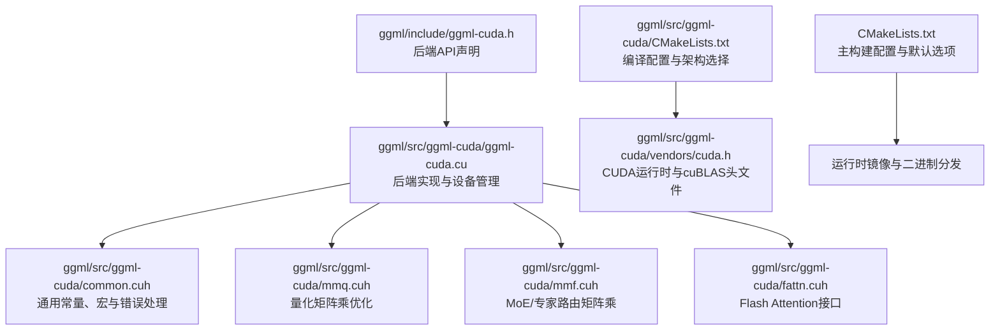
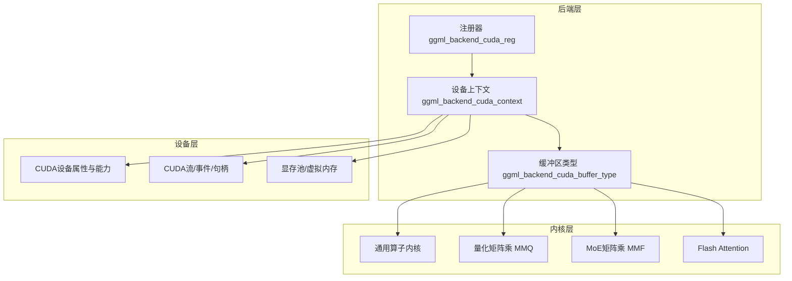
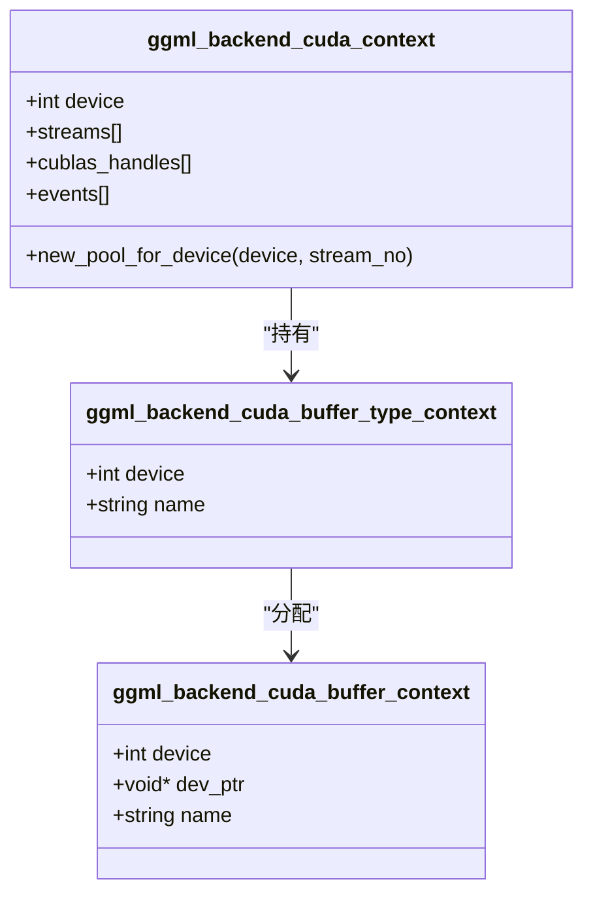
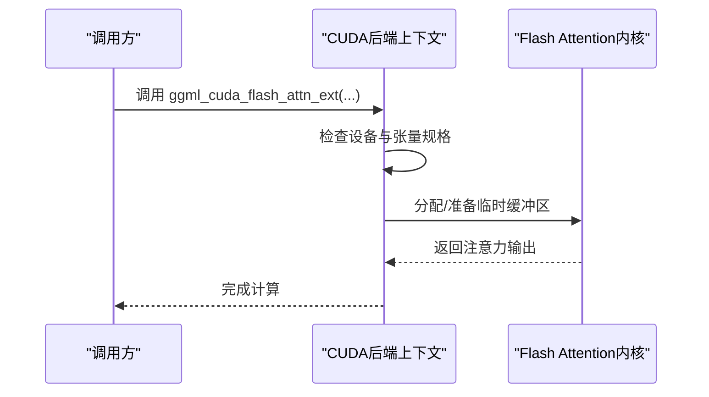
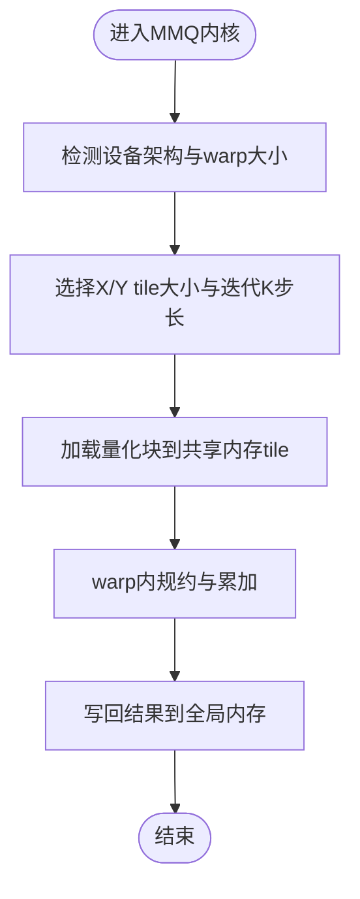
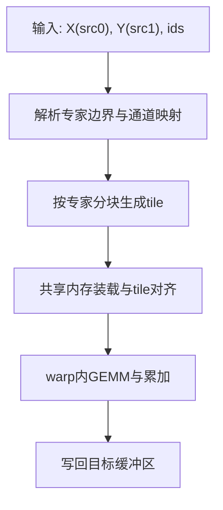
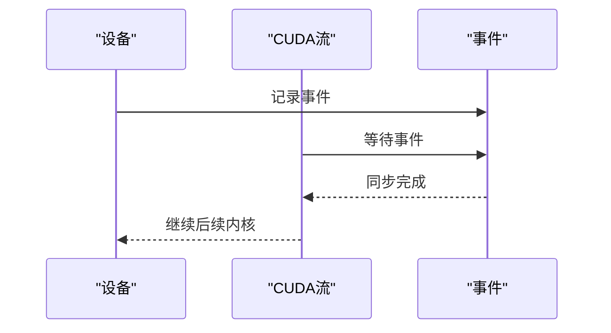
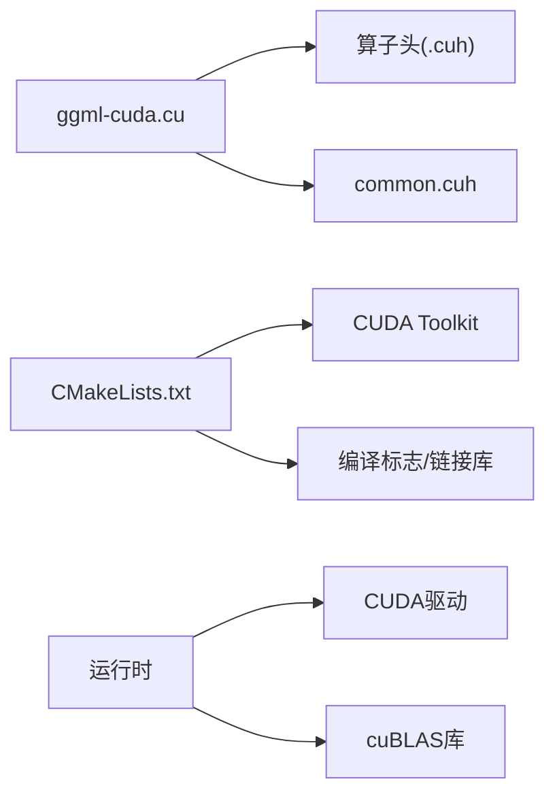

# CUDA后端

<cite>
**本文引用的文件**
- [ggml-cuda.h](file://ggml/include/ggml-cuda.h)
- [CMakeLists.txt](file://ggml/src/ggml-cuda/CMakeLists.txt)
- [CMakeLists.txt](file://CMakeLists.txt)
- [ggml-cuda.cu](file://ggml/src/ggml-cuda/ggml-cuda.cu)
- [common.cuh](file://ggml/src/ggml-cuda/common.cuh)
- [fattn.cuh](file://ggml/src/ggml-cuda/fattn.cuh)
- [mmq.cuh](file://ggml/src/ggml-cuda/mmq.cuh)
- [mmf.cuh](file://ggml/src/ggml-cuda/mmf.cuh)
- [cuda.h](file://ggml/src/ggml-cuda/vendors/cuda.h)
- [Dockerfile](file://Dockerfile)
- [build.md](file://docs/build.md)
- [docker.md](file://docs/docker.md)
- [performance.md](file://docs/performance.md)
</cite>

## 目录
1. [简介](#简介)
2. [项目结构](#项目结构)
3. [核心组件](#核心组件)
4. [架构总览](#架构总览)
5. [详细组件分析](#详细组件分析)
6. [依赖关系分析](#依赖关系分析)
7. [性能考量](#性能考量)
8. [故障排除指南](#故障排除指南)
9. [结论](#结论)
10. [附录](#附录)

## 简介
本文件系统性阐述CUDA后端的实现原理、编译配置与性能优化策略，覆盖以下主题：
- 如何利用NVIDIA GPU进行并行计算：CUDA内核优化、内存带宽优化、计算资源调度
- 版本兼容性、驱动要求与依赖库配置
- 编译选项、性能调优参数与故障排除
- 不同GPU架构（Maxwell、Pascal、Volta、Turing、Ampere、Ada Lovelace、Blackwell、DGX Spark、Rubin）的性能差异与优化策略
- 针对NVIDIA GPU用户的安装配置、性能监控与调试方法
- Docker容器化部署的CUDA配置与最佳实践

**重要变更**：CUDA后端现已作为默认选项启用。在最新的配置中，SD_CUDA选项默认值已从OFF改为ON，这意味着在没有明确指定的情况下，构建系统将自动启用CUDA后端支持。

## 项目结构
CUDA后端位于ggml子模块中，核心由头文件接口、CMake构建脚本、CUDA运行时封装与大量算子内核组成。下图展示与CUDA后端相关的关键文件与模块关系。

**图表来源**
- [ggml-cuda.h:1-48](file://ggml/include/ggml-cuda.h#L1-L48)
- [ggml-cuda.cu:1-120](file://ggml/src/ggml-cuda/ggml-cuda.cu#L1-L120)
- [CMakeLists.txt:1-120](file://ggml/src/ggml-cuda/CMakeLists.txt#L1-L120)
- [common.cuh:1-120](file://ggml/src/ggml-cuda/common.cuh#L1-L120)
- [mmq.cuh:1-120](file://ggml/src/ggml-cuda/mmq.cuh#L1-L120)
- [mmf.cuh:1-120](file://ggml/src/ggml-cuda/mmf.cuh#L1-L120)
- [fattn.cuh:1-6](file://ggml/src/ggml-cuda/fattn.cuh#L1-L6)
- [cuda.h:1-24](file://ggml/src/ggml-cuda/vendors/cuda.h#L1-L24)
- [CMakeLists.txt:1-200](file://CMakeLists.txt#L1-L200)

**章节来源**
- [ggml-cuda.h:1-48](file://ggml/include/ggml-cuda.h#L1-L48)
- [CMakeLists.txt:1-200](file://CMakeLists.txt#L1-L200)
- [ggml-cuda.cu:1-120](file://ggml/src/ggml-cuda/ggml-cuda.cu#L1-L120)
- [common.cuh:1-120](file://ggml/src/ggml-cuda/common.cuh#L1-L120)
- [mmq.cuh:1-120](file://ggml/src/ggml-cuda/mmq.cuh#L1-L120)
- [mmf.cuh:1-120](file://ggml/src/ggml-cuda/mmf.cuh#L1-L120)
- [fattn.cuh:1-6](file://ggml/src/ggml-cuda/fattn.cuh#L1-L6)
- [cuda.h:1-24](file://ggml/src/ggml-cuda/vendors/cuda.h#L1-L24)

## 核心组件
- 后端API与缓冲区类型
  - 初始化后端、查询设备、获取描述与显存信息
  - 设备缓冲区类型、拆分张量缓冲区类型、主机固定缓冲区类型
- 设备与流管理
  - 多设备、多流、事件同步、cuBLAS句柄生命周期保护
- 内存池与虚拟内存
  - 传统内存池与基于虚拟内存管理（VMM）的池化策略
- 错误处理与日志
  - 统一的CUDA/cuBLAS错误检查与致命错误中断
- 算子内核族
  - 通用算子：归并、复制、卷积、量化/反量化、归一化、激活等
  - 专用优化：量化矩阵乘（MMQ）、MoE矩阵乘（MMF）、Flash Attention（FA）

**章节来源**
- [ggml-cuda.h:22-43](file://ggml/include/ggml-cuda.h#L22-L43)
- [ggml-cuda.cu:4269-4320](file://ggml/src/ggml-cuda/ggml-cuda.cu#L4269-L4320)
- [ggml-cuda.cu:530-580](file://ggml/src/ggml-cuda/ggml-cuda.cu#L530-L580)
- [ggml-cuda.cu:584-682](file://ggml/src/ggml-cuda/ggml-cuda.cu#L584-L682)
- [ggml-cuda.cu:195-318](file://ggml/src/ggml-cuda/ggml-cuda.cu#L195-L318)
- [common.cuh:153-200](file://ggml/src/ggml-cuda/common.cuh#L153-L200)

## 架构总览
CUDA后端通过统一的后端接口注册到ggml框架，负责：
- 设备发现与能力探测（SM、共享内存、warp大小、是否支持协作启动）
- 为每个设备创建缓冲区类型与上下文
- 在设备上分配/释放显存，执行算子内核，并在多设备间进行数据搬运与同步
- 提供主机固定内存以加速CPU-GPU拷贝

**图表来源**
- [ggml-cuda.cu:5100-5110](file://ggml/src/ggml-cuda/ggml-cuda.cu#L5100-L5110)
- [ggml-cuda.cu:5070-5098](file://ggml/src/ggml-cuda/ggml-cuda.cu#L5070-L5098)
- [ggml-cuda.cu:750-774](file://ggml/src/ggml-cuda/ggml-cuda.cu#L750-L774)
- [mmq.cuh:1-120](file://ggml/src/ggml-cuda/mmq.cuh#L1-L120)
- [mmf.cuh:1-120](file://ggml/src/ggml-cuda/mmf.cuh#L1-L120)
- [fattn.cuh:1-6](file://ggml/src/ggml-cuda/fattn.cuh#L1-L6)

## 详细组件分析

### 设备与缓冲区管理
- 设备初始化与能力探测
  - 获取设备数量、属性、SM数、共享内存、warp大小、是否支持协作启动
  - 记录设备默认张量分割比例与VMM支持状态
- 缓冲区类型
  - 每个设备对应一个缓冲区类型，用于在该设备上分配显存
  - 支持主机固定缓冲区类型以提升跨主机/设备拷贝性能
- 内存池
  - 传统池：固定大小缓冲区复用，减少频繁cudaMalloc/cudaFree
  - VMM池：使用CUDA虚拟内存管理，按需映射物理页，降低碎片化

**图表来源**
- [ggml-cuda.cu:530-580](file://ggml/src/ggml-cuda/ggml-cuda.cu#L530-L580)
- [ggml-cuda.cu:684-748](file://ggml/src/ggml-cuda/ggml-cuda.cu#L684-L748)
- [ggml-cuda.cu:568-682](file://ggml/src/ggml-cuda/ggml-cuda.cu#L568-L682)

**章节来源**
- [ggml-cuda.cu:195-318](file://ggml/src/ggml-cuda/ggml-cuda.cu#L195-L318)
- [ggml-cuda.cu:530-580](file://ggml/src/ggml-cuda/ggml-cuda.cu#L530-L580)
- [ggml-cuda.cu:684-748](file://ggml/src/ggml-cuda/ggml-cuda.cu#L684-L748)
- [ggml-cuda.cu:568-682](file://ggml/src/ggml-cuda/ggml-cuda.cu#L568-L682)

### Flash Attention（FA）工作流
- 接口定义与支持检测
  - 提供外部扩展接口与支持性检测函数
- 执行流程
  - 在后端上下文中调度FA内核，结合注意力掩码与KV缓存优化
  - 对于特定模型与后端可显著降低显存占用并提升吞吐

**图表来源**
- [fattn.cuh:1-6](file://ggml/src/ggml-cuda/fattn.cuh#L1-L6)
- [ggml-cuda.cu:1747-1782](file://ggml/src/ggml-cuda/ggml-cuda.cu#L1747-L1782)

**章节来源**
- [fattn.cuh:1-6](file://ggml/src/ggml-cuda/fattn.cuh#L1-L6)
- [ggml-cuda.cu:1747-1782](file://ggml/src/ggml-cuda/ggml-cuda.cu#L1747-L1782)

### 量化矩阵乘（MMQ）算法
- 设计要点
  - 基于warp级tile与共享内存布局，针对不同量化格式采用差异化tile尺寸与加载策略
  - 利用DP4A或Tensor Core（根据架构）提升向量化点积效率
  - 动态选择X/Y tile大小以适配不同SM能力与warp大小
- 性能特征
  - 在Volta及以上架构优先使用更高吞吐的tile；在较老架构回退到更稳健的策略
  - 针对MXFP4/FP4等新格式提供专门迭代步长与tile配置

**图表来源**
- [mmq.cuh:102-162](file://ggml/src/ggml-cuda/mmq.cuh#L102-L162)
- [mmq.cuh:184-200](file://ggml/src/ggml-cuda/mmq.cuh#L184-L200)

**章节来源**
- [mmq.cuh:102-162](file://ggml/src/ggml-cuda/mmq.cuh#L102-L162)
- [mmq.cuh:184-200](file://ggml/src/ggml-cuda/mmq.cuh#L184-L200)

### MoE矩阵乘（MMF）与专家路由
- 设计要点
  - 支持带专家索引的稀疏矩阵乘，按专家分块并行
  - 使用warp级tile与共享内存，结合可选的ids匹配逻辑
- 性能特征
  - 在AMD CDNA架构上采用更大块以提升吞吐
  - 在NVIDIA架构上根据可用MFMA/WMMAs选择最优tile

**图表来源**
- [mmf.cuh:48-120](file://ggml/src/ggml-cuda/mmf.cuh#L48-L120)
- [mmf.cuh:12-26](file://ggml/src/ggml-cuda/mmf.cuh#L12-L26)

**章节来源**
- [mmf.cuh:48-120](file://ggml/src/ggml-cuda/mmf.cuh#L48-L120)
- [mmf.cuh:12-26](file://ggml/src/ggml-cuda/mmf.cuh#L12-L26)

### 错误处理与同步机制
- 统一错误检查
  - CUDA/cuBLAS/VMM错误封装，失败时打印当前设备、函数、文件与行号，并触发致命中断
- 多设备同步
  - 使用事件与流等待确保跨设备计算顺序正确
- 句柄生命周期保护
  - 图捕获期间避免销毁cuBLAS句柄，通过互斥与条件变量协调

**图表来源**
- [common.cuh:153-200](file://ggml/src/ggml-cuda/common.cuh#L153-L200)
- [ggml-cuda.cu:1747-1782](file://ggml/src/ggml-cuda/ggml-cuda.cu#L1747-L1782)
- [ggml-cuda.cu:540-564](file://ggml/src/ggml-cuda/ggml-cuda.cu#L540-L564)

**章节来源**
- [common.cuh:153-200](file://ggml/src/ggml-cuda/common.cuh#L153-L200)
- [ggml-cuda.cu:1747-1782](file://ggml/src/ggml-cuda/ggml-cuda.cu#L1747-L1782)
- [ggml-cuda.cu:540-564](file://ggml/src/ggml-cuda/ggml-cuda.cu#L540-L564)

## 依赖关系分析
- 头文件依赖
  - ggml-cuda.cu包含各算子头文件与公共头，形成"实现文件"对"算子内核"的单向依赖
  - common.cuh集中定义架构常量、错误宏与通用工具
- 构建依赖
  - CMakeLists.txt查找CUDA Toolkit并设置架构列表与编译标志
  - 静态/动态链接cuBLAS与CUDA运行时，按版本启用特性（如TF32、BF16、FP8/FP4）
- 运行时依赖
  - CUDA驱动与cuBLAS库版本需满足功能需求（如Tensor Core、BF16/FP8/FP4支持）

**图表来源**
- [ggml-cuda.cu:1-80](file://ggml/src/ggml-cuda/ggml-cuda.cu#L1-L80)
- [common.cuh:1-120](file://ggml/src/ggml-cuda/common.cuh#L1-L120)
- [CMakeLists.txt:1-120](file://ggml/src/ggml-cuda/CMakeLists.txt#L1-L120)
- [cuda.h:1-24](file://ggml/src/ggml-cuda/vendors/cuda.h#L1-L24)

**章节来源**
- [ggml-cuda.cu:1-80](file://ggml/src/ggml-cuda/ggml-cuda.cu#L1-L80)
- [common.cuh:1-120](file://ggml/src/ggml-cuda/common.cuh#L1-L120)
- [CMakeLists.txt:1-120](file://ggml/src/ggml-cuda/CMakeLists.txt#L1-L120)
- [cuda.h:1-24](file://ggml/src/ggml-cuda/vendors/cuda.h#L1-L24)

## 性能考量
- 架构与指令集
  - Maxwell/Pascal：基础FP16与DP4A；Turing引入int8 Tensor Cores
  - Volta/Ampere：FP16 Tensor Cores与异步数据加载；A100/H100进一步优化
  - Ada Lovelace/Blackwell：新增FP4 Tensor Cores与更丰富的SM功能
- 算法选择
  - MMQ在高SM架构上采用更大tile与更高吞吐；在低SM架构回退到稳健策略
  - Flash Attention在CUDA后端通常带来速度与显存收益
- 内存与带宽
  - 使用主机固定内存与事件驱动的流水线拷贝
  - VMM池化减少碎片化与频繁分配开销
- 并行与调度
  - 多流/多设备并行计算，事件同步保证跨设备一致性
  - 依据warp大小与共享内存限制调整block/tile尺寸

**章节来源**
- [common.cuh:47-91](file://ggml/src/ggml-cuda/common.cuh#L47-L91)
- [mmq.cuh:102-162](file://ggml/src/ggml-cuda/mmq.cuh#L102-L162)
- [performance.md:1-26](file://docs/performance.md#L1-L26)
- [ggml-cuda.cu:530-580](file://ggml/src/ggml-cuda/ggml-cuda.cu#L530-L580)

## 故障排除指南
- 常见问题定位
  - CUDA/cuBLAS错误：统一通过错误宏打印设备、函数、文件与行号，便于快速定位
  - 多设备同步：若出现死锁，检查事件记录与流等待顺序
  - 主机固定内存：注册失败时检查CUDA版本与权限
- 调试建议
  - 启用调试编译标志（如行号信息），在开发阶段观察内核路径与参数
  - 使用性能文档中的开关验证FA与权重卸载策略的效果
- 环境与版本
  - 确认CUDA Toolkit版本满足所需特性（如FP8/FP4、BF16、TF32）
  - 在容器环境中确保驱动与CUDA运行时匹配

**章节来源**
- [common.cuh:153-200](file://ggml/src/ggml-cuda/common.cuh#L153-L200)
- [CMakeLists.txt:189-256](file://ggml/src/ggml-cuda/CMakeLists.txt#L189-L256)
- [ggml-cuda.cu:4285-4318](file://ggml/src/ggml-cuda/ggml-cuda.cu#L4285-L4318)

## 结论
CUDA后端通过完善的设备管理、灵活的缓冲区与内存池、以及针对不同GPU架构的内核优化，实现了高效稳定的NVIDIA GPU加速。配合Flash Attention、量化矩阵乘与MoE矩阵乘等专项优化，在多种模型与场景下取得显著的性能与显存收益。构建系统提供了丰富的编译选项与版本兼容性控制，便于在不同硬件与驱动环境下稳定运行。

**重要更新**：随着SD_CUDA选项默认启用，用户现在可以在不显式指定构建选项的情况下获得CUDA加速支持。这简化了安装和配置过程，使得大多数用户能够自动享受到CUDA后端带来的性能优势。

## 附录

### 编译配置与版本兼容性
- 构建系统
  - 自动检测CUDA Toolkit并设置架构列表（Maxwell/Pascal/Volta/Turing/Ampere/Ada Lovelace/Blackwell/DGX Spark/Rubin）
  - 支持native与PTX混合编译，兼顾性能与兼容性
- 编译标志
  - 启用快速数学与lambda扩展
  - 可选压缩模式（CUDA 12.8+）、调试信息、警告转错误
- 链接库
  - 动态/静态链接CUDA运行时与cuBLAS；按版本启用BF16/FP8/FP4支持
  - 可选链接CUDA驱动库（VMM场景）

**章节来源**
- [CMakeLists.txt:8-120](file://ggml/src/ggml-cuda/CMakeLists.txt#L8-L120)
- [CMakeLists.txt:189-256](file://ggml/src/ggml-cuda/CMakeLists.txt#L189-L256)
- [cuda.h:1-24](file://ggml/src/ggml-cuda/vendors/cuda.h#L1-L24)

### 默认选项变更说明
**重要变更**：在最新的构建配置中，SD_CUDA选项的默认值已从OFF改为ON。这意味着：

- **无需显式指定**：用户在构建时无需添加-DSD_CUDA=ON参数即可启用CUDA后端
- **自动检测**：构建系统会自动检测CUDA Toolkit并启用相应功能
- **向后兼容**：如果用户明确禁用CUDA后端，系统仍会按照用户的选择进行配置

这种变更简化了用户的使用体验，使得CUDA加速成为默认的、开箱即用的功能。

**章节来源**
- [CMakeLists.txt:32](file://CMakeLists.txt#L32)
- [CMakeLists.txt:45-49](file://CMakeLists.txt#L45-L49)

### Docker容器化部署
- 构建阶段
  - 基于Ubuntu，安装构建工具与cmake，拉取源码并编译Release二进制
- 运行阶段
  - 仅依赖运行时库（如OpenMP），复制sd-cli/sd-server至运行镜像
- 最佳实践
  - 在宿主机安装与容器内运行的CUDA版本保持一致
  - 使用nvidia-container-toolkit挂载驱动与CUDA库

**章节来源**
- [Dockerfile:1-23](file://Dockerfile#L1-L23)
- [docker.md:1-40](file://docs/docker.md#L1-L40)

### 构建选项对比
**默认启用的优势**：
- 简化用户操作：无需记住额外的构建参数
- 提升用户体验：大多数用户都能自动获得CUDA加速
- 减少配置错误：避免因忘记启用CUDA而导致的性能损失

**用户控制**：
- 仍然可以通过-DSD_CUDA=OFF显式禁用CUDA后端
- 支持混合配置：用户可以同时启用多个后端（如CUDA + Metal）
- 灵活的环境适应：在无GPU或CUDA不可用的环境中自动降级

**章节来源**
- [build.md:37-45](file://docs/build.md#L37-L45)
- [CMakeLists.txt:32](file://CMakeLists.txt#L32)