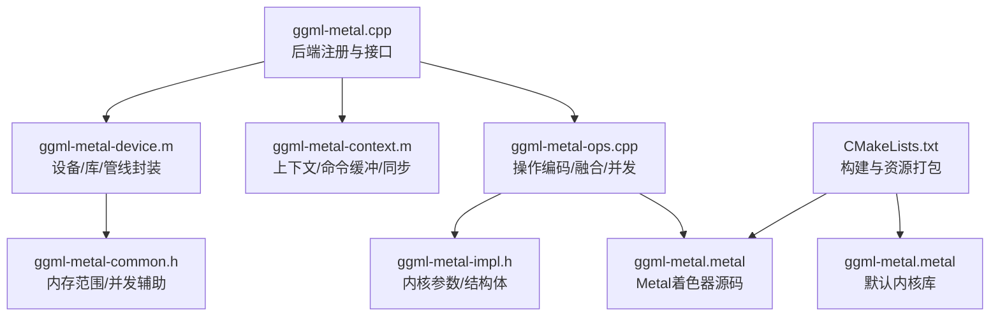
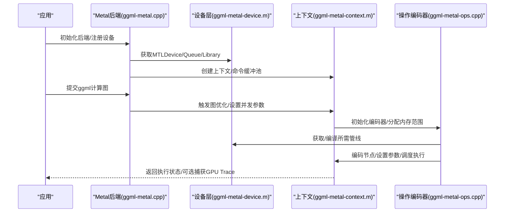
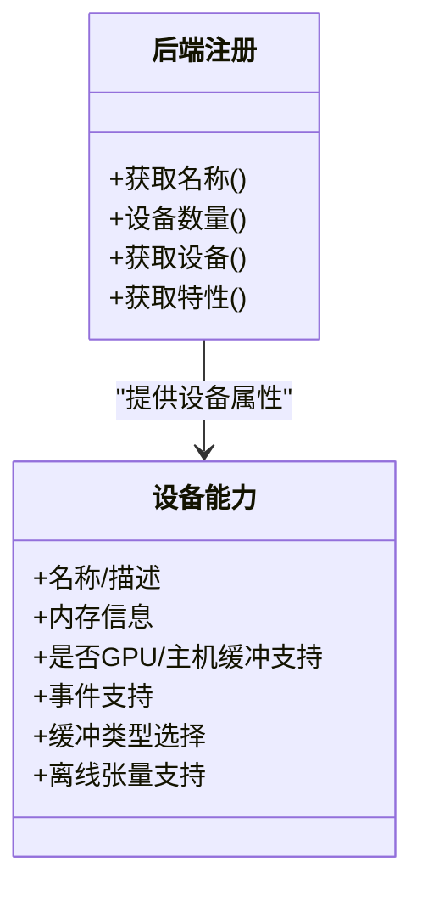
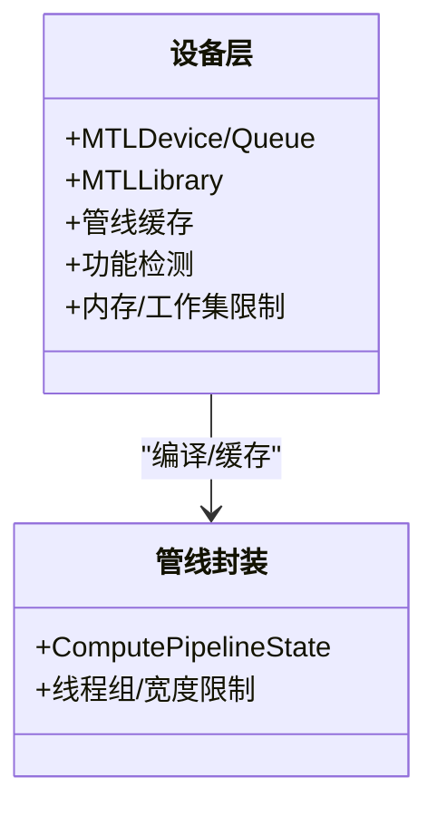
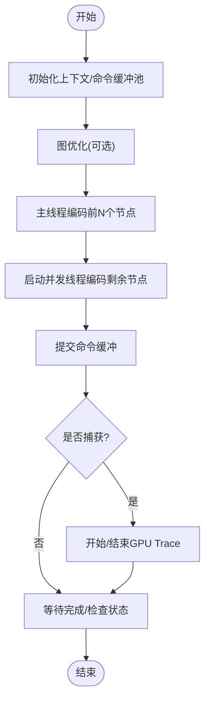
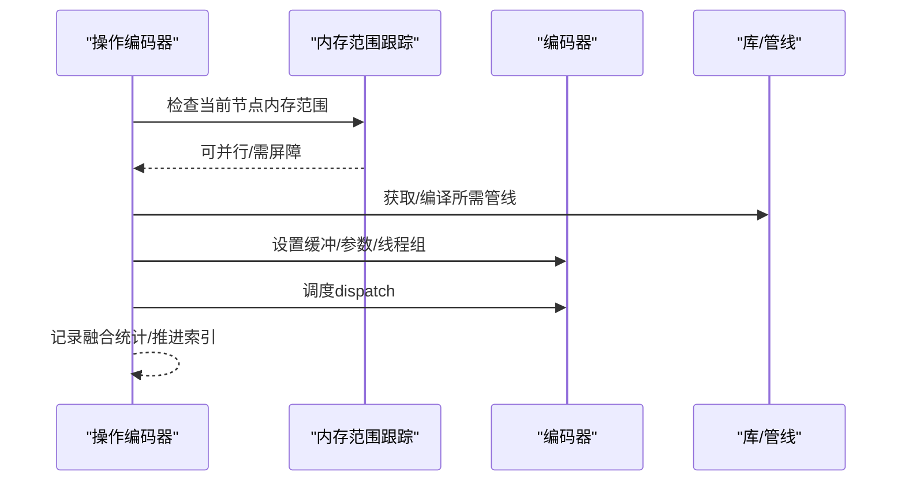
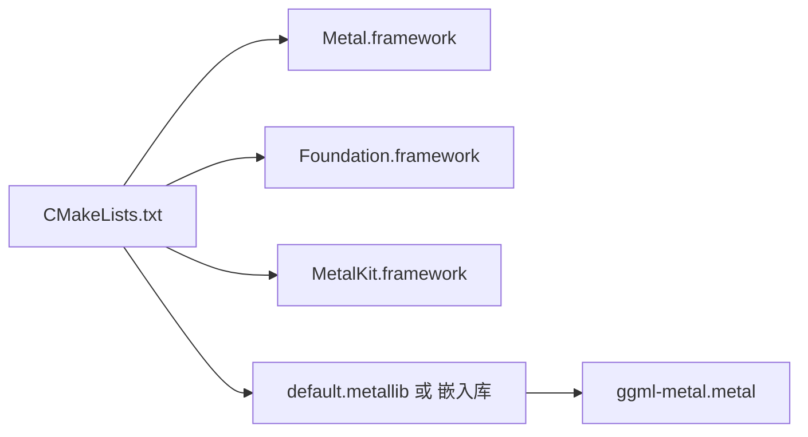

# Metal后端

<cite>
**本文档引用的文件**
- [ggml-metal.h](file://ggml/include/ggml-metal.h)
- [ggml-metal-impl.h](file://ggml/src/ggml-metal/ggml-metal-impl.h)
- [ggml-metal-ops.h](file://ggml/src/ggml-metal/ggml-metal-ops.h)
- [ggml-metal-common.h](file://ggml/src/ggml-metal/ggml-metal-common.h)
- [ggml-metal.cpp](file://ggml/src/ggml-metal/ggml-metal.cpp)
- [ggml-metal-device.h](file://ggml/src/ggml-metal/ggml-metal-device.h)
- [ggml-metal-context.h](file://ggml/src/ggml-metal/ggml-metal-context.h)
- [ggml-metal-context.m](file://ggml/src/ggml-metal/ggml-metal-context.m)
- [ggml-metal-device.m](file://ggml/src/ggml-metal/ggml-metal-device.m)
- [ggml-metal-ops.cpp](file://ggml/src/ggml-metal/ggml-metal-ops.cpp)
- [CMakeLists.txt](file://ggml/src/ggml-metal/CMakeLists.txt)
- [ggml-metal.metal](file://ggml/src/ggml-metal/ggml-metal.metal)
- [build.md](file://docs/build.md)
</cite>

## 目录
1. [简介](#简介)
2. [项目结构](#项目结构)
3. [核心组件](#核心组件)
4. [架构总览](#架构总览)
5. [详细组件分析](#详细组件分析)
6. [依赖关系分析](#依赖关系分析)
7. [性能考量](#性能考量)
8. [故障排查指南](#故障排查指南)
9. [结论](#结论)
10. [附录](#附录)

## 简介
本文件系统性阐述Metal后端的实现原理、编译配置与性能优化策略，重点覆盖以下方面：
- Metal后端如何利用Apple GPU进行高效计算：包括Metal着色器优化、内存管理策略、计算编码器使用等
- 在macOS与iOS平台上的适配情况、性能特点与限制条件
- 编译配置、Xcode设置与部署要求
- 针对Apple Silicon、Intel与AMD GPU的性能表现与优化策略
- Metal Performance Shaders与自定义着色器开发指导
- 面向Apple设备用户的Metal后端配置、性能调优与调试方法

## 项目结构
Metal后端位于ggml子模块中，采用C/C++与Objective‑C混合实现，核心源码分布如下：
- 后端接口与注册：ggml-metal.cpp
- 设备与管线封装：ggml-metal-device.h/.m
- 上下文与命令缓冲：ggml-metal-context.h/.m
- 操作编码器与融合调度：ggml-metal-ops.cpp
- 内核参数与数据结构：ggml-metal-impl.h
- 公共内存范围与并发控制：ggml-metal-common.h
- Metal内核源码：ggml-metal.metal
- 构建脚本：CMakeLists.txt

图示来源
- [ggml-metal.cpp:1-725](file://ggml/src/ggml-metal/ggml-metal.cpp#L1-L725)
- [ggml-metal-device.m:1-800](file://ggml/src/ggml-metal/ggml-metal-device.m#L1-L800)
- [ggml-metal-context.m:1-610](file://ggml/src/ggml-metal/ggml-metal-context.m#L1-L610)
- [ggml-metal-ops.cpp:1-200](file://ggml/src/ggml-metal/ggml-metal-ops.cpp#L1-L200)
- [ggml-metal-impl.h:1-800](file://ggml/src/ggml-metal/ggml-metal-impl.h#L1-L800)
- [ggml-metal.metal](file://ggml/src/ggml-metal/ggml-metal.metal)
- [CMakeLists.txt:1-125](file://ggml/src/ggml-metal/CMakeLists.txt#L1-L125)

章节来源
- [ggml-metal.cpp:1-725](file://ggml/src/ggml-metal/ggml-metal.cpp#L1-L725)
- [CMakeLists.txt:1-125](file://ggml/src/ggml-metal/CMakeLists.txt#L1-L125)

## 核心组件
- 后端注册与设备接口：负责初始化Metal后端、注册设备、提供缓冲类型与能力查询
- 设备层：封装MTLDevice、MTLLibrary、MTLCommandQueue、管线缓存与特性检测
- 上下文层：管理命令缓冲池、并发线程数、捕获状态与同步机制
- 操作编码器：将ggml计算图节点映射到Metal内核，支持融合与并发
- 内核参数与数据结构：定义各算子的内核参数结构体与线程组参数
- 公共工具：内存范围跟踪以提升并发安全与吞吐

章节来源
- [ggml-metal.cpp:374-722](file://ggml/src/ggml-metal/ggml-metal.cpp#L374-L722)
- [ggml-metal-device.h:1-275](file://ggml/src/ggml-metal/ggml-metal-device.h#L1-L275)
- [ggml-metal-context.h:1-34](file://ggml/src/ggml-metal/ggml-metal-context.h#L1-L34)
- [ggml-metal-ops.h:1-96](file://ggml/src/ggml-metal/ggml-metal-ops.h#L1-L96)
- [ggml-metal-impl.h:1-800](file://ggml/src/ggml-metal/ggml-metal-impl.h#L1-L800)
- [ggml-metal-common.h:1-53](file://ggml/src/ggml-metal/ggml-metal-common.h#L1-L53)

## 架构总览
Metal后端通过“后端接口 → 设备层 → 上下文层 → 操作编码器”的分层设计，将ggml计算图转换为Metal命令缓冲与内核执行。其关键流程包括：
- 初始化：选择MTLDevice、创建命令队列、加载或编译MTLLibrary
- 图优化：基于内存访问模式重排节点以提升并发
- 并发编码：多命令缓冲并行提交，主线程优先提交部分节点
- 执行与同步：等待完成、检查状态、可选开启GPU Trace捕获

图示来源
- [ggml-metal.cpp:420-460](file://ggml/src/ggml-metal/ggml-metal.cpp#L420-L460)
- [ggml-metal-context.m:359-521](file://ggml/src/ggml-metal/ggml-metal-context.m#L359-L521)
- [ggml-metal-ops.cpp:175-200](file://ggml/src/ggml-metal/ggml-metal-ops.cpp#L175-L200)

## 详细组件分析

### 后端接口与设备能力
- 后端注册：提供后端GUID、设备属性查询、缓冲类型选择（共享/私有/映射）
- 设备能力：检测SIMD组归约/矩阵乘、bfloat16、tensor API、统一内存、最大缓冲区与工作集大小等
- 缓冲类型：根据设备特性自动选择共享或私有缓冲，并提供映射缓冲类型

图示来源
- [ggml-metal.cpp:653-722](file://ggml/src/ggml-metal/ggml-metal.cpp#L653-L722)
- [ggml-metal.cpp:519-651](file://ggml/src/ggml-metal/ggml-metal.cpp#L519-L651)
- [ggml-metal-device.h:207-246](file://ggml/src/ggml-metal/ggml-metal-device.h#L207-L246)

章节来源
- [ggml-metal.cpp:519-651](file://ggml/src/ggml-metal/ggml-metal.cpp#L519-L651)
- [ggml-metal-device.h:207-246](file://ggml/src/ggml-metal/ggml-metal-device.h#L207-L246)

### 设备层：MTL对象封装与管线缓存
- MTLFunctionConstantValues封装：用于动态常量传递
- MTLComputePipelineState缓存：避免重复编译，加速内核加载
- MTLLibrary加载策略：优先嵌入库，其次bundle资源，最后从源码编译
- 管线获取与编译：按算子类型与参数动态生成管线

图示来源
- [ggml-metal-device.m:99-346](file://ggml/src/ggml-metal/ggml-metal-device.m#L99-L346)
- [ggml-metal-device.m:347-446](file://ggml/src/ggml-metal/ggml-metal-device.m#L347-L446)

章节来源
- [ggml-metal-device.m:99-346](file://ggml/src/ggml-metal/ggml-metal-device.m#L99-L346)
- [ggml-metal-device.m:347-446](file://ggml/src/ggml-metal/ggml-metal-device.m#L347-L446)

### 上下文层：命令缓冲与并发
- 命令缓冲池：固定上限，主线程与多个并发线程分别编码
- 并发策略：主线程优先提交部分节点，其余由线程池并行编码
- 捕获与调试：可开启GPU Trace捕获，输出.gputrace文件
- 同步与错误处理：等待完成、检查状态、必要时中止

图示来源
- [ggml-metal-context.m:359-521](file://ggml/src/ggml-metal/ggml-metal-context.m#L359-L521)
- [ggml-metal-context.m:523-592](file://ggml/src/ggml-metal/ggml-metal-context.m#L523-L592)

章节来源
- [ggml-metal-context.m:359-521](file://ggml/src/ggml-metal/ggml-metal-context.m#L359-L521)
- [ggml-metal-context.m:523-592](file://ggml/src/ggml-metal/ggml-metal-context.m#L523-L592)

### 操作编码器：融合与并发
- 节点过滤：跳过空节点，仅编码非空节点
- 并发检查：基于内存读写范围判断是否可并行
- 融合策略：根据算子组合与内存约束尝试融合
- 参数设置：为每个内核设置缓冲、字节参数与线程组维度

图示来源
- [ggml-metal-ops.cpp:175-200](file://ggml/src/ggml-metal/ggml-metal-ops.cpp#L175-L200)
- [ggml-metal-common.h:28-48](file://ggml/src/ggml-metal/ggml-metal-common.h#L28-L48)

章节来源
- [ggml-metal-ops.cpp:175-200](file://ggml/src/ggml-metal/ggml-metal-ops.cpp#L175-L200)
- [ggml-metal-common.h:28-48](file://ggml/src/ggml-metal/ggml-metal-common.h#L28-L48)

### 内核参数与数据结构
- 算子参数结构体：为每个内核定义紧凑的参数布局，减少寄存器占用
- 线程组参数宏：针对不同量化类型与算子设定N_R0/N_SG等参数
- 常量偏移：为不同函数族与算子类别预留常量索引

章节来源
- [ggml-metal-impl.h:1-800](file://ggml/src/ggml-metal/ggml-metal-impl.h#L1-L800)

### Metal着色器与自定义内核
- 默认内核库：通过CMake在构建时编译为.default.metallib或嵌入二进制
- 资源路径：支持从bundle或运行时目录加载.metal源码
- 自定义扩展：可通过动态编译源码或替换默认库实现自定义内核

章节来源
- [CMakeLists.txt:26-108](file://ggml/src/ggml-metal/CMakeLists.txt#L26-L108)
- [ggml-metal-device.m:108-262](file://ggml/src/ggml-metal/ggml-metal-device.m#L108-L262)

## 依赖关系分析
- 外部框架：Foundation、Metal、MetalKit
- 构建选项：嵌入库/外置库、调试标志、最低系统版本、标准版本
- 运行时资源：ggml-common.h、ggml-metal.metal、ggml-metal-impl.h

图示来源
- [CMakeLists.txt:1-21](file://ggml/src/ggml-metal/CMakeLists.txt#L1-L21)
- [CMakeLists.txt:26-108](file://ggml/src/ggml-metal/CMakeLists.txt#L26-L108)

章节来源
- [CMakeLists.txt:1-21](file://ggml/src/ggml-metal/CMakeLists.txt#L1-L21)
- [CMakeLists.txt:26-108](file://ggml/src/ggml-metal/CMakeLists.txt#L26-L108)

## 性能考量
- 并发与融合
  - 使用环境变量控制融合与并发开关，避免过度并发导致资源争用
  - 通过内存范围跟踪减少不必要的屏障与串行化
- 线程组与工作集
  - 根据设备特性设置命令缓冲数量与每缓冲节点数，平衡吞吐与延迟
  - 利用设备推荐工作集大小与最大缓冲长度，避免OOM
- 内存策略
  - 统一内存设备优先使用共享缓冲；离散GPU可按需启用共享缓冲
  - 可选启用驻留集合以保持内存常驻，降低反复换页开销
- 算子离线卸载
  - 对批量较大的矩阵乘算子自动离线到GPU，减少CPU负担
- 调试与捕获
  - 支持GPU Trace捕获，便于定位热点与瓶颈

章节来源
- [ggml-metal-context.m:533-592](file://ggml/src/ggml-metal/ggml-metal-context.m#L533-L592)
- [ggml-metal-device.m:766-794](file://ggml/src/ggml-metal/ggml-metal-device.m#L766-L794)
- [ggml-metal.cpp:627-633](file://ggml/src/ggml-metal/ggml-metal.cpp#L627-L633)

## 故障排查指南
- 常见问题
  - 内核编译失败：检查.metal源码路径、预处理器宏与最低系统版本
  - 管线不可用：确认设备是否满足目标GPU家族要求
  - OOM/执行失败：检查工作集大小、缓冲长度与节点批量阈值
- 调试手段
  - 启用GPU Trace捕获，导出.gputrace文件进行分析
  - 查看命令缓冲状态与错误描述，定位失败节点
  - 使用环境变量禁用融合/并发以排除干扰因素

章节来源
- [ggml-metal-context.m:404-411](file://ggml/src/ggml-metal/ggml-metal-context.m#L404-L411)
- [ggml-metal-context.m:468-517](file://ggml/src/ggml-metal/ggml-metal-context.m#L468-L517)
- [ggml-metal-device.m:214-244](file://ggml/src/ggml-metal/ggml-metal-device.m#L214-L244)

## 结论
Metal后端通过清晰的分层设计与完善的设备/管线封装，实现了对Apple GPU的高效利用。其并发与融合策略、内存范围跟踪与驻留集合等机制共同提升了吞吐与稳定性。结合构建配置与调试工具，用户可在不同Apple平台上获得可靠的Metal加速体验。

## 附录

### 编译配置与部署
- 构建选项
  - 开启Metal后端：-DSD_METAL=ON
  - 嵌入库模式：-DGGML_METAL_EMBED_LIBRARY=ON
  - 调试内核：-DGGML_METAL_SHADER_DEBUG=ON
  - 最低系统版本：-DGGML_METAL_MACOSX_VERSION_MIN=...
  - C++标准：-DGGML_METAL_STD=...
- 依赖框架：Foundation、Metal、MetalKit
- 运行时资源：default.metallib与ggml-metal.metal（非嵌入库模式）

章节来源
- [build.md:72-80](file://docs/build.md#L72-L80)
- [CMakeLists.txt:22-108](file://ggml/src/ggml-metal/CMakeLists.txt#L22-L108)

### 平台适配与限制
- macOS/iOS：支持统一内存与离散GPU；可按需启用共享缓冲
- Apple Silicon：广泛支持bfloat16与tensor API（M5/A19及以上建议启用）
- Intel/AMD：Metal后端专用于Apple GPU，不适用于Intel/AMD GPU

章节来源
- [ggml-metal-device.m:635-664](file://ggml/src/ggml-metal/ggml-metal-device.m#L635-L664)
- [ggml-metal.cpp:585-591](file://ggml/src/ggml-metal/ggml-metal.cpp#L585-L591)

### Metal Performance Shaders与自定义着色器
- MPS集成：可通过Metal库加载MPS内核，结合自定义.metal实现高性能算子
- 自定义着色器：在ggml-metal.metal中新增内核，遵循现有参数结构与命名规范，重新编译default.metallib

章节来源
- [ggml-metal-device.m:108-262](file://ggml/src/ggml-metal/ggml-metal-device.m#L108-L262)
- [CMakeLists.txt:93-107](file://ggml/src/ggml-metal/CMakeLists.txt#L93-L107)