# OpenCL后端

<cite>
**本文档引用的文件**
- [ggml-opencl.h](file://ggml/include/ggml-opencl.h)
- [ggml-opencl.cpp](file://ggml/src/ggml-opencl/ggml-opencl.cpp)
- [CMakeLists.txt](file://ggml/src/ggml-opencl/CMakeLists.txt)
- [add.cl](file://ggml/src/ggml-opencl/kernels/add.cl)
- [mul_mat_f16_f32.cl](file://ggml/src/ggml-opencl/kernels/mul_mat_f16_f32.cl)
- [embed_kernel.py](file://ggml/src/ggml-opencl/kernels/embed_kernel.py)
</cite>

## 目录
1. [简介](#简介)
2. [项目结构](#项目结构)
3. [核心组件](#核心组件)
4. [架构概览](#架构概览)
5. [详细组件分析](#详细组件分析)
6. [依赖关系分析](#依赖关系分析)
7. [性能考虑](#性能考虑)
8. [故障排除指南](#故障排除指南)
9. [结论](#结论)
10. [附录](#附录)

## 简介

OpenCL后端是ggml框架中用于异构计算的强大组件，它允许在GPU、CPU、FPGA等多种计算设备上执行并行计算。该后端实现了完整的OpenCL 2.0+标准支持，提供了从设备枚举、上下文管理到内核编译和执行的完整解决方案。

OpenCL后端的核心目标是在保持跨平台兼容性的同时，最大化利用现代异构硬件的并行计算能力。通过精心设计的内核优化和内存管理策略，该后端能够高效处理深度学习模型推理任务中的各种算子操作。

## 项目结构

OpenCL后端位于ggml项目的专门目录中，采用模块化设计，将核心逻辑与内核代码分离：

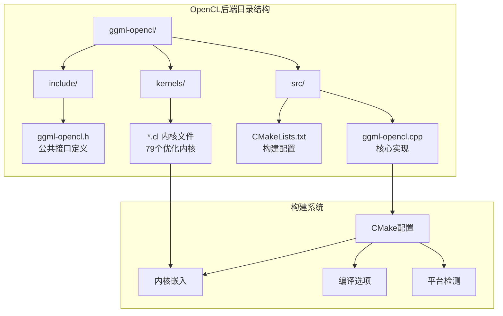

**图表来源**
- [ggml-opencl.cpp:1-100](file://ggml/src/ggml-opencl/ggml-opencl.cpp#L1-L100)
- [CMakeLists.txt:1-143](file://ggml/src/ggml-opencl/CMakeLists.txt#L1-L143)

**章节来源**
- [ggml-opencl.cpp:1-100](file://ggml/src/ggml-opencl/ggml-opencl.cpp#L1-L100)
- [CMakeLists.txt:1-143](file://ggml/src/ggml-opencl/CMakeLists.txt#L1-L143)

## 核心组件

OpenCL后端由多个相互协作的核心组件构成，每个组件都有明确的职责分工：

### 主要数据结构

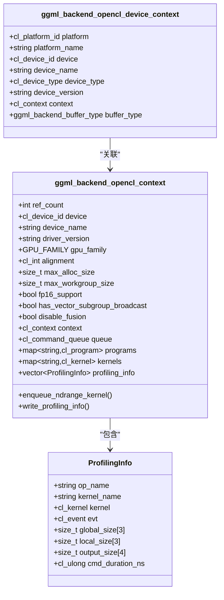

**图表来源**
- [ggml-opencl.cpp:357-710](file://ggml/src/ggml-opencl/ggml-opencl.cpp#L357-L710)

### 编译配置系统

OpenCL后端提供了灵活的编译配置选项，支持多种构建模式：

| 配置选项 | 默认值 | 功能描述 |
|---------|--------|----------|
| GGML_OPENCL_TARGET_VERSION | 220 | OpenCL目标版本（2.2） |
| GGML_OPENCL_EMBED_KERNELS | 关闭 | 嵌入内核源码到二进制文件 |
| GGML_OPENCL_PROFILING | 关闭 | 启用性能分析功能 |
| GGML_OPENCL_USE_ADRENO_KERNELS | 关闭 | 启用Adreno GPU专用内核 |

**章节来源**
- [ggml-opencl.cpp:1-50](file://ggml/src/ggml-opencl/ggml-opencl.cpp#L1-L50)
- [CMakeLists.txt:12-32](file://ggml/src/ggml-opencl/CMakeLists.txt#L12-L32)

## 架构概览

OpenCL后端采用分层架构设计，从底层的OpenCL API封装到高层的ggml后端接口：

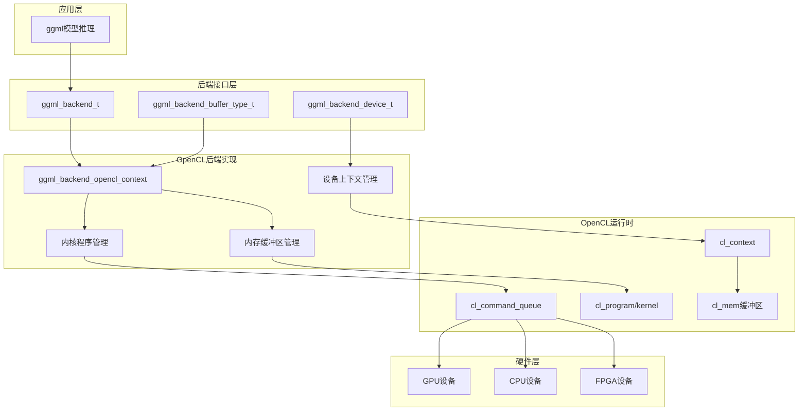

**图表来源**
- [ggml-opencl.cpp:357-410](file://ggml/src/ggml-opencl/ggml-opencl.cpp#L357-L410)
- [ggml-opencl.h:14-20](file://ggml/include/ggml-opencl.h#L14-L20)

## 详细组件分析

### 设备枚举与选择机制

OpenCL后端实现了智能的设备枚举和选择机制，支持多种筛选条件：

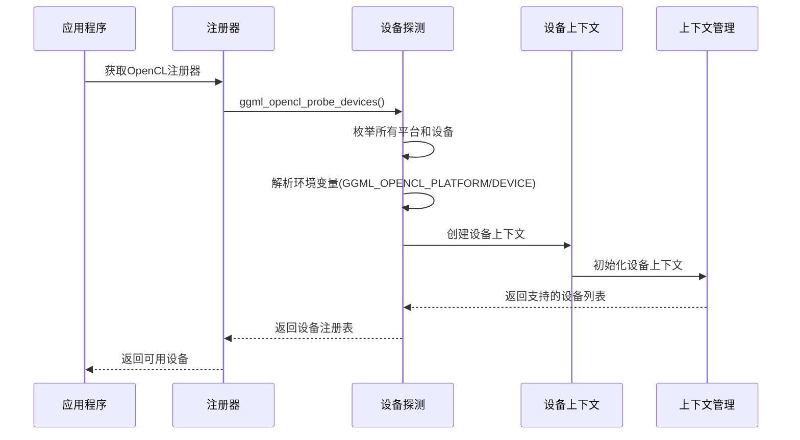

**图表来源**
- [ggml-opencl.cpp:2427-2569](file://ggml/src/ggml-opencl/ggml-opencl.cpp#L2427-L2569)

设备选择支持以下方式：
1. **环境变量控制**：通过`GGML_OPENCL_PLATFORM`和`GGML_OPENCL_DEVICE`指定平台和设备
2. **自动选择**：优先选择GPU设备，否则选择第一个可用设备
3. **名称匹配**：支持按设备名称子串匹配

**章节来源**
- [ggml-opencl.cpp:2427-2569](file://ggml/src/ggml-opencl/ggml-opencl.cpp#L2427-L2569)

### 内核编译与加载系统

OpenCL后端实现了高效的内核编译和缓存机制：

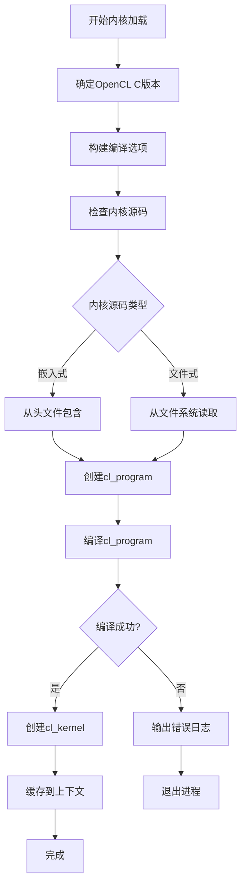

**图表来源**
- [ggml-opencl.cpp:728-755](file://ggml/src/ggml-opencl/ggml-opencl.cpp#L728-L755)
- [ggml-opencl.cpp:757-786](file://ggml/src/ggml-opencl/ggml-opencl.cpp#L757-L786)

编译选项包含：
- OpenCL C标准版本设置
- 数学优化标志：`-cl-mad-enable -cl-unsafe-math-optimizations`
- 数值精度控制：`-cl-finite-math-only -cl-fast-relaxed-math`

**章节来源**
- [ggml-opencl.cpp:757-786](file://ggml/src/ggml-opencl/ggml-opencl.cpp#L757-L786)

### 内存管理机制

OpenCL后端提供了高效的内存管理策略：

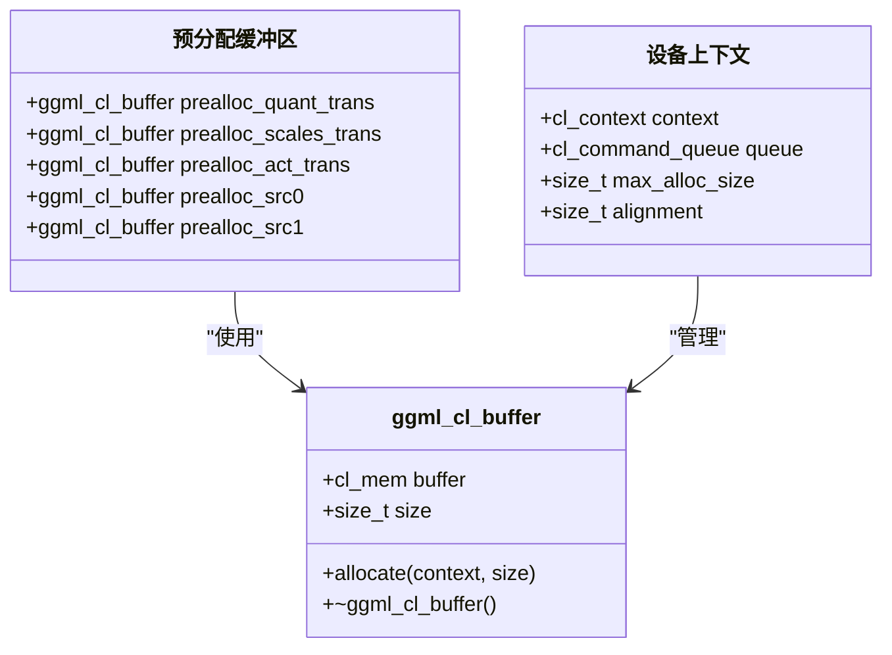

**图表来源**
- [ggml-opencl.cpp:266-290](file://ggml/src/ggml-opencl/ggml-opencl.cpp#L266-L290)
- [ggml-opencl.cpp:406-414](file://ggml/src/ggml-opencl/ggml-opencl.cpp#L406-L414)

预分配策略针对常见操作模式进行了优化：
- 权重量化转换缓冲区
- 激活函数转换缓冲区  
- 源张量缓冲区

**章节来源**
- [ggml-opencl.cpp:406-414](file://ggml/src/ggml-opencl/ggml-opencl.cpp#L406-L414)

### 内核实现分析

OpenCL后端包含79个优化的内核文件，覆盖了深度学习推理的各个方面：

#### 基础算子内核

基础加法内核展示了OpenCL内核的基本结构：

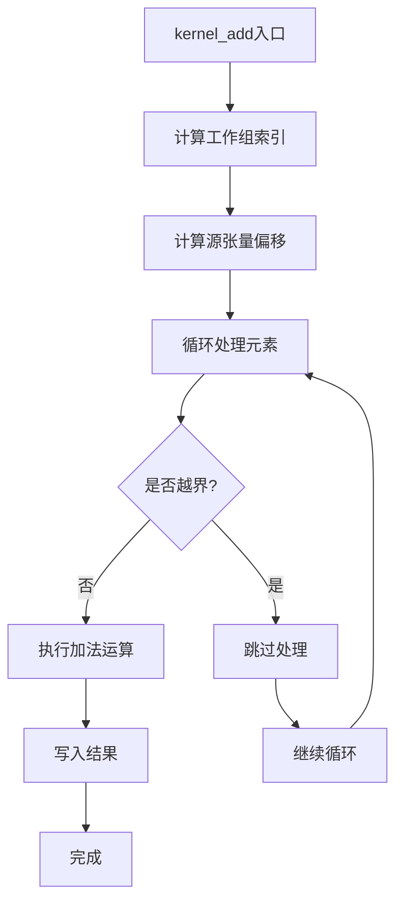

**图表来源**
- [add.cl:10-62](file://ggml/src/ggml-opencl/kernels/add.cl#L10-L62)

#### 矩阵乘法内核

矩阵乘法内核采用了高级优化技术：

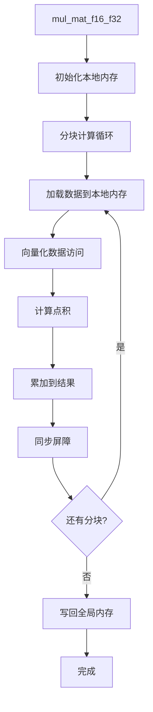

**图表来源**
- [mul_mat_f16_f32.cl:21-130](file://ggml/src/ggml-opencl/kernels/mul_mat_f16_f32.cl#L21-L130)

**章节来源**
- [add.cl:1-191](file://ggml/src/ggml-opencl/kernels/add.cl#L1-L191)
- [mul_mat_f16_f32.cl:1-131](file://ggml/src/ggml-opencl/kernels/mul_mat_f16_f32.cl#L1-L131)

### 性能分析与调试

OpenCL后端内置了强大的性能分析功能：

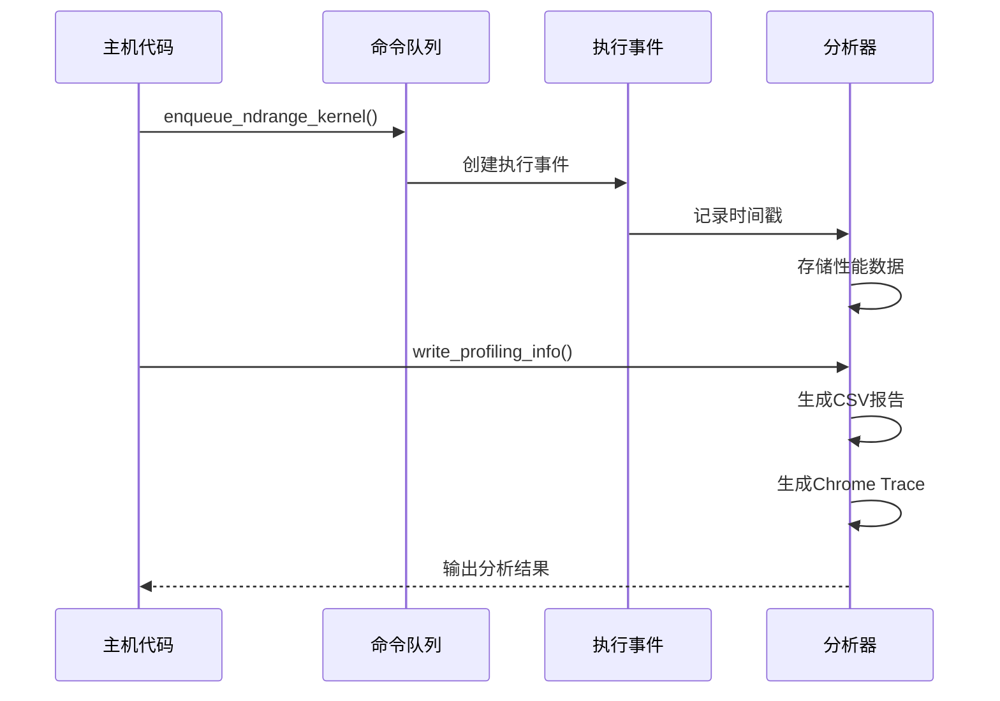

**图表来源**
- [ggml-opencl.cpp:663-674](file://ggml/src/ggml-opencl/ggml-opencl.cpp#L663-L674)
- [ggml-opencl.cpp:574-651](file://ggml/src/ggml-opencl/ggml-opencl.cpp#L574-L651)

性能分析输出包括：
- CSV格式的详细执行时间统计
- Chrome Trace格式的可视化时间线
- 每个内核的全局/局部工作尺寸信息

**章节来源**
- [ggml-opencl.cpp:574-651](file://ggml/src/ggml-opencl/ggml-opencl.cpp#L574-L651)

## 依赖关系分析

OpenCL后端的依赖关系体现了清晰的模块化设计：

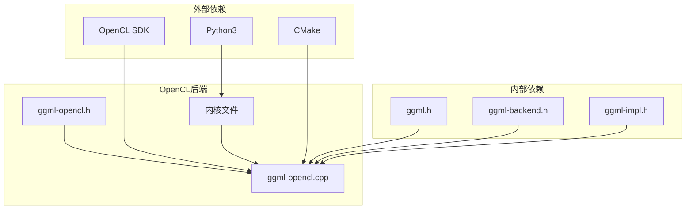

**图表来源**
- [CMakeLists.txt:1-10](file://ggml/src/ggml-opencl/CMakeLists.txt#L1-L10)
- [ggml-opencl.h:4-5](file://ggml/include/ggml-opencl.h#L4-L5)

**章节来源**
- [CMakeLists.txt:1-10](file://ggml/src/ggml-opencl/CMakeLists.txt#L1-L10)
- [ggml-opencl.h:4-5](file://ggml/include/ggml-opencl.h#L4-L5)

## 性能考虑

### 并行计算优化

OpenCL后端在多个层面实现了性能优化：

1. **工作组大小优化**：根据设备特性动态调整工作组尺寸
2. **内存访问模式优化**：使用向量化数据访问和局部内存缓存
3. **算法并行化**：针对不同算子采用最适合的并行策略

### 跨平台兼容性

针对不同厂商的OpenCL实现，后端提供了专门的兼容性处理：

| GPU厂商 | 特殊处理 | 兼容性状态 |
|---------|----------|------------|
| Qualcomm Adreno | 向量子组广播支持检测 | 完全支持 |
| Intel | FP16扩展支持检测 | 完全支持 |
| NVIDIA | CUDA驱动兼容性 | 部分支持 |
| AMD | OpenCL 2.0+特性 | 完全支持 |

### 内存管理优化

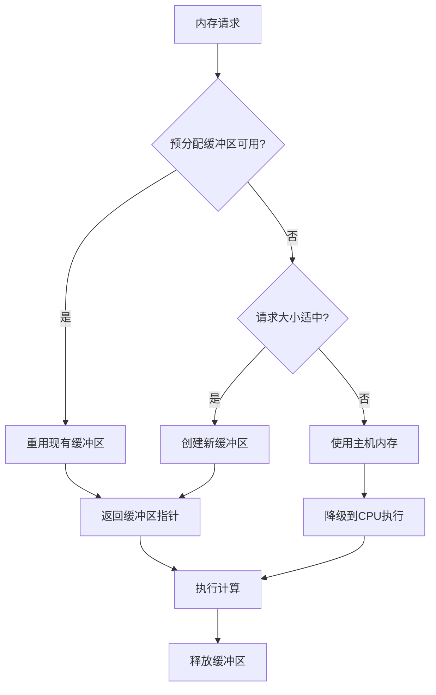

**图表来源**
- [ggml-opencl.cpp:280-290](file://ggml/src/ggml-opencl/ggml-opencl.cpp#L280-L290)

## 故障排除指南

### 常见问题诊断

#### 设备枚举失败
**症状**：无法找到任何OpenCL设备
**解决方法**：
1. 检查OpenCL驱动安装状态
2. 验证环境变量设置
3. 使用`GGML_OPENCL_PLATFORM`和`GGML_OPENCL_DEVICE`手动指定设备

#### 内核编译错误
**症状**：内核编译失败并显示详细错误信息
**解决方法**：
1. 检查OpenCL C版本兼容性
2. 验证编译选项设置
3. 确认设备支持的扩展功能

#### 性能异常
**症状**：执行速度明显低于预期
**解决方法**：
1. 启用性能分析功能收集数据
2. 检查工作组大小设置
3. 验证内存访问模式优化

**章节来源**
- [ggml-opencl.cpp:743-752](file://ggml/src/ggml-opencl/ggml-opencl.cpp#L743-L752)
- [ggml-opencl.cpp:2664-2667](file://ggml/src/ggml-opencl/ggml-opencl.cpp#L2664-L2667)

## 结论

OpenCL后端代表了现代异构计算的一个优秀实现范例。它不仅提供了完整的OpenCL 2.0+标准支持，还通过精心设计的优化策略实现了卓越的性能表现。

该后端的主要优势包括：
- **跨平台兼容性**：支持Intel、NVIDIA、AMD、Qualcomm等多种硬件平台
- **高性能优化**：针对不同GPU架构的专用优化
- **易用性**：简洁的API设计和自动设备管理
- **可调试性**：内置的性能分析和调试工具

对于需要在多种计算设备上部署深度学习模型的用户，OpenCL后端提供了一个可靠且高效的解决方案。

## 附录

### 构建配置参考

| 配置项 | 可选值 | 描述 |
|--------|--------|------|
| GGML_OPENCL_TARGET_VERSION | 120, 200, 210, 220 | OpenCL目标版本 |
| GGML_OPENCL_EMBED_KERNELS | ON/OFF | 是否嵌入内核源码 |
| GGML_OPENCL_PROFILING | ON/OFF | 是否启用性能分析 |
| GGML_OPENCL_USE_ADRENO_KERNELS | ON/OFF | 是否使用Adreno优化内核 |

### 支持的算子列表

OpenCL后端支持以下主要算子类别：
- 基础数学运算：加法、减法、乘法、除法
- 激活函数：ReLU、Sigmoid、Tanh、GELU
- 归一化操作：LayerNorm、RMSNorm、GroupNorm
- 注意力机制：Flash Attention
- 卷积操作：2D卷积及其变体
- 量化操作：Q4、Q6、MXFP4等量化格式

### 环境变量

| 环境变量 | 类型 | 描述 |
|----------|------|------|
| GGML_OPENCL_PLATFORM | 整数或字符串 | 指定平台编号或名称 |
| GGML_OPENCL_DEVICE | 整数或字符串 | 指定设备编号或名称 |
| GGML_OPENCL_TARGET_VERSION | 整数 | 设置OpenCL目标版本 |