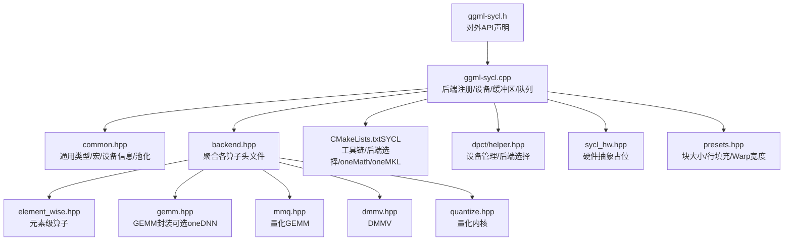
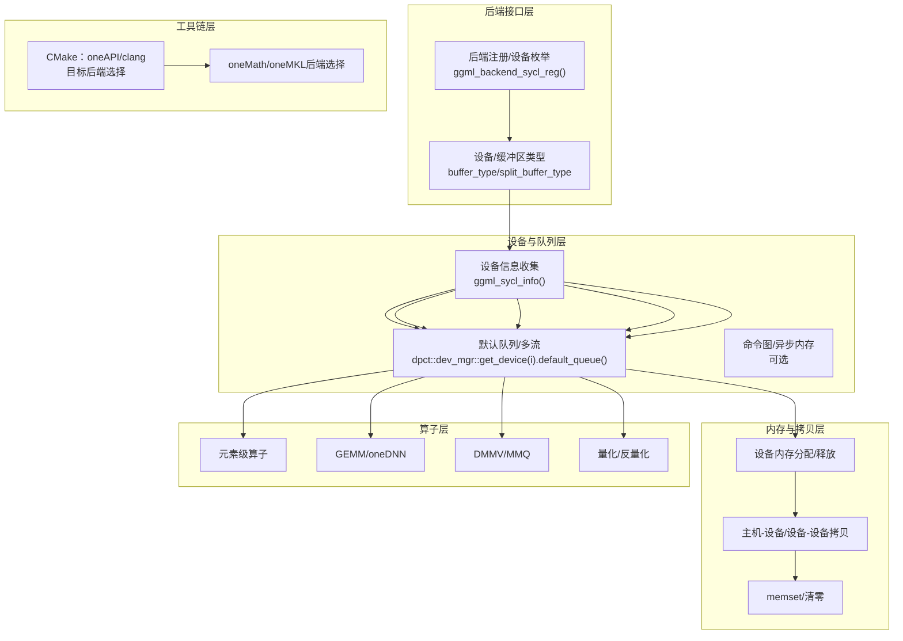
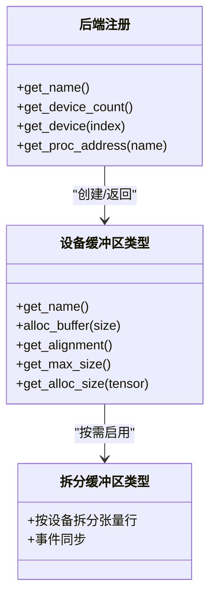
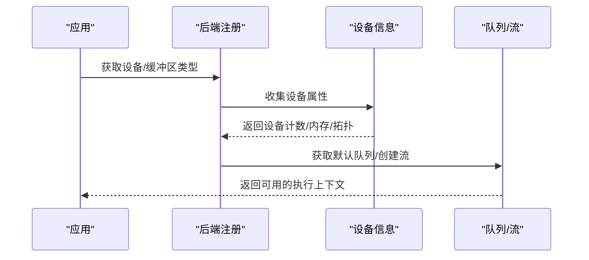
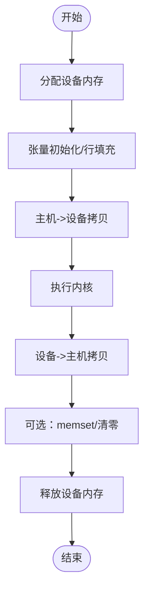
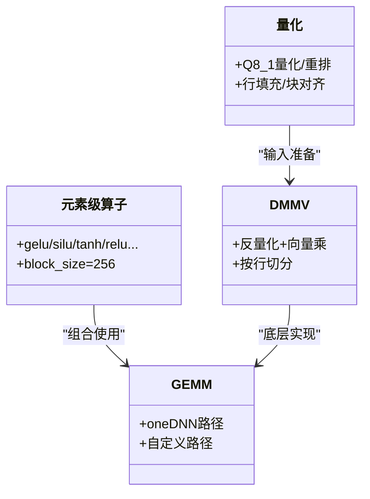
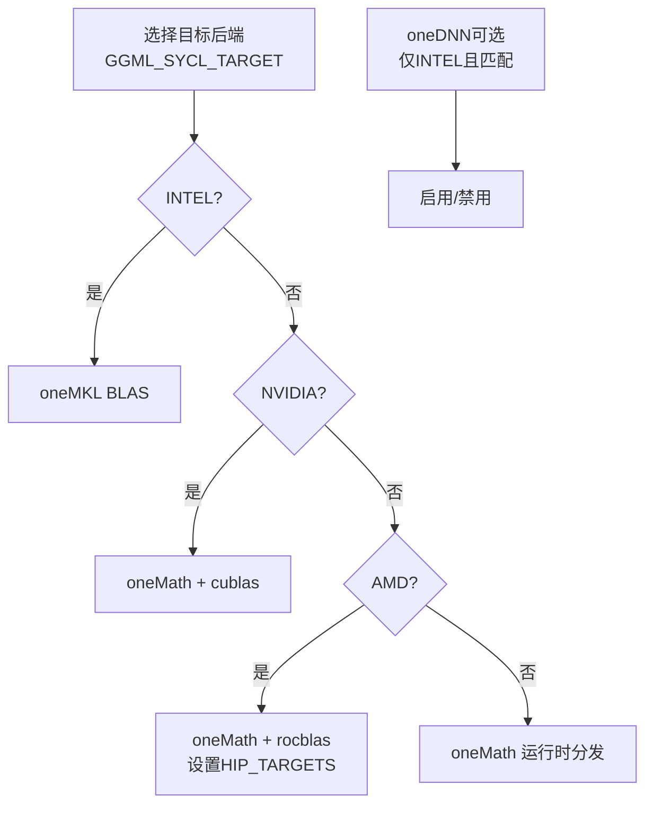
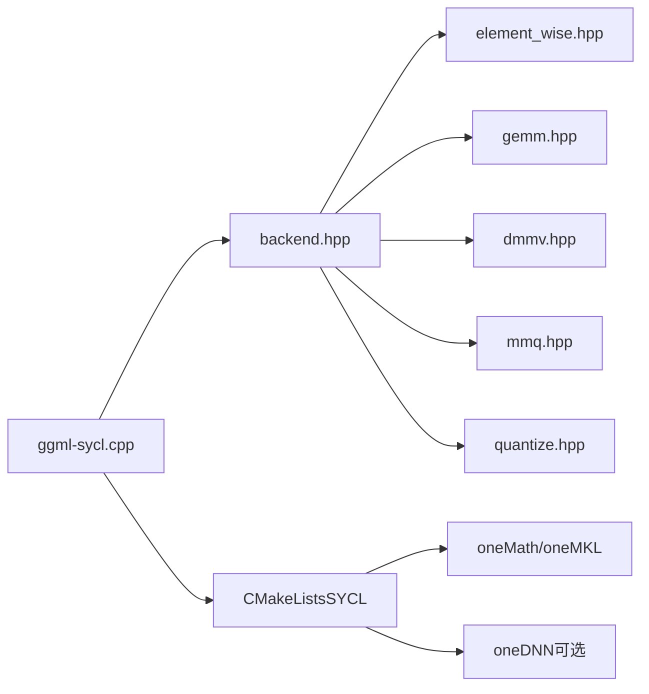

# SYCL后端

<cite>
**本文引用的文件**
- [ggml-sycl.h](file://ggml/include/ggml-sycl.h)
- [ggml-sycl.cpp](file://ggml/src/ggml-sycl/ggml-sycl.cpp)
- [backend.hpp](file://ggml/src/ggml-sycl/backend.hpp)
- [common.hpp](file://ggml/src/ggml-sycl/common.hpp)
- [sycl_hw.hpp](file://ggml/src/ggml-sycl/sycl_hw.hpp)
- [presets.hpp](file://ggml/src/ggml-sycl/presets.hpp)
- [CMakeLists.txt（SYCL）](file://ggml/src/ggml-sycl/CMakeLists.txt)
- [Dockerfile.sycl](file://Dockerfile.sycl)
- [dpct/helper.hpp](file://ggml/src/ggml-sycl/dpct/helper.hpp)
- [element_wise.hpp](file://ggml/src/ggml-sycl/element_wise.hpp)
- [gemm.hpp](file://ggml/src/ggml-sycl/gemm.hpp)
- [mmq.hpp](file://ggml/src/ggml-sycl/mmq.hpp)
- [dmmv.hpp](file://ggml/src/ggml-sycl/dmmv.hpp)
- [quantize.hpp](file://ggml/src/ggml-sycl/quantize.hpp)
</cite>

## 目录
1. [简介](#简介)
2. [项目结构](#项目结构)
3. [核心组件](#核心组件)
4. [架构总览](#架构总览)
5. [详细组件分析](#详细组件分析)
6. [依赖关系分析](#依赖关系分析)
7. [性能考量](#性能考量)
8. [故障排查指南](#故障排查指南)
9. [结论](#结论)
10. [附录](#附录)

## 简介
本文件系统化梳理并深入解析本仓库中的SYCL后端实现，覆盖以下主题：
- 实现原理与架构：基于SYCL与DPCT（DPC++ Toolchain）的跨平台异构计算后端，面向ggml后端接口，提供缓冲区、队列、内核调度与算子实现。
- 编译配置与工具链：支持Intel oneAPI（icpx/icx）、开源clang++（-fsycl），以及针对INTEL/NVIDIA/AMD的目标编译与运行时后端选择。
- 异构计算支持：设备枚举、内存分配与拷贝、主机-设备互操作、多设备拆分与事件同步、可选的命令图与异步内存扩展。
- 不同实现兼容性：通过DPCT设备管理器抽象统一识别Level-Zero、OpenCL、CUDA、HIP后端；在构建期/运行期自动选择合适oneMath/oneMKL后端。
- 性能特性：量化矩阵乘（Q4-Q8）、Dequantize-Matmul-Vec（DMMV）、通用GEMM（可选oneDNN）、块级并行与Warp归约等。

## 项目结构
SYCL后端位于ggml/src/ggml-sycl目录，主要由以下层次构成：
- 接口与注册层：对外暴露ggml后端API、设备/缓冲区类型注册、设备属性查询。
- 设备与队列层：设备信息收集、默认队列、流管理、可选的命令图与异步内存扩展。
- 缓冲区与内存层：设备内存分配、清零、memset、主机-设备拷贝、张量视图初始化与填充。
- 算子实现层：元素级算子、卷积、归约、量化/反量化、GEMM、DMMV、MMQ等。
- 预设与常量：线程块大小、行填充、Warp宽度、批大小阈值等。
- 构建与工具链：CMake宏检测oneAPI/clang、链接oneMath/oneMKL、目标后端选择、设备架构参数传递。

图表来源
- [ggml-sycl.h:12-49](file://ggml/include/ggml-sycl.h#L12-L49)
- [ggml-sycl.cpp:66-113](file://ggml/src/ggml-sycl/ggml-sycl.cpp#L66-L113)
- [backend.hpp:16-43](file://ggml/src/ggml-sycl/backend.hpp#L16-L43)
- [CMakeLists.txt（SYCL）:1-235](file://ggml/src/ggml-sycl/CMakeLists.txt#L1-L235)

章节来源
- [ggml-sycl.h:12-49](file://ggml/include/ggml-sycl.h#L12-L49)
- [ggml-sycl.cpp:66-113](file://ggml/src/ggml-sycl/ggml-sycl.cpp#L66-L113)
- [backend.hpp:16-43](file://ggml/src/ggml-sycl/backend.hpp#L16-L43)
- [CMakeLists.txt（SYCL）:1-235](file://ggml/src/ggml-sycl/CMakeLists.txt#L1-L235)

## 核心组件
- 后端API与注册
  - 初始化与检测：设备计数、打印设备列表、环境变量控制调试与功能开关。
  - 设备/缓冲区类型：单设备缓冲区类型、主机缓冲区类型、张量拆分缓冲区类型（按行切分）。
  - 注册表：后端注册、设备枚举、进程地址查询（如split buffer type）。
- 设备与队列
  - 设备信息：全局内存、最大CU/WorkGroup/SubGroup、架构能力、默认张量拆分比例。
  - 队列与流：每个设备默认队列；可扩展多流；可选命令图与异步内存扩展。
- 缓冲区与内存
  - 设备内存分配与释放；清零与memset；主机-设备/设备-设备拷贝；张量视图初始化与填充。
- 算子实现
  - 元素级：激活函数、归一化、裁剪、索引/拼接/填充等。
  - 线性代数：GEMM（含oneDNN路径）、DMMV、MMQ（量化矩阵乘）。
  - 量化：Q8_1量化与重排、按行量化、块对齐与行填充。
- 工具链与预设
  - Warp宽度、块大小、行填充、批大小阈值、K_QUANTS_PER_ITERATION等。

章节来源
- [ggml-sycl.cpp:191-279](file://ggml/src/ggml-sycl/ggml-sycl.cpp#L191-L279)
- [ggml-sycl.cpp:318-595](file://ggml/src/ggml-sycl/ggml-sycl.cpp#L318-L595)
- [ggml-sycl.cpp:671-726](file://ggml/src/ggml-sycl/ggml-sycl.cpp#L671-L726)
- [common.hpp:173-189](file://ggml/src/ggml-sycl/common.hpp#L173-L189)
- [presets.hpp:16-77](file://ggml/src/ggml-sycl/presets.hpp#L16-L77)

## 架构总览
SYCL后端以“后端注册—设备/缓冲区—队列/命令图—算子内核”的层次化方式组织，通过DPCT设备管理器抽象统一不同后端（Level-Zero/OpenCL/CUDA/HIP），并在构建期/运行期选择oneMath或oneMKL作为高性能BLAS后端。

图表来源
- [ggml-sycl.cpp:4333-4880](file://ggml/src/ggml-sycl/ggml-sycl.cpp#L4333-L4880)
- [CMakeLists.txt（SYCL）:79-228](file://ggml/src/ggml-sycl/CMakeLists.txt#L79-L228)
- [dpct/helper.hpp:101-118](file://ggml/src/ggml-sycl/dpct/helper.hpp#L101-L118)

## 详细组件分析

### 组件A：后端注册与设备/缓冲区类型
- 功能要点
  - 后端注册：提供GUID、设备枚举、设备接口、进程地址查询（如split buffer type）。
  - 单设备缓冲区类型：每个设备一个缓冲区类型，绑定默认队列；支持对齐、最大容量、分配尺寸计算。
  - 拆分缓冲区类型：按张量拆分比例将矩阵按行切分到多个设备，结合事件同步。
  - 主机缓冲区类型：用于CPU侧快速拷贝（当前注释掉，保留参考）。
- 关键接口路径
  - 后端注册与设备接口：[ggml-sycl.cpp:4333-4880](file://ggml/src/ggml-sycl/ggml-sycl.cpp#L4333-L4880)
  - 单设备缓冲区类型：[ggml-sycl.cpp:671-726](file://ggml/src/ggml-sycl/ggml-sycl.cpp#L671-L726)
  - 拆分缓冲区类型：[ggml-sycl.cpp:728-800](file://ggml/src/ggml-sycl/ggml-sycl.cpp#L728-L800)

图表来源
- [ggml-sycl.cpp:4333-4880](file://ggml/src/ggml-sycl/ggml-sycl.cpp#L4333-L4880)
- [ggml-sycl.cpp:671-726](file://ggml/src/ggml-sycl/ggml-sycl.cpp#L671-L726)
- [ggml-sycl.cpp:728-800](file://ggml/src/ggml-sycl/ggml-sycl.cpp#L728-L800)

章节来源
- [ggml-sycl.cpp:4333-4880](file://ggml/src/ggml-sycl/ggml-sycl.cpp#L4333-L4880)
- [ggml-sycl.cpp:671-726](file://ggml/src/ggml-sycl/ggml-sycl.cpp#L671-L726)
- [ggml-sycl.cpp:728-800](file://ggml/src/ggml-sycl/ggml-sycl.cpp#L728-L800)

### 组件B：设备与队列管理
- 功能要点
  - 设备信息：统计设备数量、全局内存、最大CU/WorkGroup/SubGroup、默认张量拆分比例。
  - 队列与流：默认队列；多流数组；可选命令图与异步内存扩展。
  - 设备切换：根据当前线程绑定设备；异常处理与崩溃保护。
- 关键接口路径
  - 设备信息初始化与打印：[ggml-sycl.cpp:66-113](file://ggml/src/ggml-sycl/ggml-sycl.cpp#L66-L113)、[ggml-sycl.cpp:159-189](file://ggml/src/ggml-sycl/ggml-sycl.cpp#L159-L189)
  - 设备切换与错误处理：[common.hpp:173-189](file://ggml/src/ggml-sycl/common.hpp#L173-L189)

图表来源
- [ggml-sycl.cpp:66-113](file://ggml/src/ggml-sycl/ggml-sycl.cpp#L66-L113)
- [common.hpp:173-189](file://ggml/src/ggml-sycl/common.hpp#L173-L189)

章节来源
- [ggml-sycl.cpp:66-113](file://ggml/src/ggml-sycl/ggml-sycl.cpp#L66-L113)
- [ggml-sycl.cpp:159-189](file://ggml/src/ggml-sycl/ggml-sycl.cpp#L159-L189)
- [common.hpp:173-189](file://ggml/src/ggml-sycl/common.hpp#L173-L189)

### 组件C：缓冲区与内存拷贝
- 功能要点
  - 设备内存分配/释放：基于SYCL malloc/free；失败时记录日志。
  - 清零与memset：对缓冲区或张量局部区域清零。
  - 拷贝：主机-设备、设备-设备（跨队列通过主机中转规避已知问题）。
  - 张量初始化：对量化张量进行行填充与初始化。
- 关键接口路径
  - 分配/释放/清零/拷贝：[ggml-sycl.cpp:354-595](file://ggml/src/ggml-sycl/ggml-sycl.cpp#L354-L595)
  - 跨设备拷贝（中转）：[ggml-sycl.cpp:458-528](file://ggml/src/ggml-sycl/ggml-sycl.cpp#L458-L528)

图表来源
- [ggml-sycl.cpp:354-595](file://ggml/src/ggml-sycl/ggml-sycl.cpp#L354-L595)

章节来源
- [ggml-sycl.cpp:354-595](file://ggml/src/ggml-sycl/ggml-sycl.cpp#L354-L595)
- [ggml-sycl.cpp:458-528](file://ggml/src/ggml-sycl/ggml-sycl.cpp#L458-L528)

### 组件D：算子实现与并行算法
- 元素级算子
  - 包括激活函数、归一化、裁剪、索引/拼接/填充等，采用固定块大小并行。
  - 参考：[element_wise.hpp:32-96](file://ggml/src/ggml-sycl/element_wise.hpp#L32-L96)
- GEMM与DMMV
  - GEMM：可选oneDNN路径，支持批量与stride；否则走自定义实现。
  - DMMV：反量化+向量化乘法，按行切分到多设备。
  - 参考：[gemm.hpp:23-87](file://ggml/src/ggml-sycl/gemm.hpp#L23-L87)、[dmmv.hpp:19-25](file://ggml/src/ggml-sycl/dmmv.hpp#L19-L25)
- 量化与重排
  - Q8_1量化与重排、按行量化、块对齐与行填充，保证边界安全访问。
  - 参考：[quantize.hpp:26-134](file://ggml/src/ggml-sycl/quantize.hpp#L26-L134)
- 预设与并行度
  - 块大小、Warp宽度、行填充、批大小阈值等影响并行效率与内存对齐。
  - 参考：[presets.hpp:16-77](file://ggml/src/ggml-sycl/presets.hpp#L16-L77)

图表来源
- [element_wise.hpp:32-96](file://ggml/src/ggml-sycl/element_wise.hpp#L32-L96)
- [gemm.hpp:23-87](file://ggml/src/ggml-sycl/gemm.hpp#L23-L87)
- [dmmv.hpp:19-25](file://ggml/src/ggml-sycl/dmmv.hpp#L19-L25)
- [quantize.hpp:26-134](file://ggml/src/ggml-sycl/quantize.hpp#L26-L134)

章节来源
- [element_wise.hpp:32-96](file://ggml/src/ggml-sycl/element_wise.hpp#L32-L96)
- [gemm.hpp:23-87](file://ggml/src/ggml-sycl/gemm.hpp#L23-L87)
- [dmmv.hpp:19-25](file://ggml/src/ggml-sycl/dmmv.hpp#L19-L25)
- [quantize.hpp:26-134](file://ggml/src/ggml-sycl/quantize.hpp#L26-L134)
- [presets.hpp:16-77](file://ggml/src/ggml-sycl/presets.hpp#L16-L77)

### 组件E：构建与工具链
- oneAPI与clang
  - 检测编译器是否支持SYCL；优先使用oneAPI icpx/icx，否则提示使用clang++。
  - 参考：[CMakeLists.txt（SYCL）:7-18](file://ggml/src/ggml-sycl/CMakeLists.txt#L7-L18)
- 后端选择与编译选项
  - GGML_SYCL_TARGET：INTEL/NVIDIA/AMD三选一；Warp宽度随目标调整。
  - 设备架构：通过GGML_SYCL_DEVICE_ARCH传入offload-arch。
  - 参考：[CMakeLists.txt（SYCL）:3-L5, 134-L148, 230-L233](file://ggml/src/ggml-sycl/CMakeLists.txt#L3-L5, 134-L148, 230-L233)
- BLAS后端
  - Intel：oneMKL BLAS（直接链接）。
  - NVIDIA/AMD：oneMath（自动下载/构建），按后端选择cublas/rocblas或运行时分发。
  - 参考：[CMakeLists.txt（SYCL）:155-228](file://ggml/src/ggml-sycl/CMakeLists.txt#L155-L228)
- oneDNN（可选）
  - 仅在INTEL目标且与oneDNN目标一致时启用；否则禁用并给出警告。
  - 参考：[CMakeLists.txt（SYCL）:92-125](file://ggml/src/ggml-sycl/CMakeLists.txt#L92-L125)
- Docker镜像
  - 使用intel/oneapi-basekit镜像，指定icx/icpx编译器，开启SD_SYCL构建。
  - 参考：[Dockerfile.sycl:1-21](file://Dockerfile.sycl#L1-L21)

图表来源
- [CMakeLists.txt（SYCL）:3-L5, 134-L148, 155-L228, 92-L125](file://ggml/src/ggml-sycl/CMakeLists.txt#L3-L5, 134-L148, 155-L228, 92-L125)

章节来源
- [CMakeLists.txt（SYCL）:3-5](file://ggml/src/ggml-sycl/CMakeLists.txt#L3-L5)
- [CMakeLists.txt（SYCL）:7-18](file://ggml/src/ggml-sycl/CMakeLists.txt#L7-L18)
- [CMakeLists.txt（SYCL）:92-125](file://ggml/src/ggml-sycl/CMakeLists.txt#L92-L125)
- [CMakeLists.txt（SYCL）:134-148](file://ggml/src/ggml-sycl/CMakeLists.txt#L134-L148)
- [CMakeLists.txt（SYCL）:155-228](file://ggml/src/ggml-sycl/CMakeLists.txt#L155-L228)
- [CMakeLists.txt（SYCL）:230-233](file://ggml/src/ggml-sycl/CMakeLists.txt#L230-L233)
- [Dockerfile.sycl:1-21](file://Dockerfile.sycl#L1-L21)

### 组件F：不同SYCL实现与兼容性
- DPCT设备管理器
  - 自动发现平台与设备，按后端优先级排序（Level-Zero优先），支持按环境变量过滤平台。
  - 参考：[dpct/helper.hpp:930-1087](file://ggml/src/ggml-sycl/dpct/helper.hpp#L930-L1087)
- 后端抽象
  - 通过get_device_backend_and_type统一输出“backend:device_type”，便于日志与特性判断。
  - 参考：[dpct/helper.hpp:86-91](file://ggml/src/ggml-sycl/dpct/helper.hpp#L86-L91)
- 兼容性提示
  - 当前不支持注册主机缓冲区（保留接口注释）。
  - 参考：[ggml-sycl.h:41-43](file://ggml/include/ggml-sycl.h#L41-L43)

章节来源
- [dpct/helper.hpp:86-91](file://ggml/src/ggml-sycl/dpct/helper.hpp#L86-L91)
- [dpct/helper.hpp:930-1087](file://ggml/src/ggml-sycl/dpct/helper.hpp#L930-L1087)
- [ggml-sycl.h:41-43](file://ggml/include/ggml-sycl.h#L41-L43)

## 依赖关系分析
- 头文件依赖
  - ggml-sycl.cpp聚合backend.hpp，进而包含各算子头文件，形成清晰的模块边界。
  - 参考：[backend.hpp:16-43](file://ggml/src/ggml-sycl/backend.hpp#L16-L43)
- 外部依赖
  - SYCL运行时（sycl/sycl.hpp）、oneAPI数学库（oneMath/oneMKL）、可选oneDNN。
  - 构建期通过find_package与FetchContent集成。
  - 参考：[CMakeLists.txt（SYCL）:79-L125, 155-L228](file://ggml/src/ggml-sycl/CMakeLists.txt#L79-L125, 155-L228)

图表来源
- [backend.hpp:16-43](file://ggml/src/ggml-sycl/backend.hpp#L16-L43)
- [CMakeLists.txt（SYCL）:79-125](file://ggml/src/ggml-sycl/CMakeLists.txt#L79-L125)

章节来源
- [backend.hpp:16-43](file://ggml/src/ggml-sycl/backend.hpp#L16-L43)
- [CMakeLists.txt（SYCL）:79-125](file://ggml/src/ggml-sycl/CMakeLists.txt#L79-L125)

## 性能考量
- 并行与块大小
  - 预设块大小统一为256（多数元素级算子），兼顾吞吐与占用。
  - 参考：[presets.hpp:22-54](file://ggml/src/ggml-sycl/presets.hpp#L22-L54)
- Warp宽度与子组
  - INTEL=16，NVIDIA/AMD=32，适配不同架构的Warp/SubGroup。
  - 参考：[CMakeLists.txt（SYCL）:134-148](file://ggml/src/ggml-sycl/CMakeLists.txt#L134-L148)
- 行填充与对齐
  - 量化矩阵按512对齐，避免越界与提升访存效率。
  - 参考：[presets.hpp:20](file://ggml/src/ggml-sycl/presets.hpp#L20)
- 批大小阈值
  - MMQ路径在batch<=32时更优；DMMV路径按行切分，适合大矩阵。
  - 参考：[common.hpp:93](file://ggml/src/ggml-sycl/common.hpp#L93)
- oneDNN与oneMath
  - oneDNN在INTEL目标下可显著加速GEMM；NVIDIA/AMD使用oneMath，按后端选择cublas/rocblas。
  - 参考：[CMakeLists.txt（SYCL）:92-L125, 155-L228](file://ggml/src/ggml-sycl/CMakeLists.txt#L92-L125, 155-L228)

## 故障排查指南
- 设备不可用或无GPU
  - 确认oneAPI安装与环境变量；检查设备枚举与驱动版本输出。
  - 参考：[ggml-sycl.cpp:159-189](file://ggml/src/ggml-sycl/ggml-sycl.cpp#L159-L189)
- 跨设备拷贝异常
  - 当前实现通过主机中转规避跨GPU拷贝问题，若仍失败，检查队列等待与事件同步。
  - 参考：[ggml-sycl.cpp:458-528](file://ggml/src/ggml-sycl/ggml-sycl.cpp#L458-L528)
- 内存不足或分配失败
  - 查看设备最大内存限制与分配尺寸；必要时降低批大小或启用张量拆分。
  - 参考：[ggml-sycl.cpp:641-645](file://ggml/src/ggml-sycl/ggml-sycl.cpp#L641-L645)
- 编译器与工具链
  - 未检测到SYCL支持或oneAPI未source；确保使用icpx/icx或clang++ -fsycl。
  - 参考：[CMakeLists.txt（SYCL）:7-18](file://ggml/src/ggml-sycl/CMakeLists.txt#L7-L18)
- oneDNN不生效
  - 确保oneDNN与后端目标一致（INTEL），否则自动禁用并提示。
  - 参考：[CMakeLists.txt（SYCL）:96-118](file://ggml/src/ggml-sycl/CMakeLists.txt#L96-L118)

章节来源
- [ggml-sycl.cpp:159-189](file://ggml/src/ggml-sycl/ggml-sycl.cpp#L159-L189)
- [ggml-sycl.cpp:458-528](file://ggml/src/ggml-sycl/ggml-sycl.cpp#L458-L528)
- [ggml-sycl.cpp:641-645](file://ggml/src/ggml-sycl/ggml-sycl.cpp#L641-L645)
- [CMakeLists.txt（SYCL）:7-18](file://ggml/src/ggml-sycl/CMakeLists.txt#L7-L18)
- [CMakeLists.txt（SYCL）:96-118](file://ggml/src/ggml-sycl/CMakeLists.txt#L96-L118)

## 结论
本SYCL后端以DPCT设备管理器为核心，统一抽象多后端（Level-Zero/OpenCL/CUDA/HIP），在构建期/运行期灵活选择oneMath/oneMKL/oneDNN，实现跨平台异构计算。通过设备信息收集、队列/命令图、缓冲区与内存拷贝、以及丰富的算子实现，满足从元素级到GEMM/DMMV/量化矩阵乘的完整推理需求。建议在INTEL目标下启用oneDNN以获得最佳GEMM性能，在NVIDIA/AMD目标下使用oneMath并按后端选择cublas/rocblas；同时合理设置块大小、行填充与批大小阈值以平衡吞吐与内存占用。

## 附录
- 环境变量与调试
  - GGML_SYCL_DEBUG：开启调试日志。
  - GGML_SYCL_DISABLE_OPT：禁用优化路径。
  - GGML_SYCL_DISABLE_GRAPH：禁用命令图（编译期宏可能强制禁用）。
  - GGML_SYCL_DISABLE_DNN：禁用oneDNN（编译期宏可能强制禁用）。
  - GGML_SYCL_PRIORITIZE_DMMV：优先DMMV路径。
  - 参考：[ggml-sycl.cpp:205-274](file://ggml/src/ggml-sycl/ggml-sycl.cpp#L205-L274)

章节来源
- [ggml-sycl.cpp:205-274](file://ggml/src/ggml-sycl/ggml-sycl.cpp#L205-L274)