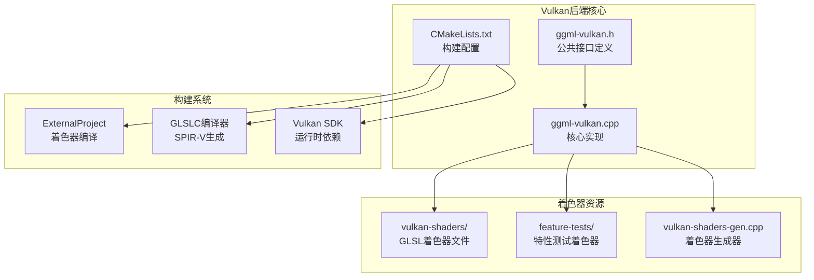
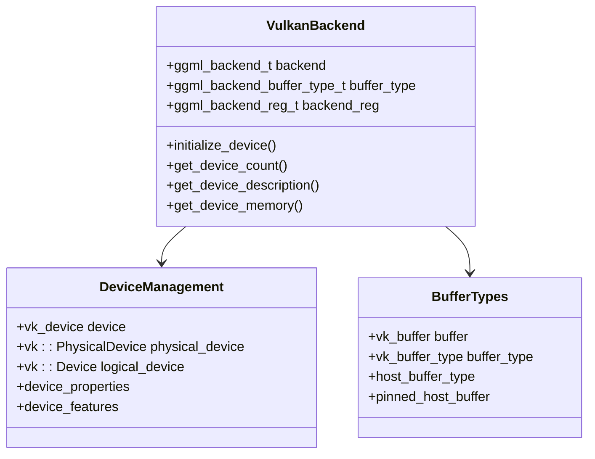
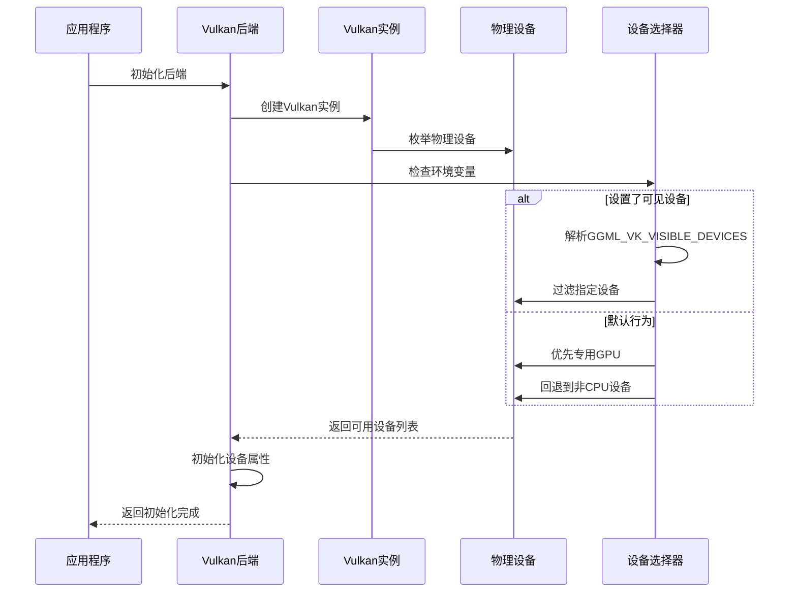
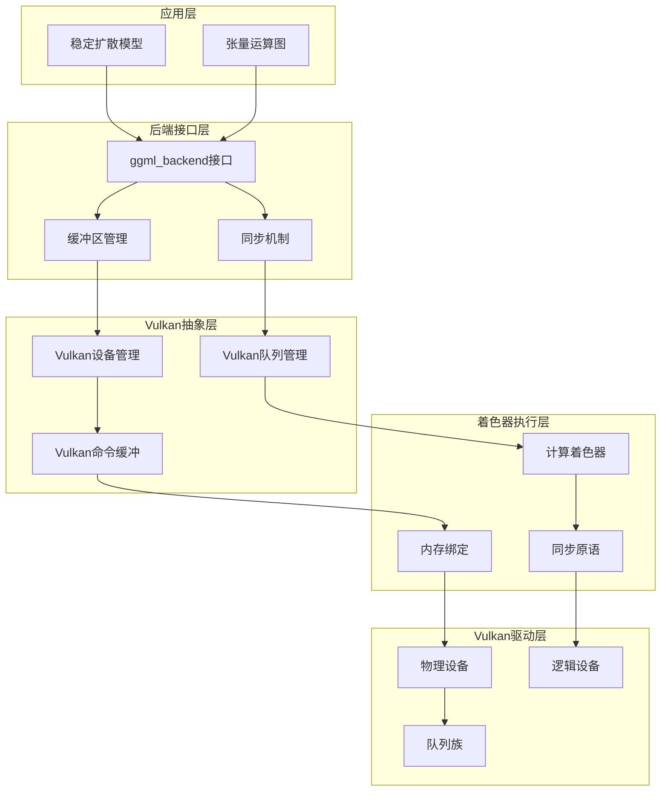
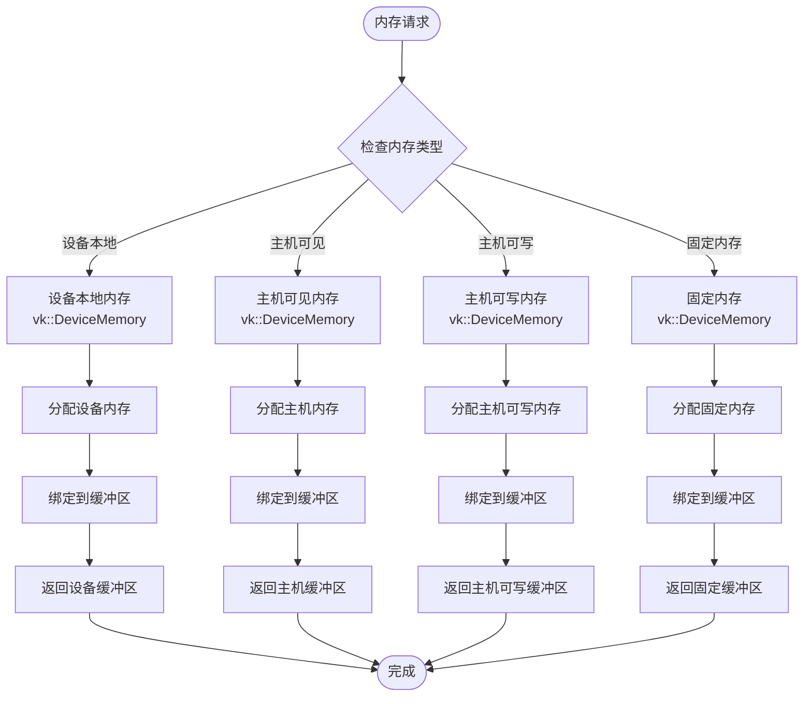
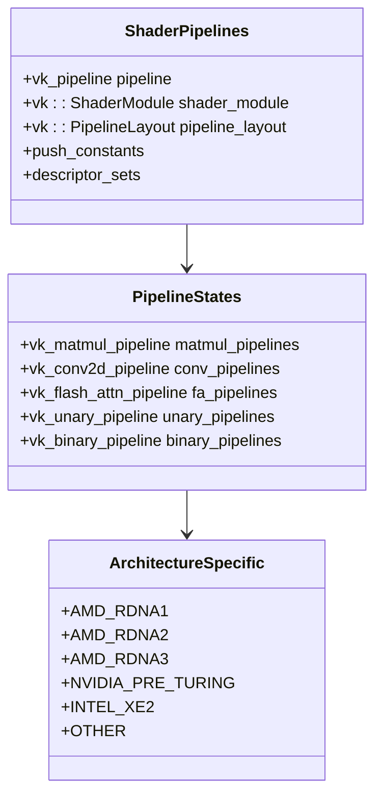
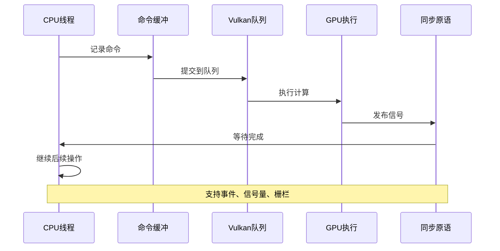
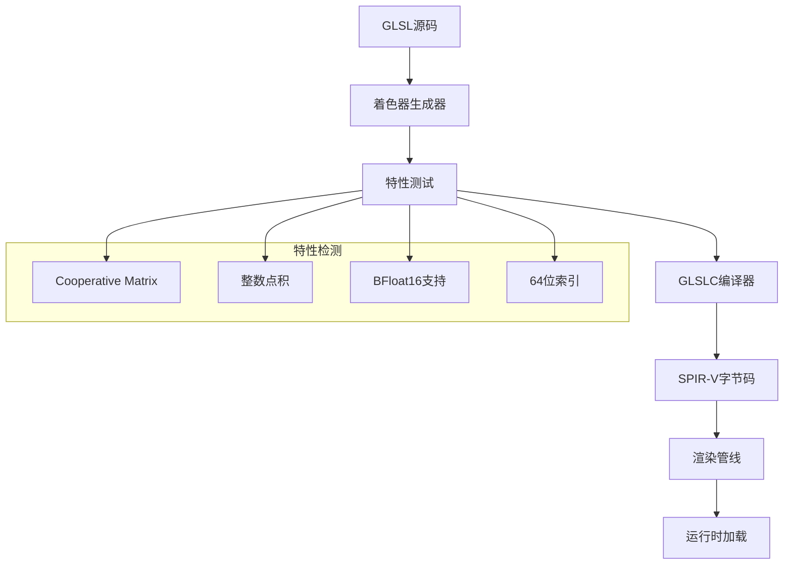
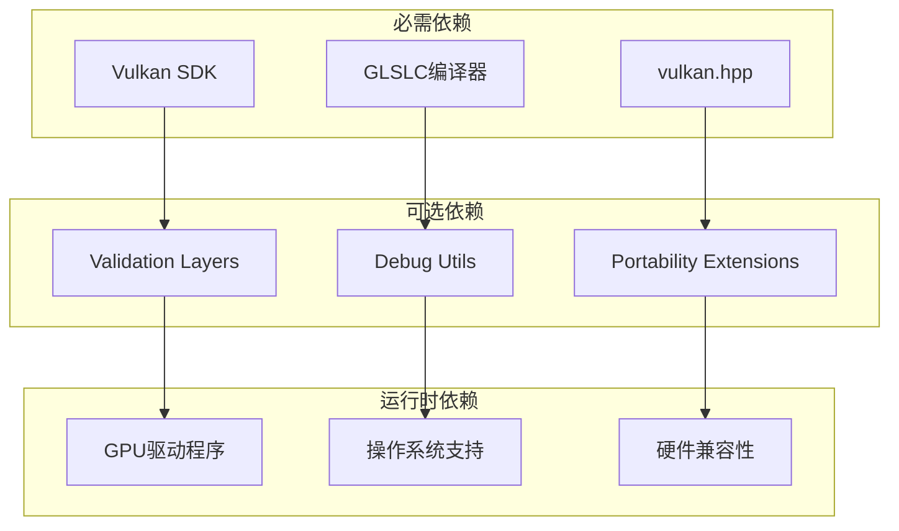
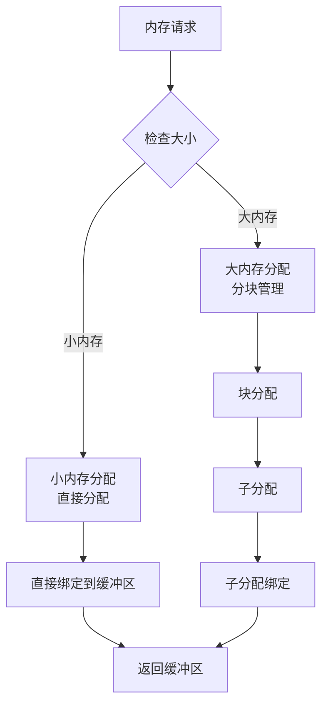

# Vulkan后端

<cite>
**本文档引用的文件**
- [ggml-vulkan.h](file://ggml/include/ggml-vulkan.h)
- [ggml-vulkan.cpp](file://ggml/src/ggml-vulkan/ggml-vulkan.cpp)
- [CMakeLists.txt](file://ggml/src/ggml-vulkan/CMakeLists.txt)
- [Dockerfile.vulkan](file://Dockerfile.vulkan)
- [build.md](file://docs/build.md)
- [performance.md](file://docs/performance.md)
</cite>

## 目录
1. [简介](#简介)
2. [项目结构](#项目结构)
3. [核心组件](#核心组件)
4. [架构概览](#架构概览)
5. [详细组件分析](#详细组件分析)
6. [依赖关系分析](#依赖关系分析)
7. [性能考虑](#性能考虑)
8. [故障排除指南](#故障排除指南)
9. [结论](#结论)
10. [附录](#附录)

## 简介

Vulkan后端是stable-diffusion.cpp项目中的一个高性能GPU加速模块，基于Khronos Group的Vulkan图形和计算API实现。该后端利用现代GPU的并行计算能力，通过计算着色器实现高效的张量运算和神经网络推理。

Vulkan后端提供了以下核心功能：
- 支持多种GPU厂商（NVIDIA、AMD、Intel）的硬件加速
- 实现了完整的张量运算图执行引擎
- 提供内存管理和同步机制
- 支持跨平台部署（Linux、Windows、Android）
- 集成验证层和性能分析工具

## 项目结构

Vulkan后端位于ggml子模块中，采用模块化设计，主要包含以下组件：



**图表来源**
- [ggml-vulkan.h:1-30](file://ggml/include/ggml-vulkan.h#L1-L30)
- [ggml-vulkan.cpp:1-100](file://ggml/src/ggml-vulkan/ggml-vulkan.cpp#L1-L100)
- [CMakeLists.txt:1-50](file://ggml/src/ggml-vulkan/CMakeLists.txt#L1-L50)

**章节来源**
- [ggml-vulkan.h:1-30](file://ggml/include/ggml-vulkan.h#L1-L30)
- [CMakeLists.txt:1-221](file://ggml/src/ggml-vulkan/CMakeLists.txt#L1-L221)

## 核心组件

### 公共接口定义

Vulkan后端提供了标准化的后端接口，包括设备管理、缓冲区类型和注册机制：



**图表来源**
- [ggml-vulkan.h:10-26](file://ggml/include/ggml-vulkan.h#L10-L26)
- [ggml-vulkan.cpp:550-650](file://ggml/src/ggml-vulkan/ggml-vulkan.cpp#L550-L650)

### 设备枚举与选择

Vulkan后端实现了智能的设备枚举机制，支持环境变量控制和自动选择策略：



**图表来源**
- [ggml-vulkan.cpp:5509-5640](file://ggml/src/ggml-vulkan/ggml-vulkan.cpp#L5509-L5640)

**章节来源**
- [ggml-vulkan.h:13-25](file://ggml/include/ggml-vulkan.h#L13-L25)
- [ggml-vulkan.cpp:5509-5640](file://ggml/src/ggml-vulkan/ggml-vulkan.cpp#L5509-L5640)

## 架构概览

Vulkan后端采用分层架构设计，从底层的Vulkan API到高层的张量运算接口：



**图表来源**
- [ggml-vulkan.cpp:116-187](file://ggml/src/ggml-vulkan/ggml-vulkan.cpp#L116-L187)
- [ggml-vulkan.cpp:550-700](file://ggml/src/ggml-vulkan/ggml-vulkan.cpp#L550-L700)

### 内存管理架构

Vulkan后端实现了复杂的内存管理系统，支持多种内存类型的分配和管理：



**图表来源**
- [ggml-vulkan.cpp:868-887](file://ggml/src/ggml-vulkan/ggml-vulkan.cpp#L868-L887)
- [ggml-vulkan.cpp:1969-1976](file://ggml/src/ggml-vulkan/ggml-vulkan.cpp#L1969-L1976)

**章节来源**
- [ggml-vulkan.cpp:868-887](file://ggml/src/ggml-vulkan/ggml-vulkan.cpp#L868-L887)
- [ggml-vulkan.cpp:1969-1976](file://ggml/src/ggml-vulkan/ggml-vulkan.cpp#L1969-L1976)

## 详细组件分析

### 计算着色器系统

Vulkan后端包含大量的GLSL计算着色器，针对不同的GPU架构进行了优化：



**图表来源**
- [ggml-vulkan.cpp:154-174](file://ggml/src/ggml-vulkan/ggml-vulkan.cpp#L154-L174)
- [ggml-vulkan.cpp:249-353](file://ggml/src/ggml-vulkan/ggml-vulkan.cpp#L249-L353)

#### 矩阵乘法优化

Vulkan后端针对不同GPU架构实现了专门的矩阵乘法优化：

| GPU架构 | 优化特性 | 性能特点 |
|---------|----------|----------|
| NVIDIA前图灵架构 | Cooperative Matrix支持 | 基础性能 |
| AMD RDNA1 | 整数点积扩展 | 中等性能 |
| AMD RDNA2 | 子组大小控制 | 较高性能 |
| AMD RDNA3 | 完整Cooperative Matrix | 最佳性能 |
| Intel Xe2 | 仅支持特定GPU | 高性能 |
| 其他架构 | 基础实现 | 基础性能 |

**章节来源**
- [ggml-vulkan.cpp:249-353](file://ggml/src/ggml-vulkan/ggml-vulkan.cpp#L249-L353)
- [ggml-vulkan.cpp:154-174](file://ggml/src/ggml-vulkan/ggml-vulkan.cpp#L154-L174)

### 同步机制

Vulkan后端实现了多层次的同步机制，确保数据一致性和执行正确性：



**图表来源**
- [ggml-vulkan.cpp:903-911](file://ggml/src/ggml-vulkan/ggml-vulkan.cpp#L903-L911)
- [ggml-vulkan.cpp:1919-1959](file://ggml/src/ggml-vulkan/ggml-vulkan.cpp#L1919-L1959)

#### 队列管理

Vulkan后端支持多种队列配置以优化性能：

| 队列类型 | 功能描述 | 使用场景 |
|----------|----------|----------|
| 计算队列 | 执行计算操作 | 主要计算任务 |
| 传输队列 | 数据传输操作 | 内存拷贝、纹理上传 |
| 单队列模式 | 合并队列功能 | 资源受限环境 |
| 双队列模式 | 分离计算和传输 | 高性能场景 |

**章节来源**
- [ggml-vulkan.cpp:208-225](file://ggml/src/ggml-vulkan/ggml-vulkan.cpp#L208-L225)
- [ggml-vulkan.cpp:4751-4760](file://ggml/src/ggml-vulkan/ggml-vulkan.cpp#L4751-L4760)

### 着色器编译系统

Vulkan后端包含一个完整的着色器编译和管理子系统：



**图表来源**
- [CMakeLists.txt:28-87](file://ggml/src/ggml-vulkan/CMakeLists.txt#L28-L87)
- [CMakeLists.txt:149-216](file://ggml/src/ggml-vulkan/CMakeLists.txt#L149-L216)

**章节来源**
- [CMakeLists.txt:28-87](file://ggml/src/ggml-vulkan/CMakeLists.txt#L28-L87)
- [CMakeLists.txt:149-216](file://ggml/src/ggml-vulkan/CMakeLists.txt#L149-L216)

## 依赖关系分析

### 外部依赖

Vulkan后端的主要外部依赖包括：



**图表来源**
- [CMakeLists.txt:9](file://ggml/src/ggml-vulkan/CMakeLists.txt#L9)
- [ggml-vulkan.cpp:5443-5476](file://ggml/src/ggml-vulkan/ggml-vulkan.cpp#L5443-L5476)

### 编译时依赖

Vulkan后端的编译时依赖关系：

| 依赖项 | 版本要求 | 用途 |
|--------|----------|------|
| CMake | 3.19+ | 构建系统 |
| Vulkan SDK | 最新版本 | Vulkan API |
| GLSLC | 最新版本 | 着色器编译 |
| C++编译器 | C++17+ | 代码编译 |
| 平台SDK | 各平台要求 | 平台特定功能 |

**章节来源**
- [CMakeLists.txt:1-10](file://ggml/src/ggml-vulkan/CMakeLists.txt#L1-L10)
- [ggml-vulkan.cpp:5443-5476](file://ggml/src/ggml-vulkan/ggml-vulkan.cpp#L5443-L5476)

## 性能考虑

### 性能优化参数

Vulkan后端提供了丰富的性能调优参数：

| 环境变量 | 类型 | 默认值 | 描述 |
|----------|------|--------|------|
| GGML_VK_PERF_LOGGER | 布尔 | 关闭 | 启用性能日志记录 |
| GGML_VK_PERF_LOGGER_FREQUENCY | 数值 | 1 | 性能日志输出频率 |
| GGML_VK_MEMORY_LOGGER | 布尔 | 关闭 | 启用内存使用日志 |
| GGML_VK_SYNC_LOGGER | 布尔 | 关闭 | 启用同步日志 |
| GGML_VK_FORCE_MAX_ALLOCATION_SIZE | 数值 | 自动检测 | 强制最大分配大小 |
| GGML_VK_FORCE_MAX_BUFFER_SIZE | 数值 | 自动检测 | 强制最大缓冲区大小 |
| GGML_VK_SUBALLOCATION_BLOCK_SIZE | 数值 | 1GB | 子分配块大小 |
| GGML_VK_DISABLE_FUSION | 布尔 | 关闭 | 禁用操作融合 |
| GGML_VK_DISABLE_MMVQ | 布尔 | 关闭 | 禁用MMVQ优化 |
| GGML_VK_FORCE_MMVQ | 布尔 | 关闭 | 强制启用MMVQ |

### GPU架构性能对比

不同GPU架构在Vulkan后端中的性能表现：

| GPU厂商 | 架构代数 | 支持状态 | 性能等级 | 特殊优化 |
|---------|----------|----------|----------|----------|
| NVIDIA | 前图灵 | 部分支持 | 基础 | Cooperative Matrix |
| NVIDIA | 图灵及更新 | 完全支持 | 优秀 | 完整Cooperative Matrix |
| AMD | RDNA1 | 部分支持 | 中等 | 整数点积 |
| AMD | RDNA2 | 部分支持 | 高 | 子组大小控制 |
| AMD | RDNA3 | 完全支持 | 优秀 | 完整特性集 |
| Intel | Xe2 | 完全支持 | 优秀 | 仅限Xe2 |
| Intel | 传统架构 | 不支持 | 不适用 | 不支持 |
| 其他 | - | 不支持 | 不适用 | 不支持 |

**章节来源**
- [ggml-vulkan.cpp:5228-5241](file://ggml/src/ggml-vulkan/ggml-vulkan.cpp#L5228-L5241)
- [ggml-vulkan.cpp:15244-15259](file://ggml/src/ggml-vulkan/ggml-vulkan.cpp#L15244-L15259)

### 内存管理优化

Vulkan后端的内存管理策略：



**图表来源**
- [ggml-vulkan.cpp:4665-4693](file://ggml/src/ggml-vulkan/ggml-vulkan.cpp#L4665-L4693)

## 故障排除指南

### 常见问题诊断

#### 设备枚举问题

当遇到设备枚举失败时，可以检查以下环境变量：

```bash
# 检查可用的Vulkan设备
export VK_ICD_FILENAMES=/usr/share/vulkan/icd.d/*.json
export VK_DRIVER_FILES=/etc/vulkan/icd.d/*.json

# 启用详细日志
export VK_LOADER_DEBUG=all
export VK_LAYER_PATH=/usr/share/vulkan/loader
```

#### 性能问题排查

启用性能分析工具：

```bash
# 启用性能日志
export GGML_VK_PERF_LOGGER=1
export GGML_VK_PERF_LOGGER_FREQUENCY=10

# 启用内存日志
export GGML_VK_MEMORY_LOGGER=1

# 启用同步日志
export GGML_VK_SYNC_LOGGER=1
```

#### 验证层配置

配置Vulkan验证层：

```bash
# 启用验证层
export VK_INSTANCE_LAYERS=VK_LAYER_KHRONOS_validation

# 配置验证设置
export VK_LAYER_SETTINGS_PATH=/path/to/settings.json
```

**章节来源**
- [ggml-vulkan.cpp:5489-5497](file://ggml/src/ggml-vulkan/ggml-vulkan.cpp#L5489-L5497)
- [ggml-vulkan.cpp:5443-5476](file://ggml/src/ggml-vulkan/ggml-vulkan.cpp#L5443-L5476)

### 跨平台兼容性

#### Linux系统配置

```bash
# Ubuntu/Debian
sudo apt-get install libvulkan-dev vulkan-tools vulkan-validationlayers

# CentOS/RHEL
sudo yum install vulkan-devel vulkan-tools mesa-vulkan-drivers

# Arch Linux
sudo pacman -S vulkan-devel vulkan-tools vulkan-intel
```

#### Windows系统配置

```cmd
REM 下载并安装Vulkan SDK
REM 设置环境变量
set VK_SDK_PATH=C:\VulkanSDK\1.x.x.x
set PATH=%PATH%;%VK_SDK_PATH%\Bin
```

#### Android系统配置

```bash
# 需要NDK和OpenCL支持
export ANDROID_NDK_HOME=/path/to/ndk
export ANDROID_ABI=arm64-v8a
export ANDROID_PLATFORM=android-21
```

**章节来源**
- [build.md:82-90](file://docs/build.md#L82-L90)
- [Dockerfile.vulkan:5](file://Dockerfile.vulkan#L5)

## 结论

Vulkan后端作为stable-diffusion.cpp项目的重要组成部分，展现了现代GPU加速技术的完整实现。通过精心设计的架构和优化策略，该后端能够在多平台环境下提供高性能的并行计算能力。

### 主要优势

1. **跨平台兼容性**：支持Linux、Windows、Android等多种操作系统
2. **多GPU厂商支持**：针对NVIDIA、AMD、Intel等不同GPU架构进行优化
3. **高性能实现**：利用Vulkan的现代API特性实现高效的并行计算
4. **灵活的配置**：提供丰富的环境变量和编译选项进行调优
5. **完善的调试工具**：集成验证层和性能分析工具

### 技术特色

- **智能设备选择**：支持环境变量控制和自动设备选择
- **优化的内存管理**：针对不同内存类型提供专门的分配策略
- **高级同步机制**：实现多层次的同步保证数据一致性
- **动态着色器编译**：根据硬件特性动态生成最优着色器
- **性能监控**：内置性能日志和内存使用跟踪

### 未来发展方向

随着Vulkan标准的不断发展和新GPU架构的推出，Vulkan后端将继续演进，目标是在保持向后兼容性的前提下，进一步提升性能和功能完整性。