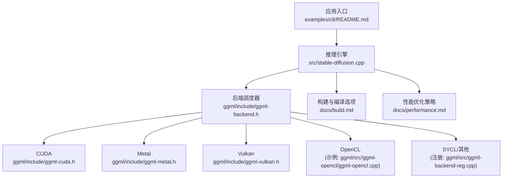
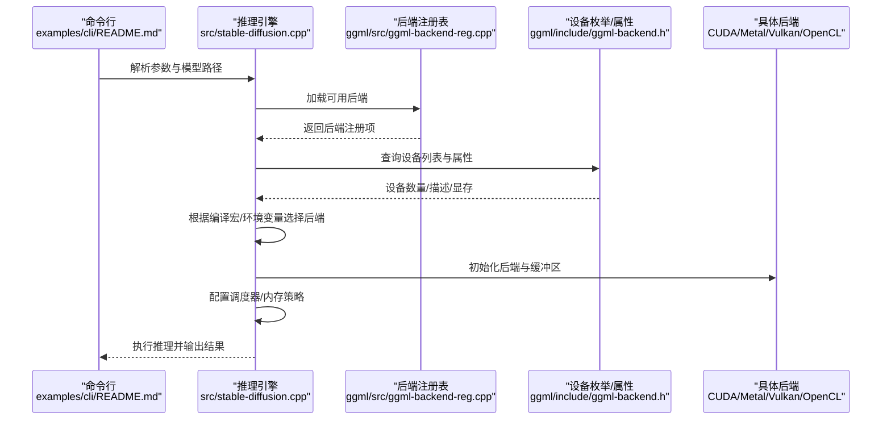
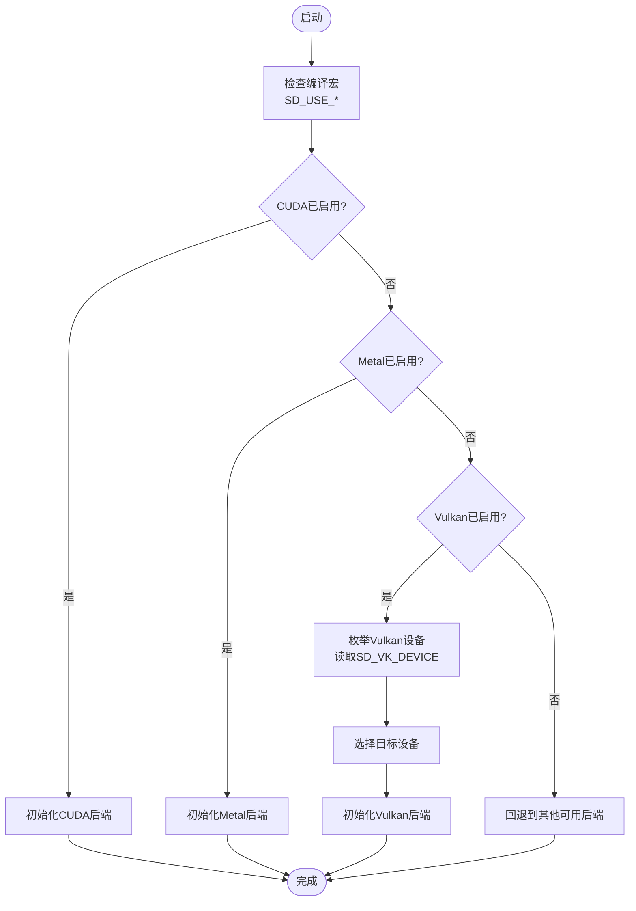
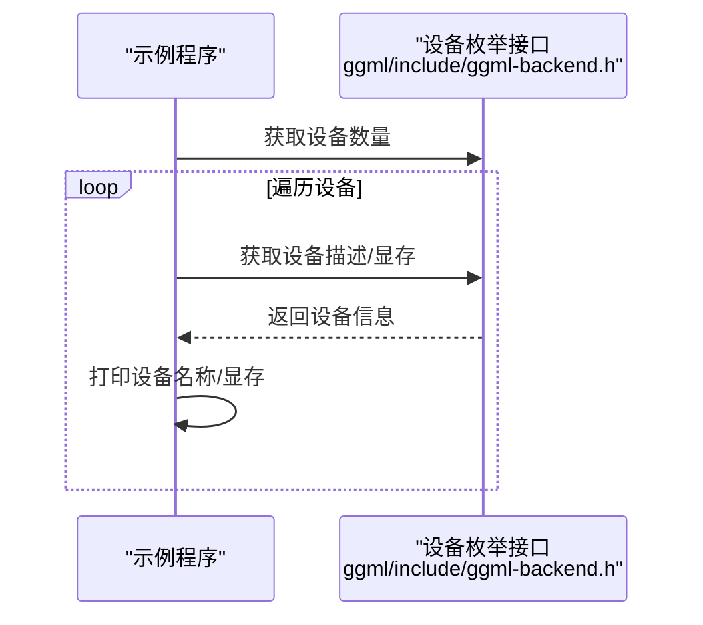
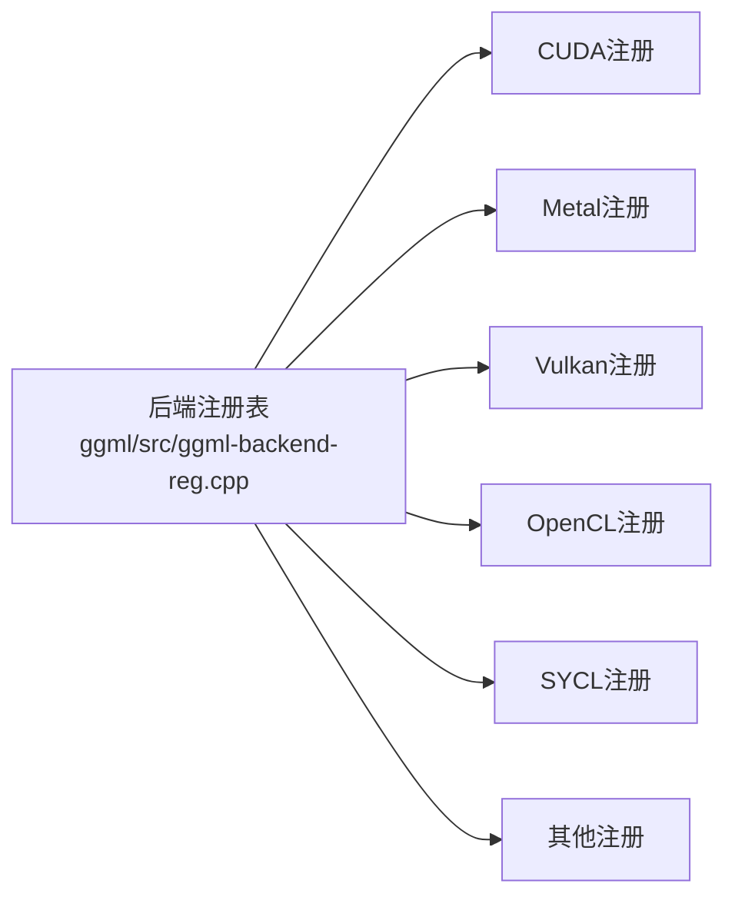
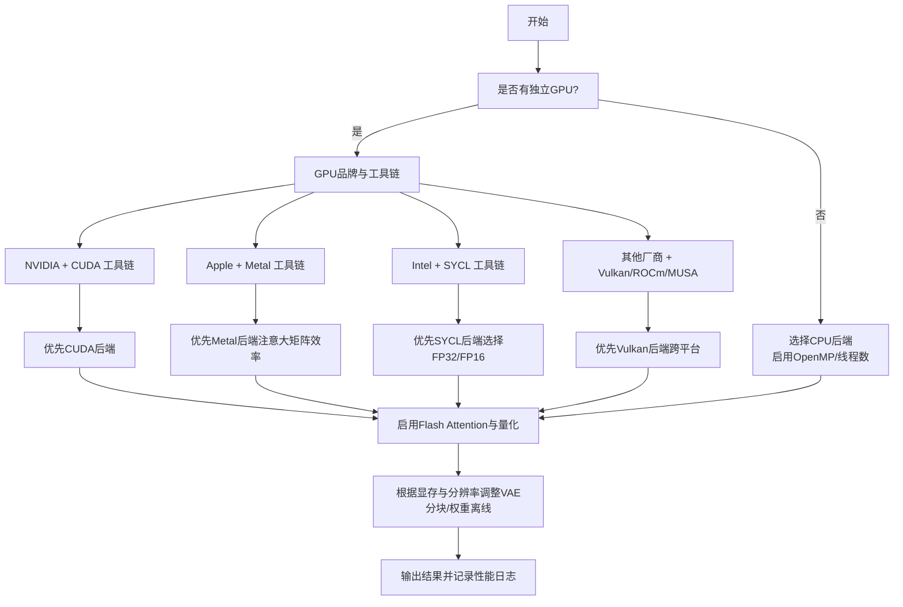

# 后端选择指南

<cite>
**本文引用的文件**
- [README.md](file://README.md)
- [性能.md](file://docs/performance.md)
- [构建.md](file://docs/build.md)
- [CLI使用说明.md](file://examples/cli/README.md)
- [稳定扩散.cpp](file://src/stable-diffusion.cpp)
- [ggml后端接口.h](file://ggml/include/ggml-backend.h)
- [ggml-CUDA接口.h](file://ggml/include/ggml-cuda.h)
- [ggml-Metal接口.h](file://ggml/include/ggml-metal.h)
- [ggml-Vulkan接口.h](file://ggml/include/ggml-vulkan.h)
- [ggml后端注册.cpp](file://ggml/src/ggml-backend-reg.cpp)
- [ggml-Vulkan实现.cpp](file://ggml/src/ggml-vulkan/ggml-vulkan.cpp)
- [ggml-OpenCL实现.cpp](file://ggml/src/ggml-opencl/ggml-opencl.cpp)
- [yolo示例.cpp](file://ggml/examples/yolo/yolov3-tiny.cpp)
- [mnist示例.cpp](file://ggml/examples/mnist/mnist-common.h)
</cite>

## 目录
1. [简介](#简介)
2. [项目结构](#项目结构)
3. [核心组件](#核心组件)
4. [架构总览](#架构总览)
5. [详细组件分析](#详细组件分析)
6. [依赖关系分析](#依赖关系分析)
7. [性能考量](#性能考量)
8. [故障排除指南](#故障排除指南)
9. [结论](#结论)
10. [附录](#附录)

## 简介
本指南面向需要在不同硬件与应用场景中选择合适推理后端的用户，围绕稳定扩散推理引擎的多后端能力（CPU、CUDA、Metal、Vulkan、OpenCL、SYCL等）进行系统化梳理。内容涵盖后端特性对比、资源消耗与兼容性、决策树与评估标准、切换方法与配置迁移、性能对比工具、常见硬件配置建议以及成本效益分析，帮助用户在图像生成、视频处理、批量推理等场景下做出最优选择。

## 项目结构
该项目基于纯C/C++实现，采用ggml作为张量与计算后端抽象层，通过统一的后端接口适配多种硬件后端，并在上层提供稳定的扩散模型推理能力。关键目录与文件如下：
- 文档：docs/performance.md、docs/build.md、examples/cli/README.md
- 核心：src/stable-diffusion.cpp（后端初始化与调度）
- 后端接口：ggml/include/ggml-backend.h 及各后端头文件（ggml-cuda.h、ggml-metal.h、ggml-vulkan.h 等）
- 后端注册与加载：ggml/src/ggml-backend-reg.cpp
- 具体后端实现：如 ggml/src/ggml-vulkan/ggml-vulkan.cpp、ggml/src/ggml-opencl/ggml-opencl.cpp
- 示例：ggml/examples/yolo/yolov3-tiny.cpp、ggml/examples/mnist/mnist-common.h（展示设备枚举与选择）

**图示来源**
- [稳定扩散.cpp:171-201](file://src/stable-diffusion.cpp#L171-L201)
- [ggml后端接口.h:233-247](file://ggml/include/ggml-backend.h#L233-L247)
- [ggml-CUDA接口.h:23-43](file://ggml/include/ggml-cuda.h#L23-L43)
- [ggml-Metal接口.h:43-57](file://ggml/include/ggml-metal.h#L43-L57)
- [ggml-Vulkan接口.h:14-25](file://ggml/include/ggml-vulkan.h#L14-L25)
- [ggml后端注册.cpp:112-137](file://ggml/src/ggml-backend-reg.cpp#L112-L137)
- [构建.md:37-90](file://docs/build.md#L37-L90)
- [性能.md:1-26](file://docs/performance.md#L1-L26)

**章节来源**
- [README.md: 68-84 行:68-84](file://README.md#L68-L84)
- [构建.md: 37-90 行:37-90](file://docs/build.md#L37-L90)
- [稳定扩散.cpp: 171-201 行:171-201](file://src/stable-diffusion.cpp#L171-L201)

## 核心组件
- 后端初始化与选择
  - 在运行时根据编译宏与环境变量选择后端，例如 CUDA、Metal、Vulkan 等。
  - 支持从环境变量指定设备索引或名称，便于多GPU场景。
- 后端注册与发现
  - 通过统一的后端注册表动态加载可用后端，支持按名称/类型查找设备。
- 设备枚举与属性查询
  - 提供设备数量、描述、显存/内存信息等，用于自动选择与诊断。
- 性能优化与内存管理
  - 支持Flash Attention、权重离线（offload）、量化、VAE分块等策略。

**章节来源**
- [稳定扩散.cpp: 171-201 行:171-201](file://src/stable-diffusion.cpp#L171-L201)
- [ggml后端接口.h: 233-247 行:233-247](file://ggml/include/ggml-backend.h#L233-L247)
- [ggml后端注册.cpp: 112-137 行:112-137](file://ggml/src/ggml-backend-reg.cpp#L112-L137)
- [yolo示例.cpp: 534-552 行:534-552](file://ggml/examples/yolo/yolov3-tiny.cpp#L534-L552)

## 架构总览
下图展示了从命令行到推理执行的整体流程，以及后端选择的关键节点。

**图示来源**
- [稳定扩散.cpp: 171-201 行:171-201](file://src/stable-diffusion.cpp#L171-L201)
- [ggml后端注册.cpp: 112-137 行:112-137](file://ggml/src/ggml-backend-reg.cpp#L112-L137)
- [ggml后端接口.h: 227-231 行:227-231](file://ggml/include/ggml-backend.h#L227-L231)
- [yolo示例.cpp: 534-552 行:534-552](file://ggml/examples/yolo/yolov3-tiny.cpp#L534-L552)

## 详细组件分析

### 后端初始化与选择
- 编译期宏控制：通过编译宏启用特定后端（如 SD_USE_CUDA、SD_USE_METAL、SD_USE_VULKAN），在初始化阶段选择对应后端。
- 运行期环境变量：Vulkan 支持通过 SD_VK_DEVICE 指定目标设备；OpenCL 支持平台/设备选择逻辑。
- 设备选择策略：优先使用编译期启用的后端；若未启用则尝试自动发现可用后端。

**图示来源**
- [稳定扩散.cpp: 171-201 行:171-201](file://src/stable-diffusion.cpp#L171-L201)
- [构建.md: 37-90 行:37-90](file://docs/build.md#L37-L90)

**章节来源**
- [稳定扩散.cpp: 171-201 行:171-201](file://src/stable-diffusion.cpp#L171-L201)
- [构建.md: 37-90 行:37-90](file://docs/build.md#L37-L90)

### 设备枚举与属性查询
- 统一接口：通过 ggml_backend_dev_count()/ggml_backend_dev_get()/ggml_backend_dev_memory() 获取设备数量、描述与显存信息。
- 实际应用：示例程序打印可用设备及其显存，辅助用户选择合适设备。

**图示来源**
- [ggml后端接口.h: 227-231 行:227-231](file://ggml/include/ggml-backend.h#L227-L231)
- [yolo示例.cpp: 534-552 行:534-552](file://ggml/examples/yolo/yolov3-tiny.cpp#L534-L552)

**章节来源**
- [ggml后端接口.h: 227-231 行:227-231](file://ggml/include/ggml-backend.h#L227-L231)
- [yolo示例.cpp: 534-552 行:534-552](file://ggml/examples/yolo/yolov3-tiny.cpp#L534-L552)

### 后端特性与兼容性
- CUDA
  - 适用于 NVIDIA GPU，推荐至少 4GB 显存。
  - 支持 cuBLAS、主机固定缓冲加速拷贝。
- Metal
  - 适用于 Apple 设备，当前对大矩阵运算效率较低，未来有改进预期。
- Vulkan
  - 跨平台图形与计算API，支持设备枚举与显存查询。
- OpenCL
  - 当前主要支持 Adreno GPU，针对 Q4_0 类型优化。
- SYCL
  - 适用于 Intel GPU，需安装驱动与 oneAPI 基础工具包。
- CPU
  - 通用后端，可配合 OpenMP/线程数设置提升性能。

**章节来源**
- [构建.md: 37-90 行:37-90](file://docs/build.md#L37-L90)
- [构建.md: 158-174 行:158-174](file://docs/build.md#L158-L174)
- [README.md: 68-84 行:68-84](file://README.md#L68-L84)

### 性能优化与内存策略
- Flash Attention：降低扩散模型内存占用，部分后端（如 CUDA）同时提升速度。
- 权重离线（Offload to CPU）：将权重迁移到系统内存以节省显存，不牺牲生成速度。
- 量化：减少内存占用，参考量化与 GGUF 文档。
- VAE 分块：通过瓦片处理降低显存占用。

**章节来源**
- [性能.md: 1-26 行:1-26](file://docs/performance.md#L1-L26)

### 后端切换与配置迁移
- 切换方式
  - 重新编译：通过修改构建选项启用/禁用后端（如 -DSD_CUDA=ON）。
  - 运行期选择：通过环境变量（如 SD_VK_DEVICE）指定设备。
- 配置迁移
  - 参数保持一致：提示/负提示、采样方法、步数、分辨率等。
  - 内存策略迁移：Flash Attention、VAE 分块、权重离线等策略可复用。

**章节来源**
- [构建.md: 37-90 行:37-90](file://docs/build.md#L37-L90)
- [CLI使用说明.md: 50-56 行:50-56](file://examples/cli/README.md#L50-L56)

## 依赖关系分析
后端注册与发现机制确保了运行时对多种后端的支持，避免硬编码依赖，便于扩展新后端。

**图示来源**
- [ggml后端注册.cpp: 112-137 行:112-137](file://ggml/src/ggml-backend-reg.cpp#L112-L137)

**章节来源**
- [ggml后端注册.cpp: 112-137 行:112-137](file://ggml/src/ggml-backend-reg.cpp#L112-L137)

## 性能考量
- 计算精度与吞吐
  - CUDA 在多数情况下具备更优吞吐；Metal 对大矩阵运算效率较低。
  - SYCL 可通过 FP32/FP16 选择影响性能与精度权衡。
- 内存占用与带宽
  - Flash Attention 降低显存占用，但并非所有后端都提速。
  - 权重离线与量化显著降低显存/内存占用。
- 平台与驱动
  - Vulkan/OpenGL 需要正确安装驱动与SDK；OpenCL 需要 ICD 与头文件支持。
- 多后端组合
  - 可将不同后端组合使用（如 CPU + GPU），通过调度器分配计算与数据搬运。

[本节为通用指导，无需列出具体文件来源]

## 故障排除指南
- 设备不可用或选择错误
  - 使用设备枚举接口查看可用设备与显存，确认设备索引与名称匹配。
  - Vulkan：检查 SD_VK_DEVICE 是否为有效整数且在设备范围内。
  - OpenCL：确认平台/设备字符串匹配，必要时打印候选设备列表。
- 性能异常
  - Flash Attention：仅在支持的模型与后端生效；确认参数已启用。
  - 权重离线：确认 offload 开关已开启，避免频繁显存/系统内存切换导致抖动。
- 构建失败
  - CUDA/ROCm/MUSA/SYCL：确保工具链版本与头文件完整；按构建文档逐项核对。
  - OpenCL（Android/NDK）：确保头文件与 ICD 库已正确复制到 sysroot。

**章节来源**
- [yolo示例.cpp: 534-552 行:534-552](file://ggml/examples/yolo/yolov3-tiny.cpp#L534-L552)
- [稳定扩散.cpp: 180-201 行:180-201](file://src/stable-diffusion.cpp#L180-L201)
- [构建.md: 92-157 行:92-157](file://docs/build.md#L92-L157)

## 结论
通过统一的后端接口与灵活的注册机制，该工程能够在多种硬件平台上高效运行。选择后端时应综合考虑 GPU 可用性、显存容量、计算精度需求与平台生态；在实际部署中，结合 Flash Attention、权重离线、量化与分块等策略可进一步优化性能与资源利用。建议在不同预算与性能目标下制定后端配置方案，并通过设备枚举与日志输出进行验证与调优。

[本节为总结性内容，无需列出具体文件来源]

## 附录

### 后端选择决策树

[本图为概念性流程图，无需列出具体文件来源]

### 常见硬件配置与后端建议
- 低预算/无独显
  - CPU 后端 + OpenMP；启用 Flash Attention 与量化；必要时使用 VAE 分块。
- 中高端 NVIDIA
  - CUDA 后端；启用 Flash Attention；根据显存大小决定是否使用量化与分块。
- Apple 生态
  - Metal 后端；关注大矩阵效率问题；可结合 CPU 作为补充。
- 跨平台/开源生态
  - Vulkan 后端；适合多厂商设备；注意驱动与SDK版本。
- Intel 集成/独显
  - SYCL 后端；根据平台选择 FP32 或 FP16；结合 Flash Attention 与量化。

[本节为通用指导，无需列出具体文件来源]

### 性能对比工具与方法
- 设备枚举与显存查询
  - 使用设备枚举接口打印设备列表与显存，辅助对比不同后端的资源占用。
- 日志与调试
  - 启用详细日志，观察 Flash Attention 是否生效、计算缓冲区大小变化等。
- 命令行参数
  - 使用 CLI 的相关参数（如 --offload-to-cpu、--fa、--diffusion-fa 等）进行策略对比。

**章节来源**
- [yolo示例.cpp: 534-552 行:534-552](file://ggml/examples/yolo/yolov3-tiny.cpp#L534-L552)
- [性能.md: 1-26 行:1-26](file://docs/performance.md#L1-L26)
- [CLI使用说明.md: 50-56 行:50-56](file://examples/cli/README.md#L50-L56)