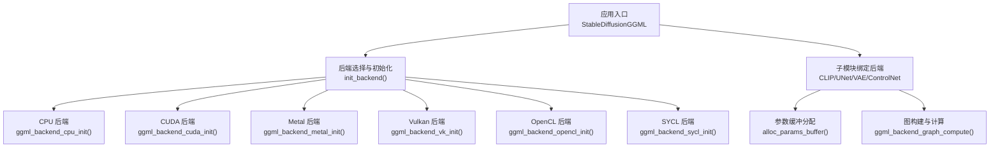
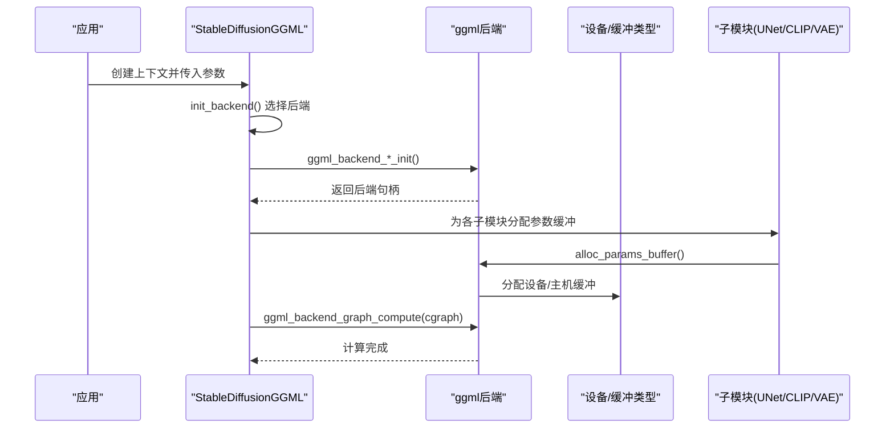
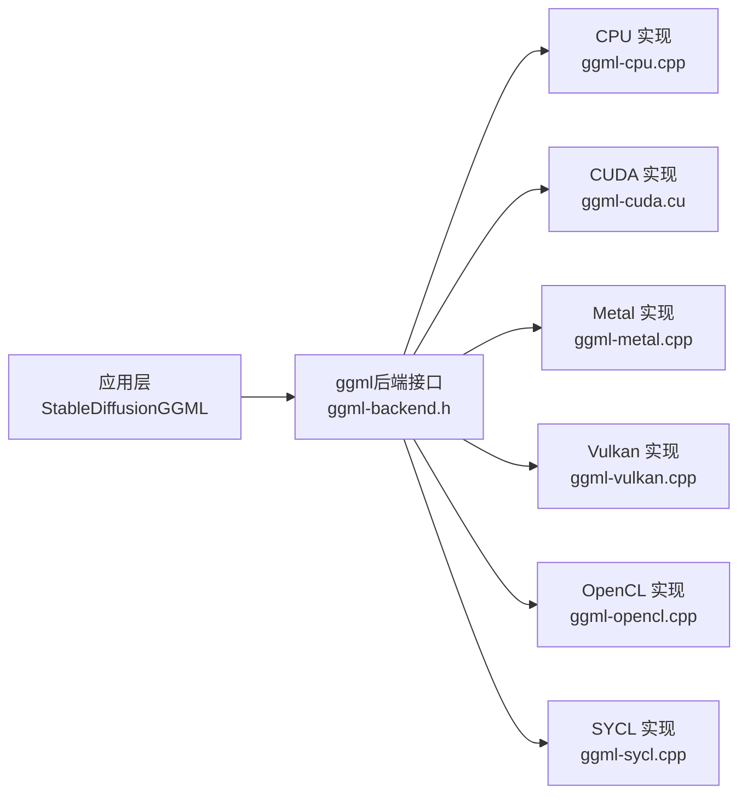

# 硬件后端

<cite>
**本文引用的文件**
- [stable-diffusion.cpp](file://src/stable-diffusion.cpp)
- [ggml.h](file://ggml/include/ggml.h)
- [ggml-backend.h](file://ggml/include/ggml-backend.h)
- [ggml-cpu.h](file://ggml/include/ggml-cpu.h)
- [ggml-cuda.h](file://ggml/include/ggml-cuda.h)
- [ggml-metal.h](file://ggml/include/ggml-metal.h)
- [ggml-vulkan.h](file://ggml/include/ggml-vulkan.h)
- [ggml-opencl.h](file://ggml/include/ggml-opencl.h)
- [ggml-sycl.h](file://ggml/include/ggml-sycl.h)
- [ggml-cpu.cpp](file://ggml/src/ggml-cpu/ggml-cpu.cpp)
- [ggml-cuda.cpp](file://ggml/src/ggml-cuda/ggml-cuda.cu)
- [ggml-metal.cpp](file://ggml/src/ggml-metal/ggml-metal.cpp)
- [ggml-vulkan.cpp](file://ggml/src/ggml-vulkan/ggml-vulkan.cpp)
- [ggml-opencl.cpp](file://ggml/src/ggml-opencl/ggml-opencl.cpp)
- [ggml-sycl.cpp](file://ggml/src/ggml-sycl/ggml-sycl.cpp)
- [build.md](file://docs/build.md)
- [performance.md](file://docs/performance.md)
</cite>

## 目录
1. [简介](#简介)
2. [项目结构](#项目结构)
3. [核心组件](#核心组件)
4. [架构总览](#架构总览)
5. [详细组件分析](#详细组件分析)
6. [依赖关系分析](#依赖关系分析)
7. [性能考量](#性能考量)
8. [故障排除指南](#故障排除指南)
9. [结论](#结论)
10. [附录](#附录)

## 简介
本文件系统性梳理稳定扩散.cpp在硬件加速后端方面的支持与使用方式，覆盖CPU（含SIMD优化）、CUDA、Metal、Vulkan、OpenCL、SYCL等后端。内容包括：后端初始化流程、内存管理、计算调度机制、配置方法、性能特征、适用场景、编译配置与依赖、故障排除以及跨平台最佳实践。

## 项目结构
稳定扩散.cpp通过ggml后端抽象层统一调度不同硬件后端。应用侧以StableDiffusionGGML为核心容器，负责模型加载、参数缓冲分配、后端选择与初始化，并将不同子模块（如CLIP、UNet、VAE、ControlNet等）绑定到相应后端上执行。

图表来源
- [stable-diffusion.cpp:171-226](file://src/stable-diffusion.cpp#L171-L226)
- [ggml-backend.h:77-101](file://ggml/include/ggml-backend.h#L77-L101)

章节来源
- [stable-diffusion.cpp:103-169](file://src/stable-diffusion.cpp#L103-L169)
- [ggml-backend.h:24-101](file://ggml/include/ggml-backend.h#L24-L101)

## 核心组件
- StableDiffusionGGML：持有主后端与子模块后端句柄，负责后端初始化、子模块实例化与参数缓冲分配、图计算调度。
- ggml后端接口：提供统一的后端生命周期、缓冲类型、异步复制、事件同步、设备能力查询等能力。
- 子模块后端绑定策略：根据用户配置与模型版本，将CLIP/V AE/ControlNet等绑定到CPU或GPU后端；默认主后端用于UNet/扩散模型。

章节来源
- [stable-diffusion.cpp:103-169](file://src/stable-diffusion.cpp#L103-L169)
- [ggml-backend.h:24-101](file://ggml/include/ggml-backend.h#L24-L101)

## 架构总览
下图展示从应用初始化到模型推理的关键调用链，以及后端选择与内存管理的交互。

图表来源
- [stable-diffusion.cpp:238-256](file://src/stable-diffusion.cpp#L238-L256)
- [ggml-backend.h:82-101](file://ggml/include/ggml-backend.h#L82-L101)

## 详细组件分析

### CPU 后端（含SIMD优化）
- 初始化：当未启用其他硬件后端时，默认使用CPU后端。
- SIMD优化：ggml-cpu实现包含多种架构路径（x86/ARM/RISC-V/LoongArch/PowerPC/WASM/S390等），并在编译期通过FindSIMD.cmake检测可用指令集（如AVX、AVX2、AVX512等），自动选择最优内核。
- 内存与调度：使用ggml默认缓冲类型与主机内存，支持多线程执行；适用于无独立GPU或资源受限环境。
- 性能特征：在具备高性能SIMD的CPU上可获得良好吞吐；受内存带宽限制，大模型推理可能成为瓶颈。
- 适用场景：服务器/工作站无独显、嵌入式/边缘设备、开发调试与小批量推理。

章节来源
- [stable-diffusion.cpp:222-225](file://src/stable-diffusion.cpp#L222-L225)
- [ggml-cpu.cpp](file://ggml/src/ggml-cpu/ggml-cpu.cpp)
- [ggml-cpu.h](file://ggml/include/ggml-cpu.h)

### CUDA 后端
- 初始化：通过宏SD_USE_CUDA触发，调用ggml_backend_cuda_init进行初始化。
- 内存与调度：使用GPU显存作为主要计算缓冲，支持异步数据传输与事件同步；适合大规模矩阵运算与卷积。
- 性能特征：在NVIDIA GPU上通常具有最高吞吐；需注意显存占用与碎片化。
- 适用场景：消费级/专业级NVIDIA显卡、云GPU实例、高吞吐推理服务。

章节来源
- [stable-diffusion.cpp:172-175](file://src/stable-diffusion.cpp#L172-L175)
- [ggml-cuda.h](file://ggml/include/ggml-cuda.h)

### Metal 后端
- 初始化：通过宏SD_USE_METAL触发，调用ggml_backend_metal_init进行初始化。
- 内存与调度：利用Apple GPU显存与Metal框架，支持高效的数据传输与并行内核执行。
- 性能特征：在Apple Silicon与部分Intel Mac上表现优异；对Metal驱动版本有一定要求。
- 适用场景：MacOS平台、Apple Silicon设备上的本地推理。

章节来源
- [stable-diffusion.cpp:176-179](file://src/stable-diffusion.cpp#L176-L179)
- [ggml-metal.h](file://ggml/include/ggml-metal.h)

### Vulkan 后端
- 初始化：通过宏SD_USE_VULKAN触发；支持通过SD_VK_DEVICE环境变量选择具体设备索引。
- 设备选择：若未设置或越界，回退到设备0；失败时记录警告并尝试回退CPU。
- 内存与调度：使用Vulkan缓冲与队列，支持跨厂商GPU（AMD/NVIDIA/intel等）。
- 性能特征：跨平台兼容性好，但驱动质量差异较大；需关注着色器编译开销。
- 适用场景：Linux桌面/服务器、需要跨厂商GPU的通用部署。

章节来源
- [stable-diffusion.cpp:180-208](file://src/stable-diffusion.cpp#L180-L208)
- [ggml-vulkan.h](file://ggml/include/ggml-vulkan.h)

### OpenCL 后端
- 初始化：通过宏SD_USE_OPENCL触发；初始化失败会记录警告。
- 兼容性：可在多种GPU/CPU/异构设备上运行，但性能与稳定性取决于驱动实现。
- 适用场景：老旧或特殊设备、需要OpenCL生态支持的环境。

章节来源
- [stable-diffusion.cpp:209-216](file://src/stable-diffusion.cpp#L209-L216)
- [ggml-opencl.h](file://ggml/include/ggml-opencl.h)

### SYCL 后端
- 初始化：通过宏SD_USE_SYCL触发，调用ggml_backend_sycl_init进行初始化。
- 跨厂商：基于oneAPI SYCL，理论上可运行于支持的CPU/GPU/异构设备。
- 适用场景：需要oneAPI生态或跨架构统一编程模型的场景。

章节来源
- [stable-diffusion.cpp:217-220](file://src/stable-diffusion.cpp#L217-L220)
- [ggml-sycl.h](file://ggml/include/ggml-sycl.h)

### 后端选择与绑定策略
- 主后端优先：按SD_USE_*宏启用对应后端；若均未启用则回退CPU。
- 子模块后端：CLIP/V AE/ControlNet可根据keep_*_on_cpu参数强制绑定CPU后端，以降低主后端显存压力或满足特定模型需求。
- 参数缓冲：各子模块在各自后端上调用alloc_params_buffer()完成参数张量的缓冲分配与初始化。

章节来源
- [stable-diffusion.cpp:436-440](file://src/stable-diffusion.cpp#L436-L440)
- [stable-diffusion.cpp:606-611](file://src/stable-diffusion.cpp#L606-L611)
- [stable-diffusion.cpp:677-693](file://src/stable-diffusion.cpp#L677-L693)

### 内存管理与计算调度
- 缓冲类型与对齐：后端提供默认缓冲类型与对齐信息，确保张量在设备/主机间正确布局。
- 异步操作：支持异步数据设置/获取、异步拷贝与事件同步，提升并发与吞吐。
- 图计算：通过ggml_backend_graph_compute或异步版本提交计算图，由后端驱动执行。
- 设备能力：后端注册与设备查询提供设备类型、内存容量、能力标志（异步/事件/主机固定缓冲等）。

章节来源
- [ggml-backend.h:34-101](file://ggml/include/ggml-backend.h#L34-L101)
- [ggml-backend.h:129-183](file://ggml/include/ggml-backend.h#L129-L183)

## 依赖关系分析
- 应用层依赖ggml后端接口，不直接耦合具体硬件SDK。
- 各后端实现位于ggml/src/目录下，分别封装对应平台的API。
- 编译期通过宏控制启用特定后端，运行时按条件初始化。

图表来源
- [ggml-backend.h:24-101](file://ggml/include/ggml-backend.h#L24-L101)
- [ggml-cpu.cpp](file://ggml/src/ggml-cpu/ggml-cpu.cpp)
- [ggml-cuda.cpp](file://ggml/src/ggml-cuda/ggml-cuda.cu)
- [ggml-metal.cpp](file://ggml/src/ggml-metal/ggml-metal.cpp)
- [ggml-vulkan.cpp](file://ggml/src/ggml-vulkan/ggml-vulkan.cpp)
- [ggml-opencl.cpp](file://ggml/src/ggml-opencl/ggml-opencl.cpp)
- [ggml-sycl.cpp](file://ggml/src/ggml-sycl/ggml-sycl.cpp)

## 性能考量
- 后端选择建议
  - NVIDIA GPU：优先CUDA，性能与生态成熟度最佳。
  - Apple设备：优先Metal，系统集成度高。
  - 跨厂商Linux：优先Vulkan，兼容性较好。
  - 需要OpenCL生态：选择OpenCL。
  - oneAPI/跨架构：选择SYCL。
  - 无独立GPU：使用CPU，结合SIMD优化与多线程。
- 性能优化要点
  - 显存/内存占用：合理设置batch与分辨率，必要时将部分子模块置于CPU后端。
  - 异步与事件：充分利用异步拷贝与事件同步减少等待。
  - Flash Attention：在支持的模型中开启，可显著降低注意力阶段的内存与时间开销。
  - 模型量化：结合权重类型规则与量化策略，平衡精度与性能。
- 参考文档
  - 构建与后端编译：参见构建文档中的后端编译选项与依赖说明。
  - 性能调优：参见性能文档中的建议与基准测试方法。

章节来源
- [performance.md](file://docs/performance.md)
- [build.md](file://docs/build.md)

## 故障排除指南
- 后端初始化失败
  - CUDA/Metal/Vulkan/OpenCL/SYCL：检查对应驱动/SDK是否正确安装，确认设备可用性。
  - Vulkan：检查SD_VK_DEVICE环境变量是否为有效索引，越界将回退设备0。
  - 若所有硬件后端均失败，系统将回退至CPU后端。
- 显存不足
  - 将CLIP/VAE/ControlNet等子模块绑定到CPU后端，或降低输入分辨率与batch大小。
- 性能异常
  - 关闭/开启Flash Attention对比验证。
  - 检查是否启用了合适的SIMD优化（CPU）。
  - 确认异步拷贝与事件同步未被不当禁用。
- 平台特定问题
  - macOS：确认Metal驱动版本与Xcode工具链。
  - Linux：确认Vulkan SDK与驱动版本一致。
  - Windows：确认CUDA Toolkit与Visual Studio版本匹配。

章节来源
- [stable-diffusion.cpp:180-208](file://src/stable-diffusion.cpp#L180-L208)
- [stable-diffusion.cpp:436-440](file://src/stable-diffusion.cpp#L436-L440)
- [stable-diffusion.cpp:606-611](file://src/stable-diffusion.cpp#L606-L611)

## 结论
稳定扩散.cpp通过ggml后端抽象层实现了对多硬件后端的统一支持。用户可通过编译期宏与运行时参数灵活选择后端，结合内存与调度策略在不同平台上获得稳定且高效的推理体验。建议依据硬件生态与平台特性选择最适合的后端，并配合性能文档与故障排除指南进行优化与排障。

## 附录

### 后端选择与配置速查
- 宏开关
  - SD_USE_CUDA：启用CUDA后端
  - SD_USE_METAL：启用Metal后端
  - SD_USE_VULKAN：启用Vulkan后端
  - SD_USE_OPENCL：启用OpenCL后端
  - SD_USE_SYCL：启用SYCL后端
- 运行时参数
  - keep_clip_on_cpu / keep_vae_on_cpu / keep_control_net_on_cpu：强制将对应子模块绑定到CPU后端
  - SD_VK_DEVICE：指定Vulkan设备索引
  - flash_attn / diffusion_flash_attn：开启Flash Attention
  - n_threads：设置线程数（CPU）

章节来源
- [stable-diffusion.cpp:171-226](file://src/stable-diffusion.cpp#L171-L226)
- [stable-diffusion.cpp:436-440](file://src/stable-diffusion.cpp#L436-L440)
- [stable-diffusion.cpp:606-611](file://src/stable-diffusion.cpp#L606-L611)
- [stable-diffusion.cpp:677-693](file://src/stable-diffusion.cpp#L677-L693)