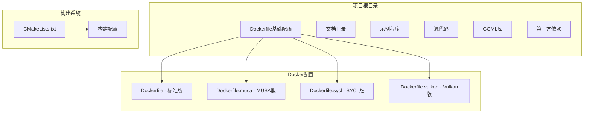
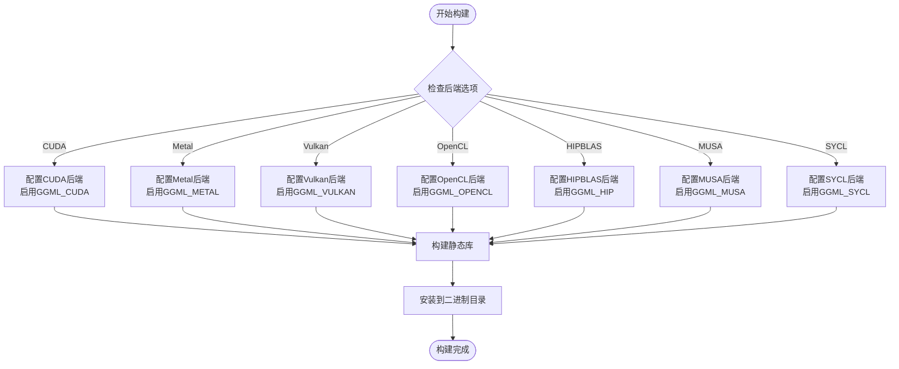
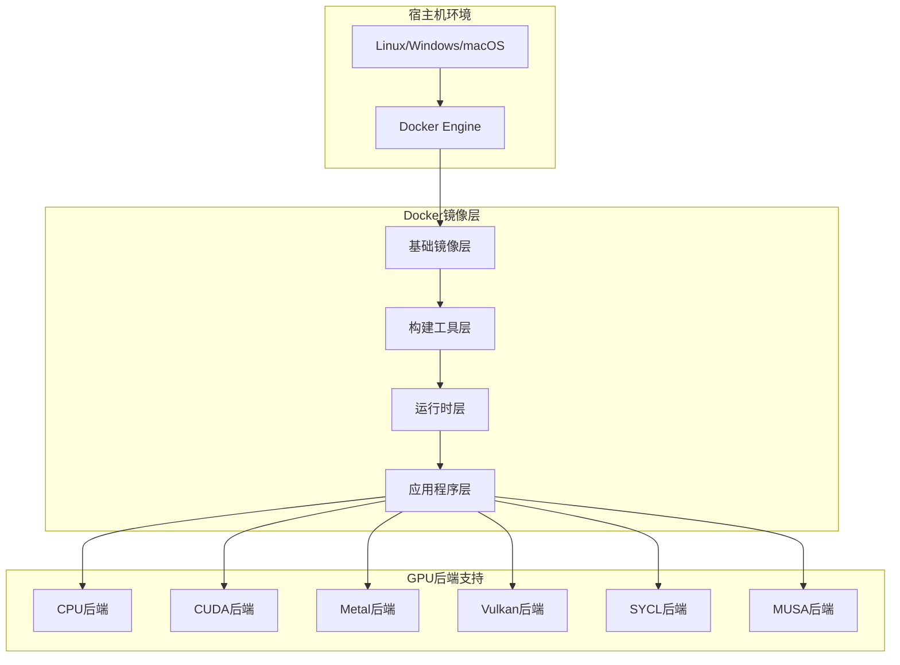
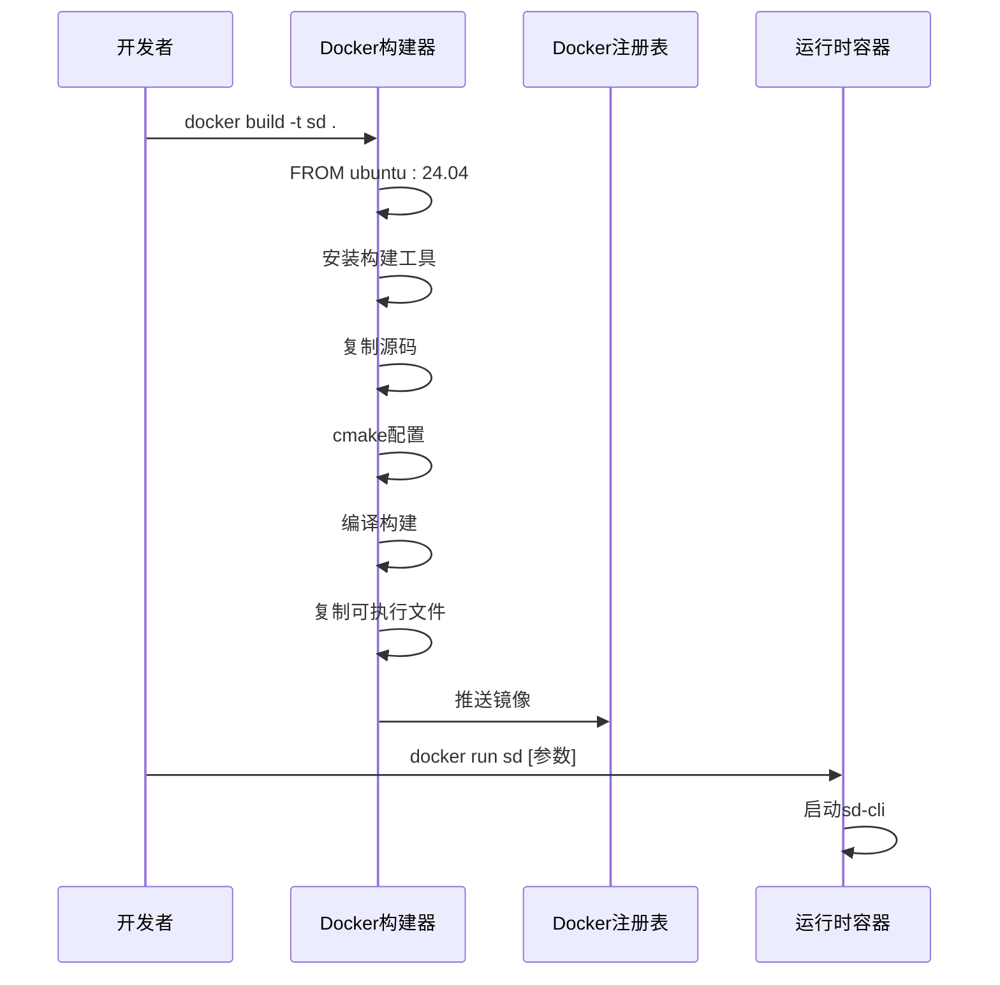
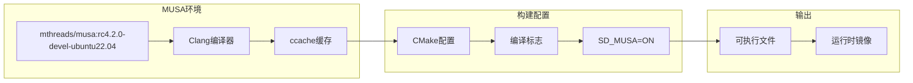
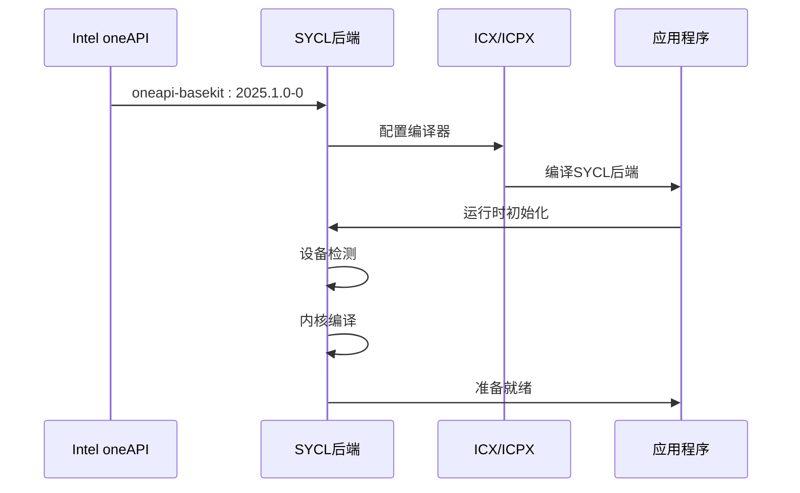
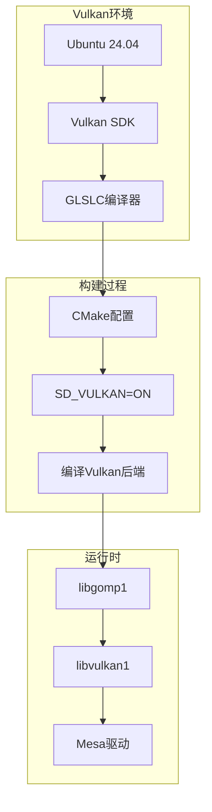
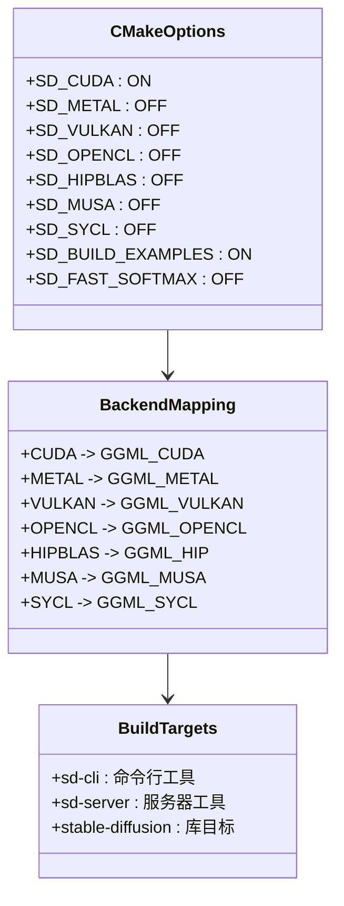
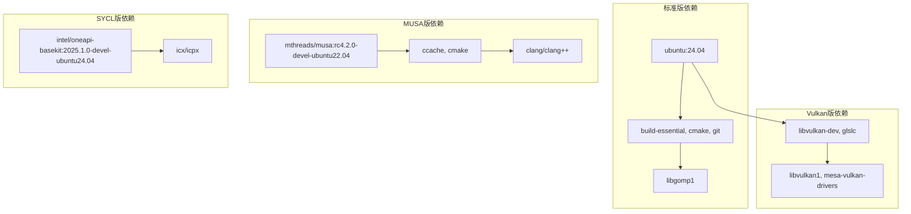
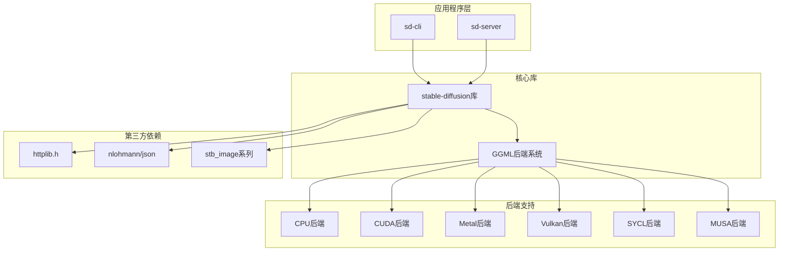

# Docker容器化部署

<cite>
**本文档引用的文件**
- [Dockerfile](file://Dockerfile)
- [Dockerfile.musa](file://Dockerfile.musa)
- [Dockerfile.sycl](file://Dockerfile.sycl)
- [Dockerfile.vulkan](file://Dockerfile.vulkan)
- [.dockerignore](file://.dockerignore)
- [docs/docker.md](file://docs/docker.md)
- [CMakeLists.txt](file://CMakeLists.txt)
- [examples/cli/main.cpp](file://examples/cli/main.cpp)
- [examples/server/main.cpp](file://examples/server/main.cpp)
- [examples/server/README.md](file://examples/server/README.md)
- [README.md](file://README.md)
</cite>

## 目录
1. [简介](#简介)
2. [项目结构](#项目结构)
3. [核心组件](#核心组件)
4. [架构概览](#架构概览)
5. [详细组件分析](#详细组件分析)
6. [依赖关系分析](#依赖关系分析)
7. [性能考虑](#性能考虑)
8. [故障排除指南](#故障排除指南)
9. [结论](#结论)
10. [附录](#附录)

## 简介

本指南提供了稳定扩散.cpp项目的完整Docker容器化部署方案，涵盖多架构Dockerfile配置、镜像构建过程、依赖安装和运行时配置。该系统支持多种GPU加速后端，包括CUDA、Metal、Vulkan、SYCL和MUSA，为不同硬件平台提供最优的推理性能。

稳定扩散.cpp是一个基于纯C/C++实现的扩散模型推理引擎，支持多种主流模型格式和推理后端。通过Docker容器化部署，用户可以在各种环境中快速、一致地运行图像生成任务。

## 项目结构

该项目采用模块化的项目结构，主要包含以下关键目录：



**图表来源**
- [Dockerfile:1-23](file://Dockerfile#L1-L23)
- [Dockerfile.musa:1-24](file://Dockerfile.musa#L1-L24)
- [Dockerfile.sycl:1-21](file://Dockerfile.sycl#L1-L21)
- [Dockerfile.vulkan:1-24](file://Dockerfile.vulkan#L1-L24)

**章节来源**
- [README.md:1-200](file://README.md#L1-L200)

## 核心组件

### Docker镜像变体

项目提供了四种不同的Docker镜像变体，每种都针对特定的GPU加速后端进行了优化：

#### 标准版Dockerfile
- 基于Ubuntu 24.04 LTS
- 支持CPU推理和OpenMP并行计算
- 最小化运行时依赖
- 适合通用Linux环境

#### MUSA版Dockerfile
- 基于Moore Threads MUSA开发环境
- 针对国产MUSA GPU优化
- 使用Clang编译器链
- 支持MUSA后端加速

#### SYCL版Dockerfile
- 基于Intel oneAPI BaseKit
- 支持跨平台SYCL后端
- 使用ICX/ICPX编译器
- 兼容多种异构计算设备

#### Vulkan版Dockerfile
- 基于Ubuntu 24.04 LTS
- 集成Vulkan SDK和驱动
- 支持现代GPU加速
- 包含必要的Vulkan运行时库

**章节来源**
- [Dockerfile:1-23](file://Dockerfile#L1-L23)
- [Dockerfile.musa:1-24](file://Dockerfile.musa#L1-L24)
- [Dockerfile.sycl:1-21](file://Dockerfile.sycl#L1-L21)
- [Dockerfile.vulkan:1-24](file://Dockerfile.vulkan#L1-L24)

### 构建系统配置

CMake构建系统提供了灵活的后端选择机制：



**图表来源**
- [CMakeLists.txt:32-85](file://CMakeLists.txt#L32-L85)
- [CMakeLists.txt:147-161](file://CMakeLists.txt#L147-L161)

**章节来源**
- [CMakeLists.txt:1-200](file://CMakeLists.txt#L1-L200)

## 架构概览

### 容器化架构设计



**图表来源**
- [Dockerfile:3-23](file://Dockerfile#L3-L23)
- [Dockerfile.musa:4-24](file://Dockerfile.musa#L4-L24)
- [Dockerfile.sycl:3-21](file://Dockerfile.sycl#L3-L21)
- [Dockerfile.vulkan:3-24](file://Dockerfile.vulkan#L3-L24)

### 应用程序架构

稳定扩散.cpp提供了两种主要的应用模式：

#### 命令行界面(CLI)
- 单次图像生成任务
- 批量处理支持
- 参数配置灵活
- 输出格式多样

#### 服务器模式
- HTTP REST API接口
- 多线程并发处理
- 内置Web界面
- 远程访问支持

**章节来源**
- [examples/cli/main.cpp:1-200](file://examples/cli/main.cpp#L1-L200)
- [examples/server/main.cpp:1-200](file://examples/server/main.cpp#L1-L200)

## 详细组件分析

### 标准版Dockerfile分析

标准版Dockerfile实现了最小化的容器化部署：



**图表来源**
- [Dockerfile:1-23](file://Dockerfile#L1-L23)

#### 关键特性
- **分阶段构建**: 使用多阶段构建减少最终镜像大小
- **最小依赖**: 仅安装必要的运行时库
- **默认入口点**: 指向CLI应用程序
- **可移植性**: 基于标准Ubuntu镜像

**章节来源**
- [Dockerfile:1-23](file://Dockerfile#L1-L23)

### MUSA版Dockerfile分析

MUSA版专门针对中国国产GPU进行了优化：



**图表来源**
- [Dockerfile.musa:1-24](file://Dockerfile.musa#L1-L24)

#### 特殊配置
- **专用基础镜像**: 使用MUSA官方开发镜像
- **编译器链**: 配置Clang编译器
- **优化标志**: 启用OpenMP并行计算
- **后端支持**: 明确启用MUSA后端

**章节来源**
- [Dockerfile.musa:1-24](file://Dockerfile.musa#L1-L24)

### SYCL版Dockerfile分析

SYCL版提供了跨平台异构计算支持：



**图表来源**
- [Dockerfile.sycl:1-21](file://Dockerfile.sycl#L1-L21)

#### 技术特点
- **跨平台兼容**: 支持多种异构计算设备
- **现代编译器**: 使用ICX/ICPX编译器
- **性能优化**: 针对SYCL后端的编译优化
- **标准接口**: 遵循SYCL标准规范

**章节来源**
- [Dockerfile.sycl:1-21](file://Dockerfile.sycl#L1-L21)

### Vulkan版Dockerfile分析

Vulkan版专注于现代GPU加速：



**图表来源**
- [Dockerfile.vulkan:1-24](file://Dockerfile.vulkan#L1-L24)

#### 运行时要求
- **Vulkan驱动**: 确保GPU支持Vulkan
- **运行时库**: 安装必要的Vulkan库
- **驱动程序**: 配置适当的GPU驱动

**章节来源**
- [Dockerfile.vulkan:1-24](file://Dockerfile.vulkan#L1-L24)

### 构建系统配置分析

CMake构建系统提供了灵活的后端选择机制：



**图表来源**
- [CMakeLists.txt:29-85](file://CMakeLists.txt#L29-L85)
- [CMakeLists.txt:192-200](file://CMakeLists.txt#L192-L200)

**章节来源**
- [CMakeLists.txt:1-200](file://CMakeLists.txt#L1-L200)

## 依赖关系分析

### Docker镜像依赖关系



**图表来源**
- [Dockerfile:5-18](file://Dockerfile#L5-L18)
- [Dockerfile.musa:6-17](file://Dockerfile.musa#L6-L17)
- [Dockerfile.sycl:5-13](file://Dockerfile.sycl#L5-L13)
- [Dockerfile.vulkan:5-18](file://Dockerfile.vulkan#L5-L18)

### 应用程序依赖关系

稳定扩散.cpp应用程序依赖于多个组件：



**图表来源**
- [examples/cli/main.cpp:16-20](file://examples/cli/main.cpp#L16-L20)
- [examples/server/main.cpp:11-14](file://examples/server/main.cpp#L11-L14)
- [CMakeLists.txt:170-189](file://CMakeLists.txt#L170-L189)

**章节来源**
- [.dockerignore:1-7](file://.dockerignore#L1-L7)

## 性能考虑

### GPU加速后端性能对比

| 后端类型 | 性能等级 | 内存占用 | 兼容性 | 推荐场景 |
|---------|----------|----------|--------|----------|
| CPU | 中等 | 低 | 广泛 | 无GPU或低负载 |
| CUDA | 高 | 中等 | NVIDIA GPU | 高性能推理 |
| Metal | 高 | 中等 | Apple Silicon | macOS/iOS |
| Vulkan | 高 | 中等 | 现代GPU | 跨平台GPU |
| SYCL | 高 | 中等 | 异构设备 | 跨厂商GPU |
| MUSA | 高 | 中等 | 国产GPU | 中国生态 |

### 容器性能优化策略

1. **镜像层优化**
   - 使用多阶段构建减少最终镜像大小
   - 合理组织Dockerfile指令顺序
   - 利用.dockerignore排除不必要的文件

2. **运行时优化**
   - 合理配置CPU亲和性和线程数
   - 优化内存分配策略
   - 启用适当的缓存机制

3. **GPU资源管理**
   - 正确配置GPU内存分配
   - 优化批处理大小
   - 启用适当的精度模式

## 故障排除指南

### 常见问题及解决方案

#### GPU后端初始化失败

**症状**: 应用程序无法检测到GPU设备

**可能原因**:
- GPU驱动未正确安装
- Docker容器缺少GPU访问权限
- 后端库版本不匹配

**解决方案**:
1. 验证GPU驱动状态
2. 检查Docker GPU插件配置
3. 确认后端库版本兼容性

#### 模型加载错误

**症状**: 无法加载模型文件

**可能原因**:
- 模型路径不正确
- 权重格式不支持
- 内存不足

**解决方案**:
1. 验证模型文件完整性
2. 检查权重格式兼容性
3. 增加容器内存限制

#### 性能问题

**症状**: 推理速度慢于预期

**可能原因**:
- 后端未正确启用
- 线程配置不当
- 内存带宽受限

**解决方案**:
1. 确认目标后端已启用
2. 调整线程数量配置
3. 优化内存使用策略

### 容器调试技巧

```bash
# 查看容器日志
docker logs <container_id>

# 进入容器进行调试
docker exec -it <container_id> /bin/bash

# 检查容器资源使用
docker stats <container_id>

# 查看容器详细信息
docker inspect <container_id>
```

**章节来源**
- [docs/docker.md:1-40](file://docs/docker.md#L1-L40)

## 结论

稳定扩散.cpp的Docker容器化部署提供了高度灵活和可扩展的解决方案。通过多架构Dockerfile配置，用户可以根据具体的硬件平台和需求选择最适合的部署方案。

关键优势包括：
- **多后端支持**: 支持CUDA、Metal、Vulkan、SYCL、MUSA等多种GPU加速后端
- **容器化友好**: 优化的Dockerfile配置，便于CI/CD集成
- **性能优化**: 针对不同硬件平台的专门优化
- **易于部署**: 简化的部署流程和配置管理

建议在生产环境中根据具体硬件条件选择合适的后端，并结合实际工作负载进行性能调优。

## 附录

### 部署最佳实践

#### 环境准备
1. 确保宿主机具备足够的GPU内存
2. 安装适当的GPU驱动程序
3. 配置Docker GPU插件（如使用NVIDIA GPU）

#### 容器配置
1. 设置合理的内存和CPU限制
2. 配置持久化存储卷
3. 优化网络配置以支持远程访问

#### 监控和维护
1. 定期监控容器资源使用情况
2. 跟踪模型推理性能指标
3. 及时更新容器镜像版本

### 相关文档链接
- [Docker官方文档](https://docs.docker.com/)
- [NVIDIA Docker支持](https://github.com/NVIDIA/nvidia-docker)
- [Intel oneAPI文档](https://www.intel.com/content/www/us/en/developer/tools/oneapi/documentation.html)
- [Moore Threads文档](https://www.mthreads.com/)