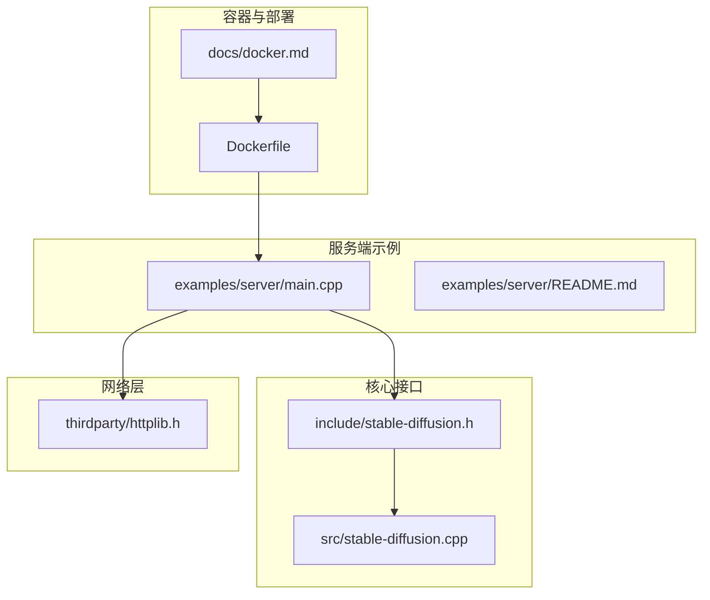
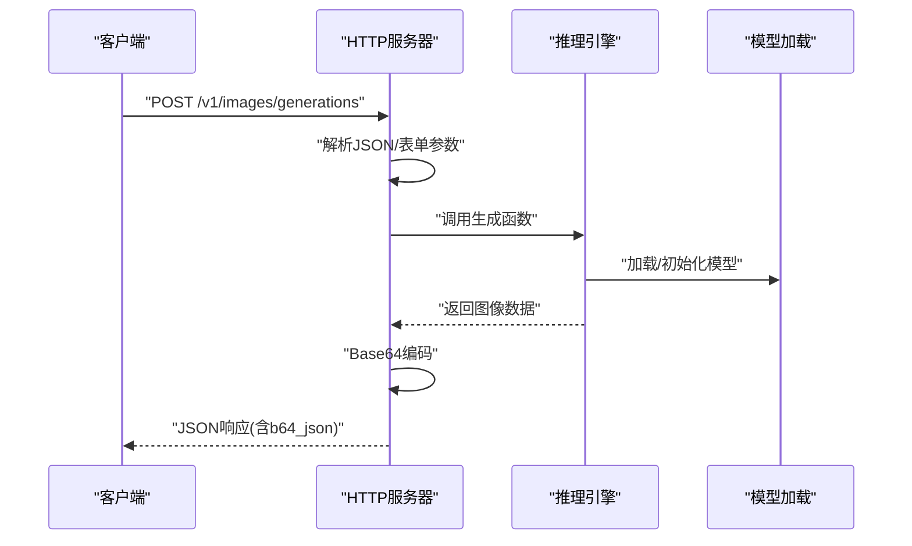
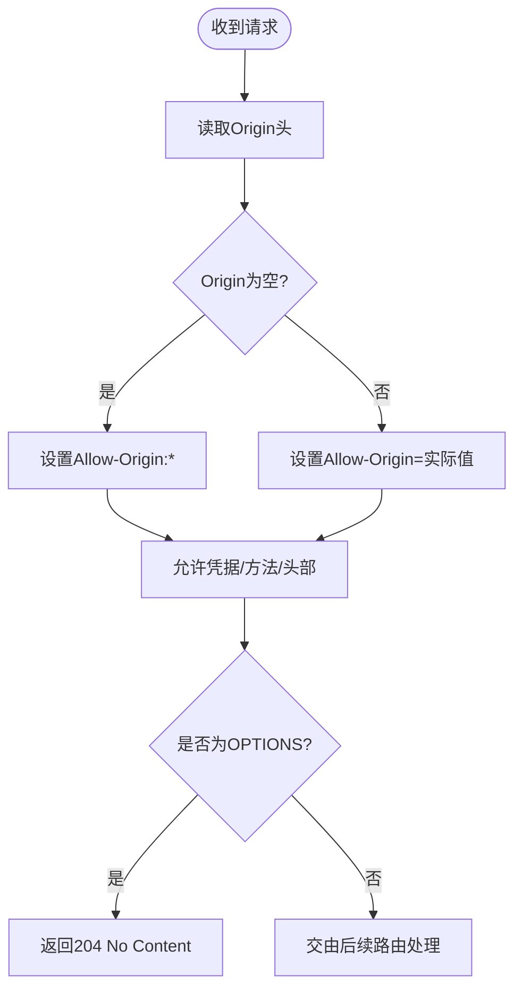
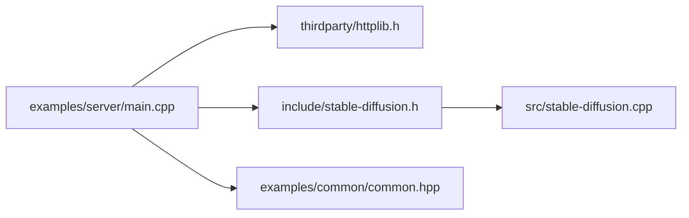

# 安全加固与权限控制

<cite>
**本文档引用的文件**
- [examples/server/main.cpp](file://examples/server/main.cpp)
- [examples/server/README.md](file://examples/server/README.md)
- [include/stable-diffusion.h](file://include/stable-diffusion.h)
- [src/stable-diffusion.cpp](file://src/stable-diffusion.cpp)
- [thirdparty/httplib.h](file://thirdparty/httplib.h)
- [Dockerfile](file://Dockerfile)
- [docs/docker.md](file://docs/docker.md)
- [examples/common/common.hpp](file://examples/common/common.hpp)
</cite>

## 目录
1. [简介](#简介)
2. [项目结构](#项目结构)
3. [核心组件](#核心组件)
4. [架构总览](#架构总览)
5. [详细组件分析](#详细组件分析)
6. [依赖关系分析](#依赖关系分析)
7. [性能考虑](#性能考虑)
8. [故障排除指南](#故障排除指南)
9. [结论](#结论)
10. [附录](#附录)

## 简介
本指南聚焦于稳定扩散.cpp在生产环境中的安全加固与权限控制，涵盖API访问控制、身份认证与授权机制、容器安全、网络安全与数据保护、防火墙与SSL/TLS加密、敏感信息保护、审计日志、入侵检测与安全事件响应流程，以及用户权限管理、资源配额与访问限制的实现建议。文档基于仓库现有代码与配置进行分析，并提供可操作的安全实践。

## 项目结构
该项目采用模块化设计，服务端示例位于examples/server，核心推理接口定义在include/stable-diffusion.h，模型加载与推理实现在src/stable-diffusion.cpp，HTTP服务器使用thirdparty/httplib.h，Docker构建与运行配置位于根目录的Dockerfile与docs/docker.md。

**图表来源**
- [examples/server/main.cpp](file://examples/server/main.cpp)
- [include/stable-diffusion.h](file://include/stable-diffusion.h)
- [src/stable-diffusion.cpp](file://src/stable-diffusion.cpp)
- [thirdparty/httplib.h](file://thirdparty/httplib.h)
- [Dockerfile](file://Dockerfile)
- [docs/docker.md](file://docs/docker.md)

**章节来源**
- [examples/server/main.cpp](file://examples/server/main.cpp)
- [examples/server/README.md](file://examples/server/README.md)
- [include/stable-diffusion.h](file://include/stable-diffusion.h)
- [src/stable-diffusion.cpp](file://src/stable-diffusion.cpp)
- [thirdparty/httplib.h](file://thirdparty/httplib.h)
- [Dockerfile](file://Dockerfile)
- [docs/docker.md](file://docs/docker.md)

## 核心组件
- HTTP服务器与路由：基于cpp-httplib实现，支持预路由处理（CORS）、静态文件与JSON响应。
- 推理引擎：通过C API暴露生成参数、采样器、调度器等能力，供HTTP接口调用。
- 日志系统：统一的日志回调与格式化输出，支持级别控制与颜色输出。
- 配置解析：命令行参数解析与参数校验，支持监听地址、端口、模型路径等。

**章节来源**
- [examples/server/main.cpp](file://examples/server/main.cpp)
- [include/stable-diffusion.h](file://include/stable-diffusion.h)
- [examples/common/common.hpp](file://examples/common/common.hpp)

## 架构总览
服务端以单线程HTTP服务器为核心，接收请求后解析参数，调用推理引擎生成图像，再将结果编码为Base64返回。整体流程简洁，便于在容器中部署与扩展。

**图表来源**
- [examples/server/main.cpp](file://examples/server/main.cpp)
- [include/stable-diffusion.h](file://include/stable-diffusion.h)
- [src/stable-diffusion.cpp](file://src/stable-diffusion.cpp)

## 详细组件分析

### API访问控制与CORS
- 预路由处理器设置跨域头，允许任意来源、方法与头部；对OPTIONS预检请求直接返回204。
- 建议在生产环境中收紧CORS策略，仅允许受信来源，并限制方法与头部。

**图表来源**
- [examples/server/main.cpp](file://examples/server/main.cpp)

**章节来源**
- [examples/server/main.cpp](file://examples/server/main.cpp)

### 身份认证与授权机制
- 当前实现未内置认证与授权逻辑，所有请求均可访问。
- 生产建议：
  - 在网关或反向代理层启用API密钥、Bearer Token或OAuth。
  - 对不同用户/租户实施配额与速率限制。
  - 引入最小权限原则，按需开放端点。

**章节来源**
- [examples/server/main.cpp](file://examples/server/main.cpp)

### 容器安全
- Dockerfile采用多阶段构建，运行时镜像仅包含必要依赖，入口默认为CLI。
- 建议：
  - 使用非root用户运行容器，限制权限。
  - 挂载只读卷存放模型，避免写入。
  - 启用只读根文件系统与必要的capabilities裁剪。

**章节来源**
- [Dockerfile](file://Dockerfile)
- [docs/docker.md](file://docs/docker.md)

### 网络安全与TLS
- cpp-httplib支持SSL/TLS服务器与客户端，可配置证书链、私钥与最低协议版本。
- 建议：
  - 在反向代理（如Nginx）启用TLS终止，使用强密码套件与OCSP Stapling。
  - 为内部服务间通信启用双向TLS验证。
  - 限制内网访问，结合防火墙规则。

**章节来源**
- [thirdparty/httplib.h](file://thirdparty/httplib.h)

### 数据保护与敏感信息
- Base64编码图像数据在响应体中传输，注意避免在日志中打印完整响应。
- 建议：
  - 将模型权重与密钥存储在安全位置，使用环境变量或密钥管理服务注入。
  - 对日志进行脱敏，避免泄露参数与路径。

**章节来源**
- [examples/server/main.cpp](file://examples/server/main.cpp)
- [examples/common/common.hpp](file://examples/common/common.hpp)

### 审计日志与入侵检测
- 统一日志回调与格式化输出，支持级别与颜色。
- 建议：
  - 将访问日志与错误日志分离，定期轮转。
  - 结合SIEM系统进行异常检测（如异常速率、失败率突增）。
  - 对敏感端点增加审计标记与告警阈值。

**章节来源**
- [examples/common/common.hpp](file://examples/common/common.hpp)

### 用户权限管理与资源配额
- 代码未实现用户角色与配额控制。
- 建议：
  - 在API网关层实现用户/租户维度的配额与并发限制。
  - 对批量生成与大尺寸请求设置上限，防止资源滥用。
  - 引入队列与优先级调度，保障公平性。

**章节来源**
- [examples/server/main.cpp](file://examples/server/main.cpp)

### 访问限制与输入校验
- 请求体与表单参数存在基础校验（空体、必填字段、格式范围），但未实施速率限制与深度校验。
- 建议：
  - 引入限流（令牌桶/滑动窗口），区分匿名与认证用户。
  - 对JSON字段与文件上传进行白名单与大小限制。
  - 对提示词与掩码进行内容审核与长度限制。

**章节来源**
- [examples/server/main.cpp](file://examples/server/main.cpp)

## 依赖关系分析
服务端示例依赖HTTP库、推理接口与公共工具；推理接口定义了生成参数与回调类型，核心实现负责模型加载与计算。

**图表来源**
- [examples/server/main.cpp](file://examples/server/main.cpp)
- [thirdparty/httplib.h](file://thirdparty/httplib.h)
- [include/stable-diffusion.h](file://include/stable-diffusion.h)
- [src/stable-diffusion.cpp](file://src/stable-diffusion.cpp)
- [examples/common/common.hpp](file://examples/common/common.hpp)

**章节来源**
- [examples/server/main.cpp](file://examples/server/main.cpp)
- [include/stable-diffusion.h](file://include/stable-diffusion.h)
- [src/stable-diffusion.cpp](file://src/stable-diffusion.cpp)
- [thirdparty/httplib.h](file://thirdparty/httplib.h)
- [examples/common/common.hpp](file://examples/common/common.hpp)

## 性能考虑
- 多线程与后端选择：推理引擎支持多种后端（CPU/CUDA/Metal/Vulkan/OpenCL/SYCL），可根据硬件选择最优后端。
- 内存与显存：启用VAE分块与量化可降低内存占用，但可能影响精度。
- 并发与连接：合理设置连接超时与线程池大小，避免过载。

[本节为通用建议，不涉及具体文件分析]

## 故障排除指南
- 启动与参数
  - 使用帮助选项查看可用参数与默认值。
  - 检查监听IP与端口是否被占用。
- 模型加载
  - 确认模型路径正确且权重类型匹配。
  - 若出现加载失败，检查文件权限与完整性。
- 日志定位
  - 开启详细日志与颜色输出，定位错误发生位置。
- 容器运行
  - 确保挂载的模型与输出目录存在且有足够权限。
  - 如需服务模式，指定入口为sd-server并映射端口。

**章节来源**
- [examples/server/README.md](file://examples/server/README.md)
- [examples/common/common.hpp](file://examples/common/common.hpp)
- [docs/docker.md](file://docs/docker.md)

## 结论
当前实现提供了简洁的服务端入口与强大的推理能力，但在生产安全方面仍需补齐认证授权、CORS限制、TLS加密、敏感信息保护与审计监控等环节。建议在网关层与反向代理层强化安全边界，结合容器与网络策略形成纵深防御，并建立完善的日志与告警体系。

## 附录

### API端点与参数参考
- GET /v1/models：返回可用模型列表（简化实现）
- POST /v1/images/generations：生成图像，支持JSON请求体与Base64响应
- POST /v1/images/edits：图像编辑，支持multipart/form-data

**章节来源**
- [examples/server/main.cpp](file://examples/server/main.cpp)