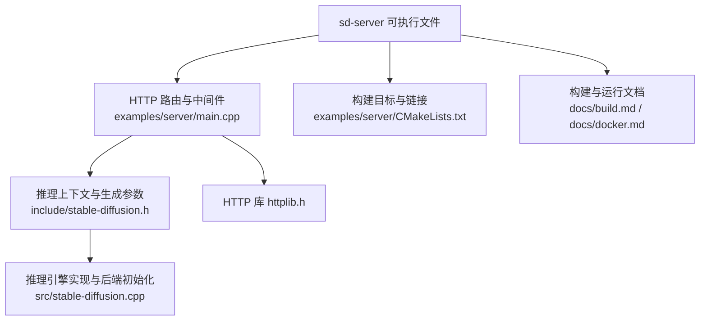
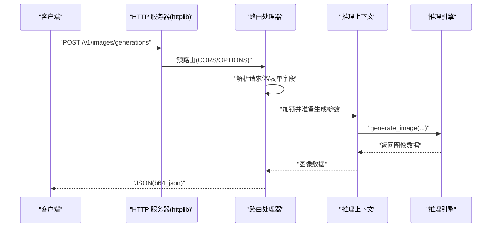
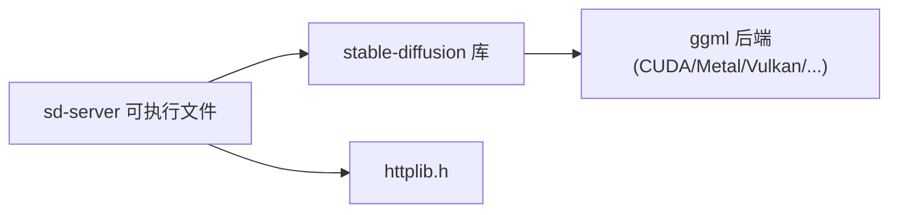

# 服务器配置与部署

<cite>
**本文引用的文件**
- [examples/server/main.cpp](file://examples/server/main.cpp)
- [examples/server/README.md](file://examples/server/README.md)
- [examples/server/CMakeLists.txt](file://examples/server/CMakeLists.txt)
- [include/stable-diffusion.h](file://include/stable-diffusion.h)
- [src/stable-diffusion.cpp](file://src/stable-diffusion.cpp)
- [thirdparty/httplib.h](file://thirdparty/httplib.h)
- [docs/performance.md](file://docs/performance.md)
- [docs/build.md](file://docs/build.md)
- [docs/docker.md](file://docs/docker.md)
- [Dockerfile](file://Dockerfile)
- [Dockerfile.vulkan](file://Dockerfile.vulkan)
</cite>

## 目录
1. [简介](#简介)
2. [项目结构](#项目结构)
3. [核心组件](#核心组件)
4. [架构总览](#架构总览)
5. [详细组件分析](#详细组件分析)
6. [依赖关系分析](#依赖关系分析)
7. [性能考量](#性能考量)
8. [故障排查指南](#故障排查指南)
9. [结论](#结论)
10. [附录](#附录)

## 简介
本指南面向在生产环境中部署与运维 stable-diffusion.cpp 的 sd-server 可执行文件，覆盖以下主题：
- 部署步骤与构建方式（含 Docker）
- 启动参数与配置项详解
- HTTP API 接口与访问控制
- 多实例部署、负载均衡与高可用策略
- 性能调优、内存管理与并发处理
- 日志配置、监控指标与健康检查
- 安全配置与资源限制建议

## 项目结构
sd-server 是基于示例工程编译出的 HTTP 服务，核心由以下部分组成：
- 服务器入口与路由：examples/server/main.cpp
- 参数解析与默认生成参数：examples/server/README.md
- 构建目标与链接：examples/server/CMakeLists.txt
- 核心推理接口定义：include/stable-diffusion.h
- 推理引擎实现与后端选择：src/stable-diffusion.cpp
- HTTP 服务器库：thirdparty/httplib.h
- 文档与构建脚本：docs/*.md、Dockerfile、Dockerfile.vulkan

**图表来源**
- [examples/server/main.cpp](file://examples/server/main.cpp)
- [include/stable-diffusion.h](file://include/stable-diffusion.h)
- [src/stable-diffusion.cpp](file://src/stable-diffusion.cpp)
- [thirdparty/httplib.h](file://thirdparty/httplib.h)
- [examples/server/CMakeLists.txt](file://examples/server/CMakeLists.txt)
- [docs/build.md](file://docs/build.md)
- [docs/docker.md](file://docs/docker.md)

**章节来源**
- [examples/server/main.cpp](file://examples/server/main.cpp)
- [examples/server/README.md](file://examples/server/README.md)
- [examples/server/CMakeLists.txt](file://examples/server/CMakeLists.txt)
- [include/stable-diffusion.h](file://include/stable-diffusion.h)
- [src/stable-diffusion.cpp](file://src/stable-diffusion.cpp)
- [thirdparty/httplib.h](file://thirdparty/httplib.h)
- [docs/build.md](file://docs/build.md)
- [docs/docker.md](file://docs/docker.md)

## 核心组件
- HTTP 服务器与路由
  - 使用 httplib::Server 提供根路径、模型列表、图像生成与编辑等接口。
  - 支持预路由处理以统一设置跨域头与 OPTIONS 预检。
- 推理上下文与生成参数
  - 通过 SDContextParams、SDGenerationParams 等参数对象控制模型加载、采样器、调度器、LoRA、VAE 切片等。
- 推理引擎与后端
  - StableDiffusionGGML 类负责后端初始化（如 CUDA/Metal/Vulkan 等）、权重卸载到 CPU、VAE 切片等。
- 构建与运行
  - CMake 目标 sd-server 链接 stable-diffusion 库与线程库；Dockerfile 提供容器化构建与运行。

**章节来源**
- [examples/server/main.cpp](file://examples/server/main.cpp)
- [include/stable-diffusion.h](file://include/stable-diffusion.h)
- [src/stable-diffusion.cpp](file://src/stable-diffusion.cpp)
- [examples/server/CMakeLists.txt](file://examples/server/CMakeLists.txt)

## 架构总览
sd-server 的请求处理链路如下：
- 客户端请求到达 HTTP 服务器
- 预路由中间件设置 CORS 并处理 OPTIONS
- 路由处理器解析请求体/表单字段，构造生成参数
- 在互斥锁保护下调用推理接口生成图像
- 将结果编码为 base64 并返回 JSON

**图表来源**
- [examples/server/main.cpp](file://examples/server/main.cpp)
- [thirdparty/httplib.h](file://thirdparty/httplib.h)

## 详细组件分析

### HTTP API 与访问控制
- 路由与方法
  - GET /：返回服务状态或指定 HTML 文件内容
  - GET /v1/models：返回最小化的模型列表
  - POST /v1/images/generations：根据提示词生成图像
  - POST /v1/images/edits：支持多图上传与遮罩的图像编辑
- 访问控制
  - 预路由中间件统一设置 Access-Control-Allow-* 头，允许跨域请求；对 OPTIONS 方法直接返回 204。
- 请求与响应
  - 生成接口支持输出格式（png/jpeg）、压缩质量、尺寸（size WxH）与批量数量（n），并在成功时返回包含 base64 编码图像的 JSON。
  - 编辑接口支持 multipart/form-data，支持 image[]、mask、n、size、output_format、output_compression 等字段。

**章节来源**
- [examples/server/main.cpp](file://examples/server/main.cpp)

### 启动参数与配置项
- 服务器参数（Svr Options）
  - --listen-ip/-l：监听地址，默认 127.0.0.1
  - --listen-port：监听端口，默认 1234
  - --serve-html-path：根路径返回的 HTML 文件路径（可选）
  - --verbose/-v：打印额外信息
  - --color：按日志级别着色
- 上下文参数（Context Options）
  - 模型路径：--model、--clip_l、--clip_g、--clip_vision、--t5xxl、--llm、--llm_vision、--diffusion-model、--high-noise-diffusion-model、--vae、--taesd/--tae、--control-net、--photo-maker、--upscale-model
  - LoRA：--lora-model-dir、--lora-apply-mode
  - 线程：--threads
  - VAE 切片：--vae-tiling、--vae-tile-size、--vae-relative-tile-size、--vae-tile-overlap、--force-sdxl-vae-conv-scale
  - 低显存策略：--offload-to-cpu、--clip-on-cpu、--vae-on-cpu、--control-net-cpu
  - 注意力优化：--fa、--diffusion-fa、--diffusion-conv-direct、--vae-conv-direct
  - 循环边界：--circular、--circularx、--circulary
  - 其他：--tensor-type-rules、--chroma-*、--qwen-image-zero-cond-t、--prediction、--rng/--sampler-rng、--type
- 默认生成参数（Default Generation Options）
  - 提示词：--prompt/-p、--negative-prompt/-n
  - 输入图：--init-img、--end-img、--mask、--control-image、--control-video
  - 尺寸与步数：--height/-H、--width/-W、--steps/-b、--high-noise-steps
  - 引导尺度：--cfg-scale、--img-cfg-scale、--guidance、--slg-scale、--skip-layer-start、--skip-layer-end、--high-noise-*
  - 采样与调度：--sampling-method、--high-noise-sampling-method、--scheduler、--sigmas
  - 视频/放大：--video-frames、--fps、--upscale-repeats、--upscale-tile-size
  - 其他：--strength、--control-strength、--pm-style-strength、--pm-id-images-dir、--pm-id-embed-path、--cache-mode、--cache-option、--cache-preset、--scm-mask、--scm-policy

**章节来源**
- [examples/server/README.md](file://examples/server/README.md)
- [examples/server/main.cpp](file://examples/server/main.cpp)

### 推理上下文与后端初始化
- 后端选择与初始化
  - 支持 CUDA、Metal、Vulkan 等后端；可通过环境变量或编译选项启用。
- 内存与显存优化
  - VAE 切片：tile size/relative tile size/overlap
  - 权重卸载到 CPU：--offload-to-cpu
  - 量化类型：--type
- 线程与并发
  - --threads 控制推理线程数；默认使用物理核数（<=0 时）

**章节来源**
- [src/stable-diffusion.cpp](file://src/stable-diffusion.cpp)
- [include/stable-diffusion.h](file://include/stable-diffusion.h)
- [examples/server/README.md](file://examples/server/README.md)

### 构建与运行
- 本地构建
  - CPU：CMake + 编译器
  - CUDA：-DSD_CUDA=ON
  - HIP/ROCm：-DSD_HIPBLAS=ON
  - Metal：-DSD_METAL=ON
  - Vulkan：-DSD_VULKAN=ON
  - SYCL：-DSD_SYCL=ON
  - MUSA：-DSD_MUSA=ON
- Docker
  - 基础镜像：Ubuntu，安装构建工具与依赖
  - 运行镜像：仅包含 /sd-cli 与 /sd-server
  - 提供 Vulkan 变体 Dockerfile

**章节来源**
- [docs/build.md](file://docs/build.md)
- [Dockerfile](file://Dockerfile)
- [Dockerfile.vulkan](file://Dockerfile.vulkan)
- [docs/docker.md](file://docs/docker.md)

## 依赖关系分析
- sd-server 依赖 stable-diffusion 库与线程库
- 推理引擎依赖 ggml 后端（CUDA/Metal/Vulkan 等）与相关设备驱动
- HTTP 服务器依赖第三方 httplib.h

**图表来源**
- [examples/server/CMakeLists.txt](file://examples/server/CMakeLists.txt)
- [src/stable-diffusion.cpp](file://src/stable-diffusion.cpp)
- [thirdparty/httplib.h](file://thirdparty/httplib.h)

**章节来源**
- [examples/server/CMakeLists.txt](file://examples/server/CMakeLists.txt)
- [src/stable-diffusion.cpp](file://src/stable-diffusion.cpp)
- [thirdparty/httplib.h](file://thirdparty/httplib.h)

## 性能考量
- 闪存注意力（Flash Attention）
  - --diffusion-fa 或 --fa 可降低显存占用，加速 CUDA 后端；需满足模型与后端支持条件。
- 权重卸载到 CPU
  - --offload-to-cpu 在不牺牲速度的前提下节省显存。
- 量化与类型
  - --type 指定权重类型（如 q4_0、q4_1、q5_0、q5_1、q8_0 等）以减少内存占用。
- VAE 切片
  - --vae-tiling、--vae-tile-size、--vae-relative-tile-size、--vae-tile-overlap 降低显存峰值。
- 线程与采样器
  - --threads 控制线程数；合理选择采样器与调度器可提升稳定性与速度。
- 环境变量
  - Vulkan 设备选择：SD_VK_DEVICE

**章节来源**
- [docs/performance.md](file://docs/performance.md)
- [examples/server/README.md](file://examples/server/README.md)
- [src/stable-diffusion.cpp](file://src/stable-diffusion.cpp)

## 故障排查指南
- 常见错误与定位
  - 空请求体：生成接口返回 400，提示 empty body
  - 缺少 prompt：返回 400，提示 prompt required
  - 输出格式非法：返回 400，提示 invalid output_format
  - 参数校验失败：返回 400，提示 invalid params
  - 服务器内部异常：返回 500，包含 error 与 message 字段
- 日志与调试
  - --verbose 打印额外信息；--color 按日志级别着色
  - sd_set_log_callback 设置回调，统一输出日志
- 资源与并发
  - 若出现 OOM，优先尝试 --offload-to-cpu、--vae-tiling、--type 量化与降低分辨率
  - 合理设置 --threads，避免过度竞争 CPU/GPU 资源

**章节来源**
- [examples/server/main.cpp](file://examples/server/main.cpp)

## 结论
sd-server 提供了开箱即用的 HTTP 接口与丰富的配置项，结合多种后端与优化手段，可在不同硬件环境下实现高效稳定的图像生成服务。生产部署建议配合容器化、反向代理与负载均衡，并依据业务场景调整并发、内存与采样策略。

## 附录

### 多实例部署、负载均衡与高可用
- 多实例
  - 同一主机上启动多个 sd-server 实例，绑定不同 --listen-port
  - 使用 systemd 或容器编排工具管理进程生命周期
- 负载均衡
  - 使用反向代理（如 Nginx、HAProxy）分发请求至多个实例
  - 健康检查：GET /（或自定义健康端点），期望 200
- 高可用
  - 健康探针 + 自动重启策略
  - 配置只读共享模型目录，避免重复加载

[本节为通用实践建议，不直接分析具体文件，故无“章节来源”]

### 安全配置与资源限制
- 网络安全
  - 限制 --listen-ip 为内网地址或仅本地回环，必要时通过反向代理暴露
  - 使用 HTTPS（在反向代理层终止 TLS），并配置强密码与证书轮换
- 访问控制
  - 在反向代理层启用认证与速率限制
  - 严格限制上传文件大小与类型（multipart/form-data）
- 资源限制
  - Docker：--memory、--cpus、ulimit
  - Kubernetes：requests/limits、PodDisruptionBudget
  - 后端资源：Vulkan 设备选择（SD_VK_DEVICE）、GPU 驱动版本兼容性

[本节为通用实践建议，不直接分析具体文件，故无“章节来源”]