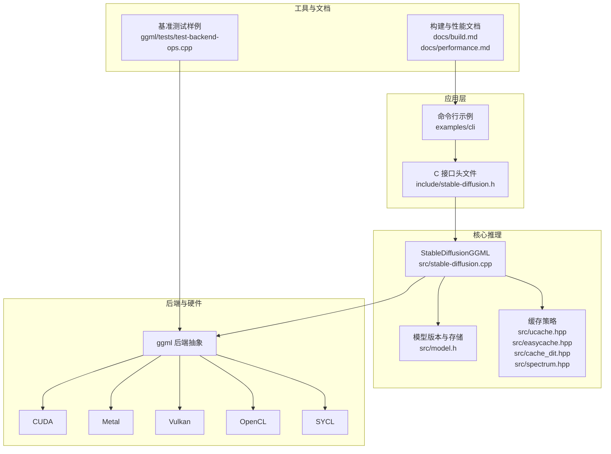
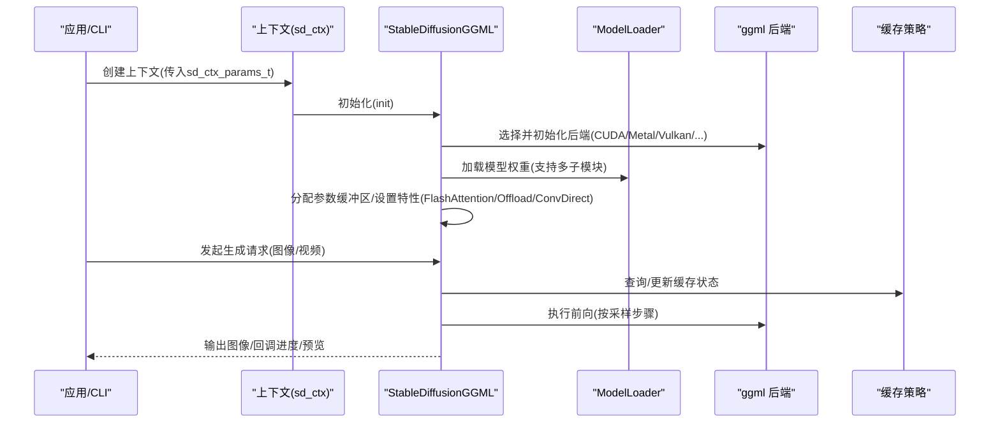
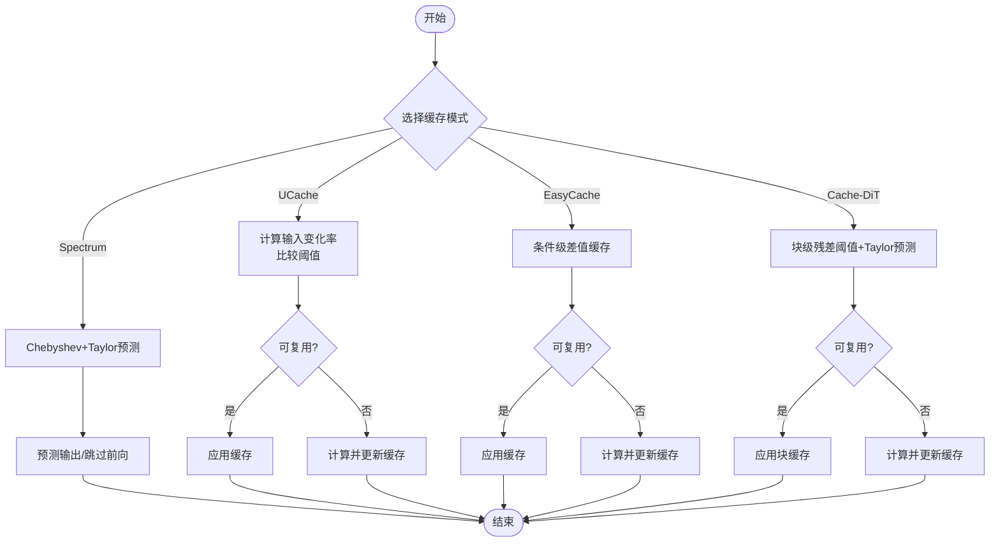
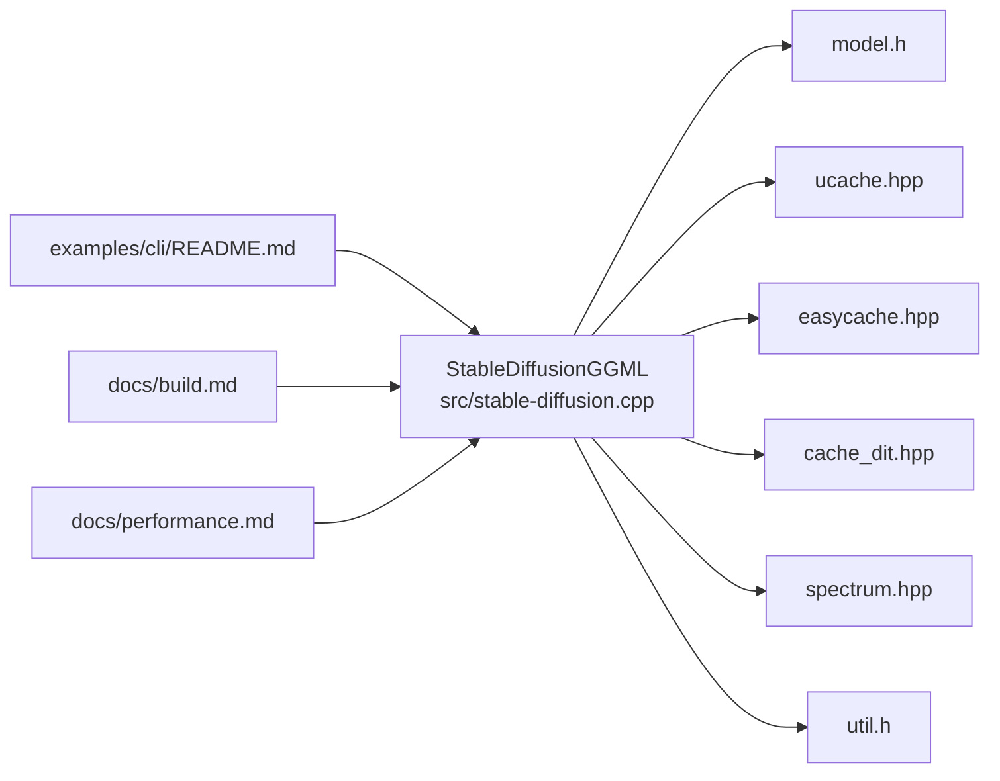

# 生产环境优化

<cite>
**本文引用的文件**
- [README.md](file://README.md)
- [docs/performance.md](file://docs/performance.md)
- [docs/caching.md](file://docs/caching.md)
- [docs/quantization_and_gguf.md](file://docs/quantization_and_gguf.md)
- [src/stable-diffusion.cpp](file://src/stable-diffusion.cpp)
- [src/model.h](file://src/model.h)
- [src/cache_dit.hpp](file://src/cache_dit.hpp)
- [src/easycache.hpp](file://src/easycache.hpp)
- [src/spectrum.hpp](file://src/spectrum.hpp)
- [src/ucache.hpp](file://src/ucache.hpp)
- [include/stable-diffusion.h](file://include/stable-diffusion.h)
- [examples/cli/README.md](file://examples/cli/README.md)
- [docs/build.md](file://docs/build.md)
- [src/util.h](file://src/util.h)
- [ggml/src/ggml-vulkan/ggml-vulkan.cpp](file://ggml/src/ggml-vulkan/ggml-vulkan.cpp)
- [ggml/tests/test-backend-ops.cpp](file://ggml/tests/test-backend-ops.cpp)
- [ggml/src/ggml-alloc.c](file://ggml/src/ggml-alloc.c)
</cite>

## 目录
1. [引言](#引言)
2. [项目结构](#项目结构)
3. [核心组件](#核心组件)
4. [架构总览](#架构总览)
5. [详细组件分析](#详细组件分析)
6. [依赖关系分析](#依赖关系分析)
7. [性能考量与优化建议](#性能考量与优化建议)
8. [故障排查指南](#故障排查指南)
9. [结论](#结论)
10. [附录](#附录)

## 引言
本指南面向在生产环境中部署与运行 stable-diffusion.cpp 的工程团队，围绕内存管理、模型缓存、量化与权重格式、批处理与并行、硬件后端性能调优、资源监控与基准测试、瓶颈分析、自动扩缩容与故障转移、灾难恢复以及容量规划与成本优化、SLA 保障等方面，提供系统化落地建议。内容基于仓库中的实现与文档，结合实际工程实践进行提炼与扩展。

## 项目结构
项目采用模块化设计：核心推理引擎以 ggml 为后端抽象，按模型类型（UNet/Flux/MMDiT 等）拆分组件；通过统一的上下文参数与回调接口对外提供能力；CLI 示例展示典型使用方式；文档覆盖构建、性能、缓存、量化等主题。

图示来源
- [src/stable-diffusion.cpp](file://src/stable-diffusion.cpp)
- [src/model.h](file://src/model.h)
- [src/cache_dit.hpp](file://src/cache_dit.hpp)
- [src/easycache.hpp](file://src/easycache.hpp)
- [src/spectrum.hpp](file://src/spectrum.hpp)
- [src/ucache.hpp](file://src/ucache.hpp)
- [include/stable-diffusion.h](file://include/stable-diffusion.h)
- [docs/build.md](file://docs/build.md)
- [docs/performance.md](file://docs/performance.md)
- [ggml/tests/test-backend-ops.cpp](file://ggml/tests/test-backend-ops.cpp)

章节来源
- [README.md](file://README.md)
- [docs/build.md](file://docs/build.md)

## 核心组件
- 上下文与参数：通过 sd_ctx_params_t 统一承载模型路径、线程数、随机数生成器类型、是否启用 Flash Attention、是否将权重卸载到 CPU、是否内存映射、是否保持某些子模块在 CPU、卷积直接路径、循环卷积、预测类型、LoRA 应用模式等关键开关与参数。
- 模型加载与版本识别：ModelLoader 负责从 ckpt/safetensors/GGUF/diffusers 等格式加载权重，识别模型版本，并统计各张量类型分布，支持按需覆盖权重精度。
- 缓存策略：提供 UCache（UNet）、EasyCache（DiT 条件级）、Cache-DiT（块级 + Taylor 预测）、Spectrum（Chebyshev+Taylor 预测）等多种缓存模式，支持阈值、起止百分比、预热步数、连续缓存上限、累积误差等参数。
- 硬件后端：通过 ggml 后端初始化选择 CUDA/Metal/Vulkan/OpenCL/SYCL/CPU，支持设备选择（如 Vulkan 设备索引）与回退逻辑。
- CLI 与参数：CLI 文档列出常用参数，包括缓存模式与选项、Flash Attention、VAE 并行瓦片、Offload 到 CPU、LoRA 应用时机等。

章节来源
- [include/stable-diffusion.h](file://include/stable-diffusion.h)
- [src/stable-diffusion.cpp](file://src/stable-diffusion.cpp)
- [src/model.h](file://src/model.h)
- [docs/caching.md](file://docs/caching.md)
- [examples/cli/README.md](file://examples/cli/README.md)

## 架构总览
推理流程自上而下：应用层通过 C 接口或 CLI 提交请求；上下文初始化时根据参数选择后端、加载模型、分配参数缓冲区；推理阶段按采样步骤迭代，结合缓存策略减少重复计算；最终输出图像并通过回调上报进度与预览帧。

图示来源
- [src/stable-diffusion.cpp](file://src/stable-diffusion.cpp)
- [include/stable-diffusion.h](file://include/stable-diffusion.h)
- [src/cache_dit.hpp](file://src/cache_dit.hpp)
- [src/easycache.hpp](file://src/easycache.hpp)
- [src/spectrum.hpp](file://src/spectrum.hpp)
- [src/ucache.hpp](file://src/ucache.hpp)

## 详细组件分析

### 内存管理策略
- 权重卸载到 CPU：通过 offload_params_to_cpu 在初始化时将权重放置于主机内存，按需加载到设备显存，显著降低峰值显存占用，适合显存紧张场景。
- Flash Attention：在扩散模型中启用可减少计算缓冲区大小，部分后端（如 CUDA）同时提升速度；需注意对不同模型与后端效果差异。
- VAE 瓦片化：通过 vae_tiling_params 控制瓦片尺寸与重叠比例，降低显存占用，适用于高分辨率生成。
- 参数缓冲区分配：模型初始化时为各子模块分配参数缓冲区，支持 Conv2d 直通路径以减少中间拷贝。
- 内存映射：enable_mmap 可开启模型文件内存映射，降低常驻内存压力。

章节来源
- [src/stable-diffusion.cpp](file://src/stable-diffusion.cpp)
- [docs/performance.md](file://docs/performance.md)
- [include/stable-diffusion.h](file://include/stable-diffusion.h)

### 模型缓存机制
- UCache（UNet）：基于残差差值与相对变换率的条件级缓存，支持自适应阈值、误差衰减、重算重置策略，适合 UNet 流程。
- EasyCache（DiT）：按条件对象缓存输入-输出差值，在激活区间内比较输入变化幅度决定复用。
- Cache-DiT：块级缓存（DBCache）+ 泰勒预测（TaylorSeer），支持前后若干块固定计算、阈值、预热步数、SCM 步骤掩码与策略、预设（slow/medium/fast/ultra）。
- Spectrum：针对 UNet 的 Chebyshev+Taylor 预测，通过窗口与多项式拟合跳过若干前向计算，适合长步数采样。

图示来源
- [src/ucache.hpp](file://src/ucache.hpp)
- [src/easycache.hpp](file://src/easycache.hpp)
- [src/cache_dit.hpp](file://src/cache_dit.hpp)
- [src/spectrum.hpp](file://src/spectrum.hpp)
- [docs/caching.md](file://docs/caching.md)

章节来源
- [src/ucache.hpp](file://src/ucache.hpp)
- [src/easycache.hpp](file://src/easycache.hpp)
- [src/cache_dit.hpp](file://src/cache_dit.hpp)
- [src/spectrum.hpp](file://src/spectrum.hpp)
- [docs/caching.md](file://docs/caching.md)

### 量化技术与权重格式
- 支持的权重类型：f32/f16/q8_0/q5_0/q5_1/q4_0/q4_1 等整数量化与混合精度；可通过 --type 或转换工具指定输出类型。
- GGUF 转换：提供 convert 命令将 ckpt/safetensors/diffusers 转为 GGUF 并完成量化，避免每次加载时重复量化，缩短启动时间。
- 性能与内存权衡：文档给出不同精度在特定分辨率下的内存估算，便于容量规划与选择。

章节来源
- [docs/quantization_and_gguf.md](file://docs/quantization_and_gguf.md)
- [include/stable-diffusion.h](file://include/stable-diffusion.h)

### 批处理与并行计算配置
- 线程数：n_threads 控制推理期间的线程数；CLI 默认使用物理核数，可根据 CPU/NUMA 结构与任务并发度调整。
- 后端并行：CUDA/Metal/Vulkan/OpenCL/SYCL 等后端具备各自的并行调度与队列机制，建议结合硬件能力与队列深度调优。
- 卷积直通路径：diffusion_conv_direct/vae_conv_direct 可减少中间张量拷贝，提高吞吐。
- 循环卷积：circular_x/circular_y 启用 RoPE 圆形包裹，改善周期性纹理生成质量。

章节来源
- [include/stable-diffusion.h](file://include/stable-diffusion.h)
- [src/stable-diffusion.cpp](file://src/stable-diffusion.cpp)
- [examples/cli/README.md](file://examples/cli/README.md)

### 硬件后端性能调优方案
- CUDA：推荐启用 Flash Attention 与合适的线程数；确保驱动与 CUDA 版本匹配；关注显存峰值与带宽利用率。
- Metal：当前对大矩阵效率较低，建议谨慎用于生产；可配合小批量与低分辨率验证。
- Vulkan：支持多设备选择（SD_VK_DEVICE），建议优先选择高性能离散显卡；可打印内部计时日志辅助定位热点。
- OpenCL：主要面向 Adreno GPU，建议使用 Q4_0 类型量化；Android/ARM64 构建需准备 ICD 与头文件。
- SYCL：Intel GPU 推荐使用 FP32；需正确配置 oneAPI 环境变量与编译器。

章节来源
- [docs/build.md](file://docs/build.md)
- [src/stable-diffusion.cpp](file://src/stable-diffusion.cpp)
- [ggml/src/ggml-vulkan/ggml-vulkan.cpp](file://ggml/src/ggml-vulkan/ggml-vulkan.cpp)

### 资源监控与性能基准测试
- 进度与预览回调：通过回调函数上报每步耗时、预览帧等，便于前端展示与指标采集。
- 后端基准测试：参考 ggml 的 test-backend-ops，支持多种输出格式（控制台/CSV/SQL），记录运行次数、平均耗时、FLOPs、带宽、内存占用等，可用于跨后端对比。
- Vulkan 计时日志：可周期性打印各算子耗时与 GFLOPS，辅助热点定位。

章节来源
- [include/stable-diffusion.h](file://include/stable-diffusion.h)
- [ggml/tests/test-backend-ops.cpp](file://ggml/tests/test-backend-ops.cpp)
- [ggml/src/ggml-vulkan/ggml-vulkan.cpp](file://ggml/src/ggml-vulkan/ggml-vulkan.cpp)

### 瓶颈分析方法
- 步骤级日志：结合进度回调与后端计时，定位耗时集中在哪些采样步骤。
- 算子级剖析：利用 Vulkan/GGML 后端计时与 FLOPs 统计，识别高复杂度算子（如注意力、卷积）。
- 内存与带宽：通过 mmap、offload、瓦片化与 Flash Attention 的组合，观察显存峰值与带宽占用变化。
- 缓存命中率：关注缓存策略日志（如 CacheDIT/UCache 的统计），评估阈值与预热参数对吞吐的影响。

章节来源
- [src/cache_dit.hpp](file://src/cache_dit.hpp)
- [src/ucache.hpp](file://src/ucache.hpp)
- [ggml/src/ggml-vulkan/ggml-vulkan.cpp](file://ggml/src/ggml-vulkan/ggml-vulkan.cpp)
- [ggml/tests/test-backend-ops.cpp](file://ggml/tests/test-backend-ops.cpp)

### 自动扩缩容、故障转移与灾难恢复
- 扩缩容：依据请求 QPS 与后端利用率动态增减实例；结合 GPU/内存指标设定阈值，使用容器编排平台的 HPA/HPA-like 机制。
- 故障转移：当某节点显存不足或后端异常时，将流量切换至其他健康节点；建议启用权重卸载与模型预热，缩短切换时间。
- 灾难恢复：定期备份 GGUF 模型与关键配置；在多可用区部署，结合只读副本与异地复制，确保快速恢复。

（本节为通用工程实践建议，不直接分析具体代码文件）

### 容量规划、成本优化与 SLA 保障
- 容量规划：结合模型类型、分辨率、采样步数、缓存策略与后端类型，估算峰值显存与吞吐；使用基准测试数据与历史业务曲线推导所需实例数。
- 成本优化：优先选择性价比高的后端（如 CUDA），合理使用量化与 Flash Attention；在低峰期释放实例，高峰期弹性扩容。
- SLA 保障：设置端到端延迟与成功率阈值；对关键路径（解码、扩散主干）进行缓存与预热；建立告警与自动恢复机制。

（本节为通用工程实践建议，不直接分析具体代码文件）

## 依赖关系分析

图示来源
- [src/stable-diffusion.cpp](file://src/stable-diffusion.cpp)
- [src/model.h](file://src/model.h)
- [src/ucache.hpp](file://src/ucache.hpp)
- [src/easycache.hpp](file://src/easycache.hpp)
- [src/cache_dit.hpp](file://src/cache_dit.hpp)
- [src/spectrum.hpp](file://src/spectrum.hpp)
- [src/util.h](file://src/util.h)
- [docs/build.md](file://docs/build.md)
- [docs/performance.md](file://docs/performance.md)
- [examples/cli/README.md](file://examples/cli/README.md)

章节来源
- [src/stable-diffusion.cpp](file://src/stable-diffusion.cpp)
- [src/model.h](file://src/model.h)
- [src/ucache.hpp](file://src/ucache.hpp)
- [src/easycache.hpp](file://src/easycache.hpp)
- [src/cache_dit.hpp](file://src/cache_dit.hpp)
- [src/spectrum.hpp](file://src/spectrum.hpp)
- [src/util.h](file://src/util.h)
- [docs/build.md](file://docs/build.md)
- [docs/performance.md](file://docs/performance.md)
- [examples/cli/README.md](file://examples/cli/README.md)

## 性能考量与优化建议
- 优先启用 Flash Attention（若后端支持且模型兼容），并结合 offload_to_cpu 降低显存峰值。
- 对 DiT 模型优先尝试 Cache-DiT（含 DBCache 与 TaylorSeer），并根据业务步数选择合适预设；对 UNet 可考虑 Spectrum。
- 使用 GGUF 量化与转换，减少首次加载耗时；在高并发场景下预热关键模型。
- 合理设置 n_threads 与后端队列深度；对 CUDA/Metal/Vulkan/SYCL 等后端分别进行基准测试，选择最优组合。
- 利用瓦片化与循环卷积提升高分辨率与周期性纹理生成质量；必要时启用 Conv2d 直通路径减少拷贝。

（本节为通用优化建议，不直接分析具体代码文件）

## 故障排查指南
- 后端初始化失败：检查构建选项与运行环境（驱动/SDK/库版本），查看回退日志；对 Vulkan 可通过 SD_VK_DEVICE 指定设备。
- 显存不足：启用 offload_to_cpu、启用 Flash Attention、启用 VAE 瓦片化、降低分辨率或步数。
- 生成质量异常：检查缓存阈值与预热步数设置；对 Chroma/Flux 等特殊模型，确认掩码与参数一致性。
- 性能异常：使用回调与后端计时日志定位热点；对比不同后端与量化精度；检查 mmap 与内存映射权限。

章节来源
- [src/stable-diffusion.cpp](file://src/stable-diffusion.cpp)
- [ggml/src/ggml-vulkan/ggml-vulkan.cpp](file://ggml/src/ggml-vulkan/ggml-vulkan.cpp)
- [docs/performance.md](file://docs/performance.md)

## 结论
通过合理的内存管理（卸载、Flash Attention、瓦片化）、多策略缓存（UCache/EasyCache/Cache-DiT/Spectrum）、量化与 GGUF 转换、批处理与并行配置、以及针对 CUDA/Metal/Vulkan/OpenCL/SYCL 的后端调优，可在生产环境中获得稳定的吞吐与更低的成本。结合资源监控、基准测试与瓶颈分析，持续迭代参数与部署策略，可进一步提升 SLA 与可靠性。

## 附录
- 关键参数速查：见 CLI 文档与 C 接口头文件，涵盖缓存模式、阈值、预热、瓦片化、Offload、LoRA 应用时机等。
- 构建与后端：参考构建文档，按需启用 CUDA/Metal/Vulkan/OpenCL/SYCL 等后端。

章节来源
- [examples/cli/README.md](file://examples/cli/README.md)
- [include/stable-diffusion.h](file://include/stable-diffusion.h)
- [docs/build.md](file://docs/build.md)