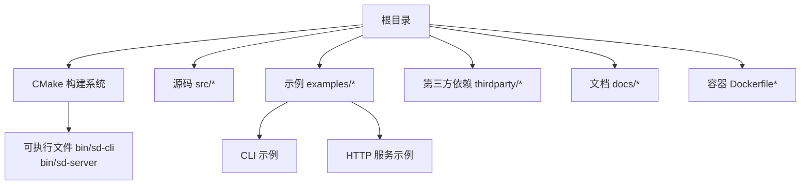
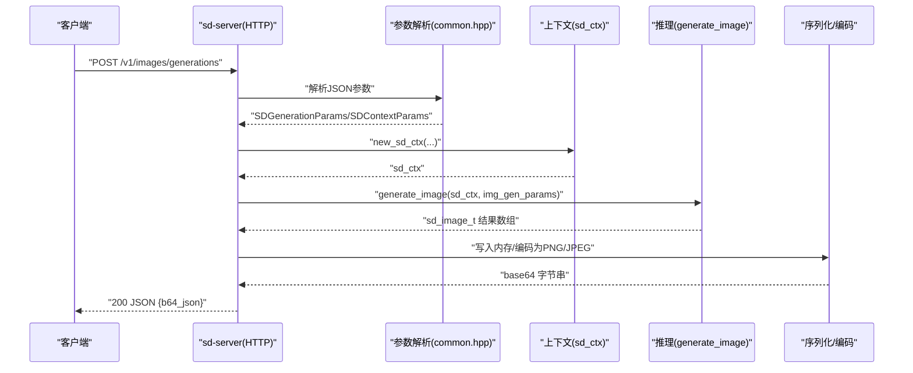
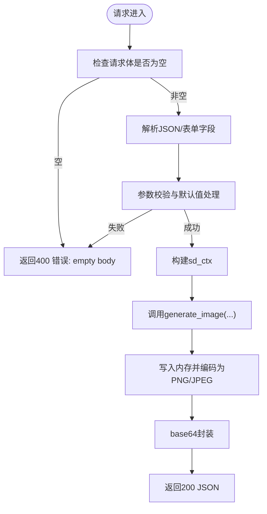
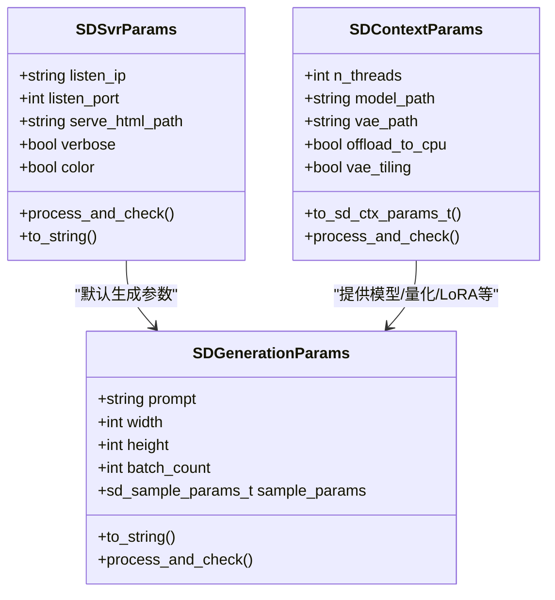
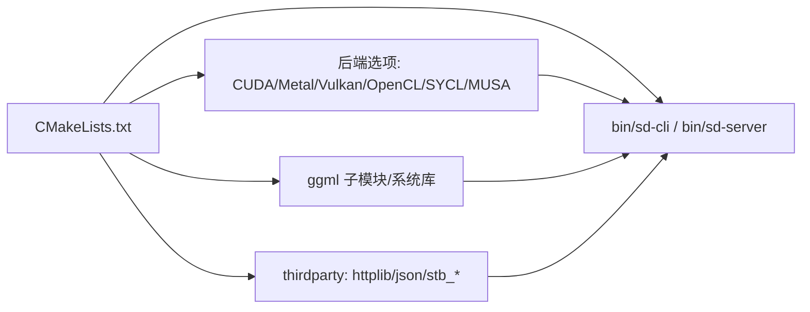

# 部署指南

<cite>
**本文引用的文件**
- [README.md](file://README.md)
- [Dockerfile](file://Dockerfile)
- [Dockerfile.vulkan](file://Dockerfile.vulkan)
- [Dockerfile.sycl](file://Dockerfile.sycl)
- [docs/docker.md](file://docs/docker.md)
- [docs/build.md](file://docs/build.md)
- [docs/performance.md](file://docs/performance.md)
- [docs/caching.md](file://docs/caching.md)
- [CMakeLists.txt](file://CMakeLists.txt)
- [examples/server/main.cpp](file://examples/server/main.cpp)
- [examples/cli/main.cpp](file://examples/cli/main.cpp)
- [examples/common/common.hpp](file://examples/common/common.hpp)
</cite>

## 目录
1. [简介](#简介)
2. [项目结构](#项目结构)
3. [核心组件](#核心组件)
4. [架构总览](#架构总览)
5. [详细组件分析](#详细组件分析)
6. [依赖关系分析](#依赖关系分析)
7. [性能考量](#性能考量)
8. [故障排查指南](#故障排查指南)
9. [结论](#结论)
10. [附录](#附录)

## 简介
本指南面向运维与开发团队，提供稳定扩散.cpp在多平台（Linux、Windows、macOS）的完整部署方案，涵盖容器化（Docker）、服务器配置、生产环境优化、Web服务器集成、API服务部署、批量处理系统配置、负载均衡、监控告警与故障恢复策略，并给出安全配置、访问控制与资源限制的最佳实践。

## 项目结构
该项目采用C/C++实现，基于ggml推理引擎，支持多种后端（CPU、CUDA、Metal、Vulkan、OpenCL、SYCL、MUSA），并通过CMake进行构建管理；示例包含命令行工具与HTTP服务端，便于快速集成到Web或批处理系统中。

图表来源
- [CMakeLists.txt:1-200](file://CMakeLists.txt#L1-L200)
- [examples/server/main.cpp:1-1229](file://examples/server/main.cpp#L1-L1229)
- [examples/cli/main.cpp:1-839](file://examples/cli/main.cpp#L1-L839)

章节来源
- [README.md:1-202](file://README.md#L1-L202)
- [CMakeLists.txt:1-200](file://CMakeLists.txt#L1-L200)

## 核心组件
- 命令行工具（sd-cli）：用于单次生成、视频生成、放大、模型转换等离线任务。
- HTTP服务（sd-server）：提供REST风格API，兼容常见图像生成接口，支持跨域与基础参数校验。
- 参数解析与上下文（common.hpp）：统一的参数解析、日志、线程数、内存映射、量化类型、LoRA与嵌入加载、VAE分块等。
- 构建系统（CMake）：通过选项启用不同后端（CUDA/Metal/Vulkan/OpenCL/SYCL/MUSA），并支持系统级ggml库链接。

章节来源
- [examples/cli/main.cpp:1-839](file://examples/cli/main.cpp#L1-L839)
- [examples/server/main.cpp:1-1229](file://examples/server/main.cpp#L1-L1229)
- [examples/common/common.hpp:1-2149](file://examples/common/common.hpp#L1-L2149)
- [CMakeLists.txt:1-200](file://CMakeLists.txt#L1-L200)

## 架构总览
下图展示从客户端请求到推理完成的整体流程，包括HTTP服务端、参数解析、上下文初始化、模型加载、推理与结果返回。

图表来源
- [examples/server/main.cpp:407-564](file://examples/server/main.cpp#L407-L564)
- [examples/common/common.hpp:1023-1200](file://examples/common/common.hpp#L1023-L1200)

## 详细组件分析

### 组件A：HTTP服务端（sd-server）
- 监听地址与端口：支持通过命令行参数设置监听IP与端口，默认仅本地回环。
- 跨域支持：预路由阶段设置标准CORS头，允许任意来源或自定义来源。
- 根路径：可选提供静态HTML文件，否则返回运行状态文本。
- 模型列表：最小化实现，返回本地可用模型标识。
- 图像生成接口：接收JSON，解析提示词、尺寸、输出格式、压缩率、采样步数等，执行推理并返回base64编码的图像数据。
- 图像编辑接口：支持multipart/form-data，接收图片、掩码、数量、尺寸、输出格式等，执行推理并返回base64编码的图像数据。

图表来源
- [examples/server/main.cpp:364-564](file://examples/server/main.cpp#L364-L564)

章节来源
- [examples/server/main.cpp:97-146](file://examples/server/main.cpp#L97-L146)
- [examples/server/main.cpp:383-406](file://examples/server/main.cpp#L383-L406)
- [examples/server/main.cpp:407-564](file://examples/server/main.cpp#L407-L564)
- [examples/server/main.cpp:566-800](file://examples/server/main.cpp#L566-L800)

### 组件B：参数解析与上下文（common.hpp）
- 参数结构：SDContextParams、SDGenerationParams、SDSvrParams，分别负责模型路径、量化类型、LoRA、嵌入、采样器、VAE分块、缓存策略等。
- 日志系统：统一的日志打印与颜色开关，支持调试级别过滤。
- 线程与内存：自动探测物理核数、VAE分块重叠、内存映射、权重卸载到CPU等。
- 预处理与输出：支持预览回调、图像写入内存、base64编码等。

图表来源
- [examples/common/common.hpp:429-987](file://examples/common/common.hpp#L429-L987)
- [examples/common/common.hpp:1023-1200](file://examples/common/common.hpp#L1023-L1200)

章节来源
- [examples/common/common.hpp:137-207](file://examples/common/common.hpp#L137-L207)
- [examples/common/common.hpp:429-987](file://examples/common/common.hpp#L429-L987)
- [examples/common/common.hpp:1023-1200](file://examples/common/common.hpp#L1023-L1200)

### 组件C：命令行工具（sd-cli）
- 运行模式：图像生成、视频生成、放大、模型转换。
- 输出控制：支持序列化输出、预览图像、帧率、压缩质量等。
- 资源管理：根据模式选择性加载初始/结束图像、参考图像、掩码、控制图像/视频帧等。
- 上采样：可选使用ESRGAN进行放大，支持重复次数与瓦片大小。

章节来源
- [examples/cli/main.cpp:31-226](file://examples/cli/main.cpp#L31-L226)
- [examples/cli/main.cpp:477-839](file://examples/cli/main.cpp#L477-L839)

## 依赖关系分析
- 构建系统通过CMake选项启用不同后端，例如CUDA、Metal、Vulkan、OpenCL、SYCL、MUSA等。
- 默认链接ggml子模块，也可选择使用系统安装的ggml库。
- 示例程序依赖thirdparty中的轻量HTTP库与JSON库，以及STB系列图像处理库。

图表来源
- [CMakeLists.txt:41-85](file://CMakeLists.txt#L41-L85)
- [CMakeLists.txt:165-184](file://CMakeLists.txt#L165-L184)
- [CMakeLists.txt:184-194](file://CMakeLists.txt#L184-L194)

章节来源
- [CMakeLists.txt:1-200](file://CMakeLists.txt#L1-L200)

## 性能考量
- Flash Attention：对扩散模型启用Flash Attention可显著降低显存占用，部分后端同时提升速度；需结合具体模型与后端验证收益。
- 权重卸载：将权重卸载至CPU可节省显存，不影响生成速度。
- 缓存加速：针对UNet与DiT模型提供多种缓存模式（如UCache、EasyCache、DBCache、TaylorSeer、Cache-DIT、Spectrum），通过阈值、起止比例、预设等参数调节缓存策略。
- 分块VAE：开启VAE分块与重叠参数，可在有限显存下生成更大分辨率图像。
- 线程与量化：合理设置线程数与权重类型（如q4_0/q4_1等）以平衡速度与显存占用。

章节来源
- [docs/performance.md:1-26](file://docs/performance.md#L1-L26)
- [docs/caching.md:1-150](file://docs/caching.md#L1-L150)
- [examples/common/common.hpp:567-807](file://examples/common/common.hpp#L567-L807)

## 故障排查指南
- 启动参数错误：服务端会校验监听IP、端口范围、HTML文件存在性；CLI会校验模型路径、线程数、输出路径等。
- 请求参数错误：生成接口要求提示词非空，编辑接口要求至少一张图片，输出格式必须为png或jpeg；超出范围的压缩率会被裁剪。
- 推理失败：检查模型路径、LoRA/嵌入目录、量化类型与后端兼容性；必要时开启VAE分块与权重卸载。
- 日志与颜色：通过verbose与color参数增强调试信息输出。

章节来源
- [examples/server/main.cpp:142-158](file://examples/server/main.cpp#L142-L158)
- [examples/server/main.cpp:416-483](file://examples/server/main.cpp#L416-L483)
- [examples/server/main.cpp:568-670](file://examples/server/main.cpp#L568-L670)
- [examples/common/common.hpp:137-207](file://examples/common/common.hpp#L137-L207)

## 结论
稳定扩散.cpp提供了高性能、低耦合的推理能力与灵活的部署方式。通过Docker容器化、多后端编译、HTTP服务API与丰富的性能优化手段，可在生产环境中实现高可用、可扩展的图像/视频生成服务。建议结合业务场景选择合适的后端与缓存策略，并配合完善的监控与告警体系保障稳定性。

## 附录

### 平台与后端选择
- Linux：推荐使用CUDA（NVIDIA GPU）或Vulkan（跨厂商显卡）；也可使用CPU后端。
- Windows：可使用CUDA或Metal（通过ggml的Metal后端）；ROCm/HIPBLAS亦可按文档构建。
- macOS：Metal后端当前在大矩阵运算上效率较低，建议优先考虑CPU或等待后续优化。
- Android/ARM：OpenCL后端可用于Adreno GPU，需准备NDK与OpenCL依赖。

章节来源
- [docs/build.md:37-174](file://docs/build.md#L37-L174)

### Docker容器化部署
- 使用官方Dockerfile构建镜像，或使用特定后端变体（如Vulkan、SYCL）的Dockerfile。
- CLI运行：挂载模型与输出目录，传入模型路径、提示词、输出路径等参数。
- 服务运行：映射端口，指定入口为sd-server，传入模型路径与监听参数。
- 本地镜像：构建完成后可直接运行本地镜像的CLI或服务。

章节来源
- [Dockerfile:1-23](file://Dockerfile#L1-L23)
- [Dockerfile.vulkan:1-24](file://Dockerfile.vulkan#L1-L24)
- [Dockerfile.sycl:1-21](file://Dockerfile.sycl#L1-L21)
- [docs/docker.md:1-40](file://docs/docker.md#L1-L40)

### Web服务器集成与API服务
- sd-server提供与常见图像生成API兼容的端点，支持跨域与基础参数校验。
- 可在Nginx/Apache前部署反向代理，统一入口与证书管理。
- 建议将sd-server置于独立容器或进程内，结合负载均衡器实现水平扩展。

章节来源
- [examples/server/main.cpp:364-564](file://examples/server/main.cpp#L364-L564)

### 批量处理系统配置
- 使用sd-cli在离线模式下批量生成图像/视频，支持序列化输出与帧率控制。
- 对于大规模任务，建议拆分批次、设置合理的并发度与队列长度，避免显存峰值过高。
- 可结合外部队列（如消息中间件）实现异步生成与结果回传。

章节来源
- [examples/cli/main.cpp:477-839](file://examples/cli/main.cpp#L477-L839)

### 负载均衡、监控告警与故障恢复
- 负载均衡：使用Nginx/HAProxy将请求分发至多个sd-server实例，结合健康检查与会话亲和策略。
- 监控告警：采集CPU/GPU利用率、显存占用、请求延迟、错误率等指标，设置阈值告警。
- 故障恢复：多副本部署与自动重启策略，异常请求快速失败并记录日志，定期备份模型与配置。

[本节为通用实践建议，不直接分析具体文件]

### 安全配置、访问控制与资源限制
- 访问控制：在反向代理层启用认证与速率限制，限制请求体大小与并发连接数。
- 资源限制：通过容器编排设置CPU/内存/显存配额，防止单实例占用过多资源。
- 数据安全：模型与输出目录权限最小化，敏感参数通过环境变量或密钥管理服务注入。

[本节为通用实践建议，不直接分析具体文件]