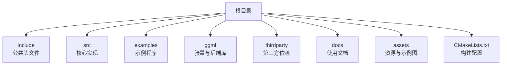
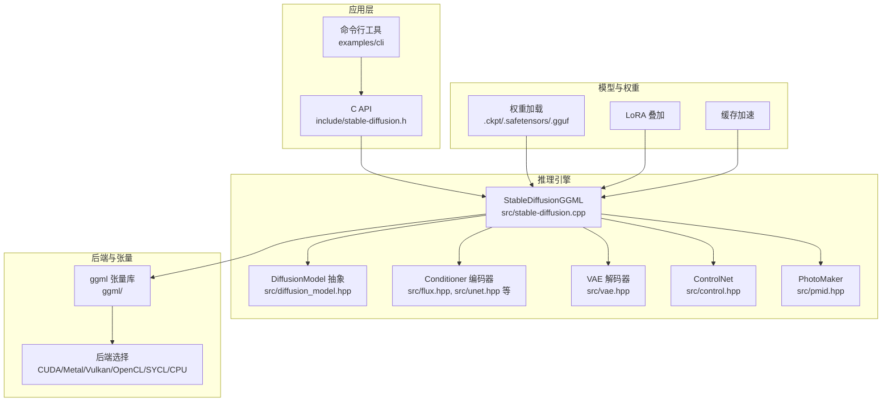
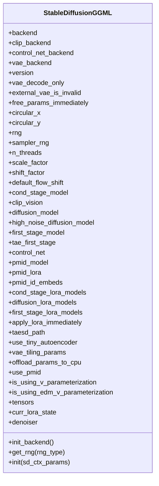
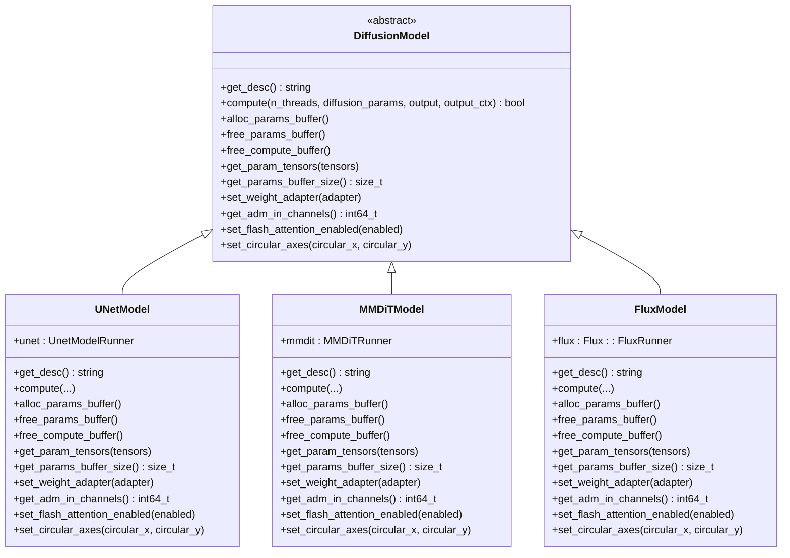
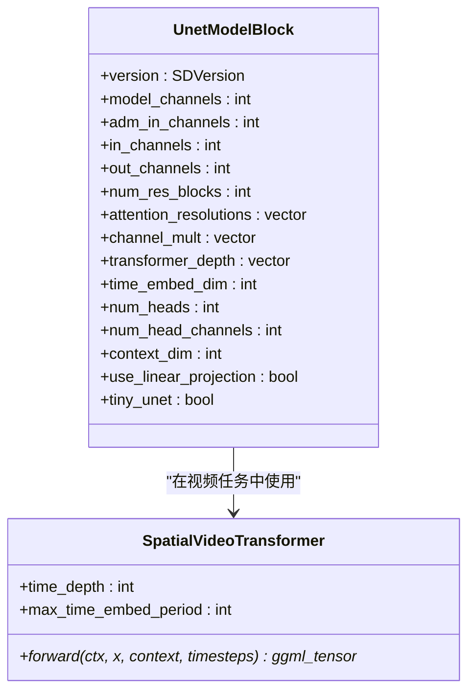
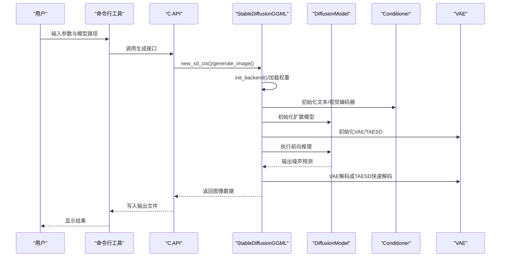
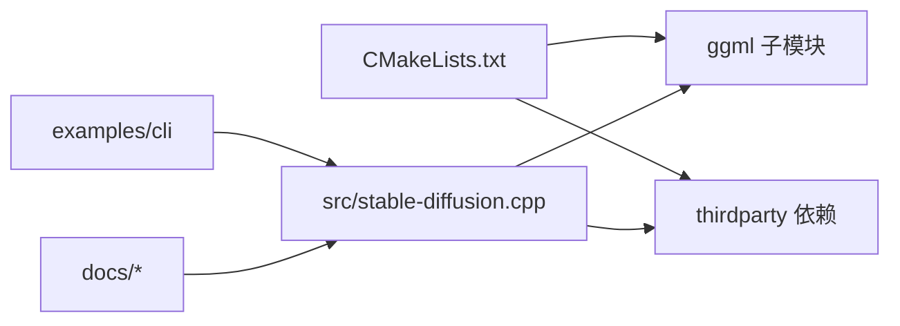

# 项目概述

<cite>
**本文档引用的文件**
- [README.md](file://README.md)
- [stable-diffusion.cpp](file://src/stable-diffusion.cpp)
- [stable-diffusion.h](file://include/stable-diffusion.h)
- [CMakeLists.txt](file://CMakeLists.txt)
- [model.h](file://src/model.h)
- [diffusion_model.hpp](file://src/diffusion_model.hpp)
- [unet.hpp](file://src/unet.hpp)
- [flux.hpp](file://src/flux.hpp)
- [wan.hpp](file://src/wan.hpp)
- [README.md](file://ggml/README.md)
- [README.md](file://docs/build.md)
- [README.md](file://docs/sd.md)
- [README.md](file://docs/flux.md)
- [README.md](file://docs/wan.md)
- [README.md](file://examples/cli/README.md)
</cite>

## 目录
1. [引言](#引言)
2. [项目结构](#项目结构)
3. [核心组件](#核心组件)
4. [架构总览](#架构总览)
5. [详细组件分析](#详细组件分析)
6. [依赖关系分析](#依赖关系分析)
7. [性能考量](#性能考量)
8. [故障排查指南](#故障排查指南)
9. [结论](#结论)
10. [附录](#附录)

## 引言
稳定扩散.cpp是一个以纯C/C++实现的扩散模型推理引擎，基于ggml张量库构建，目标是提供轻量、无外部依赖、跨平台且高性能的图像生成与视频生成能力。项目支持多种主流扩散模型架构（如SD1.x/SD2.x、SDXL、SD3、FLUX系列、Wan系列等），并提供多后端加速（CPU、CUDA、Metal、Vulkan、OpenCL、SYCL等）。其独特优势在于：
- 基于ggml的统一张量抽象与后端适配，实现“一次编写，多后端运行”
- 轻量化设计：无第三方深度学习框架依赖，便于嵌入与部署
- 多样化模型支持：覆盖文本到图像、图像到图像、控制引导、LoRA、TAESD快速解码、ESRGAN超分等生态功能
- 跨平台兼容：Linux、macOS、Windows、Android均有良好支持

项目当前处于活跃开发阶段，API与命令行选项可能频繁调整，建议关注发布说明与变更日志。

**章节来源**
- [README.md:11-14](file://README.md#L11-L14)
- [README.md:39-101](file://README.md#L39-L101)

## 项目结构
项目采用模块化组织方式，核心代码位于src目录，接口头文件位于include目录，示例程序位于examples目录，构建系统通过CMake管理，底层张量计算由ggml子模块提供。



**图表来源**
- [CMakeLists.txt:89-95](file://CMakeLists.txt#L89-L95)
- [CMakeLists.txt:170-184](file://CMakeLists.txt#L170-L184)

**章节来源**
- [CMakeLists.txt:1-200](file://CMakeLists.txt#L1-L200)

## 核心组件
- 推理上下文与参数
  - 公共头文件定义了推理所需的上下文参数结构体、采样参数、缓存参数、LoRA参数等，涵盖模型路径、权重类型、随机数生成器类型、调度器与采样方法、VAE平铺策略、Flash Attention开关、循环卷积等关键配置项。
- 模型版本与架构识别
  - 内置枚举与辅助函数用于识别不同扩散模型版本（SD1.x/SD2.x/SDXL/SD3/FLUX/FLUX.2/Wan/Qwen/Z-Image/Ovis/Anima等），并据此选择对应的编码器、扩散模型、VAE或特殊处理逻辑。
- 后端初始化与选择
  - 构建时通过编译选项启用不同后端（CUDA/Metal/Vulkan/OpenCL/SYCL等），运行时根据环境自动选择可用后端，优先使用GPU后端，否则回退至CPU。
- 扩散模型抽象
  - 抽象出DiffusionModel接口，具体实现包括UNetModel（SD1.x/SD2.x/SDXL）、MMDiTModel（SD3）、FluxModel（FLUX/FLUX.2）、WanModel（Wan系列）、QwenImageModel（Qwen系列）、ZImageModel（Z-Image）、AnimaModel（Anima）等。
- 编码器与VAE
  - 文本编码器支持CLIP（L/G）、T5、LLM（用于FLUX.2/Qwen/Z-Image等），视觉编码器支持FrozenCLIPVisionEmbedder（Wan I2V），VAE支持AutoEncoderKL、TinyAutoEncoder（TAESD）以及WAN专用VAE。
- 辅助功能
  - 支持LoRA叠加、ControlNet、PhotoMaker个性化、TAESD快速解码、ESRGAN超分、VAE平铺降低显存占用、缓存加速（Easycache/UCache/DBCache/TaylorSeer/Cache-DiT/Spectrum等）。

**章节来源**
- [stable-diffusion.h:148-313](file://include/stable-diffusion.h#L148-L313)
- [model.h:23-54](file://src/model.h#L23-L54)
- [model.h:56-174](file://src/model.h#L56-L174)
- [stable-diffusion.cpp:103-226](file://src/stable-diffusion.cpp#L103-L226)
- [diffusion_model.hpp:29-44](file://src/diffusion_model.hpp#L29-L44)

## 架构总览
下图展示了从用户调用到模型推理的整体流程，以及各组件之间的交互关系。



**图表来源**
- [stable-diffusion.cpp:103-226](file://src/stable-diffusion.cpp#L103-L226)
- [diffusion_model.hpp:29-44](file://src/diffusion_model.hpp#L29-L44)
- [flux.hpp:13-200](file://src/flux.hpp#L13-L200)
- [unet.hpp:1-200](file://src/unet.hpp#L1-L200)
- [CMakeLists.txt:45-85](file://CMakeLists.txt#L45-L85)

**章节来源**
- [stable-diffusion.cpp:238-768](file://src/stable-diffusion.cpp#L238-L768)
- [diffusion_model.hpp:46-174](file://src/diffusion_model.hpp#L46-L174)

## 详细组件分析

### 组件A：StableDiffusionGGML 类
该类是推理引擎的核心，负责：
- 初始化后端（CPU/CUDA/Metal/Vulkan/OpenCL/SYCL）
- 加载与解析模型权重（支持多种格式与命名规则）
- 选择并实例化对应版本的编码器、扩散模型、VAE
- 配置随机数生成器、Flash Attention、循环卷积、LoRA应用模式等
- 提供图像/视频生成入口



**图表来源**
- [stable-diffusion.cpp:103-169](file://src/stable-diffusion.cpp#L103-L169)
- [stable-diffusion.cpp:238-401](file://src/stable-diffusion.cpp#L238-L401)

**章节来源**
- [stable-diffusion.cpp:103-226](file://src/stable-diffusion.cpp#L103-L226)
- [stable-diffusion.cpp:238-768](file://src/stable-diffusion.cpp#L238-L768)

### 组件B：DiffusionModel 抽象与实现
DiffusionModel定义了扩散模型的统一接口，具体实现按模型架构分为：
- UNetModel：适用于SD1.x/SD2.x/SDXL
- MMDiTModel：适用于SD3
- FluxModel：适用于FLUX/FLUX.2（含Chroma变体）
- WanModel：适用于Wan系列（含MoE与高噪声分支）
- QwenImageModel/ZImageModel/AnimaModel：适用于相应系列



**图表来源**
- [diffusion_model.hpp:29-44](file://src/diffusion_model.hpp#L29-L44)
- [diffusion_model.hpp:46-110](file://src/diffusion_model.hpp#L46-L110)
- [diffusion_model.hpp:112-174](file://src/diffusion_model.hpp#L112-L174)
- [flux.hpp:176-200](file://src/flux.hpp#L176-L200)

**章节来源**
- [diffusion_model.hpp:29-174](file://src/diffusion_model.hpp#L29-L174)

### 组件C：UNetModel 与空间视频Transformer
UNetModel基于UnetModelBlock实现，支持：
- 多分辨率特征提取与注意力机制
- 视频时空Transformer（SpatialVideoTransformer）以支持视频生成任务
- 时间步嵌入与时序混合策略



**图表来源**
- [unet.hpp:167-200](file://src/unet.hpp#L167-L200)
- [unet.hpp:11-62](file://src/unet.hpp#L11-L62)

**章节来源**
- [unet.hpp:1-200](file://src/unet.hpp#L1-L200)

### 组件D：FluxModel 与注意力/归一化
FluxModel基于Flux命名空间中的块实现，包含：
- RMSNorm、QKNorm、SelfAttention、MLP、YakMLP等
- RoPE位置编码与掩码支持
- 可配置的Flash Attention与掩码策略（如Chroma）

```mermaid
classDiagram
class Flux : : RMSNorm {
+hidden_size : int64_t
+eps : float
+forward(ctx, x) ggml_tensor*
}
class Flux : : QKNorm {
+query_norm : RMSNorm
+key_norm : RMSNorm
+query_norm(ctx, x) ggml_tensor*
+key_norm(ctx, x) ggml_tensor*
}
class Flux : : SelfAttention {
+num_heads : int64_t
+pre_attention(ctx, x) vector<ggml_tensor*>
+post_attention(ctx, x) ggml_tensor*
+forward(ctx, x, pe, mask) ggml_tensor*
}
class Flux : : MLP {
+use_mlp_silu_act : bool
+forward(ctx, x) ggml_tensor*
}
class Flux : : YakMLP {
+forward(ctx, x) ggml_tensor*
}
Flux : : SelfAttention --> Flux : : QKNorm : "使用"
Flux : : SelfAttention --> Flux : : RMSNorm : "使用"
```

**图表来源**
- [flux.hpp:35-83](file://src/flux.hpp#L35-L83)
- [flux.hpp:85-137](file://src/flux.hpp#L85-L137)
- [flux.hpp:139-163](file://src/flux.hpp#L139-L163)
- [flux.hpp:165-185](file://src/flux.hpp#L165-L185)

**章节来源**
- [flux.hpp:1-200](file://src/flux.hpp#L1-L200)

### 组件E：WanModel 与3D因果卷积
WanModel针对视频生成引入了3D因果卷积（CausalConv3d）与时间步缓存机制，以保持时序一致性与高效推理。

```mermaid
classDiagram
class WAN : : CausalConv3d {
+in_channels : int64_t
+out_channels : int64_t
+kernel_size : tuple
+stride : tuple
+padding : tuple
+dilation : tuple
+bias : bool
+forward(ctx, x, cache_x) ggml_tensor*
}
class WAN : : Resample {
+dim : int64_t
+mode : string
+forward(ctx, x, b, feat_cache, feat_idx, chunk_idx) ggml_tensor*
}
WAN : : Resample --> WAN : : CausalConv3d : "在upsample3d时使用"
```

**图表来源**
- [wan.hpp:18-83](file://src/wan.hpp#L18-L83)
- [wan.hpp:118-200](file://src/wan.hpp#L118-L200)

**章节来源**
- [wan.hpp:1-200](file://src/wan.hpp#L1-L200)

### 组件F：API工作流（以CLI为例）
以下序列图展示从命令行到推理执行的关键步骤。



**图表来源**
- [examples/cli/README.md:1-151](file://examples/cli/README.md#L1-L151)
- [stable-diffusion.h:370-381](file://include/stable-diffusion.h#L370-L381)
- [stable-diffusion.cpp:238-401](file://src/stable-diffusion.cpp#L238-L401)

**章节来源**
- [examples/cli/README.md:1-151](file://examples/cli/README.md#L1-L151)
- [stable-diffusion.h:370-381](file://include/stable-diffusion.h#L370-L381)

## 依赖关系分析
- 构建系统
  - 通过CMake选项启用不同后端（CUDA/Metal/Vulkan/OpenCL/SYCL/HIPBLAS/MUSA），并在未使用系统ggml时自动添加子模块。
- 运行时依赖
  - ggml为核心张量库，提供跨平台后端与量化支持；thirdparty包含JSON、ZIP、STB等轻量依赖。
- 模型与权重
  - 支持PyTorch检查点（.ckpt/.pth）、safetensors（.safetensors）、GGUF（.gguf）等多种格式，并提供转换工具。



**图表来源**
- [CMakeLists.txt:170-184](file://CMakeLists.txt#L170-L184)
- [CMakeLists.txt:186-189](file://CMakeLists.txt#L186-L189)

**章节来源**
- [CMakeLists.txt:170-189](file://CMakeLists.txt#L170-L189)

## 性能考量
- 后端选择
  - 在具备合适驱动与SDK的环境下优先选择GPU后端（CUDA/Metal/Vulkan/OpenCL/SYCL），可显著提升推理速度。
- 内存优化
  - 使用VAE平铺（VAE tiling）减少显存占用；TAESD快速解码适合对质量要求不高但追求速度的场景。
- 计算优化
  - Flash Attention可降低注意力计算内存峰值；Conv2d direct与循环卷积（circular padding）在特定模型上可提升吞吐。
- 权重精度
  - 不同量化类型（如F32/F16/Q4_0/Q5_0/Q8_0等）在质量与速度之间权衡，需结合硬件能力选择。
- 缓存加速
  - 多种缓存策略（Easycache/UCache/DBCache/TaylorSeer/Cache-DiT/Spectrum）可复用中间结果，缩短后续生成时间。

**章节来源**
- [README.md:126-151](file://README.md#L126-L151)
- [stable-diffusion.h:148-155](file://include/stable-diffusion.h#L148-L155)
- [stable-diffusion.cpp:737-768](file://src/stable-diffusion.cpp#L737-L768)

## 故障排查指南
- 后端初始化失败
  - 检查是否正确启用对应后端编译选项（如SD_CUDA/SD_METAL/SD_VULKAN等），确认驱动与SDK安装完整。
- 显存不足
  - 开启VAE平铺、使用TAESD、降低分辨率或关闭Flash Attention；必要时启用offload-to-cpu。
- LoRA叠加问题
  - 若权重包含量化参数，建议使用“at_runtime”模式以避免精度与兼容性问题；否则可尝试“immediately”模式以获得更快速度。
- 模型版本识别错误
  - 确认权重文件与模型描述一致，必要时手动指定预测类型（prediction）或权重类型（wtype）。
- 控制引导/个性化
  - 确保ControlNet/PhotoMaker权重路径正确，且与模型版本匹配。

**章节来源**
- [stable-diffusion.cpp:171-226](file://src/stable-diffusion.cpp#L171-L226)
- [stable-diffusion.cpp:380-401](file://src/stable-diffusion.cpp#L380-L401)
- [examples/cli/README.md:67-76](file://examples/cli/README.md#L67-L76)

## 结论
稳定扩散.cpp以ggml为基础，提供了从单机到多后端、从CPU到GPU的统一推理体验。其轻量、跨平台与生态完善的特性，使其既能满足初学者快速上手，也能为有经验的开发者提供灵活扩展空间。随着对新模型架构（如FLUX.2、Z-Image、Wan2.2等）与缓存策略的持续完善，项目在易用性与性能之间实现了良好平衡。

## 附录
- 快速开始
  - 下载预编译二进制或从源码构建，准备权重文件，使用命令行工具进行文本到图像生成。
- 官方文档与示例
  - SD1.x/SD2.x/SDXL、SD3/SD3.5、FLUX.1-dev/FLUX.1-schnell、FLUX.2-dev/FLUX.2-klein、Chroma、Qwen Image、Z-Image、Ovis-Image、Anima、LoRA、LCM、ESRGAN、TAESD、Docker、量化与GGUF、缓存加速等均有专门文档与示例。

**章节来源**
- [README.md:102-151](file://README.md#L102-L151)
- [README.md:132-151](file://README.md#L132-L151)
- [docs/build.md:1-174](file://docs/build.md#L1-L174)
- [docs/sd.md:1-37](file://docs/sd.md#L1-L37)
- [docs/flux.md:1-67](file://docs/flux.md#L1-L67)
- [docs/wan.md:1-208](file://docs/wan.md#L1-L208)