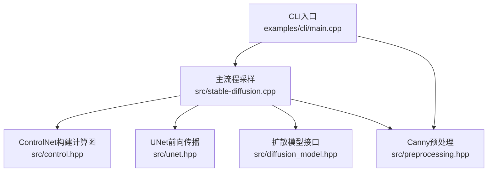
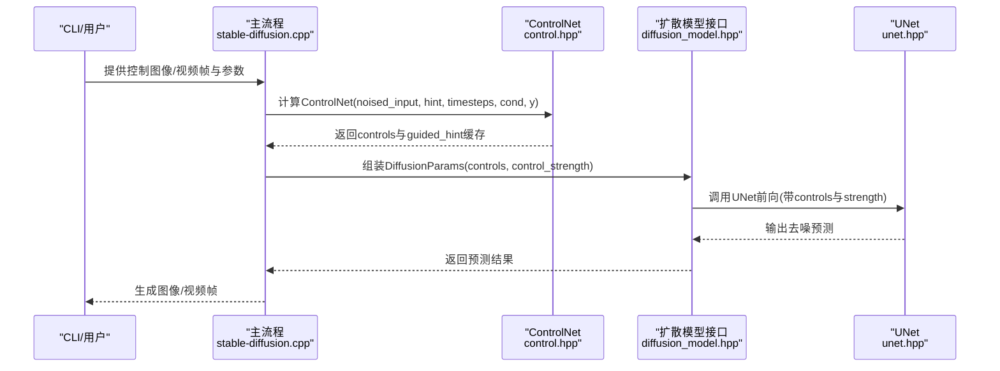
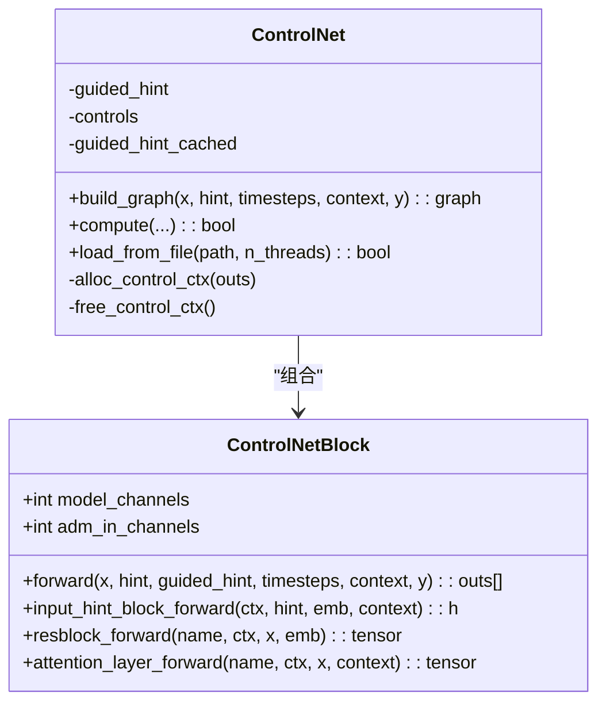
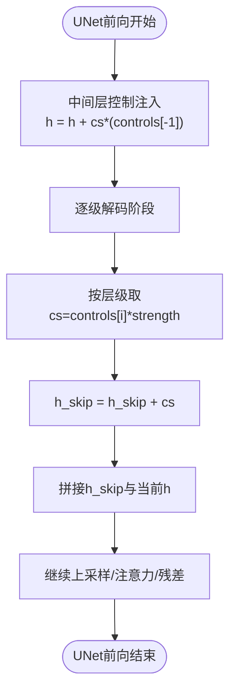
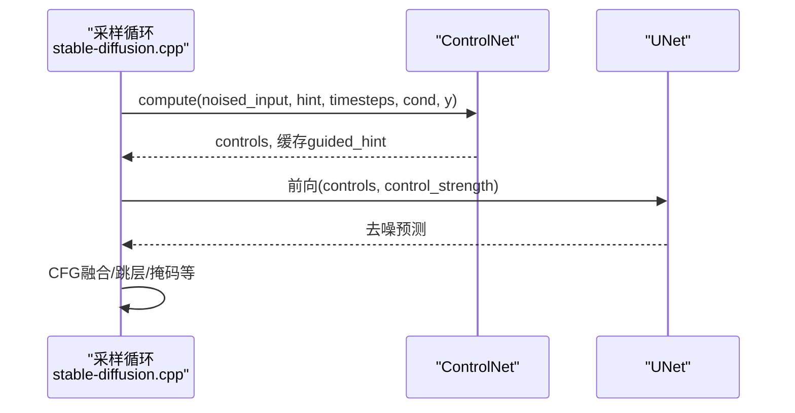
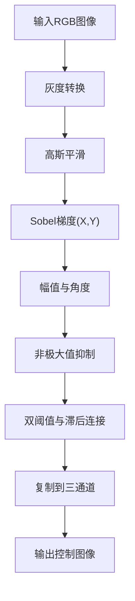
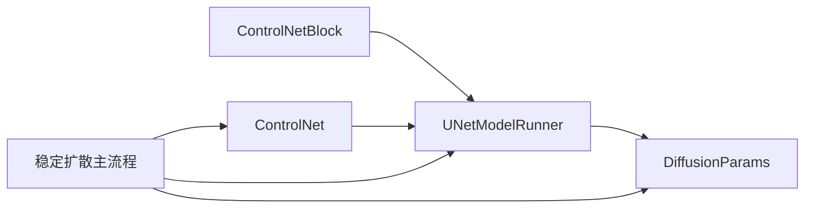

# ControlNet控制

<cite>
**本文引用的文件**
- [src/control.hpp](file://src/control.hpp)
- [src/preprocessing.hpp](file://src/preprocessing.hpp)
- [src/stable-diffusion.cpp](file://src/stable-diffusion.cpp)
- [src/diffusion_model.hpp](file://src/diffusion_model.hpp)
- [src/unet.hpp](file://src/unet.hpp)
- [examples/cli/main.cpp](file://examples/cli/main.cpp)
- [examples/common/common.hpp](file://examples/common/common.hpp)
</cite>

## 目录
1. [简介](#简介)
2. [项目结构](#项目结构)
3. [核心组件](#核心组件)
4. [架构总览](#架构总览)
5. [详细组件分析](#详细组件分析)
6. [依赖关系分析](#依赖关系分析)
7. [性能考量](#性能考量)
8. [故障排查指南](#故障排查指南)
9. [结论](#结论)
10. [附录](#附录)

## 简介
本文件系统性阐述本仓库中ControlNet控制技术的实现与使用方法，覆盖以下要点：
- ControlNet工作原理与架构：条件输入处理、控制信号注入、特征对齐与缓存复用
- 支持的ControlNet模式：Canny边缘检测（含预处理）、Depth深度估计、OpenPose人体姿态、Segmentation分割等（以“hint”输入形式接入）
- 模型加载与配置：输入图像预处理、阈值设置、权重调节（control_strength）
- 参数详解：control_mode（通过流程控制实现）、guidance_strength（扩散过程中的引导强度）、start_percent/end_percent（时间范围控制）
- 实际使用示例：CLI中Canny预处理与ControlNet提示图的加载与应用
- 与主模型的交互机制：ControlNet输出作为UNet的条件注入，以及性能优化策略（缓存、后端内存分配）

## 项目结构
ControlNet相关代码主要分布在如下模块：
- 控制网络定义与执行：src/control.hpp
- 图像预处理（如Canny）：src/preprocessing.hpp
- 主流程集成（采样循环、条件拼接、控制信号传递）：src/stable-diffusion.cpp
- 扩散模型接口与UNet实现（控制信号注入点）：src/diffusion_model.hpp、src/unet.hpp
- CLI示例（加载ControlNet模型、Canny预处理）：examples/cli/main.cpp
- 参数定义与默认值：examples/common/common.hpp

图表来源
- [examples/cli/main.cpp:642-671](file://examples/cli/main.cpp#L642-L671)
- [src/stable-diffusion.cpp:2082-2158](file://src/stable-diffusion.cpp#L2082-L2158)
- [src/control.hpp:377-414](file://src/control.hpp#L377-L414)
- [src/unet.hpp:423-589](file://src/unet.hpp#L423-L589)
- [src/diffusion_model.hpp:12-27](file://src/diffusion_model.hpp#L12-L27)
- [src/preprocessing.hpp:165-224](file://src/preprocessing.hpp#L165-L224)

章节来源
- [src/control.hpp:14-307](file://src/control.hpp#L14-L307)
- [src/preprocessing.hpp:165-224](file://src/preprocessing.hpp#L165-L224)
- [src/stable-diffusion.cpp:2082-2158](file://src/stable-diffusion.cpp#L2082-L2158)
- [src/stable-diffusion.cpp:3387-3483](file://src/stable-diffusion.cpp#L3387-L3483)
- [src/diffusion_model.hpp:12-27](file://src/diffusion_model.hpp#L12-L27)
- [src/unet.hpp:423-589](file://src/unet.hpp#L423-L589)
- [examples/cli/main.cpp:642-671](file://examples/cli/main.cpp#L642-L671)
- [examples/common/common.hpp:1060](file://examples/common/common.hpp#L1060)
- [examples/common/common.hpp:1245](file://examples/common/common.hpp#L1245)
- [examples/common/common.hpp:1590](file://examples/common/common.hpp#L1590)

## 核心组件
- ControlNetBlock：定义ControlNet骨干网络结构（时间嵌入、Hint分支、编码器路径、中间块、零初始化输出），并提供forward函数产出多尺度控制特征。
- ControlNet：封装ControlNetBlock的运行器，负责构建计算图、缓存guided_hint、管理后端内存、加载模型权重。
- UNetModel/UNetModelRunner：扩散模型接口与实现，接收ControlNet输出controls与control_strength，在中间层与各解码阶段进行特征对齐与加权融合。
- 预处理模块：提供Canny边缘检测预处理函数，支持高/低阈值、弱/强像素替换与反色选项。
- 主流程：在每步采样中调用ControlNet，将控制特征注入UNet，并根据需要拼接到c_concat通道。

章节来源
- [src/control.hpp:14-307](file://src/control.hpp#L14-L307)
- [src/unet.hpp:423-589](file://src/unet.hpp#L423-L589)
- [src/preprocessing.hpp:165-224](file://src/preprocessing.hpp#L165-L224)
- [src/stable-diffusion.cpp:2082-2158](file://src/stable-diffusion.cpp#L2082-L2158)

## 架构总览
ControlNet在采样流程中的位置与交互如下：

图表来源
- [src/stable-diffusion.cpp:2082-2158](file://src/stable-diffusion.cpp#L2082-L2158)
- [src/control.hpp:377-414](file://src/control.hpp#L377-L414)
- [src/diffusion_model.hpp:12-27](file://src/diffusion_model.hpp#L12-L27)
- [src/unet.hpp:423-589](file://src/unet.hpp#L423-L589)

## 详细组件分析

### ControlNetBlock与ControlNet
- 结构要点
  - 时间嵌入：timestep经嵌入与两层线性变换得到emb
  - Hint分支：将3通道hint经若干卷积+激活生成guided_hint，用于后续与主干特征相加
  - 编码器路径：按channel_mult与attention_resolutions堆叠残差块与注意力层，同时记录每个阶段的零初始化输出（用于与ControlNet特征对齐）
  - 中间块：残差-注意力-残差结构
  - 输出：返回多尺度控制特征列表（包含中间块输出与每个下采样阶段的零初始化输出）
- 运行时优化
  - guided_hint缓存：首次计算后复用，避免重复推理
  - 后端内存分配：为控制特征分配专用上下文与缓冲区，降低CPU/GPU间拷贝开销

图表来源
- [src/control.hpp:14-307](file://src/control.hpp#L14-L307)

章节来源
- [src/control.hpp:14-307](file://src/control.hpp#L14-L307)

### UNet中的控制信号注入
- 注入位置
  - 中间层：将控制特征按control_strength缩放后与中间特征相加
  - 解码阶段：在上采样前将对应层级的控制特征按control_strength缩放后与skip连接
- 特征对齐
  - 控制特征与UNet各层级特征在空间尺寸与通道数上需匹配；ControlNet输出与UNet编码器输出一一对应
- 条件拼接
  - 当未使用ControlNet时，c_concat可由控制潜空间拼接形成（例如在某些版本中）

图表来源
- [src/unet.hpp:530-547](file://src/unet.hpp#L530-L547)

章节来源
- [src/unet.hpp:423-589](file://src/unet.hpp#L423-L589)

### 主流程中的ControlNet集成
- 每步采样
  - 若存在control_hint与control_net，先计算ControlNet得到controls
  - 将controls与control_strength放入DiffusionParams
  - 分别计算有/无条件分支，最终按CFG规则融合
- 控制潜空间拼接
  - 在某些版本中，将ControlNet生成的潜空间按strength缩放后拼接到c_concat通道

图表来源
- [src/stable-diffusion.cpp:2082-2158](file://src/stable-diffusion.cpp#L2082-L2158)
- [src/stable-diffusion.cpp:3387-3483](file://src/stable-diffusion.cpp#L3387-L3483)

章节来源
- [src/stable-diffusion.cpp:2082-2158](file://src/stable-diffusion.cpp#L2082-L2158)
- [src/stable-diffusion.cpp:3387-3483](file://src/stable-diffusion.cpp#L3387-L3483)

### 预处理与Canny边缘检测
- Canny流程
  - 彩色转灰度、高斯平滑、Sobel梯度计算、非极大值抑制、双阈值与滞后连接、归一化与角度映射、可选反色
- CLI集成
  - 可在加载控制图像后自动执行Canny预处理，便于边缘控制

图表来源
- [src/preprocessing.hpp:165-224](file://src/preprocessing.hpp#L165-L224)
- [examples/cli/main.cpp:651-658](file://examples/cli/main.cpp#L651-L658)

章节来源
- [src/preprocessing.hpp:165-224](file://src/preprocessing.hpp#L165-L224)
- [examples/cli/main.cpp:651-658](file://examples/cli/main.cpp#L651-L658)

## 依赖关系分析
- ControlNet依赖
  - ControlNetBlock依赖通用块（ResBlock、SpatialTransformer、DownSample等）
  - ControlNetRunner负责后端张量搬运与图构建
- UNet依赖
  - UNetModelRunner持有UnetModelBlock，前向中读取controls并按层级注入
- 主流程依赖
  - DiffusionParams统一承载context、y、c_concat、controls、control_strength等
  - Stable Diffusion主流程在每步采样中调用ControlNet并组装DiffusionParams

图表来源
- [src/control.hpp:14-307](file://src/control.hpp#L14-L307)
- [src/unet.hpp:423-589](file://src/unet.hpp#L423-L589)
- [src/diffusion_model.hpp:12-27](file://src/diffusion_model.hpp#L12-L27)
- [src/stable-diffusion.cpp:2082-2158](file://src/stable-diffusion.cpp#L2082-L2158)

章节来源
- [src/control.hpp:14-307](file://src/control.hpp#L14-L307)
- [src/unet.hpp:423-589](file://src/unet.hpp#L423-L589)
- [src/diffusion_model.hpp:12-27](file://src/diffusion_model.hpp#L12-L27)
- [src/stable-diffusion.cpp:2082-2158](file://src/stable-diffusion.cpp#L2082-L2158)

## 性能考量
- 缓存与复用
  - ControlNet首次计算后缓存guided_hint，后续步骤直接复用，减少重复推理
- 内存管理
  - 为控制特征分配独立的ggml上下文与后端缓冲，降低跨设备拷贝
- 并行与批处理
  - UNet前向支持多线程；ControlNet与UNet均通过后端加速
- 输入预处理
  - Canny等预处理在CPU侧完成，建议在I/O阶段尽早完成，避免在推理热路径中重复计算

章节来源
- [src/control.hpp:331-371](file://src/control.hpp#L331-L371)
- [src/stable-diffusion.cpp:2082-2158](file://src/stable-diffusion.cpp#L2082-L2158)

## 故障排查指南
- ControlNet计算失败
  - 现象：日志打印“controlnet compute failed”
  - 排查：确认ControlNet模型加载成功、输入张量形状与后端可用性
- 控制效果不明显
  - 检查control_strength是否过小或hint预处理不当
  - 确认c_concat拼接逻辑与版本兼容性
- 内存不足
  - 关注ControlNet控制缓冲大小日志，必要时降低分辨率或关闭缓存复用
- 预处理异常
  - Canny阈值设置不当会导致边缘过强或过弱，调整高/低阈值与弱/强像素值

章节来源
- [src/stable-diffusion.cpp:2084-2092](file://src/stable-diffusion.cpp#L2084-L2092)
- [src/control.hpp:440-462](file://src/control.hpp#L440-L462)
- [src/preprocessing.hpp:165-224](file://src/preprocessing.hpp#L165-L224)

## 结论
本实现将ControlNet以“条件输入+特征对齐+权重注入”的方式无缝集成至扩散采样流程：ControlNet负责从hint生成多尺度控制特征，UNet在中间层与解码阶段按strength进行融合，主流程在每步采样中动态调度。该设计既保证了控制精度，又兼顾了性能与易用性。对于不同控制模式（如Canny、Depth、OpenPose、Segmentation），只需提供对应的hint图像并通过预处理适配即可接入。

## 附录

### 参数说明与使用示例

- control_strength（控制强度）
  - 作用：对ControlNet各级特征按strength缩放后注入UNet
  - 默认值：CLI示例中为0.9
  - 设置位置：CLI参数解析与配置文件加载
  - 使用位置：主流程采样时传入DiffusionParams

- start_percent / end_percent（时间范围）
  - 作用：控制ControlNet在扩散过程中的生效时间段（以步数比例表示）
  - 设置位置：缓存配置与采样参数
  - 行为：在指定区间内启用/保留ControlNet特征，区间外可跳过或降权

- guidance_strength（扩散过程中的引导强度）
  - 作用：影响扩散模型的去噪预测与CFG融合
  - 设置位置：采样参数与扩散模型接口

- control_mode（控制模式）
  - 说明：本实现通过流程控制实现不同模式（如仅边缘、仅深度等），而非单一枚举参数
  - 典型做法：通过选择不同的hint输入与预处理策略达到不同控制效果

章节来源
- [examples/common/common.hpp:1060](file://examples/common/common.hpp#L1060)
- [examples/common/common.hpp:1245](file://examples/common/common.hpp#L1245)
- [examples/common/common.hpp:1590](file://examples/common/common.hpp#L1590)
- [src/stable-diffusion.cpp:1699-1750](file://src/stable-diffusion.cpp#L1699-L1750)
- [src/stable-diffusion.cpp:2986-2987](file://src/stable-diffusion.cpp#L2986-L2987)
- [src/stable-diffusion.cpp:3232-3233](file://src/stable-diffusion.cpp#L3232-L3233)

### 实际使用示例（CLI）
- 加载控制图像并可选Canny预处理
- 通过参数控制control_strength与采样步数
- 在采样循环中自动调用ControlNet并注入到UNet

章节来源
- [examples/cli/main.cpp:642-671](file://examples/cli/main.cpp#L642-L671)