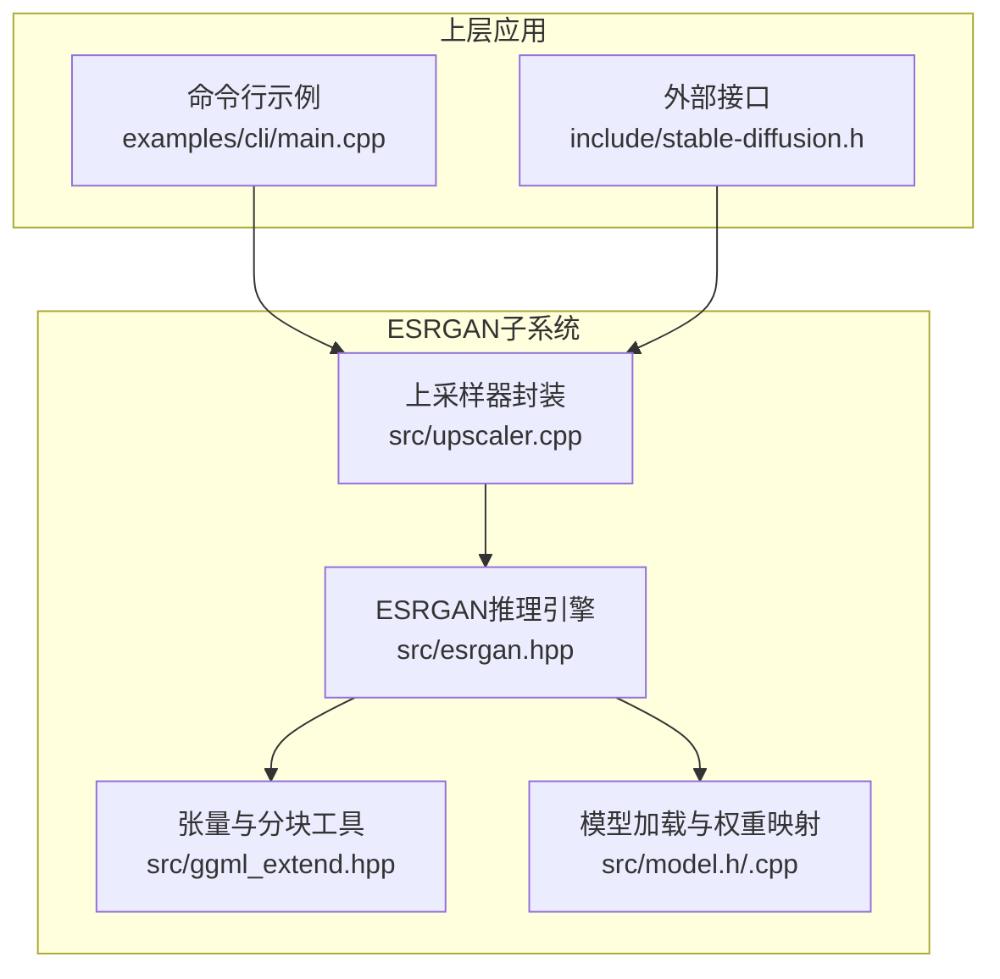
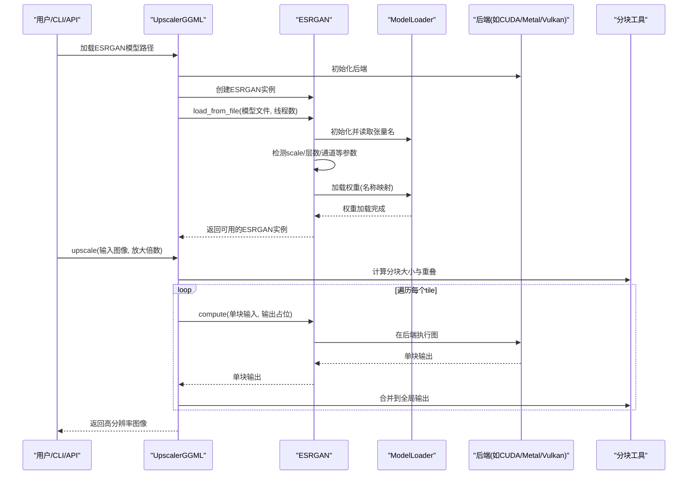
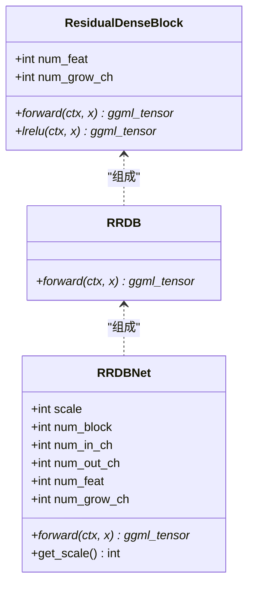
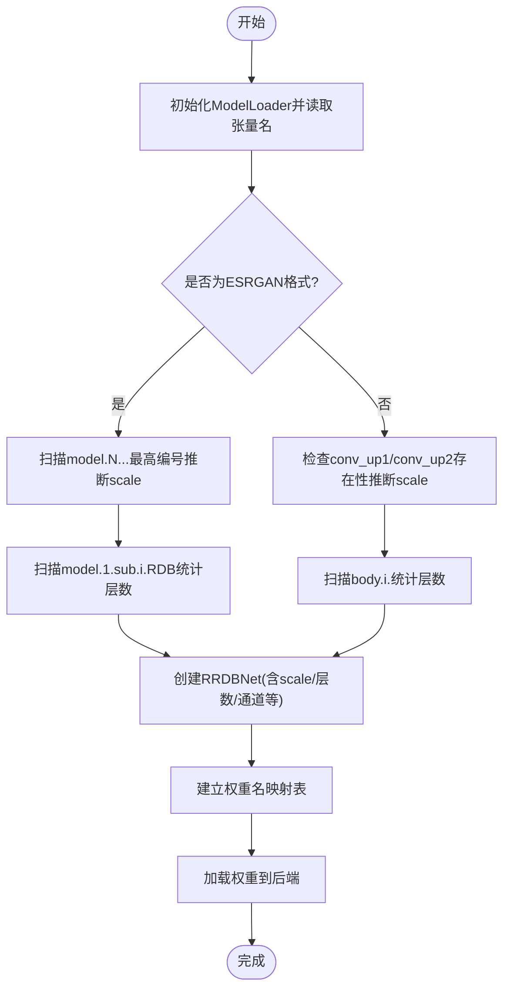
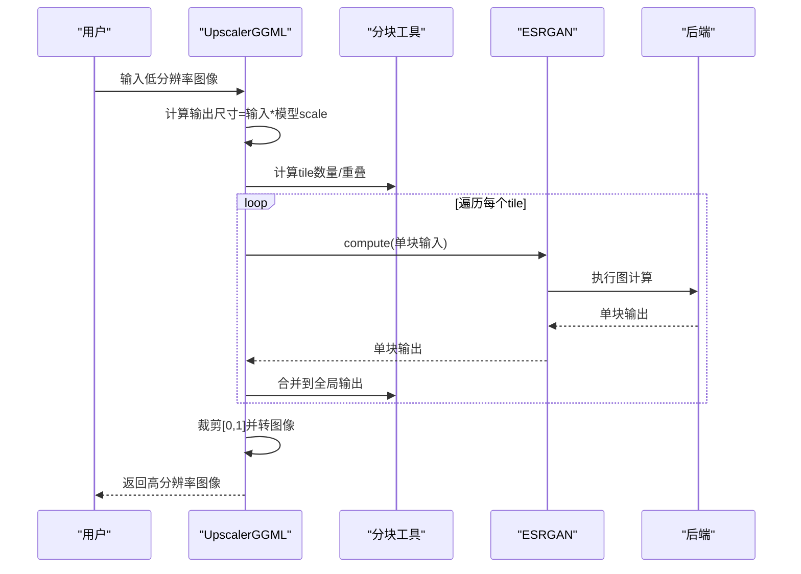
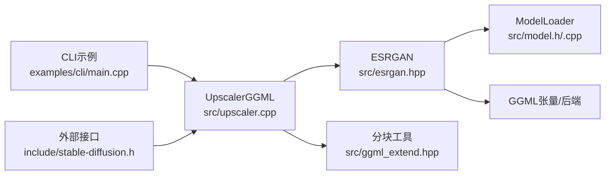

# ESRGAN图像放大

<cite>
**本文引用的文件**
- [esrgan.hpp](file://src/esrgan.hpp)
- [upscaler.cpp](file://src/upscaler.cpp)
- [ggml_extend.hpp](file://src/ggml_extend.hpp)
- [model.h](file://src/model.h)
- [model.cpp](file://src/model.cpp)
- [stable-diffusion.h](file://include/stable-diffusion.h)
- [main.cpp](file://examples/cli/main.cpp)
- [esrgan.md](file://docs/esrgan.md)
</cite>

## 目录
1. [简介](#简介)
2. [项目结构](#项目结构)
3. [核心组件](#核心组件)
4. [架构总览](#架构总览)
5. [详细组件分析](#详细组件分析)
6. [依赖关系分析](#依赖关系分析)
7. [性能考量](#性能考量)
8. [故障排除指南](#故障排除指南)
9. [结论](#结论)
10. [附录](#附录)

## 简介
本文件系统性阐述ESRGAN（Enhanced Super-Resolution Generative Adversarial Networks）在本仓库中的实现与使用，覆盖技术原理、网络结构、模型加载与配置、推理流程、性能优化与故障排除等。ESRGAN通过深度卷积神经网络学习从低分辨率到高分辨率的映射，强调细节恢复与纹理增强，在保持边缘清晰的同时减少传统插值方法常见的模糊与伪影。

## 项目结构
ESRGAN相关实现集中在以下模块：
- 网络定义与推理：src/esrgan.hpp
- 上采样封装与后处理：src/upscaler.cpp
- 图像张量与分块推理工具：src/ggml_extend.hpp
- 模型加载与权重映射：src/model.h, src/model.cpp
- 外部接口与参数：include/stable-diffusion.h
- 命令行示例与使用：examples/cli/main.cpp
- 使用文档：docs/esrgan.md

图表来源
- [upscaler.cpp:1-160](file://src/upscaler.cpp#L1-L160)
- [esrgan.hpp:152-368](file://src/esrgan.hpp#L152-L368)
- [ggml_extend.hpp:828-1027](file://src/ggml_extend.hpp#L828-L1027)
- [model.h:292-345](file://src/model.h#L292-L345)

章节来源
- [upscaler.cpp:1-160](file://src/upscaler.cpp#L1-L160)
- [esrgan.hpp:152-368](file://src/esrgan.hpp#L152-L368)
- [ggml_extend.hpp:828-1027](file://src/ggml_extend.hpp#L828-L1027)
- [model.h:292-345](file://src/model.h#L292-L345)

## 核心组件
- ResidualDenseBlock（RDD）：密集连接的残差块，堆叠多层卷积并以小比例残差融合，增强特征复用与表达能力。
- RRDB：由多个RDD组成的模块，进一步堆叠并引入残差融合，提升深层非线性建模能力。
- RRDBNet：ESRGAN生成器主体，包含前层卷积、若干RRDB堆叠、主体融合、可选的上采样层以及最终输出层。
- ESRGAN：基于GGMLRunner的推理类，负责模型检测与加载、图构建与执行、参数离线存储等。
- UpscalerGGML：面向上采样的高层封装，自动选择后端、加载模型、执行分块推理与结果后处理。
- 分块推理工具：提供通用的分块拼接与重叠策略，避免显存不足导致的OOM。

章节来源
- [esrgan.hpp:15-150](file://src/esrgan.hpp#L15-L150)
- [esrgan.hpp:152-368](file://src/esrgan.hpp#L152-L368)
- [upscaler.cpp:6-111](file://src/upscaler.cpp#L6-L111)
- [ggml_extend.hpp:828-1027](file://src/ggml_extend.hpp#L828-L1027)

## 架构总览
ESRGAN在本项目中采用“上采样器封装 + 推理引擎 + 模型加载 + 张量工具”的分层架构。上层通过CLI或API传入低分辨率图像，上采样器根据模型缩放因子计算输出尺寸，将整图按分块策略切片，逐块调用ESRGAN推理，最后合并为高分辨率图像。

图表来源
- [upscaler.cpp:23-111](file://src/upscaler.cpp#L23-L111)
- [esrgan.hpp:169-365](file://src/esrgan.hpp#L169-L365)
- [model.h:313-329](file://src/model.h#L313-L329)
- [ggml_extend.hpp:828-1027](file://src/ggml_extend.hpp#L828-L1027)

## 详细组件分析

### 生成器网络：ResidualDenseBlock、RRDB、RRDBNet
- ResidualDenseBlock（RDD）
  - 结构要点：多层卷积（3×3）、LeakyReLU激活、逐层拼接、残差融合（0.2缩放）。
  - 数据流：输入特征经多路卷积+拼接，再经最后一层卷积，与输入做加权残差。
- RRDB
  - 结构要点：堆叠三个RDD，并在末尾进行残差融合。
- RRDBNet
  - 结构要点：conv_first → 多RRDB → conv_body → 可选上采样（nearest）→ conv_hr → conv_last。
  - 放大倍数：支持scale=1/2/4，通过是否存在conv_up1/conv_up2判断；nearest上采样配合卷积实现像素重生。

图表来源
- [esrgan.hpp:15-150](file://src/esrgan.hpp#L15-L150)

章节来源
- [esrgan.hpp:15-150](file://src/esrgan.hpp#L15-L150)

### 模型加载与配置：参数检测、权重映射与后端选择
- 参数检测
  - ESRGAN格式：通过张量名前缀“model.”与最高编号推断scale；通过“model.1.sub.i.RDB”层级统计层数。
  - 原始格式：通过是否存在“conv_up1/conv_up2”判断scale=2/4，否则scale=1；通过“body.i.”层级统计层数。
- 权重映射
  - 将模型文件中的权重名映射到RRDBNet期望的键，确保参数初始化与加载一致。
- 后端选择
  - 自动探测CUDA/Metal/Vulkan/OpenCL/SYCL/Metal/CPU等后端，优先使用GPU后端以加速推理。
- 离线参数与张量存储
  - 通过ModelLoader管理权重存储与类型转换，支持线程化加载与内存映射。

图表来源
- [esrgan.hpp:169-342](file://src/esrgan.hpp#L169-L342)
- [model.h:313-329](file://src/model.h#L313-L329)

章节来源
- [esrgan.hpp:169-342](file://src/esrgan.hpp#L169-L342)
- [model.h:292-345](file://src/model.h#L292-L345)
- [model.cpp:1602-1708](file://src/model.cpp#L1602-L1708)

### 推理流程与分块策略：输入输出尺寸、放大倍数与性能
- 输入输出尺寸
  - 输入：[N, C, H, W]，通道通常为3（RGB）。
  - 输出：[N, C, H*scale, W*scale]。
- 放大倍数
  - 由模型scale决定；CLI示例中存在“upscale_factor”参数但注释说明对某些模型无效，实际以模型scale为准。
- 分块策略
  - 通过sd_tiling/sd_tiling_non_square将大图切分为小块，设置重叠以消除拼接伪影；支持圆形/非圆形边界策略。
  - 每个tile单独推理，再合并回全局输出，显著降低显存占用。
- 后处理
  - 将输出张量裁剪至[0,1]范围，再转回图像数据。

图表来源
- [upscaler.cpp:67-111](file://src/upscaler.cpp#L67-L111)
- [ggml_extend.hpp:828-1027](file://src/ggml_extend.hpp#L828-L1027)
- [esrgan.hpp:344-365](file://src/esrgan.hpp#L344-L365)

章节来源
- [upscaler.cpp:67-111](file://src/upscaler.cpp#L67-L111)
- [ggml_extend.hpp:828-1027](file://src/ggml_extend.hpp#L828-L1027)
- [esrgan.hpp:344-365](file://src/esrgan.hpp#L344-L365)

### 与传统插值方法的对比与优势
- 细节恢复：ESRGAN通过深度卷积学习高频细节，能恢复纹理与边缘的锐利度，而双线性/双三次插值易造成模糊。
- 纹理增强：残差密集块与RRDB堆叠增强了特征表达，使放大后的图像更接近真实照片质感。
- 伪影减少：分块推理与重叠合并有效缓解拼接边界问题；模型训练目标抑制了放大过程中的噪声与伪影。

## 依赖关系分析
- ESRGAN依赖GGML张量库与后端（CPU/CUDA/Metal/Vulkan/OpenCL/SYCL），通过GGMLRunner统一管理图构建与执行。
- UpscalerGGML封装ESRGAN，负责后端初始化、模型加载、分块推理与结果后处理。
- ModelLoader负责模型文件解析、张量名转换、权重加载与类型转换。
- 分块工具提供通用的重叠拼接逻辑，保证大图推理稳定性。

图表来源
- [esrgan.hpp:152-368](file://src/esrgan.hpp#L152-L368)
- [upscaler.cpp:1-160](file://src/upscaler.cpp#L1-L160)
- [model.h:292-345](file://src/model.h#L292-L345)
- [ggml_extend.hpp:828-1027](file://src/ggml_extend.hpp#L828-L1027)

章节来源
- [esrgan.hpp:152-368](file://src/esrgan.hpp#L152-L368)
- [upscaler.cpp:1-160](file://src/upscaler.cpp#L1-L160)
- [model.h:292-345](file://src/model.h#L292-L345)
- [ggml_extend.hpp:828-1027](file://src/ggml_extend.hpp#L828-L1027)

## 性能考量
- 后端选择
  - 优先使用GPU后端（CUDA/Metal/Vulkan/OpenCL/SYCL），可显著提升推理速度；无GPU时回退CPU。
- 分块与重叠
  - 合理设置tile_size与重叠率可在显存与质量间取得平衡；过小tile增加通信开销，过大易OOM。
- 线程数
  - n_threads影响模型加载与部分张量操作的并行度；推理阶段主要受后端与硬件限制。
- 类型与量化
  - 模型权重类型可通过ModelLoader覆盖，结合后端能力选择合适精度以平衡速度与质量。
- 直通卷积
  - 可启用direct卷积优化（如diffusion_conv_direct），在满足精度前提下提升吞吐。

章节来源
- [upscaler.cpp:15-65](file://src/upscaler.cpp#L15-L65)
- [ggml_extend.hpp:828-1027](file://src/ggml_extend.hpp#L828-L1027)
- [stable-diffusion.h:181-200](file://include/stable-diffusion.h#L181-L200)

## 故障排除指南
- 模型加载失败
  - 检查模型路径与文件完整性；确认模型格式被正确识别（ESRGAN/原始格式）。
  - 关注权重映射是否成功，若未知张量过多，可能为模型不兼容或命名规则差异。
- 显存不足（OOM）
  - 减小tile_size或增大重叠率以降低峰值显存；必要时启用offload_params_to_cpu。
- 输出异常（过亮/过暗/溢出）
  - 确认输出已裁剪至[0,1]；检查输入归一化与后处理流程。
- 放大倍数不符预期
  - 以模型scale为准；CLI中的upscale_factor对某些模型无效，应忽略该参数。
- 后端不可用
  - 检查编译选项与运行环境；确保对应后端驱动安装正确。

章节来源
- [esrgan.hpp:169-342](file://src/esrgan.hpp#L169-L342)
- [upscaler.cpp:23-65](file://src/upscaler.cpp#L23-L65)
- [ggml_extend.hpp:828-1027](file://src/ggml_extend.hpp#L828-L1027)

## 结论
本实现完整复现了ESRGAN生成器的网络结构与推理流程，具备自动参数检测、灵活的后端选择与强大的分块推理能力。通过合理的分块策略与后端优化，可在多种硬件环境下稳定地实现高质量图像超分。建议在实际部署中结合图像类型与硬件条件调整tile_size、重叠率与后端配置，以获得最佳的速度与质量平衡。

## 附录

### 使用方法与参数调优
- CLI使用
  - 通过命令行参数指定ESRGAN模型路径，即可对生成图像进行超分；重复次数可叠加多次放大。
- 参数建议
  - tile_size：根据显存大小自适应调整；默认128较为安全。
  - 重叠率：一般设置为0.25左右，兼顾速度与质量。
  - 后端：优先GPU后端；CPU仅用于无GPU环境。
  - direct卷积：在满足精度前提下开启以提升性能。

章节来源
- [esrgan.md:1-10](file://docs/esrgan.md#L1-L10)
- [main.cpp:794-839](file://examples/cli/main.cpp#L794-L839)
- [upscaler.cpp:15-65](file://src/upscaler.cpp#L15-L65)