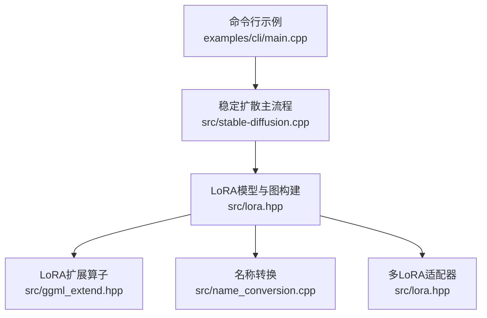
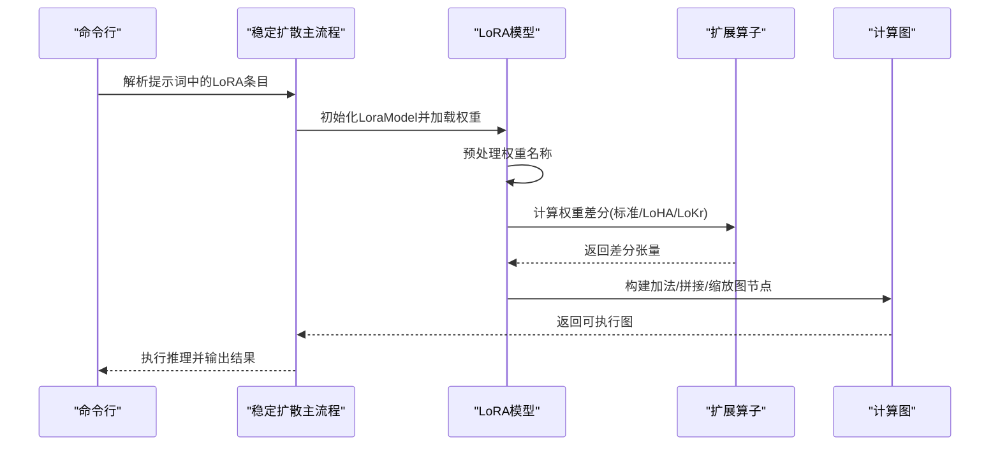
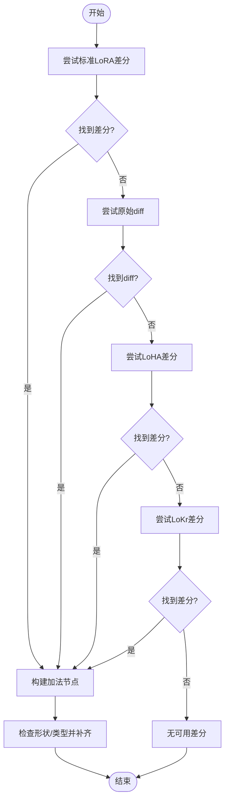
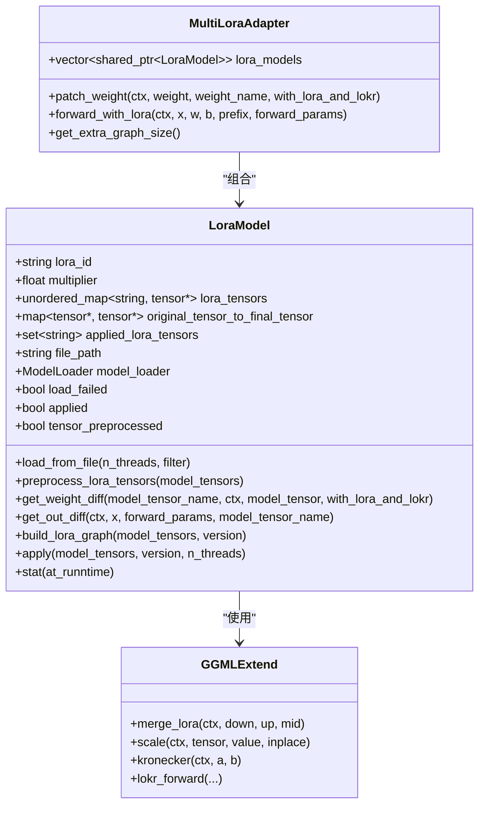

# LoRA变体支持

<cite>
**本文档引用的文件**
- [src/lora.hpp](file://src/lora.hpp)
- [src/ggml_extend.hpp](file://src/ggml_extend.hpp)
- [docs/lora.md](file://docs/lora.md)
- [src/name_conversion.cpp](file://src/name_conversion.cpp)
- [src/model.h](file://src/model.h)
- [examples/cli/main.cpp](file://examples/cli/main.cpp)
</cite>

## 目录
1. [简介](#简介)
2. [项目结构](#项目结构)
3. [核心组件](#核心组件)
4. [架构总览](#架构总览)
5. [详细组件分析](#详细组件分析)
6. [依赖关系分析](#依赖关系分析)
7. [性能考量](#性能考量)
8. [故障排查指南](#故障排查指南)
9. [结论](#结论)
10. [附录](#附录)

## 简介
本文件系统化阐述本项目对LoRA变体的支持，覆盖标准LoRA、LoHA（Hadamard分解）与LoKr（Kronecker积）等变体的实现与使用。内容包括：
- 各变体的技术特点与适用场景
- 权重结构差异（参数数量、计算复杂度、效果表现）
- 加载与应用流程（权重张量识别与处理逻辑）
- 使用建议与最佳实践
- 兼容性与版本支持说明

## 项目结构
LoRA变体支持主要由以下模块构成：
- LoRA模型与图构建：负责从权重文件加载LoRA张量、预处理名称、构建计算图并应用到模型权重
- LoRA扩展算子：提供合并、缩放、Kronecker积、LoKR前向等底层算子
- 名称转换：统一不同来源LoRA权重的命名格式
- 应用入口：命令行示例展示如何在推理中启用与切换LoRA应用模式

图表来源
- [examples/cli/main.cpp:220-230](file://examples/cli/main.cpp#L220-L230)
- [src/lora.hpp:750-789](file://src/lora.hpp#L750-L789)
- [src/ggml_extend.hpp:131-160](file://src/ggml_extend.hpp#L131-L160)
- [src/name_conversion.cpp:971-1011](file://src/name_conversion.cpp#L971-L1011)

章节来源
- [src/lora.hpp:39-95](file://src/lora.hpp#L39-L95)
- [docs/lora.md:1-27](file://docs/lora.md#L1-L27)

## 核心组件
- LoRA模型（LoraModel）：封装单个LoRA权重文件的加载、预处理、权重差分计算与图构建
- 多LoRA适配器（MultiLoraAdapter）：支持同时叠加多个LoRA权重
- LoRA扩展算子（ggml_ext_*）：提供merge_lora、kronecker、scale、lokr_forward等底层操作
- 名称转换（convert_tensor_name）：将不同来源的LoRA权重名规范化为统一格式

章节来源
- [src/lora.hpp:9-833](file://src/lora.hpp#L9-L833)
- [src/ggml_extend.hpp:131-160](file://src/ggml_extend.hpp#L131-L160)
- [src/name_conversion.cpp:971-1011](file://src/name_conversion.cpp#L971-L1011)

## 架构总览
LoRA变体在推理时通过“权重差分”叠加到原模型权重上，或在前向过程中以低秩路径注入。系统按优先级尝试不同变体，最终确保形状匹配与数值一致性。

图表来源
- [src/lora.hpp:471-502](file://src/lora.hpp#L471-L502)
- [src/ggml_extend.hpp:131-160](file://src/ggml_extend.hpp#L131-L160)

## 详细组件分析

### 标准LoRA（低秩分解）
- 技术要点
  - 采用两层或三层低秩矩阵（lora_down、lora_up，可选lora_mid）进行近似
  - 支持显式缩放因子（scale）或基于alpha/rank的自动缩放
  - 在线性层与卷积层分别通过线性/卷积前向完成注入
- 权重结构与复杂度
  - 参数数量：约2×rank×(in+out)，含mid时额外增加rank^2×(in/out)
  - 计算复杂度：线性层O(batch×in×rank)+O(batch×rank×out)，卷积层类似
- 效果表现
  - 通用性强，适配各类风格迁移与细节增强
- 加载与应用
  - 通过名称匹配“lora.*.lora_down/.lora_up/.lora_mid/.alpha/.scale”
  - 自动检测rank与缩放，必要时进行形状补齐与类型转换

章节来源
- [src/lora.hpp:132-249](file://src/lora.hpp#L132-L249)
- [src/lora.hpp:620-747](file://src/lora.hpp#L620-L747)

### LoHA（Hadamard分解）
- 技术要点
  - 将权重分解为两个Hadarmard乘积链：(W1^a ⊙ W1^b) ⊙ (W2^a ⊙ W2^b)
  - 可选中间张量（tucker分解）用于卷积层的高维融合
  - 通过逐元素乘法实现低秩近似
- 权重结构与复杂度
  - 参数数量：约2×rank×(u+v)，其中u,v为两组分解维度
  - 计算复杂度：逐元素乘法为主，内存访问更局部
- 效果表现
  - 在保持稀疏性的同时提升表达能力，适合纹理与结构细节增强
- 加载与应用
  - 通过名称匹配“lora.*.hada_w1_a/.hada_w1_b/.hada_t1/.hada_w2_a/.hada_w2_b/.hada_t2/.alpha”
  - 自动转置与合并，按rank计算缩放

章节来源
- [src/lora.hpp:251-352](file://src/lora.hpp#L251-L352)
- [src/ggml_extend.hpp:131-146](file://src/ggml_extend.hpp#L131-L146)

### LoKr（Kronecker积）
- 技术要点
  - 使用Kronecker积将低秩子块组合为完整权重：W ≈ W1 ⊗ W2 或由W1a,W1b与W2a,W2b合并得到
  - 支持卷积通道的拆分与重组合，保证输入维度一致性
  - 提供专用前向算子（ggml_ext_lokr_forward）以高效实现
- 权重结构与复杂度
  - 参数数量：约rank1×(u×v)+rank2×(v×p)，Kronecker积带来更高时间/空间复杂度
  - 计算复杂度：Kronecker积与多次矩阵乘法，但可通过批合并优化
- 效果表现
  - 在通道/空间维度上具有更强的分解能力，适合大规模结构变化
- 加载与应用
  - 通过名称匹配“lora.*.lokr_w1(.a/.b)/.lokr_w2(.a/.b)/.alpha”
  - 若rank为1则退化为普通缩放；否则按Kronecker积合成并缩放

章节来源
- [src/lora.hpp:354-469](file://src/lora.hpp#L354-L469)
- [src/ggml_extend.hpp:148-160](file://src/ggml_extend.hpp#L148-L160)
- [src/ggml_extend.hpp:2677-2844](file://src/ggml_extend.hpp#L2677-L2844)

### 权重差分与图构建
- 差分生成顺序：先尝试标准LoRA，再回退到原始diff，再尝试LoHA，最后尝试LoKr
- 形状与类型处理：若差分小于原权重，按列补零；必要时进行类型转换与重塑
- 图构建：在计算图中插入加法节点，将差分叠加到原权重；运行时可复制回宿主缓冲区

图表来源
- [src/lora.hpp:471-502](file://src/lora.hpp#L471-L502)

章节来源
- [src/lora.hpp:471-502](file://src/lora.hpp#L471-L502)
- [src/lora.hpp:750-789](file://src/lora.hpp#L750-L789)

### 前向注入与LoKR专用前向
- 前向路径
  - 对于非LoKr：按线性/卷积前向，依次通过lora_down、lora_mid（可选）、lora_up
  - 对于LoKr：调用专用前向算子，按外层W1与内层W2的组合进行高效计算
- 类型与形状约束
  - 卷积场景下对权重类型进行必要转换，确保精度与兼容性

章节来源
- [src/lora.hpp:504-747](file://src/lora.hpp#L504-L747)
- [src/ggml_extend.hpp:2677-2844](file://src/ggml_extend.hpp#L2677-L2844)

### 多LoRA叠加
- 多LoRA适配器会依次对同一权重累加各LoRA的差分，最后统一前向叠加输出
- 图大小按LoRA数量线性增长，需合理控制LoRA数量以平衡性能与效果

章节来源
- [src/lora.hpp:835-909](file://src/lora.hpp#L835-L909)

## 依赖关系分析
- LoRA模型依赖扩展算子完成张量运算
- 名称转换模块确保不同来源权重的统一命名，提升兼容性
- 版本信息用于判断模型类型，间接影响LoRA的匹配策略

图表来源
- [src/lora.hpp:9-833](file://src/lora.hpp#L9-L833)
- [src/ggml_extend.hpp:131-160](file://src/ggml_extend.hpp#L131-L160)
- [src/ggml_extend.hpp:2677-2844](file://src/ggml_extend.hpp#L2677-L2844)

章节来源
- [src/lora.hpp:9-833](file://src/lora.hpp#L9-L833)
- [src/ggml_extend.hpp:131-160](file://src/ggml_extend.hpp#L131-L160)
- [src/ggml_extend.hpp:2677-2844](file://src/ggml_extend.hpp#L2677-L2844)

## 性能考量
- 参数规模
  - 标准LoRA：参数最少，最易部署
  - LoHA：参数略增，逐元素乘法更节省存储
  - LoKr：参数最多，Kronecker积带来更高的计算与内存开销
- 计算复杂度
  - 标准LoRA与LoHA主要为矩阵乘法与逐元素运算，LoKr引入Kronecker积与多次矩阵乘法
- 内存与精度
  - 卷积场景下对权重进行类型转换以保证精度
  - 批合并与形状对齐有助于减少额外内存占用
- 推理速度
  - 多LoRA叠加会增加图节点数量，需权衡LoRA数量与性能

## 故障排查指南
- 未应用的LoRA张量
  - 日志会提示“仅应用了部分LoRA张量”，检查权重文件是否与目标层匹配
- 形状不一致
  - 当差分小于原权重时会自动按列补零；若仍报错，确认rank与缩放设置
- 类型不兼容
  - 卷积层权重可能需要转换为F16；检查日志中的类型转换提示
- 模式选择
  - 量化模型默认使用“at_runtime”模式；如出现精度问题，可强制使用该模式

章节来源
- [src/lora.hpp:807-832](file://src/lora.hpp#L807-L832)
- [docs/lora.md:15-27](file://docs/lora.md#L15-L27)

## 结论
本项目对LoRA变体提供了完整的支持：标准LoRA用于通用风格迁移，LoHA在保持稀疏性的同时提升表达力，LoKr在通道/空间维度上具备更强的分解能力。通过统一的名称转换与扩展算子，系统实现了跨来源权重的兼容与高效执行。建议根据任务需求与资源限制选择合适变体，并在多LoRA叠加时关注性能与内存开销。

## 附录

### 使用建议与最佳实践
- 选择变体
  - 通用风格迁移：优先标准LoRA
  - 细节增强与纹理：考虑LoHA
  - 大尺度结构变化：考虑LoKr
- 参数设置
  - 合理设置alpha/rank与scale，避免过拟合或欠拟合
  - 多LoRA叠加时，逐步调试并记录效果
- 兼容性
  - 使用统一的LoRA权重命名；若来源不一致，交由名称转换模块处理
  - 量化模型建议使用“at_runtime”模式以获得更高精度

章节来源
- [docs/lora.md:1-27](file://docs/lora.md#L1-L27)
- [src/name_conversion.cpp:971-1011](file://src/name_conversion.cpp#L971-L1011)

### 兼容性与版本支持
- 支持的模型版本（示例）
  - Stable Diffusion 1.x、2.x、XL系列、SD3、Flux、Wan、Qwen Image、Anima、Z-Image等
- 影响因素
  - 不同版本的权重命名与结构存在差异，系统通过名称转换与预处理适配
  - 卷积层与线性层的处理路径不同，需分别适配

章节来源
- [src/model.h:23-54](file://src/model.h#L23-L54)
- [src/lora.hpp:97-130](file://src/lora.hpp#L97-L130)