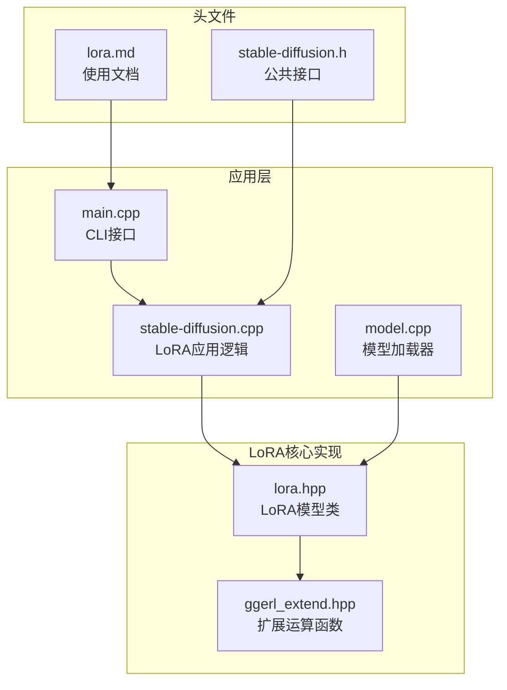
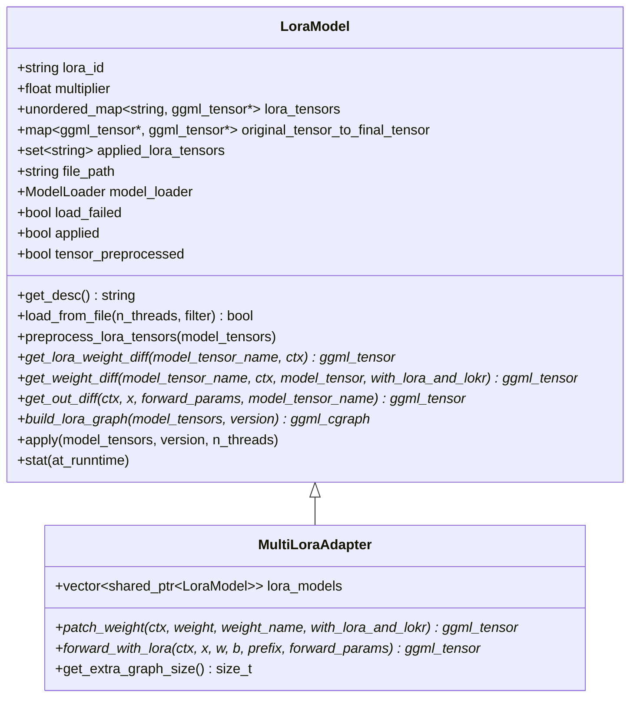
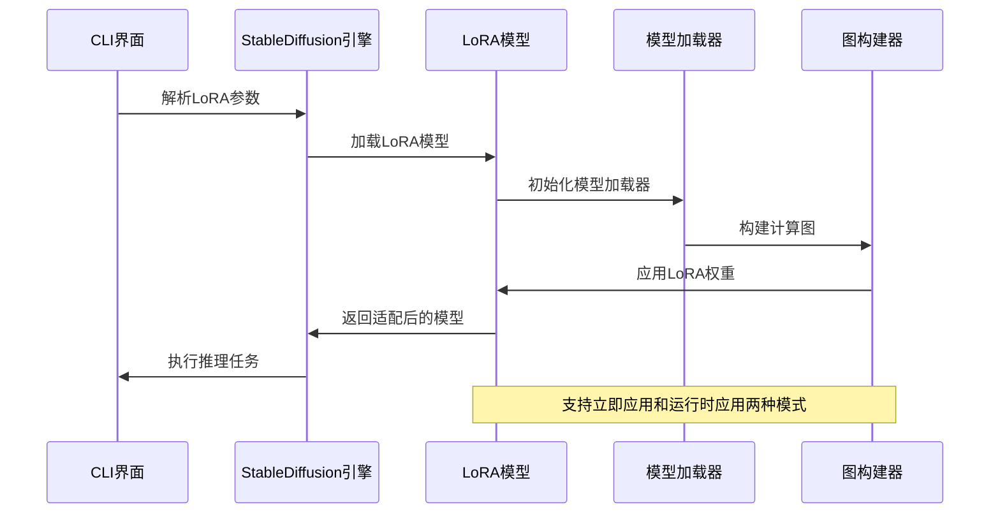
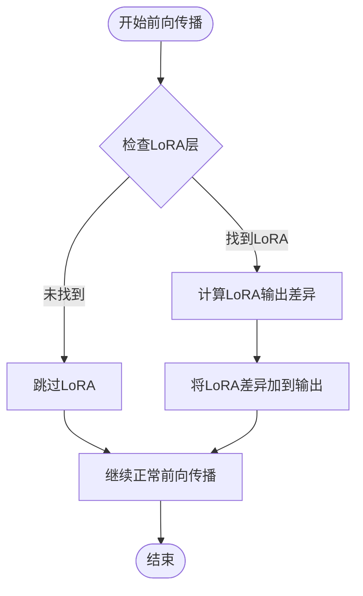
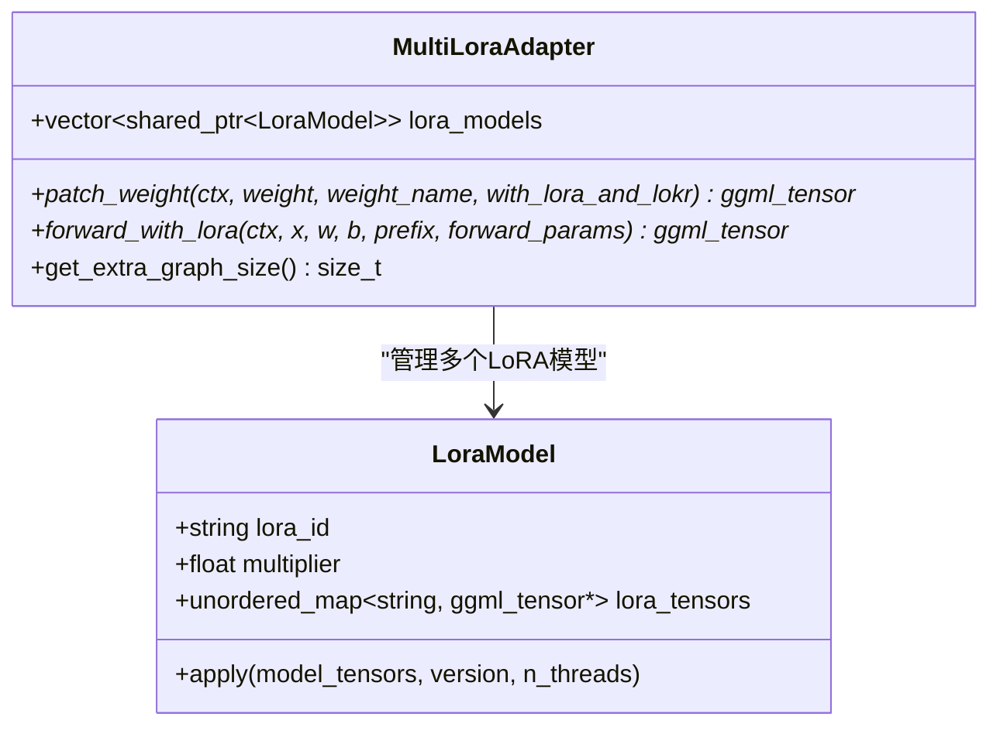
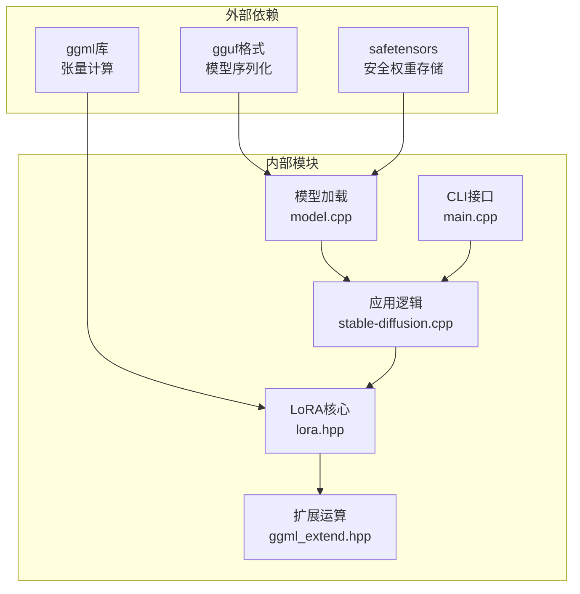

# LoRA基础概念

<cite>
**本文档引用的文件**
- [lora.md](file://docs/lora.md)
- [lora.hpp](file://src/lora.hpp)
- [ggml_extend.hpp](file://src/ggml_extend.hpp)
- [stable-diffusion.cpp](file://src/stable-diffusion.cpp)
- [model.cpp](file://src/model.cpp)
- [stable-diffusion.h](file://include/stable-diffusion.h)
- [main.cpp](file://examples/cli/main.cpp)
</cite>

## 目录
1. [引言](#引言)
2. [项目结构](#项目结构)
3. [核心组件](#核心组件)
4. [架构概览](#架构概览)
5. [详细组件分析](#详细组件分析)
6. [依赖关系分析](#依赖关系分析)
7. [性能考虑](#性能考虑)
8. [故障排除指南](#故障排除指南)
9. [结论](#结论)

## 引言

LoRA（Low-Rank Adaptation，低秩适应）是一种革命性的微调技术，它通过引入低秩矩阵来适应预训练模型，而无需重新训练整个模型。这种技术在稳定扩散模型中具有重要的应用价值，能够显著减少参数数量、提高计算效率并降低存储需求。

LoRA的核心思想是将复杂的权重更新分解为低秩矩阵的乘积形式，这样可以在保持模型性能的同时大幅减少需要学习的参数数量。这种方法特别适用于大型语言模型和图像生成模型的个性化定制。

## 项目结构

该项目采用模块化设计，LoRA功能主要分布在以下关键文件中：



**图表来源**
- [lora.hpp:1-912](file://src/lora.hpp#L1-L912)
- [ggml_extend.hpp:108-2847](file://src/ggml_extend.hpp#L108-L2847)
- [stable-diffusion.cpp:378-2981](file://src/stable-diffusion.cpp#L378-L2981)

**章节来源**
- [lora.md:1-27](file://docs/lora.md#L1-L27)
- [lora.hpp:1-912](file://src/lora.hpp#L1-L912)

## 核心组件

### LoRA模型类 (LoraModel)

LoRA模型类是整个LoRA系统的核心，负责加载、处理和应用LoRA权重。该类继承自GGMLRunner，提供了完整的LoRA生命周期管理。



**图表来源**
- [lora.hpp:9-833](file://src/lora.hpp#L9-L833)
- [lora.hpp:835-912](file://src/lora.hpp#L835-L912)

### LoRA权重类型

项目支持多种LoRA变体，每种都有其特定的数学原理和应用场景：

| LoRA变体 | 数学原理 | 适用场景 | 参数效率 |
|---------|---------|---------|---------|
| LoRA | W + ΔW = W + Up^T Down | 标准线性层适配 | 高 |
| LoHA | ΔW = (W1_up ⊗ W1_down) ⊙ (W2_up ⊗ W2_down) | 卷积层适配 | 极高 |
| LoKr | ΔW = (W1 ⊗ W2) + (W1a ⊗ W1b) + (W2a ⊗ W2b) | 大型卷积层 | 极高 |
| Raw Diff | ΔW = 直接权重差值 | 简单权重替换 | 低 |

**章节来源**
- [lora.hpp:132-502](file://src/lora.hpp#L132-L502)
- [lora.hpp:504-748](file://src/lora.hpp#L504-L748)

## 架构概览

LoRA系统采用分层架构设计，从底层张量操作到高层应用接口形成了完整的处理链路：



**图表来源**
- [stable-diffusion.cpp:378-401](file://src/stable-diffusion.cpp#L378-L401)
- [lora.hpp:750-789](file://src/lora.hpp#L750-L789)

## 详细组件分析

### LoRA权重合并算法

LoRA的核心在于如何将低秩权重合并到原始模型权重中。项目实现了多种合并策略：

#### 标准LoRA合并
标准LoRA通过矩阵乘法实现权重更新：
```
ΔW = Up^T Down
```

其中Up和Down是低秩矩阵，满足Up ∈ R^(d×r)，Down ∈ R^(r×d)，r ≪ d。

#### LoHA合并算法
LoHA（Hadamard分解）使用元素级乘法：
```
ΔW = (W1_up ⊗ W1_down) ⊙ (W2_up ⊗ W2_down)
```

这种算法特别适合卷积层的适配。

#### LoKr合并算法
LoKr（Kronecker分解）结合了Kronecker积和矩阵乘法：
```
ΔW = (W1 ⊗ W2) + (W1a ⊗ W1b) + (W2a ⊗ W2b)
```

**章节来源**
- [ggml_extend.hpp:117-160](file://src/ggml_extend.hpp#L117-L160)
- [lora.hpp:251-352](file://src/lora.hpp#L251-L352)

### LoRA应用模式

系统支持两种LoRA应用模式，以适应不同的硬件和精度要求：

#### 立即应用模式 (Immediately)
- **特点**: 在模型加载时直接将LoRA权重合并到原权重中
- **优势**: 推理速度快，内存占用相对较低
- **劣势**: 可能存在精度损失，兼容性有限
- **适用场景**: 无量化权重的模型，对速度要求高的应用

#### 运行时应用模式 (At Runtime)
- **特点**: 在推理过程中动态应用LoRA权重
- **优势**: 精度高，兼容性强，支持量化权重
- **劣势**: 推理速度较慢，内存占用较高
- **适用场景**: 量化权重模型，对精度要求高的应用

**章节来源**
- [lora.md:15-27](file://docs/lora.md#L15-L27)
- [stable-diffusion.cpp:378-401](file://src/stable-diffusion.cpp#L378-L401)

### LoRA前向传播

LoRA不仅影响权重，还影响模型的前向传播过程。系统实现了完整的前向传播适配：



**图表来源**
- [lora.hpp:504-748](file://src/lora.hpp#L504-L748)

**章节来源**
- [lora.hpp:504-748](file://src/lora.hpp#L504-L748)

### 多LoRA适配器

系统支持同时应用多个LoRA模型，MultiLoraAdapter提供了统一的接口：



**图表来源**
- [lora.hpp:835-912](file://src/lora.hpp#L835-L912)

**章节来源**
- [lora.hpp:835-912](file://src/lora.hpp#L835-L912)

## 依赖关系分析

LoRA系统的依赖关系体现了清晰的分层设计：



**图表来源**
- [lora.hpp:4-6](file://src/lora.hpp#L4-L6)
- [ggml_extend.hpp:108-2847](file://src/ggml_extend.hpp#L108-L2847)

**章节来源**
- [lora.hpp:1-912](file://src/lora.hpp#L1-L912)
- [ggml_extend.hpp:108-2847](file://src/ggml_extend.hpp#L108-L2847)

## 性能考虑

### 参数效率分析

LoRA的主要优势体现在参数效率上：

| 模型类型 | 原始参数 | LoRA参数 | 参数减少比例 |
|---------|---------|---------|-------------|
| 标准线性层 | d² | 2dr | (d²-2dr)/d² |
| 卷积层 | k²d² | 2kd·rank | (k²d²-2kd·rank)/k²d² |
| 注意力层 | 4d² | 8dr | (4d²-8dr)/4d² |

其中d是维度大小，r是低秩秩（通常很小）。

### 计算复杂度

LoRA的计算复杂度主要来自低秩矩阵乘法：
- **权重合并**: O(dr² + d²r) = O(d·r·(d+r))
- **前向传播**: O(d·r·(d+r) + d·n) 其中n是输入维度

### 内存优化

系统通过以下方式优化内存使用：
1. **延迟加载**: 只在需要时加载LoRA权重
2. **批量处理**: 支持多LoRA模型的批量应用
3. **自动模式选择**: 根据模型类型自动选择最优应用模式

## 故障排除指南

### 常见问题及解决方案

#### LoRA权重加载失败
**症状**: 日志显示"init lora model loader from file failed"
**原因**: 文件路径错误或格式不支持
**解决**: 
1. 检查LoRA文件路径是否正确
2. 确认文件格式为safetensors或ckpt
3. 验证文件完整性

#### 精度问题
**症状**: 应用LoRA后模型性能下降
**原因**: 立即应用模式可能引入精度损失
**解决**:
1. 切换到运行时应用模式
2. 调整LoRA权重缩放因子
3. 检查量化权重兼容性

#### 内存不足
**症状**: 推理过程中内存溢出
**原因**: 运行时应用模式内存占用较高
**解决**:
1. 使用立即应用模式
2. 减少同时应用的LoRA数量
3. 优化批处理大小

**章节来源**
- [lora.hpp:807-832](file://src/lora.hpp#L807-L832)
- [stable-diffusion.cpp:1097-1240](file://src/stable-diffusion.cpp#L1097-L1240)

## 结论

LoRA技术为大模型的个性化定制提供了高效、灵活的解决方案。通过低秩矩阵分解，LoRA能够在保持模型性能的同时大幅减少参数数量和计算开销。

本项目的LoRA实现具有以下特点：
1. **模块化设计**: 清晰的层次结构便于维护和扩展
2. **多变体支持**: 支持LoRA、LoHA、LoKr等多种适配算法
3. **双模式应用**: 灵活的选择立即应用或运行时应用模式
4. **完整集成**: 与稳定扩散模型无缝集成

对于扩散模型的应用，LoRA特别有价值：
- **个性化风格**: 快速适配特定艺术风格
- **领域适应**: 将模型适配到特定领域数据
- **快速部署**: 无需重新训练整个模型
- **资源优化**: 显著降低存储和计算需求

未来可以进一步优化的方向包括：
1. 更高效的低秩分解算法
2. 自动超参数调优
3. 更好的可视化工具
4. 支持更多模型架构