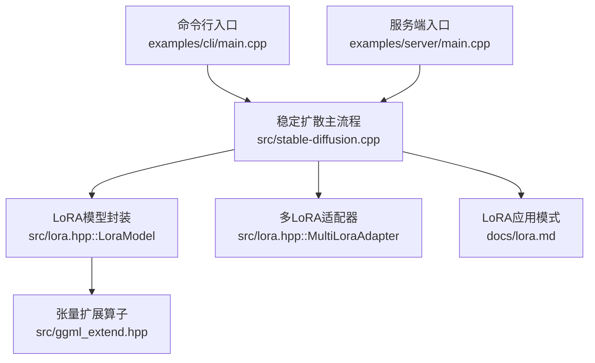
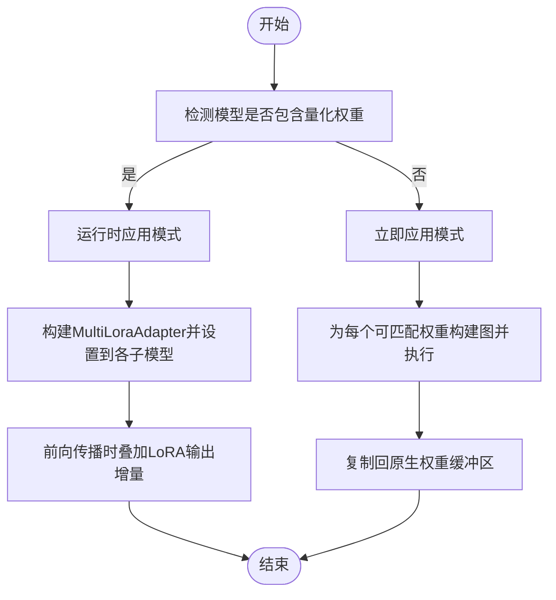
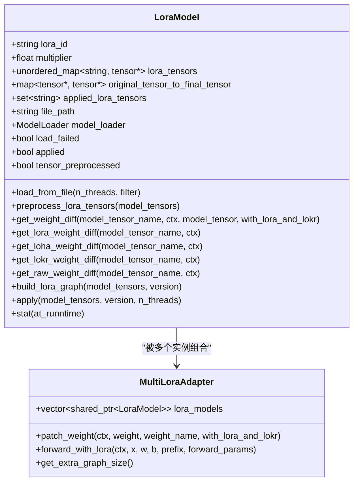
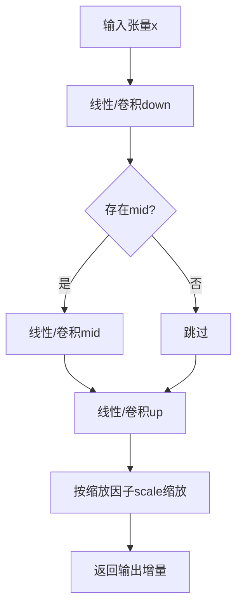
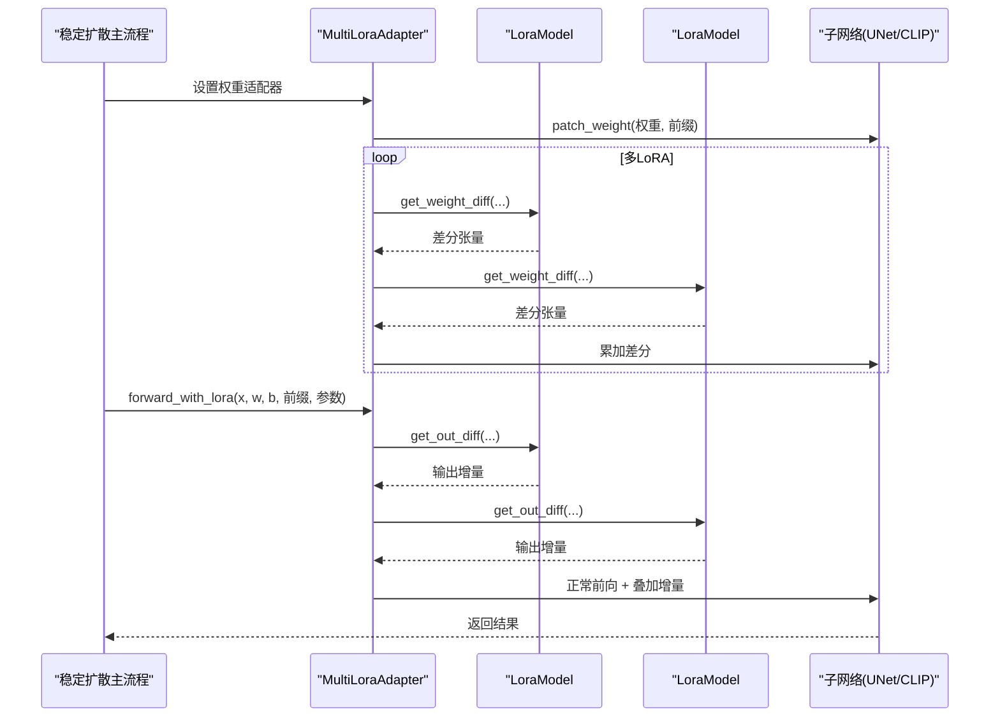
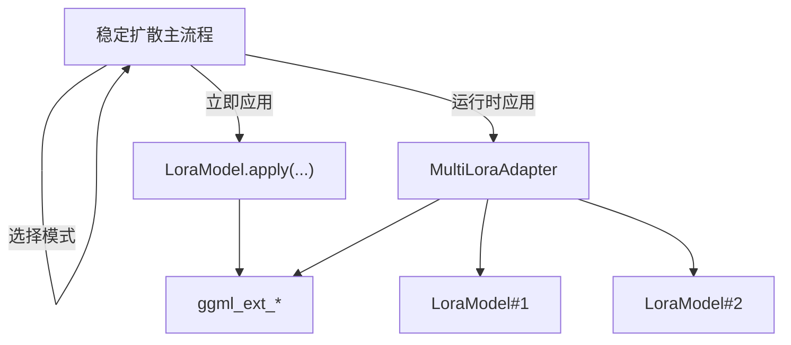

# LoRA微调支持

<cite>
**本文档引用的文件**
- [lora.hpp](file://src/lora.hpp)
- [ggml_extend.hpp](file://src/ggml_extend.hpp)
- [stable-diffusion.cpp](file://src/stable-diffusion.cpp)
- [lora.md](file://docs/lora.md)
- [main.cpp](file://examples/cli/main.cpp)
- [server/main.cpp](file://examples/server/main.cpp)
</cite>

## 目录
1. [简介](#简介)
2. [项目结构](#项目结构)
3. [核心组件](#核心组件)
4. [架构总览](#架构总览)
5. [详细组件分析](#详细组件分析)
6. [依赖关系分析](#依赖关系分析)
7. [性能考虑](#性能考虑)
8. [故障排查指南](#故障排查指南)
9. [结论](#结论)
10. [附录](#附录)

## 简介
本文件系统化阐述本仓库中LoRA（Low-Rank Adaptation）微调的实现原理、架构设计与使用方法。内容覆盖LoRA模型的加载、预处理与应用流程，支持的标准LoRA、LoHA与LoKr三种变体的权重合并算法、缩放因子计算与张量操作，以及运行时与立即应用两种模式的选择策略。同时提供配置参数说明、训练流程概述、文件格式与兼容性说明，并给出在图像生成中进行风格迁移与个性化定制的实际使用示例。

## 项目结构
LoRA支持主要由以下模块构成：
- 模型加载与权重适配：LoraModel负责从文件加载LoRA权重，构建图并在推理时对原生模型权重进行融合或前向路径增量修正。
- 张量扩展与算子：ggml_extend提供LoRA关键算子，如低秩合并、Kronecker积、LoKR前向等。
- 运行时调度：稳定扩散主流程根据量化状态自动选择“立即应用”或“运行时应用”模式，并管理多LoRA叠加。
- 命令行与服务端集成：CLI与Server示例展示了LoRA目录配置、提示词内LoRA指定与缓存刷新机制。

**图表来源**
- [main.cpp](file://examples/cli/main.cpp)
- [server/main.cpp](file://examples/server/main.cpp)
- [stable-diffusion.cpp](file://src/stable-diffusion.cpp)
- [lora.hpp](file://src/lora.hpp)
- [ggml_extend.hpp](file://src/ggml_extend.hpp)
- [lora.md](file://docs/lora.md)

**章节来源**
- [lora.hpp](file://src/lora.hpp)
- [ggml_extend.hpp](file://src/ggml_extend.hpp)
- [stable-diffusion.cpp](file://src/stable-diffusion.cpp)
- [lora.md](file://docs/lora.md)
- [main.cpp](file://examples/cli/main.cpp)
- [server/main.cpp](file://examples/server/main.cpp)

## 核心组件
- LoraModel：封装单个LoRA模型的加载、权重预处理、权重差分计算、图构建与应用。
- MultiLoraAdapter：聚合多个LoRA模型，按权重名或前缀匹配进行增量修正，并在前向路径叠加LoRA输出增量。
- ggml_ext_*：提供LoRA核心张量操作，包括标准LoRA合并、LoHA分解乘法、LoKr Kronecker积与前向路径实现。

关键职责与交互：
- 加载阶段：通过ModelLoader按需创建LoRA张量，建立名称到张量的映射。
- 预处理阶段：针对特定模型（如CLIP）对LoRA权重名称进行映射，保证与目标权重键一致。
- 应用阶段：在“立即应用”模式下直接将权重差分加到原生权重；在“运行时应用”模式下通过WeightAdapter在前向路径叠加LoRA输出增量。

**章节来源**
- [lora.hpp](file://src/lora.hpp)
- [ggml_extend.hpp](file://src/ggml_extend.hpp)

## 架构总览
LoRA在本项目中的两种应用模式由稳定扩散主流程自动或手动选择：

**图表来源**
- [stable-diffusion.cpp](file://src/stable-diffusion.cpp)
- [lora.hpp](file://src/lora.hpp)

**章节来源**
- [stable-diffusion.cpp](file://src/stable-diffusion.cpp)
- [lora.md](file://docs/lora.md)

## 详细组件分析

### LoraModel类与权重差分计算
- 加载与初始化
  - 通过构造函数初始化ModelLoader并转换名称前缀，随后按需加载张量。
  - 支持过滤器以仅加载匹配的张量，减少内存占用。
- 预处理
  - 针对特定编码器层的Q/K/V拼接权重，将LoRA键名映射为对应in_proj权重键，确保名称一致性。
- 权重差分计算
  - 标准LoRA：从lora_down与lora_up（可选lora_mid）合并得到updown，计算缩放因子后拼接。
  - LoHA：两组Hadamard分解权重相乘得到两个updown，再逐元素相乘并缩放。
  - LoKr：两组Kronecker分解权重相乘得到两个矩阵，再计算其Kronecker积并缩放。
  - Raw diff：直接使用“.diff”张量作为权重差分，按multiplier缩放。
- 缩放因子与multiplier
  - 若存在“.scale”，直接使用；否则使用“.alpha/rank”计算缩放值。
  - 最终缩放值乘以LoraModel::multiplier，实现用户级强度控制。
- 图构建与应用
  - build_lora_graph遍历模型权重，若找到匹配的LoRA权重差分，则将其加到原权重上，构建计算图并执行。
  - 在非CPU后端且权重位于主机缓冲区时，会复制到计算缓冲区以避免主机/设备同步问题。

**图表来源**
- [lora.hpp](file://src/lora.hpp)

**章节来源**
- [lora.hpp](file://src/lora.hpp)

### ggml_ext扩展算子与张量操作
- 合并LoRA权重（merge_lora）
  - 将lora_up与lora_down展平并转置后相乘，得到updown；若提供lora_mid则按卷积Tucker分解方式组合。
- Kronecker积（kronecker）
  - 对两个张量进行插值放大后逐元素相乘，实现LoKr的Kronecker积效果。
- LoRA前向（linear/conv2d）
  - 标准LoRA：线性层按顺序执行down→mid→up的线性变换，卷积层同理但使用卷积算子。
- LoKr前向（lokr_forward）
  - 将输入按维度拆分，分别与内外两组权重（全秩或低秩分解）进行矩阵乘或卷积，最终按比例缩放。

**图表来源**
- [ggml_extend.hpp](file://src/ggml_extend.hpp)
- [lora.hpp](file://src/lora.hpp)

**章节来源**
- [ggml_extend.hpp](file://src/ggml_extend.hpp)
- [lora.hpp](file://src/lora.hpp)

### 多LoRA适配器与前向路径叠加
- MultiLoraAdapter按权重名或前缀匹配，依次对权重加权差分，并在前向路径叠加LoRA输出增量。
- 对于线性层与卷积层分别调用对应的扩展算子，确保类型与尺寸兼容。

**图表来源**
- [lora.hpp](file://src/lora.hpp)
- [stable-diffusion.cpp](file://src/stable-diffusion.cpp)

**章节来源**
- [lora.hpp](file://src/lora.hpp)
- [stable-diffusion.cpp](file://src/stable-diffusion.cpp)

### LoRA权重矩阵合并算法与缩放因子
- 标准LoRA合并
  - updown = (lora_up × lora_down^T)^T（或卷积Tucker分解形式），随后按缩放因子缩放。
- LoHA合并
  - updown_1 = merge_lora(w1_b, w1_a, t1)，updown_2 = merge_lora(w2_b, w2_a, t2)，最终为updown_1 ⊙ updown_2（逐元素乘）。
- LoKr合并
  - 若提供lokr_w1/lokr_w2则直接使用；否则先用lokr_w1_a/b或lokr_w2_a/b合并得到完整权重，再计算Kronecker积。
- 缩放因子
  - scale = alpha / rank 或直接使用scale张量；最终乘以multiplier实现强度调节。

**章节来源**
- [lora.hpp](file://src/lora.hpp)
- [ggml_extend.hpp](file://src/ggml_extend.hpp)

### 配置参数与文件格式
- 基本参数
  - multiplier：LoRA强度倍数，影响最终缩放值。
  - alpha：用于缩放因子计算的超参，通常与rank相关。
  - rank：低秩分解的秩大小，决定缩放因子的分母。
  - scale：显式缩放张量，优先于alpha/rank。
- 文件格式
  - 支持.safetensors与.ckpt格式的LoRA权重文件。
  - 键名约定：标准LoRA为lora.{key}.lora_down、lora.{key}.lora_up、可选lora.{key}.lora_mid、lora.{key}.alpha或lora.{key}.scale；LoHA为hada_w*_a/b与可选hada_t*；LoKr为lokr_w*或lokr_w*_a/b。
- 兼容性
  - 当模型包含量化权重时，默认采用运行时应用模式以保证精度与兼容性；否则采用立即应用模式以提升速度与降低内存占用。

**章节来源**
- [lora.hpp](file://src/lora.hpp)
- [lora.md](file://docs/lora.md)

### 训练流程与提示词集成
- 训练流程（概念性说明）
  - 使用LoRA训练框架（如A1111 WebUI）生成.safetensors或.ckpt权重文件。
  - 在提示词中通过<lora:name:multiplier>语法指定LoRA及其强度，CLI与Server示例均支持该语法解析与加载。
- 提示词与LoRA目录
  - 通过--lora-model-dir指定LoRA权重所在目录；未指定时默认当前工作目录。
  - 示例：./bin/sd-cli -m ../models/v1-5-pruned-emaonly.safetensors -p "a lovely cat<lora:marblesh:1>" --lora-model-dir ../models

**章节来源**
- [lora.md](file://docs/lora.md)
- [main.cpp](file://examples/cli/main.cpp)
- [server/main.cpp](file://examples/server/main.cpp)

### 实际使用示例（风格迁移与个性化定制）
- 风格迁移
  - 使用风格化LoRA（如artistic风格）配合提示词，通过multiplier调节风格强度。
  - 示例：在提示词中加入<lora:style_name:0.8>，并设置--lora-model-dir指向LoRA目录。
- 个性化定制
  - 使用人物LoRA（如photomaker风格）结合人像主体，通过较小multiplier实现自然融合。
  - 示例：在提示词中加入<lora:personality:0.5>，并确保LoRA文件存在于指定目录。

**章节来源**
- [lora.md](file://docs/lora.md)
- [main.cpp](file://examples/cli/main.cpp)
- [server/main.cpp](file://examples/server/main.cpp)

## 依赖关系分析
- 组件耦合
  - LoraModel依赖ModelLoader与GGMLRunner，负责权重加载与图执行。
  - MultiLoraAdapter依赖多个LoraModel，实现多LoRA叠加。
  - 稳定扩散主流程根据量化状态选择应用模式，并将适配器注入到各子模型。
- 外部依赖
  - ggml后端（CPU/CUDA/Metal等）用于张量运算与图执行。
  - safetensors/ckpt文件格式用于权重存储与加载。

**图表来源**
- [stable-diffusion.cpp](file://src/stable-diffusion.cpp)
- [lora.hpp](file://src/lora.hpp)
- [ggml_extend.hpp](file://src/ggml_extend.hpp)

**章节来源**
- [stable-diffusion.cpp](file://src/stable-diffusion.cpp)
- [lora.hpp](file://src/lora.hpp)
- [ggml_extend.hpp](file://src/ggml_extend.hpp)

## 性能考虑
- 立即应用模式
  - 优点：推理速度快，内存占用可能更低。
  - 风险：与量化权重可能存在精度与兼容性问题。
- 运行时应用模式
  - 优点：兼容性更好，精度更高。
  - 成本：可能带来额外的前向开销与内存占用。
- 优化建议
  - 优先使用非量化模型或在量化模型上启用运行时应用模式。
  - 合理设置multiplier，避免过度叠加导致数值不稳定。
  - 对于大体积LoRA，尽量使用GPU后端以加速张量运算。

[本节为通用指导，无需具体文件来源]

## 故障排查指南
- 未应用任何LoRA权重
  - 检查LoRA文件路径与名称前缀是否正确；确认键名与目标权重一致（必要时触发预处理映射）。
  - 查看日志中“Only (...) LoRA tensors have been applied”提示，定位未使用的权重。
- 量化模型精度异常
  - 切换至运行时应用模式，确保LoRA在前向路径正确叠加。
- 内存不足或速度过慢
  - 调整multiplier，减少LoRA数量；或切换到立即应用模式（若兼容）。

**章节来源**
- [lora.hpp](file://src/lora.hpp)
- [stable-diffusion.cpp](file://src/stable-diffusion.cpp)

## 结论
本项目提供了完整的LoRA微调支持，涵盖标准LoRA、LoHA与LoKr三种变体的权重合并与前向路径叠加。通过“立即应用”与“运行时应用”两种模式，兼顾性能与精度，并在CLI与Server中提供便捷的提示词与目录配置接口。建议在量化模型上优先采用运行时应用模式，在非量化模型上可选择立即应用模式以获得更优性能。

[本节为总结，无需具体文件来源]

## 附录
- 关键实现位置
  - LoRA模型封装与应用：[lora.hpp](file://src/lora.hpp)
  - 扩展算子与张量操作：[ggml_extend.hpp](file://src/ggml_extend.hpp)
  - 应用模式选择与多LoRA管理：[stable-diffusion.cpp](file://src/stable-diffusion.cpp)
  - 使用示例与参数说明：[lora.md](file://docs/lora.md)
  - CLI与Server集成示例：[main.cpp](file://examples/cli/main.cpp)、[server/main.cpp](file://examples/server/main.cpp)

[本节为补充信息，无需具体文件来源]