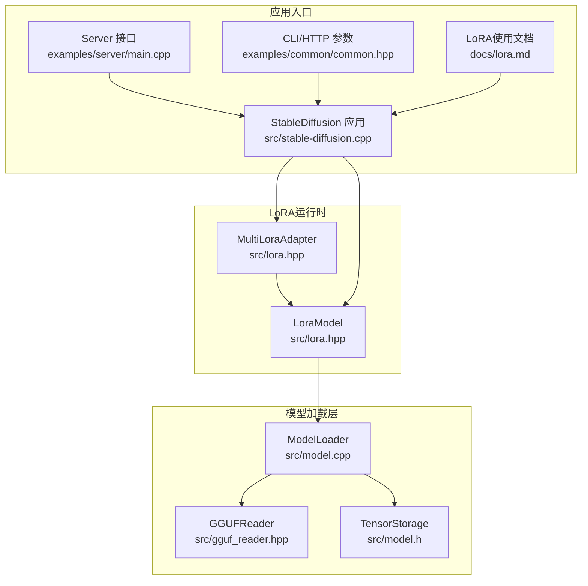
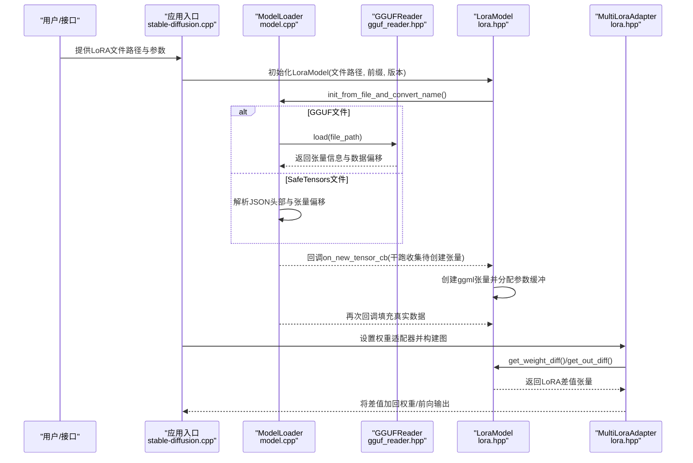
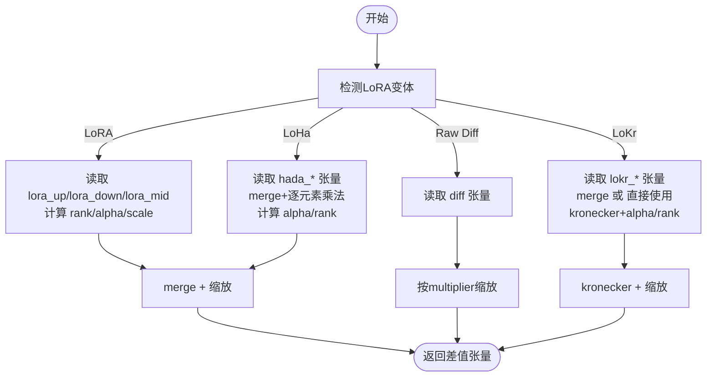
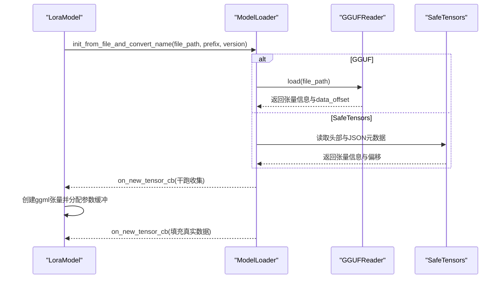
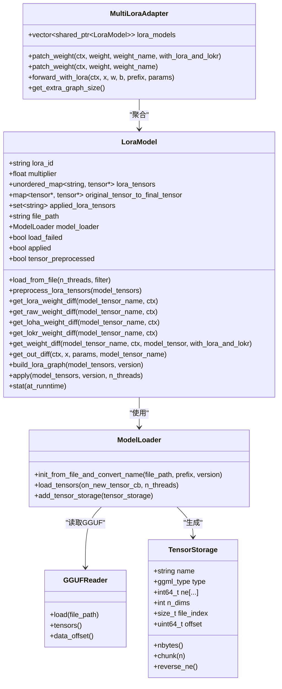

# LoRA文件格式

<cite>
**本文引用的文件**
- [lora.hpp](file://src/lora.hpp)
- [model.cpp](file://src/model.cpp)
- [gguf_reader.hpp](file://src/gguf_reader.hpp)
- [model.h](file://src/model.h)
- [stable-diffusion.cpp](file://src/stable-diffusion.cpp)
- [lora.md](file://docs/lora.md)
- [common.hpp](file://examples/common/common.hpp)
- [main.cpp](file://examples/server/main.cpp)
</cite>

## 目录
1. [简介](#简介)
2. [项目结构](#项目结构)
3. [核心组件](#核心组件)
4. [架构总览](#架构总览)
5. [详细组件分析](#详细组件分析)
6. [依赖关系分析](#依赖关系分析)
7. [性能考量](#性能考量)
8. [故障排查指南](#故障排查指南)
9. [结论](#结论)
10. [附录](#附录)

## 简介
本文件系统化梳理了LoRA（Low-Rank Adaptation）在本项目中的文件格式与运行机制，覆盖以下关键点：
- LoRA权重张量的命名规范与存储组织（含lora_down、lora_up、lora_mid、diff、hada_*、lokr_*等）
- 不同LoRA变体（普通LoRA、Raw Diff、LoHa、LoKr）的权重合并与缩放策略
- 元数据信息（alpha、scale、rank）的存储位置与计算逻辑
- LoRA文件的加载与解析流程（支持GGUF与SafeTensors两种后端）
- 版本兼容性与名称映射处理
- 文件格式规范（二进制与文本）、验证与完整性检查方法
- 加载与应用模式（立即应用 vs 运行时应用）

## 项目结构
围绕LoRA功能的关键文件与职责如下：
- LoRA运行与适配器：src/lora.hpp
- 模型加载与多后端支持：src/model.cpp
- GGUF二进制读取：src/gguf_reader.hpp
- 张量描述与分块：src/model.h
- 应用入口与运行时控制：src/stable-diffusion.cpp
- 文档与使用示例：docs/lora.md
- 服务器端LoRA参数解析：examples/server/main.cpp
- CLI/HTTP接口LoRA参数序列化：examples/common/common.hpp

图表来源
- [lora.hpp:9-912](file://src/lora.hpp#L9-L912)
- [model.cpp:283-612](file://src/model.cpp#L283-L612)
- [gguf_reader.hpp:35-232](file://src/gguf_reader.hpp#L35-L232)
- [model.h:181-286](file://src/model.h#L181-L286)
- [stable-diffusion.cpp:1089-1121](file://src/stable-diffusion.cpp#L1089-L1121)
- [lora.md:1-27](file://docs/lora.md#L1-L27)
- [main.cpp:858-900](file://examples/server/main.cpp#L858-L900)
- [common.hpp:1925-1957](file://examples/common/common.hpp#L1925-L1957)

章节来源
- [lora.hpp:9-912](file://src/lora.hpp#L9-L912)
- [model.cpp:283-612](file://src/model.cpp#L283-L612)
- [gguf_reader.hpp:35-232](file://src/gguf_reader.hpp#L35-L232)
- [model.h:181-286](file://src/model.h#L181-L286)
- [stable-diffusion.cpp:1089-1121](file://src/stable-diffusion.cpp#L1089-L1121)
- [lora.md:1-27](file://docs/lora.md#L1-L27)
- [main.cpp:858-900](file://examples/server/main.cpp#L858-L900)
- [common.hpp:1925-1957](file://examples/common/common.hpp#L1925-L1957)

## 核心组件
- LoraModel：封装单个LoRA模型的加载、权重差值计算、图构建与应用统计。支持普通LoRA、Raw Diff、LoHa、LoKr等多种变体，并对特定模型（如CLIP QKV）进行名称预处理以适配权重键名。
- MultiLoraAdapter：聚合多个LoraModel，按需对权重与前向输出叠加LoRA差值。
- ModelLoader：统一的模型加载器，支持从GGUF与SafeTensors中解析张量信息与偏移，生成TensorStorage列表供后续读取。
- GGUFReader：专门读取GGUF文件头、元数据与张量信息，计算数据区对齐后的起始偏移。
- TensorStorage：描述张量的类型、形状、文件索引与偏移，支持分块读取与维度重排。

章节来源
- [lora.hpp:9-912](file://src/lora.hpp#L9-L912)
- [model.cpp:283-612](file://src/model.cpp#L283-L612)
- [gguf_reader.hpp:35-232](file://src/gguf_reader.hpp#L35-L232)
- [model.h:181-286](file://src/model.h#L181-L286)

## 架构总览
LoRA在本项目中的工作流分为“加载阶段”和“应用阶段”：
- 加载阶段：ModelLoader根据文件类型选择GGUF或SafeTensors路径，解析张量元信息并生成TensorStorage；随后LoraModel通过回调注册实际张量，完成张量创建与参数缓冲分配。
- 应用阶段：MultiLoraAdapter遍历模型权重，调用LoraModel计算对应权重差值（按变体选择合并策略），最终将差值加回到原权重或前向输出上。

图表来源
- [stable-diffusion.cpp:1089-1121](file://src/stable-diffusion.cpp#L1089-L1121)
- [model.cpp:283-612](file://src/model.cpp#L283-L612)
- [gguf_reader.hpp:172-225](file://src/gguf_reader.hpp#L172-L225)
- [lora.hpp:39-95](file://src/lora.hpp#L39-L95)
- [lora.hpp:750-789](file://src/lora.hpp#L750-L789)

## 详细组件分析

### LoRA权重张量命名规范与存储组织
- 基本前缀：所有LoRA张量均以固定前缀开头，用于区分与过滤。LoraModel构造时会为文件中的张量名加上统一前缀，便于后续匹配。
- 普通LoRA（lora_*）：
  - lora_down：低秩下投影矩阵，决定rank与缩放因子的分母
  - lora_up：低秩上投影矩阵
  - lora_mid（可选）：中间激活矩阵（如非线性）
  - alpha：可选标量，用于scale = alpha / rank
  - scale：可选标量，显式覆盖scale
- Raw Diff（diff）：直接存储权重差值张量，无需分解
- LoHa（hada_*）：
  - hada_w1_a / hada_w1_b：第一组低秩分解
  - hada_t1：第一组tucker分解的核（可选）
  - hada_w2_a / hada_w2_b：第二组低秩分解
  - hada_t2：第二组tucker分解的核（可选）
  - alpha：可选标量
- LoKr（lokr_*）：
  - lokr_w1 / lokr_w1_a + lokr_w1_b：第一组合并（若只有w1则直接使用，否则merge）
  - lokr_w2 / lokr_w2_a + lokr_w2_b：第二组合并
  - alpha：可选标量
- 多实例支持：当同一权重键存在多个LoRA实例时，通过“键名.序号”的形式进行匹配（例如“attn.q_proj.weight.0”、“attn.q_proj.weight.1”）。

章节来源
- [lora.hpp:132-209](file://src/lora.hpp#L132-L209)
- [lora.hpp:211-249](file://src/lora.hpp#L211-L249)
- [lora.hpp:251-352](file://src/lora.hpp#L251-L352)
- [lora.hpp:354-469](file://src/lora.hpp#L354-L469)
- [lora.hpp:618-747](file://src/lora.hpp#L618-L747)

### 权重差值计算与合并策略
- 普通LoRA：
  - 合并：updown = merge(lora_down, lora_up, lora_mid)
  - 缩放：scale由alpha/rank或显式scale决定，再乘以LoRA倍率multiplier
- Raw Diff：
  - 直接使用diff张量，按multiplier缩放
- LoHa：
  - 分别merge两组hadamard分解，得到updown_1与updown_2，然后逐元素相乘，再按alpha/rank缩放
- LoKr：
  - 若仅有w1/w2则直接使用，否则先merge(w1_b, w1_a)与merge(w2_b, w2_a)，再计算kronecker积，最后按alpha/rank缩放（rank为1时scale=1）
- 输出差值（前向）：
  - 对于线性层与卷积层分别执行相应算子，支持conv2d参数（步幅、填充、空洞、direct等），并在必要时进行类型转换（如F16）

图表来源
- [lora.hpp:132-209](file://src/lora.hpp#L132-L209)
- [lora.hpp:211-249](file://src/lora.hpp#L211-L249)
- [lora.hpp:251-352](file://src/lora.hpp#L251-L352)
- [lora.hpp:354-469](file://src/lora.hpp#L354-L469)

章节来源
- [lora.hpp:132-209](file://src/lora.hpp#L132-L209)
- [lora.hpp:211-249](file://src/lora.hpp#L211-L249)
- [lora.hpp:251-352](file://src/lora.hpp#L251-L352)
- [lora.hpp:354-469](file://src/lora.hpp#L354-L469)

### 元数据与配置信息
- alpha：标量张量，用于计算scale = alpha / rank；若未提供，则使用scale作为显式缩放因子
- scale：标量张量，显式覆盖默认缩放
- rank：由lora_down最后一维决定（或lokr_*分解矩阵的最后一维）
- multiplier：LoRA倍率，最终缩放为scale * multiplier
- 额外元数据：部分LoRA文件可能包含额外元信息（如dora_scale），但当前实现主要依赖alpha与scale

章节来源
- [lora.hpp:179-195](file://src/lora.hpp#L179-L195)
- [lora.hpp:665-681](file://src/lora.hpp#L665-L681)

### LoRA文件加载与解析流程
- 文件类型识别：
  - GGUF：通过魔数与版本字段判断；读取元数据与张量信息，计算数据区对齐后的起始偏移
  - SafeTensors：读取头部长度与JSON元数据，解析张量形状与偏移
- 张量注册：
  - 干跑阶段收集需要创建的张量，建立名称到TensorStorage的映射
  - 正式阶段创建ggml张量并分配参数缓冲，再次加载填充真实数据
- 名称预处理：
  - 针对特定模型（如CLIP QKV）将旧键名映射到新键名，确保LoRA权重能正确匹配

图表来源
- [model.cpp:283-477](file://src/model.cpp#L283-L477)
- [model.cpp:479-612](file://src/model.cpp#L479-L612)
- [gguf_reader.hpp:172-225](file://src/gguf_reader.hpp#L172-L225)
- [lora.hpp:39-95](file://src/lora.hpp#L39-L95)

章节来源
- [model.cpp:283-477](file://src/model.cpp#L283-L477)
- [model.cpp:479-612](file://src/model.cpp#L479-L612)
- [gguf_reader.hpp:172-225](file://src/gguf_reader.hpp#L172-L225)
- [lora.hpp:39-95](file://src/lora.hpp#L39-L95)

### 版本兼容性与名称映射
- 针对特定模型（如CLIP的Q/K/V投影）进行键名映射，将旧键名替换为新键名，保证LoRA权重能正确匹配
- 支持多实例LoRA（通过“.序号”后缀），循环匹配直到找不到对应张量为止

章节来源
- [lora.hpp:97-130](file://src/lora.hpp#L97-L130)
- [lora.hpp:132-209](file://src/lora.hpp#L132-L209)
- [lora.hpp:618-747](file://src/lora.hpp#L618-L747)

### 应用模式与运行时控制
- 应用模式：
  - 自动：若模型包含量化参数则采用运行时应用，否则立即应用
  - 立即应用：更快推理速度，可能在量化参数上存在精度与兼容性问题
  - 运行时应用：更高精度与兼容性，可能更慢且内存占用更高
- 运行时应用：清理已有适配器，按LoRA状态重新设置权重适配器并构建计算图

章节来源
- [lora.md:15-27](file://docs/lora.md#L15-L27)
- [stable-diffusion.cpp:1089-1121](file://src/stable-diffusion.cpp#L1089-L1121)

### 使用与参数传递
- 服务器端LoRA参数解析：支持数组形式的LoRA对象，包含路径、倍率与高噪声标记
- CLI/HTTP接口LoRA参数序列化：将LoRA映射序列化为字符串，便于日志与调试

章节来源
- [main.cpp:870-900](file://examples/server/main.cpp#L870-L900)
- [common.hpp:1925-1957](file://examples/common/common.hpp#L1925-L1957)

## 依赖关系分析
- LoraModel依赖ModelLoader进行文件解析与张量注册
- MultiLoraAdapter聚合多个LoraModel，统一管理权重与前向差值叠加
- ModelLoader内部依赖GGUFReader与SafeTensors解析逻辑
- TensorStorage提供张量元信息与分块读取能力

图表来源
- [lora.hpp:9-912](file://src/lora.hpp#L9-L912)
- [model.cpp:283-612](file://src/model.cpp#L283-L612)
- [gguf_reader.hpp:35-232](file://src/gguf_reader.hpp#L35-L232)
- [model.h:181-286](file://src/model.h#L181-L286)

章节来源
- [lora.hpp:9-912](file://src/lora.hpp#L9-L912)
- [model.cpp:283-612](file://src/model.cpp#L283-L612)
- [gguf_reader.hpp:35-232](file://src/gguf_reader.hpp#L35-L232)
- [model.h:181-286](file://src/model.h#L181-L286)

## 性能考量
- 立即应用模式在量化模型上可能存在精度与兼容性问题，但通常推理更快、内存占用更低
- 运行时应用模式在量化模型上具备更好的精度与兼容性，但可能带来更高的延迟与内存开销
- LoRA图构建大小与LoRA张数量线性相关，可通过减少LoRA数量或降低multiplier来优化

章节来源
- [lora.md:15-27](file://docs/lora.md#L15-L27)
- [lora.hpp:750-789](file://src/lora.hpp#L750-L789)

## 故障排查指南
- 未应用的LoRA张量：统计函数会记录未被使用的LoRA张量，便于定位未匹配的键名或版本不一致问题
- 键名不匹配：确认LoRA文件是否针对目标模型版本；必要时启用名称预处理逻辑
- 类型不匹配：在conv2d场景下，若张量类型非F16会进行类型转换；确保输入与权重类型一致以避免额外开销
- 量化兼容性：若模型包含量化参数，建议使用运行时应用模式

章节来源
- [lora.hpp:807-832](file://src/lora.hpp#L807-L832)
- [lora.hpp:517-747](file://src/lora.hpp#L517-L747)

## 结论
本项目的LoRA实现以统一的张量命名与变体合并策略为核心，通过ModelLoader与GGUF/SafeTensors解析器实现跨格式支持，并在运行时提供灵活的应用模式选择。通过对alpha/scale/rank的标准化处理与名称映射，LoRA能够在多种模型架构间保持良好的兼容性与可移植性。

## 附录

### LoRA文件格式规范（二进制与文本）
- GGUF格式：
  - 魔数与版本：通过魔数与版本字段识别
  - 元数据：包含general.alignment等关键元数据，影响数据区对齐
  - 张量信息：包含名称、形状、类型与偏移，支持多维张量
  - 数据区：按对齐要求排列，偏移从data_offset开始
- SafeTensors格式：
  - 头部长度：固定长度字段指示JSON头部大小
  - JSON元数据：包含每个张量的形状、类型与偏移
  - 数据区：按元数据顺序存放张量数据

章节来源
- [gguf_reader.hpp:172-225](file://src/gguf_reader.hpp#L172-L225)
- [model.cpp:298-339](file://src/model.cpp#L298-L339)
- [model.cpp:581-612](file://src/model.cpp#L581-L612)

### 验证与完整性检查方法
- 文件类型验证：通过魔数与头部字段判断文件类型
- 张量计数一致性：解析出的张量总数应与元数据一致
- 对齐校验：GGUF数据区对齐后偏移应满足对齐要求
- 张量尺寸一致性：TensorStorage计算的字节数应与实际读取一致
- 运行时统计：未应用张量数量应为0，否则检查键名与版本

章节来源
- [gguf_reader.hpp:172-225](file://src/gguf_reader.hpp#L172-L225)
- [model.cpp:451-477](file://src/model.cpp#L451-L477)
- [model.h:213-225](file://src/model.h#L213-L225)
- [lora.hpp:807-832](file://src/lora.hpp#L807-L832)