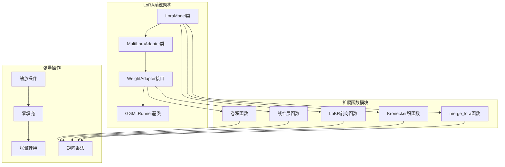
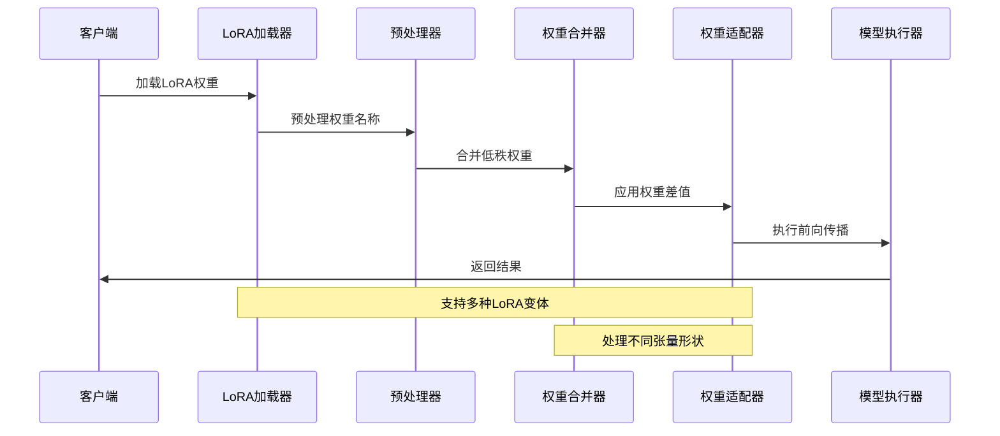
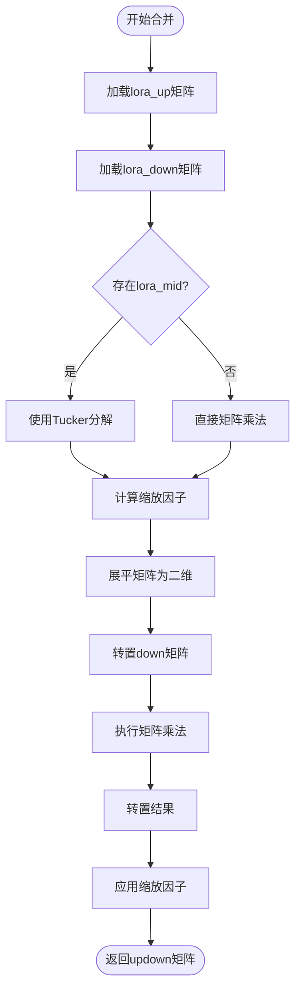
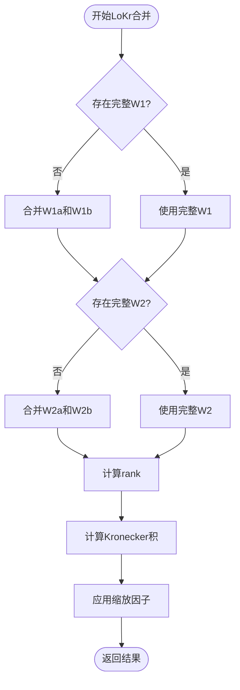
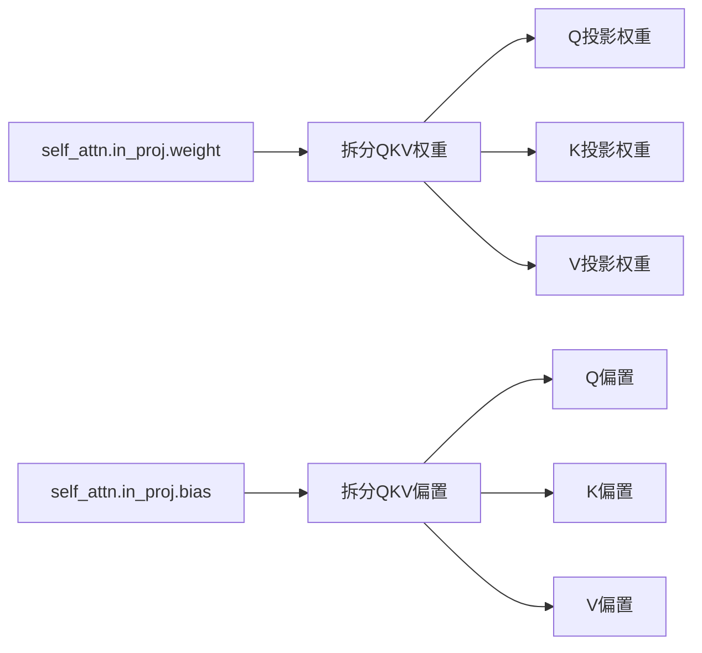
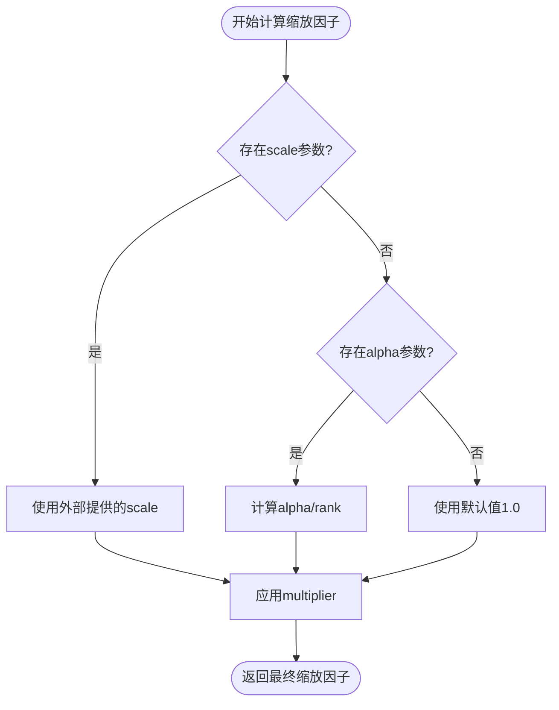
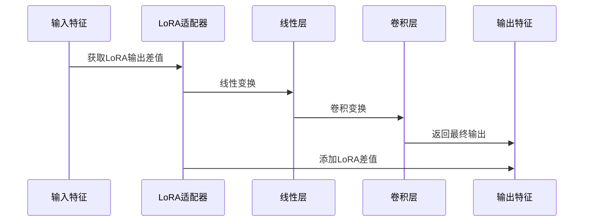
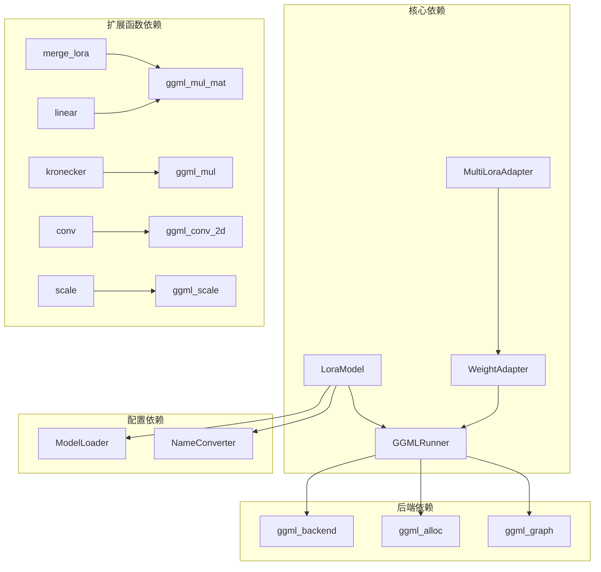
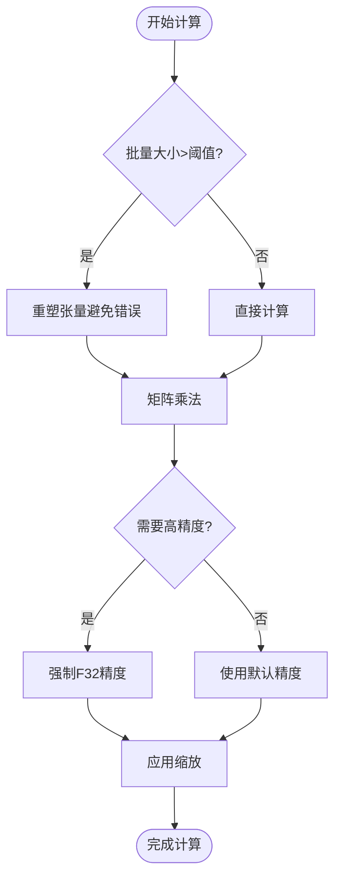

# LoRA权重操作

<cite>
**本文档引用的文件**
- [lora.hpp](file://src/lora.hpp)
- [ggml_extend.hpp](file://src/ggml_extend.hpp)
- [lora.md](file://docs/lora.md)
</cite>

## 目录
1. [简介](#简介)
2. [项目结构](#项目结构)
3. [核心组件](#核心组件)
4. [架构概览](#架构概览)
5. [详细组件分析](#详细组件分析)
6. [依赖关系分析](#依赖关系分析)
7. [性能考量](#性能考量)
8. [故障排除指南](#故障排除指南)
9. [结论](#结论)

## 简介

本文档深入解析了稳定扩散模型中的LoRA（Low-Rank Adaptation）权重操作系统。LoRA是一种高效的微调技术，通过在预训练模型中添加低秩矩阵来实现参数高效适配。该系统支持多种LoRA变体，包括标准LoRA、LoHA（Hadamard分解）和LoKr（Kronecker积）操作。

LoRA权重操作的核心在于将低秩分解的权重矩阵合并为标准权重矩阵，然后与原始模型权重进行加法融合。这种设计既保持了模型的原有功能，又允许通过可学习的低秩参数实现特定领域的适配。

## 项目结构

LoRA系统主要由以下关键组件构成：



**图表来源**
- [lora.hpp:1-912](file://src/lora.hpp#L1-L912)
- [ggml_extend.hpp:108-2847](file://src/ggml_extend.hpp#L108-L2847)

**章节来源**
- [lora.hpp:1-912](file://src/lora.hpp#L1-L912)
- [ggml_extend.hpp:1-2847](file://src/ggml_extend.hpp#L1-L2847)

## 核心组件

### LoraModel类

LoraModel是LoRA系统的核心类，负责加载、处理和应用LoRA权重。其主要职责包括：

- **权重加载**：从文件系统加载LoRA权重张量
- **权重预处理**：适配不同模型架构的权重名称映射
- **权重合并**：将低秩权重矩阵合并为标准权重矩阵
- **权重应用**：将合并后的权重差值应用到目标模型

### MultiLoraAdapter类

MultiLoraAdapter提供了多LoRA模型的统一管理接口，支持同时应用多个LoRA适配器。

### WeightAdapter接口

WeightAdapter定义了权重适配的标准接口，包括权重修补和前向传播两个核心功能。

**章节来源**
- [lora.hpp:9-833](file://src/lora.hpp#L9-L833)

## 架构概览

LoRA系统的整体架构采用分层设计，从底层的张量操作到上层的权重适配形成完整的处理链路：



**图表来源**
- [lora.hpp:471-502](file://src/lora.hpp#L471-L502)
- [lora.hpp:844-900](file://src/lora.hpp#L844-L900)

## 详细组件分析

### 标准LoRA权重合并算法

标准LoRA的权重合并基于低秩矩阵分解原理，将权重差值计算为up和down矩阵的乘积。

#### 数学公式

对于标准LoRA，权重差值计算公式为：
```
ΔW = scale × (W_up × W_down^T)
```

其中：
- `W_up` 和 `W_down` 是低秩分解的上半部和下半部矩阵
- `scale` 是缩放因子，通常为 `α/rank` 或从外部提供的scale值

#### 实现细节



**图表来源**
- [ggml_extend.hpp:117-146](file://src/ggml_extend.hpp#L117-L146)
- [lora.hpp:132-209](file://src/lora.hpp#L132-L209)

**章节来源**
- [ggml_extend.hpp:117-146](file://src/ggml_extend.hpp#L117-L146)
- [lora.hpp:132-209](file://src/lora.hpp#L132-L209)

### LoHA权重操作

LoHA（Hadamard分解）是LoRA的一种变体，使用Hadamard积（逐元素乘法）而非矩阵乘法。

#### 数学公式

LoHA的权重差值计算为：
```
ΔW = scale × (W_up1 ⊙ W_up2) ⊙ (W_down1 ⊙ W_down2)
```

其中 `⊙` 表示Hadamard积。

#### 实现特点

LoHA实现的关键在于使用逐元素乘法替代矩阵乘法，这要求up和down矩阵具有相同的维度。

**章节来源**
- [lora.hpp:251-352](file://src/lora.hpp#L251-L352)

### LoKr权重操作

LoKr（Kronecker积）是另一种LoRA变体，使用Kronecker积来构建权重矩阵。

#### 数学公式

LoKr的权重差值计算为：
```
ΔW = scale × (W1 ⊗ W2)
```

其中 `⊗` 表示Kronecker积。

#### 实现机制



**图表来源**
- [lora.hpp:354-469](file://src/lora.hpp#L354-L469)
- [ggml_extend.hpp:148-160](file://src/ggml_extend.hpp#L148-L160)

**章节来源**
- [lora.hpp:354-469](file://src/lora.hpp#L354-L469)
- [ggml_extend.hpp:148-160](file://src/ggml_extend.hpp#L148-L160)

### 权重预处理和张量形状适配

LoRA系统实现了复杂的权重预处理机制，以适配不同模型架构的权重名称和形状。

#### QKV权重特殊处理

系统对QKV（查询、键、值）权重进行了专门处理，将标准注意力权重拆分为独立的投影权重：



**图表来源**
- [lora.hpp:103-130](file://src/lora.hpp#L103-L130)

#### 张量维度匹配

系统通过以下机制处理张量维度不匹配问题：

1. **自动形状推断**：根据权重名称推断正确的张量形状
2. **维度重塑**：将高维张量重塑为二维矩阵进行矩阵运算
3. **批量维度处理**：支持批量处理和序列长度变化

**章节来源**
- [lora.hpp:97-130](file://src/lora.hpp#L97-L130)
- [lora.hpp:471-502](file://src/lora.hpp#L471-L502)

### 缩放因子计算

缩放因子是LoRA权重操作中的关键参数，决定了适配强度。

#### 计算策略



**图表来源**
- [lora.hpp:179-195](file://src/lora.hpp#L179-L195)
- [lora.hpp:444-456](file://src/lora.hpp#L444-L456)

**章节来源**
- [lora.hpp:179-195](file://src/lora.hpp#L179-L195)
- [lora.hpp:444-456](file://src/lora.hpp#L444-L456)

### 前向传播路径

LoRA系统支持两种前向传播模式：权重修补和直接前向传播。

#### 权重修补模式



**图表来源**
- [lora.hpp:504-748](file://src/lora.hpp#L504-L748)

**章节来源**
- [lora.hpp:504-748](file://src/lora.hpp#L504-L748)

## 依赖关系分析

LoRA系统的依赖关系呈现清晰的层次结构：



**图表来源**
- [lora.hpp:1-912](file://src/lora.hpp#L1-L912)
- [ggml_extend.hpp:1-2847](file://src/ggml_extend.hpp#L1-L2847)

**章节来源**
- [lora.hpp:1-912](file://src/lora.hpp#L1-L912)
- [ggml_extend.hpp:1-2847](file://src/ggml_extend.hpp#L1-L2847)

## 性能考量

### 内存管理策略

LoRA系统采用了多项内存优化策略：

1. **延迟加载**：仅在需要时加载和处理LoRA权重
2. **张量复用**：重用中间计算结果减少内存分配
3. **批量处理**：支持批量维度优化计算效率
4. **类型转换优化**：智能选择数据类型以平衡精度和性能

### 计算优化



**图表来源**
- [ggml_extend.hpp:1029-1061](file://src/ggml_extend.hpp#L1029-L1061)

### 并行化策略

系统支持多线程并行处理，包括：

- **权重加载并行**：多个LoRA模型可以并行加载
- **计算图构建并行**：不同层的计算可以并行执行
- **后端加速**：利用GPU等硬件加速计算

**章节来源**
- [ggml_extend.hpp:1029-1061](file://src/ggml_extend.hpp#L1029-L1061)
- [lora.hpp:791-805](file://src/lora.hpp#L791-L805)

## 故障排除指南

### 常见问题诊断

#### 权重形状不匹配

当出现权重形状不匹配错误时，检查以下方面：

1. **权重名称映射**：确认LoRA权重名称与模型权重名称的对应关系
2. **张量维度**：验证张量的维度是否符合预期
3. **批量维度**：检查批量维度是否正确处理

#### 内存不足问题

解决内存不足问题的方法：

1. **降低批量大小**：减少同时处理的样本数量
2. **释放缓存**：及时清理不再使用的中间结果
3. **优化数据类型**：在不影响精度的前提下使用更小的数据类型

#### 性能问题

性能问题的排查步骤：

1. **检查后端配置**：确认是否正确配置了硬件加速后端
2. **分析计算图**：检查是否存在不必要的计算节点
3. **监控内存使用**：观察内存使用峰值和趋势

**章节来源**
- [lora.hpp:807-832](file://src/lora.hpp#L807-L832)

## 结论

LoRA权重操作系统展现了现代深度学习模型微调技术的先进性。通过精心设计的算法和优化策略，该系统实现了：

1. **高效性**：低秩分解显著减少了需要训练的参数数量
2. **灵活性**：支持多种LoRA变体以适应不同的应用场景
3. **兼容性**：能够无缝集成到现有的模型架构中
4. **可扩展性**：支持多LoRA模型的联合应用

该系统不仅为稳定扩散模型提供了强大的适配能力，也为其他深度学习模型的参数高效微调提供了有价值的参考。随着技术的不断发展，LoRA系统将继续演进，为AI模型的个性化和定制化提供更好的解决方案。