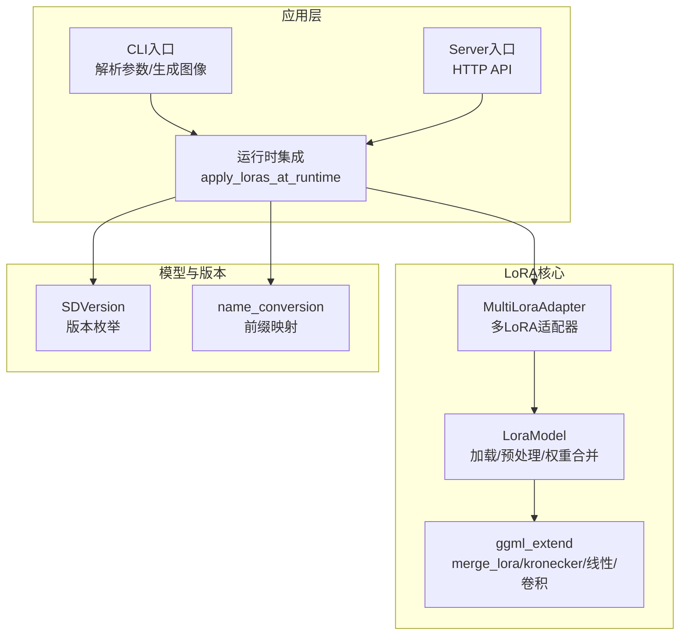
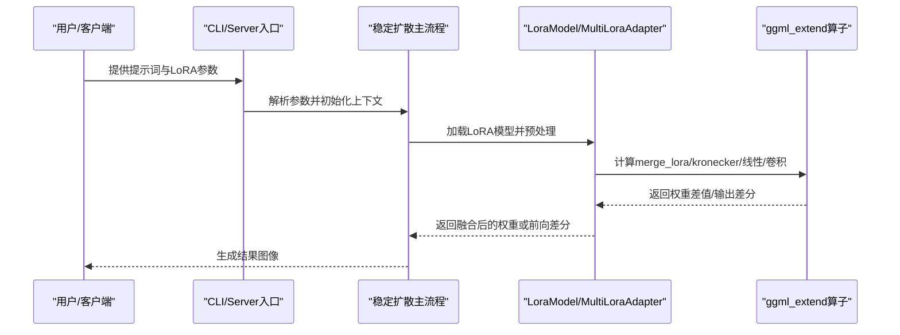
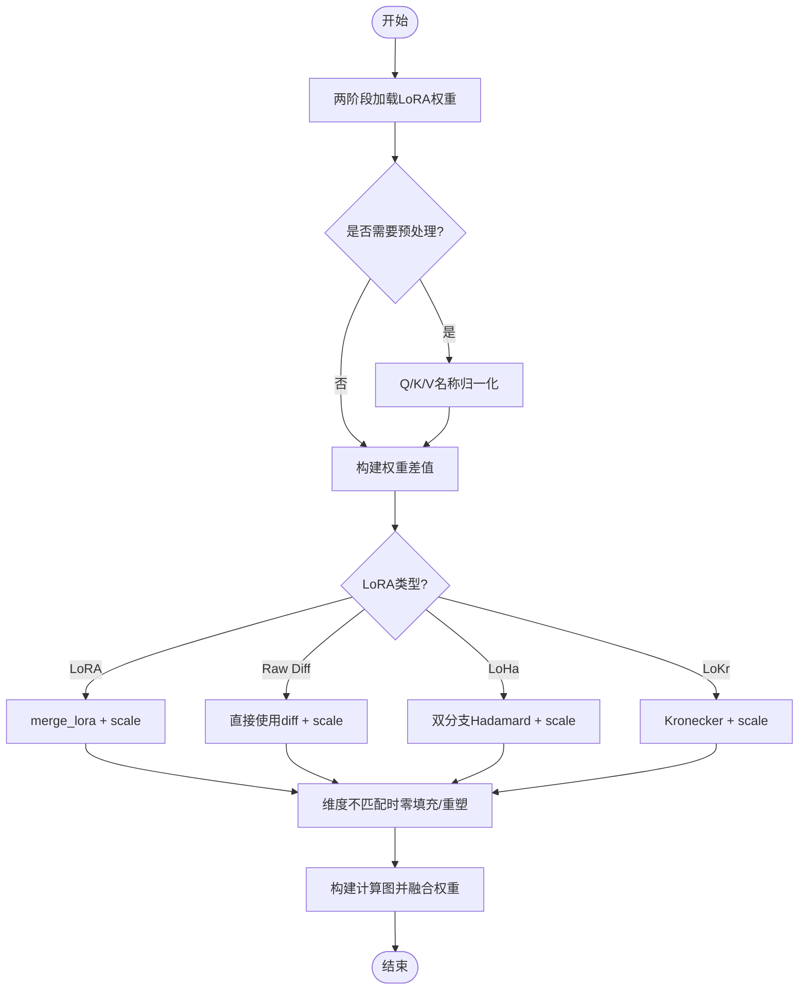
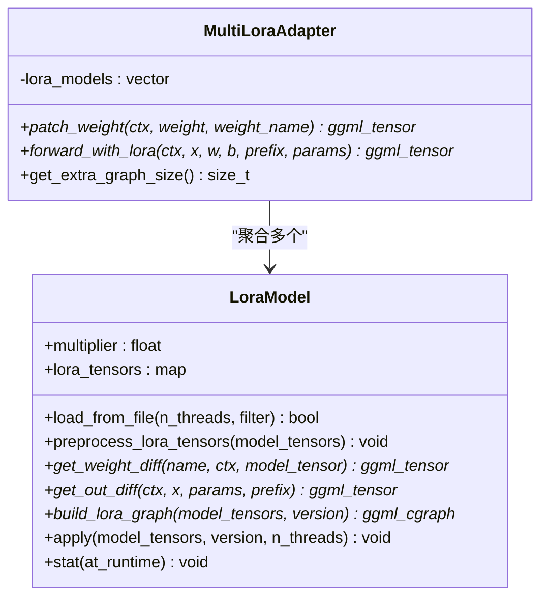
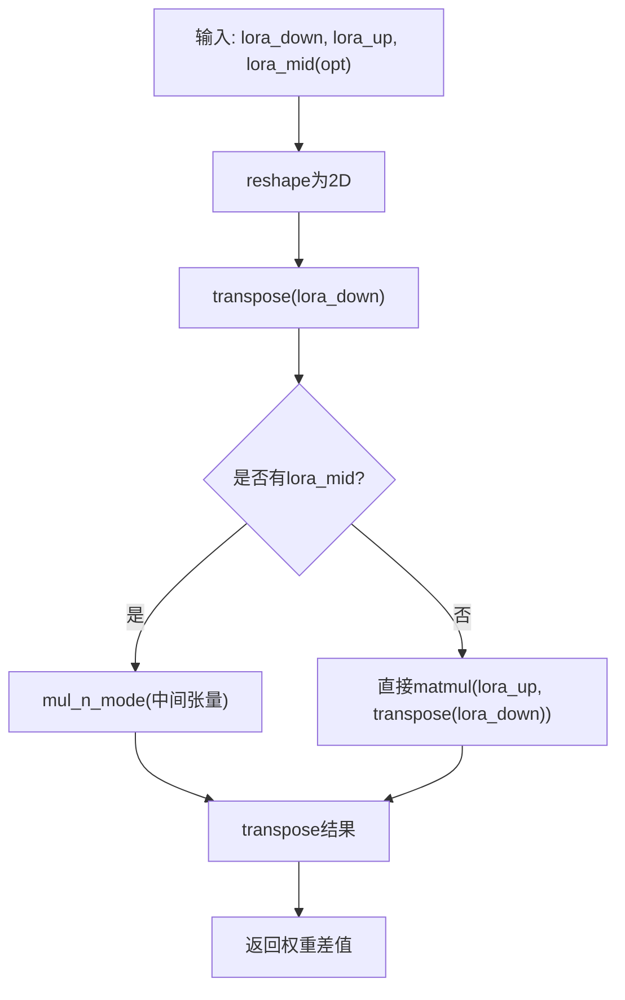
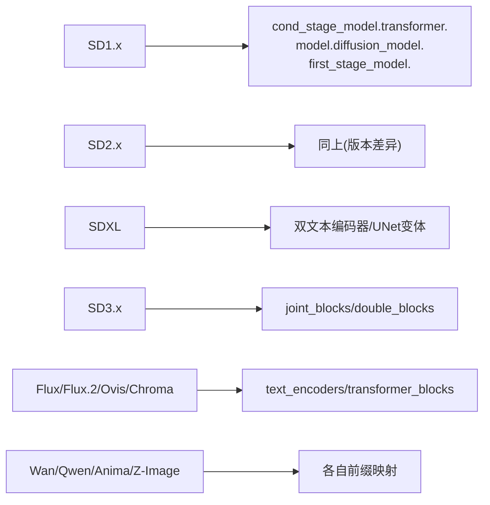
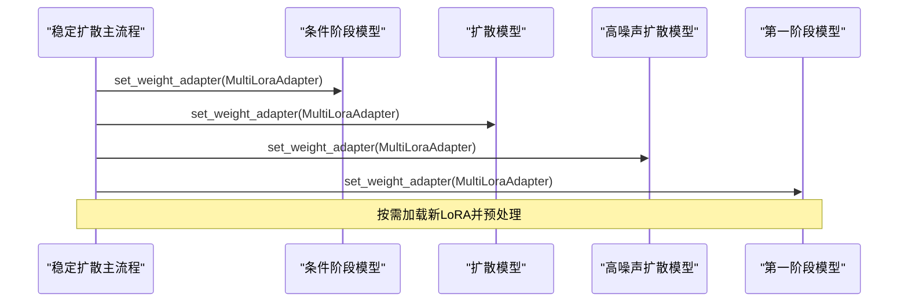
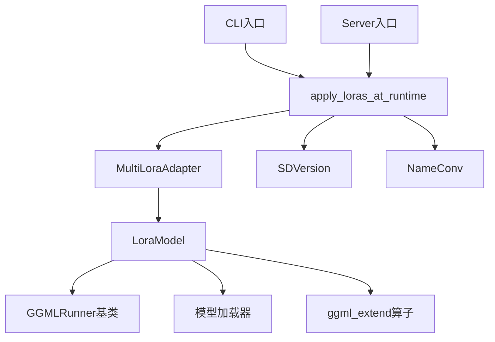

# LoRA集成应用

<cite>
**本文档引用的文件**
- [lora.hpp](file://src/lora.hpp)
- [ggml_extend.hpp](file://src/ggml_extend.hpp)
- [stable-diffusion.cpp](file://src/stable-diffusion.cpp)
- [model.h](file://src/model.h)
- [name_conversion.cpp](file://src/name_conversion.cpp)
- [lora.md](file://docs/lora.md)
- [main.cpp](file://examples/cli/main.cpp)
- [common.hpp](file://examples/common/common.hpp)
- [server_main.cpp](file://examples/server/main.cpp)
</cite>

## 目录
1. [简介](#简介)
2. [项目结构](#项目结构)
3. [核心组件](#核心组件)
4. [架构总览](#架构总览)
5. [详细组件分析](#详细组件分析)
6. [依赖关系分析](#依赖关系分析)
7. [性能考虑](#性能考虑)
8. [故障排除指南](#故障排除指南)
9. [结论](#结论)
10. [附录](#附录)

## 简介
本文件系统性阐述LoRA（Low-Rank Adaptation）在稳定扩散模型中的集成与应用，覆盖LoRA模型的加载、预处理与权重合并流程；LoRA与原生模型的融合机制（权重差值的计算与添加、张量操作实现）；参数配置（multiplier倍数、alpha值、rank参数）；在不同扩散模型（SD1.x、SD2.x、SDXL等）中的适配方法；实际使用示例（命令行参数与API调用）；以及性能优化策略与故障排除建议。

## 项目结构
LoRA集成主要涉及以下模块：
- LoRA模型加载与权重合并：src/lora.hpp
- 张量扩展与LoRA/LoKr/LoHa核心算子：src/ggml_extend.hpp
- 模型版本识别与前缀映射：src/model.h、src/name_conversion.cpp
- 应用模式与运行时集成：src/stable-diffusion.cpp
- 命令行与服务器接口：examples/cli/main.cpp、examples/common/common.hpp、examples/server/main.cpp
- 文档说明：docs/lora.md

**图表来源**
- [lora.hpp:9-912](file://src/lora.hpp#L9-L912)
- [ggml_extend.hpp:117-160](file://src/ggml_extend.hpp#L117-L160)
- [model.h:23-54](file://src/model.h#L23-L54)
- [name_conversion.cpp:1067-1094](file://src/name_conversion.cpp#L1067-L1094)
- [stable-diffusion.cpp:1097-1183](file://src/stable-diffusion.cpp#L1097-L1183)
- [main.cpp:212-226](file://examples/cli/main.cpp#L212-L226)
- [server_main.cpp:858-900](file://examples/server/main.cpp#L858-L900)

**章节来源**
- [lora.hpp:1-912](file://src/lora.hpp#L1-L912)
- [ggml_extend.hpp:117-160](file://src/ggml_extend.hpp#L117-L160)
- [model.h:23-174](file://src/model.h#L23-L174)
- [name_conversion.cpp:1067-1094](file://src/name_conversion.cpp#L1067-L1094)
- [stable-diffusion.cpp:1097-1183](file://src/stable-diffusion.cpp#L1097-L1183)
- [lora.md:1-27](file://docs/lora.md#L1-L27)
- [main.cpp:212-226](file://examples/cli/main.cpp#L212-L226)
- [common.hpp:792-798](file://examples/common/common.hpp#L792-L798)
- [server_main.cpp:858-900](file://examples/server/main.cpp#L858-L900)

## 核心组件
- LoraModel：负责从文件加载LoRA权重、名称规范化、按需预处理（如QKV合并）、构建权重差值图、执行权重融合与统计。
- MultiLoraAdapter：聚合多个LoRA模型，按前向路径动态叠加权重差值或输出差分。
- ggml_extend：提供LoRA核心算子（merge_lora、kronecker、线性/卷积前向），用于权重差值计算与融合。
- SDVersion与name_conversion：根据模型版本选择正确的前缀映射，确保LoRA权重名与模型权重名匹配。

**章节来源**
- [lora.hpp:9-912](file://src/lora.hpp#L9-L912)
- [ggml_extend.hpp:117-160](file://src/ggml_extend.hpp#L117-L160)
- [model.h:23-174](file://src/model.h#L23-L174)
- [name_conversion.cpp:1067-1094](file://src/name_conversion.cpp#L1067-L1094)

## 架构总览
LoRA在该系统中以两种模式应用：
- 立即应用（immediately）：在构建图阶段直接将权重差值加到原生权重上，适合非量化权重，速度更快但可能精度略低。
- 运行时应用（at_runtime）：通过WeightAdapter在前向过程中动态叠加LoRA差分，兼容量化权重，精度更高但开销更大。

**图表来源**
- [stable-diffusion.cpp:1097-1183](file://src/stable-diffusion.cpp#L1097-L1183)
- [lora.hpp:750-805](file://src/lora.hpp#L750-L805)
- [ggml_extend.hpp:117-160](file://src/ggml_extend.hpp#L117-L160)

## 详细组件分析

### LoraModel：LoRA模型加载与权重合并
- 加载流程
  - 初始化模型加载器，按指定前缀与版本进行名称转换与过滤。
  - 两阶段加载：先Dry-run收集待创建张量，再正式加载并填充LoRA权重张量。
- 预处理
  - 针对特定模型（如CLIP）将Q/K/V投影权重名统一为in_proj形式，便于LoRA匹配。
- 权重差值计算
  - 支持LoRA（lora_down/lora_up/lora_mid）、Raw Diff（diff）、LoHa（Hadamard分解）、LoKr（Kronecker分解）。
  - 自动推导scale：优先使用显式scale，否则使用alpha/rank；乘以multiplier得到最终缩放。
  - 对于2D权重，若维度不一致则进行零填充与重塑，保证形状匹配。
- 图构建与融合
  - 在计算图中为每个匹配到的原生权重节点添加add操作，将权重差值融合进原权重。
  - 对CPU后端的主机缓冲区进行复制，避免写回问题。

**图表来源**
- [lora.hpp:39-95](file://src/lora.hpp#L39-L95)
- [lora.hpp:97-130](file://src/lora.hpp#L97-L130)
- [lora.hpp:132-209](file://src/lora.hpp#L132-L209)
- [lora.hpp:211-249](file://src/lora.hpp#L211-L249)
- [lora.hpp:251-352](file://src/lora.hpp#L251-L352)
- [lora.hpp:354-469](file://src/lora.hpp#L354-L469)
- [lora.hpp:471-502](file://src/lora.hpp#L471-L502)
- [lora.hpp:750-789](file://src/lora.hpp#L750-L789)

**章节来源**
- [lora.hpp:39-95](file://src/lora.hpp#L39-L95)
- [lora.hpp:97-130](file://src/lora.hpp#L97-L130)
- [lora.hpp:132-209](file://src/lora.hpp#L132-L209)
- [lora.hpp:211-249](file://src/lora.hpp#L211-L249)
- [lora.hpp:251-352](file://src/lora.hpp#L251-L352)
- [lora.hpp:354-469](file://src/lora.hpp#L354-L469)
- [lora.hpp:471-502](file://src/lora.hpp#L471-L502)
- [lora.hpp:750-789](file://src/lora.hpp#L750-L789)

### MultiLoraAdapter：多LoRA适配器
- 聚合多个LoraModel，依次计算权重差值并累加到原权重。
- 支持前向时的输出差分叠加，分别处理线性和卷积两种操作类型。
- 动态估算图大小，为后续计算图预留空间。

**图表来源**
- [lora.hpp:835-912](file://src/lora.hpp#L835-L912)
- [lora.hpp:791-832](file://src/lora.hpp#L791-L832)

**章节来源**
- [lora.hpp:835-912](file://src/lora.hpp#L835-L912)
- [lora.hpp:791-832](file://src/lora.hpp#L791-L832)

### ggml_extend：LoRA核心算子
- merge_lora：将低秩矩阵下采样与上采样相乘，得到权重差值；支持卷积场景的Tucker分解中间张量。
- kronecker：计算Kronecker积，用于LoKr分解。
- 线性/卷积前向：在LoRA输出差分路径中使用，支持F16类型转换与多种卷积参数。

**图表来源**
- [ggml_extend.hpp:117-146](file://src/ggml_extend.hpp#L117-L146)

**章节来源**
- [ggml_extend.hpp:117-146](file://src/ggml_extend.hpp#L117-L146)
- [ggml_extend.hpp:148-160](file://src/ggml_extend.hpp#L148-L160)
- [ggml_extend.hpp:2677-2707](file://src/ggml_extend.hpp#L2677-L2707)

### 模型版本与名称映射
- SDVersion枚举涵盖SD1.x、SD2.x、SDXL、SD3、Flux、Flux.2、Wan、Qwen Image、Anima、Z-Image等多种版本。
- name_conversion提供前缀映射规则，将LoRA权重名映射到对应模型的权重名空间，确保匹配成功。

**图表来源**
- [model.h:23-174](file://src/model.h#L23-L174)
- [name_conversion.cpp:1067-1094](file://src/name_conversion.cpp#L1067-L1094)

**章节来源**
- [model.h:23-174](file://src/model.h#L23-L174)
- [name_conversion.cpp:1067-1094](file://src/name_conversion.cpp#L1067-L1094)

### 运行时LoRA应用流程
- 清理旧LoRA适配器，按模型组件（条件阶段/扩散模型/高噪声扩散模型/第一阶段）分别加载与预处理。
- 使用MultiLoraAdapter设置到对应模型，实现前向时的动态叠加。

**图表来源**
- [stable-diffusion.cpp:1097-1183](file://src/stable-diffusion.cpp#L1097-L1183)

**章节来源**
- [stable-diffusion.cpp:1097-1183](file://src/stable-diffusion.cpp#L1097-L1183)

## 依赖关系分析
- LoraModel依赖GGMLRunner与模型加载器，通过ggml_extend完成张量运算。
- MultiLoraAdapter依赖多个LoraModel，按前向路径叠加差分。
- 运行时集成依赖SDVersion与name_conversion，确保权重名匹配。
- CLI/Server通过参数解析与API调用触发LoRA应用。

**图表来源**
- [lora.hpp:9-33](file://src/lora.hpp#L9-L33)
- [lora.hpp:835-912](file://src/lora.hpp#L835-L912)
- [stable-diffusion.cpp:1097-1183](file://src/stable-diffusion.cpp#L1097-L1183)
- [model.h:23-54](file://src/model.h#L23-L54)
- [name_conversion.cpp:1067-1094](file://src/name_conversion.cpp#L1067-L1094)
- [main.cpp:212-226](file://examples/cli/main.cpp#L212-L226)
- [server_main.cpp:858-900](file://examples/server/main.cpp#L858-L900)

**章节来源**
- [lora.hpp:9-33](file://src/lora.hpp#L9-L33)
- [lora.hpp:835-912](file://src/lora.hpp#L835-L912)
- [stable-diffusion.cpp:1097-1183](file://src/stable-diffusion.cpp#L1097-L1183)
- [model.h:23-54](file://src/model.h#L23-L54)
- [name_conversion.cpp:1067-1094](file://src/name_conversion.cpp#L1067-L1094)
- [main.cpp:212-226](file://examples/cli/main.cpp#L212-L226)
- [server_main.cpp:858-900](file://examples/server/main.cpp#L858-L900)

## 性能考虑
- 立即应用模式（immediately）
  - 优点：在构建图阶段一次性融合权重，推理速度快，内存占用可能更低。
  - 适用：非量化权重或对速度敏感场景。
- 运行时应用模式（at_runtime）
  - 优点：兼容量化权重，精度更稳定。
  - 代价：每次前向需要额外的LoRA差分计算与叠加，可能增加延迟与内存。
- 自动模式（auto）
  - 若模型包含量化参数则自动选择at_runtime，否则选择immediately。
- 优化建议
  - 合理设置multiplier，避免过大导致数值不稳定。
  - 优先使用F16权重与后端加速（CUDA/Metal等）。
  - 控制LoRA数量与rank，平衡效果与性能。
  - 使用图大小估算与预分配，减少运行时内存抖动。

[本节为通用指导，无需具体文件分析]

## 故障排除指南
- LoRA未生效
  - 检查LoRA权重文件路径与扩展名（.safetensors/.ckpt/.gguf）。
  - 确认提示词中LoRA语法正确：<lora:name:multiplier>。
  - 查看日志中“仅部分LoRA张量被应用”的警告，确认权重名映射是否成功。
- 名称不匹配
  - 使用name_conversion前缀映射功能，确保LoRA权重名与模型权重名一致。
  - 对SDXL等多文本编码器模型，注意区分cond_stage_model与cond_stage_model.1。
- 精度/兼容性问题
  - 若模型含量化权重，强制使用at_runtime模式。
  - 检查后端类型（F16/F32）与卷积参数（direct/circular等）。
- 性能异常
  - 切换应用模式观察差异。
  - 减少LoRA数量或降低rank，或提升multiplier至合适范围。

**章节来源**
- [lora.md:1-27](file://docs/lora.md#L1-L27)
- [lora.hpp:807-832](file://src/lora.hpp#L807-L832)
- [name_conversion.cpp:1067-1094](file://src/name_conversion.cpp#L1067-L1094)
- [common.hpp:792-798](file://examples/common/common.hpp#L792-L798)

## 结论
该LoRA集成方案提供了灵活且高效的权重融合能力，既支持立即应用以获得更快推理速度，也支持运行时应用以增强兼容性与精度。通过完善的名称映射与多LoRA适配器机制，可在SD1.x、SD2.x、SDXL及多种现代扩散模型中稳定工作。配合合理的参数配置与性能优化策略，可满足从开发调试到生产部署的多样化需求。

[本节为总结，无需具体文件分析]

## 附录

### 参数配置与使用示例

- 基本参数
  - LoRA模型目录：通过命令行参数指定，默认当前工作目录。
  - LoRA应用模式：auto/immediately/at_runtime，自动模式会根据模型是否量化选择at_runtime。
  - 提示词LoRA语法：<lora:name:multiplier>，支持绝对/相对路径与自动扩展名查找。
  - 高噪声LoRA：可通过特殊前缀标记为高噪声LoRA。

- 命令行示例
  - 指定LoRA目录与提示词中的LoRA条目，系统会自动解析并加载对应权重。
  - 示例命令格式参见文档说明。

- API调用（服务器）
  - JSON请求中可包含lora数组，每项包含path、multiplier、is_high_noise字段。
  - 服务端会校验路径有效性并构建LoRA状态，随后应用到扩散模型。

**章节来源**
- [lora.md:1-27](file://docs/lora.md#L1-L27)
- [common.hpp:792-798](file://examples/common/common.hpp#L792-L798)
- [main.cpp:228-228](file://examples/cli/main.cpp#L228-L228)
- [server_main.cpp:870-900](file://examples/server/main.cpp#L870-L900)