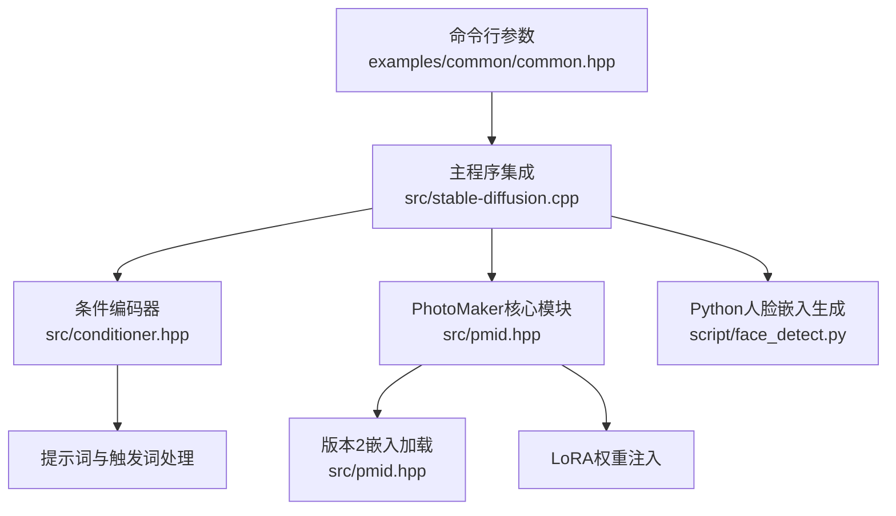
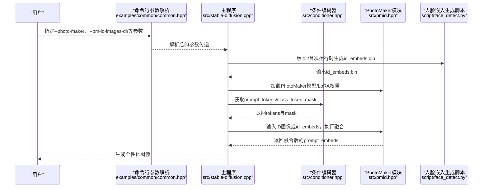
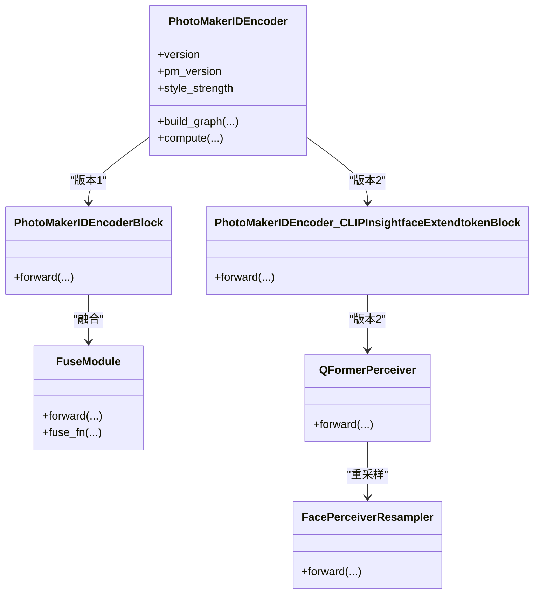
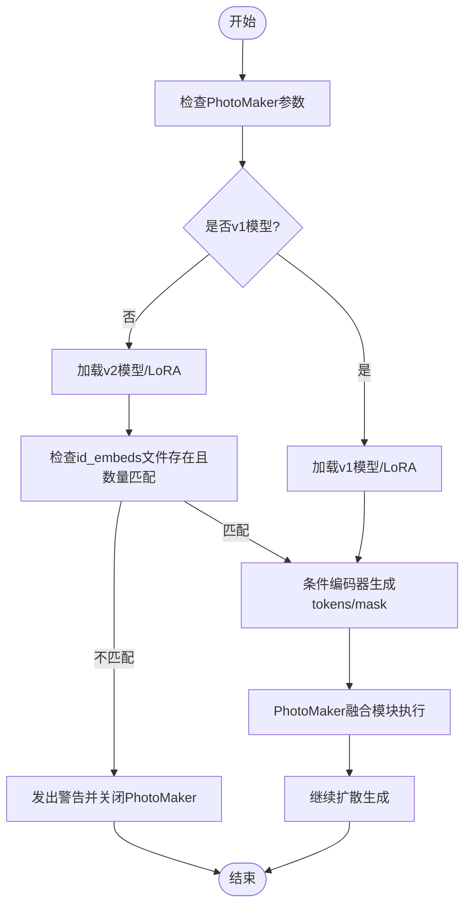
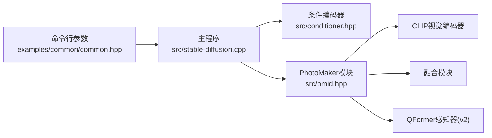

# PhotoMaker个性化

<cite>
**本文引用的文件**
- [photo_maker.md](file://docs/photo_maker.md)
- [pmid.hpp](file://src/pmid.hpp)
- [face_detect.py](file://script/face_detect.py)
- [stable-diffusion.cpp](file://src/stable-diffusion.cpp)
- [conditioner.hpp](file://src/conditioner.hpp)
- [common.hpp](file://examples/common/common.hpp)
- [main.cpp](file://examples/cli/main.cpp)
</cite>

## 目录
1. [简介](#简介)
2. [项目结构](#项目结构)
3. [核心组件](#核心组件)
4. [架构总览](#架构总览)
5. [详细组件分析](#详细组件分析)
6. [依赖关系分析](#依赖关系分析)
7. [性能考量](#性能考量)
8. [故障排查指南](#故障排查指南)
9. [结论](#结论)
10. [附录](#附录)

## 简介
本文件系统性阐述PhotoMaker个性化功能在本仓库中的实现与使用方法，覆盖人脸特征提取、个性化嵌入生成、风格迁移机制、模型加载与配置、提示词构建与文本编码策略、完整使用流程以及最佳实践与效果对比建议。读者无需深入底层即可按步骤完成从人脸图像上传到最终图像生成的全流程。

## 项目结构
围绕PhotoMaker功能的相关文件主要分布在以下位置：
- 文档与使用说明：docs/photo_maker.md
- 核心实现（个性化嵌入与融合模块）：src/pmid.hpp
- 版本2专用的人脸嵌入生成脚本：script/face_detect.py
- 主程序集成点（模型加载、参数解析、运行时控制）：src/stable-diffusion.cpp
- 提示词编码与触发词处理：src/conditioner.hpp
- 命令行参数定义：examples/common/common.hpp
- CLI入口与参数打印：examples/cli/main.cpp

**图示来源**
- [common.hpp:1116-1123](file://examples/common/common.hpp#L1116-L1123)
- [stable-diffusion.cpp:695-714](file://src/stable-diffusion.cpp#L695-L714)
- [conditioner.hpp:301-364](file://src/conditioner.hpp#L301-L364)
- [pmid.hpp:395-566](file://src/pmid.hpp#L395-L566)
- [face_detect.py:37-88](file://script/face_detect.py#L37-L88)

**章节来源**
- [photo_maker.md:1-54](file://docs/photo_maker.md#L1-L54)
- [common.hpp:1116-1123](file://examples/common/common.hpp#L1116-L1123)
- [stable-diffusion.cpp:695-714](file://src/stable-diffusion.cpp#L695-L714)
- [pmid.hpp:395-566](file://src/pmid.hpp#L395-L566)
- [face_detect.py:37-88](file://script/face_detect.py#L37-L88)

## 核心组件
- PhotoMakerIDEncoder：负责将输入ID图像通过视觉编码与融合模块生成个性化嵌入，并将其融合到文本提示的对应位置，支持版本1与版本2两种路径。
- PhotoMakerIDEmbed：用于加载版本2所需的预先计算好的id_embeds二进制文件。
- 条件编码器（Conditioner）：负责对提示词进行分词、定位触发词“img”、扩展类词token并生成class_token_mask，为个性化嵌入的融合提供掩码信息。
- 主程序集成：在运行时根据参数选择PhotoMaker模型、加载LoRA权重、读取ID图像或id_embeds、调用编码器与融合逻辑。

**章节来源**
- [pmid.hpp:395-566](file://src/pmid.hpp#L395-L566)
- [pmid.hpp:567-639](file://src/pmid.hpp#L567-L639)
- [conditioner.hpp:301-364](file://src/conditioner.hpp#L301-L364)
- [stable-diffusion.cpp:695-714](file://src/stable-diffusion.cpp#L695-L714)

## 架构总览
下图展示了从命令行参数到最终图像生成的端到端流程，重点标注了PhotoMaker相关的数据流与控制点。

**图示来源**
- [common.hpp:1116-1123](file://examples/common/common.hpp#L1116-L1123)
- [stable-diffusion.cpp:695-714](file://src/stable-diffusion.cpp#L695-L714)
- [pmid.hpp:395-566](file://src/pmid.hpp#L395-L566)
- [conditioner.hpp:301-364](file://src/conditioner.hpp#L301-L364)
- [face_detect.py:37-88](file://script/face_detect.py#L37-L88)

## 详细组件分析

### 组件A：PhotoMakerIDEncoder（个性化嵌入与融合）
- 功能职责
  - 版本1：通过CLIP视觉编码器提取ID图像特征，生成两路投影嵌入并在通道维拼接，再经融合模块与文本提示嵌入融合。
  - 版本2：先用QFormer感知器对输入id_embeds进行重采样与跨注意力融合，再与文本提示嵌入融合。
  - 支持style_strength参数控制个性化强度。
- 关键数据结构
  - class_tokens_mask/class_tokens_mask_pos：指示提示中“img”触发词所在位置，决定融合区域。
  - left/right：用于保留提示词前后未被融合的部分，保证token序列连续性。
- 计算图构建
  - 将id_pixel_values、prompt_embeds、id_embeds（版本2）映射到后端张量。
  - 构建mask张量与左右零片段，调用id_encoder/id_encoder2执行前向。
  - 返回融合后的prompt_embeds供后续扩散模型使用。

**图示来源**
- [pmid.hpp:395-566](file://src/pmid.hpp#L395-L566)
- [pmid.hpp:312-351](file://src/pmid.hpp#L312-L351)
- [pmid.hpp:353-393](file://src/pmid.hpp#L353-L393)
- [pmid.hpp:247-311](file://src/pmid.hpp#L247-L311)
- [pmid.hpp:154-202](file://src/pmid.hpp#L154-L202)

**章节来源**
- [pmid.hpp:395-566](file://src/pmid.hpp#L395-L566)
- [pmid.hpp:247-311](file://src/pmid.hpp#L247-L311)
- [pmid.hpp:154-202](file://src/pmid.hpp#L154-L202)

### 组件B：PhotoMakerIDEmbed（版本2嵌入加载）
- 功能职责
  - 从本地二进制文件加载预先计算的id_embeds张量，供PhotoMaker v2使用。
- 关键点
  - 仅加载名称匹配的特定张量，避免无关参数进入内存。
  - 支持CPU卸载参数以降低显存占用。

**章节来源**
- [pmid.hpp:567-639](file://src/pmid.hpp#L567-L639)

### 组件C：条件编码器（提示词与触发词处理）
- 功能职责
  - 对提示词进行分词，识别“img”触发词位置，扩展类词token数量（v2为2×ID图像数），并生成class_token_mask。
- 关键点
  - 触发词“img”必须紧随类别词（man/woman/girl/boy），若包含亚洲人脸需在类别词前加“Asian”。

**章节来源**
- [conditioner.hpp:301-364](file://src/conditioner.hpp#L301-L364)

### 组件D：主程序集成与运行时控制
- 功能职责
  - 根据模型路径判断PhotoMaker版本，加载相应LoRA权重。
  - 读取ID图像目录或id_embeds文件，校验数量一致性。
  - 调用条件编码器与PhotoMakerIDEncoder，完成个性化提示嵌入融合。
- 关键点
  - 版本2需要先运行face_detect.py生成id_embeds.bin。
  - 若未提供有效ID嵌入或ID图像数量不匹配，会发出警告并关闭PhotoMaker。

**图示来源**
- [stable-diffusion.cpp:695-714](file://src/stable-diffusion.cpp#L695-L714)
- [stable-diffusion.cpp:1307-1341](file://src/stable-diffusion.cpp#L1307-L1341)
- [pmid.hpp:567-639](file://src/pmid.hpp#L567-L639)
- [conditioner.hpp:301-364](file://src/conditioner.hpp#L301-L364)

**章节来源**
- [stable-diffusion.cpp:695-714](file://src/stable-diffusion.cpp#L695-L714)
- [stable-diffusion.cpp:1307-1341](file://src/stable-diffusion.cpp#L1307-L1341)

### 组件E：版本2人脸嵌入生成脚本
- 功能职责
  - 使用insightface检测人脸并提取embedding，生成二进制id_embeds.bin文件，供PhotoMaker v2复用。
- 关键点
  - 支持多次尝试不同检测尺寸，提升检测成功率。
  - 输出格式为自定义二进制，包含张量元信息与数据体。

**章节来源**
- [face_detect.py:26-88](file://script/face_detect.py#L26-L88)

## 依赖关系分析
- PhotoMakerIDEncoder依赖于：
  - CLIP视觉编码器（OpenAI ViT-L/14）与投影层
  - 融合模块（FuseModule）与QFormer感知器（v2）
  - 条件编码器提供的class_token_mask与触发词位置
- 主程序依赖于：
  - 参数解析模块（examples/common/common.hpp）
  - 条件编码器（src/conditioner.hpp）
  - PhotoMaker模块（src/pmid.hpp）

**图示来源**
- [common.hpp:1116-1123](file://examples/common/common.hpp#L1116-L1123)
- [stable-diffusion.cpp:695-714](file://src/stable-diffusion.cpp#L695-L714)
- [pmid.hpp:395-566](file://src/pmid.hpp#L395-L566)
- [conditioner.hpp:301-364](file://src/conditioner.hpp#L301-L364)

**章节来源**
- [common.hpp:1116-1123](file://examples/common/common.hpp#L1116-L1123)
- [stable-diffusion.cpp:695-714](file://src/stable-diffusion.cpp#L695-L714)
- [pmid.hpp:395-566](file://src/pmid.hpp#L395-L566)
- [conditioner.hpp:301-364](file://src/conditioner.hpp#L301-L364)

## 性能考量
- 显存与内存
  - 在低显存设备上可启用VAE CPU卸载以减少显存占用，避免伪影。
  - PhotoMaker v2可通过将参数卸载至CPU降低显存压力。
- 推理速度
  - 版本2的QFormer感知器与跨注意力融合会增加计算开销，建议合理控制ID图像数量与分辨率。
- 参数建议
  - 推荐CFG Scale约5.0，分辨率1024×1024，步数50步；style_strength在10%-20%区间通常取得良好平衡。

**章节来源**
- [photo_maker.md:19-25](file://docs/photo_maker.md#L19-L25)

## 故障排查指南
- 问题：提供ID图像但未找到有效id_embeds文件（v2）
  - 现象：日志警告并自动关闭PhotoMaker
  - 处理：先运行face_detect.py生成id_embeds.bin，确保与ID图像数量一致
- 问题：ID图像数量与id_embeds数量不匹配
  - 现象：日志提示应重新运行face_detect.py
  - 处理：清空旧id_embeds.bin，重新生成
- 问题：未提供PhotoMaker模型但提供了ID图像
  - 现象：日志警告并关闭PhotoMaker
  - 处理：提供有效的PhotoMaker模型文件

**章节来源**
- [stable-diffusion.cpp:1315-1324](file://src/stable-diffusion.cpp#L1315-L1324)
- [stable-diffusion.cpp:1340-1341](file://src/stable-diffusion.cpp#L1340-L1341)

## 结论
本实现基于CLIP视觉编码与融合模块，结合版本1/版本2的不同嵌入生成策略，实现了对输入ID图像的个性化迁移。通过触发词“img”与class_token_mask的配合，PhotoMaker能够在保持主体风格的同时忠实还原人脸特征。推荐在高分辨率与适中CFG Scale下获得更佳的人像质量，并在低显存环境下启用VAE CPU卸载与参数卸载策略以稳定运行。

## 附录

### 使用流程（从头到尾）
- 准备阶段
  - 下载PhotoMaker模型（safetensors格式），v2需先运行face_detect.py生成id_embeds.bin
- 命令行参数
  - 指定--photo-maker与--pm-id-images-dir（v1）或--pm-id-embed-path（v2）
  - 提示词需包含类别词+触发词“img”，亚洲人脸需在类别词前加“Asian”
  - 推荐--cfg-scale 5.0、-H 1024、-W 1024、--pm-style-strength 10-20
- 运行与验证
  - 启动程序，确认日志中PhotoMaker版本信息与参数生效
  - 查看输出图像是否保留主体风格并体现人脸特征

**章节来源**
- [photo_maker.md:7-31](file://docs/photo_maker.md#L7-L31)
- [common.hpp:1116-1123](file://examples/common/common.hpp#L1116-L1123)
- [conditioner.hpp:301-364](file://src/conditioner.hpp#L301-L364)
- [face_detect.py:37-88](file://script/face_detect.py#L37-L88)