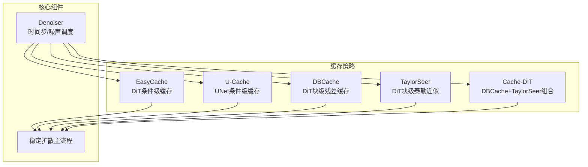
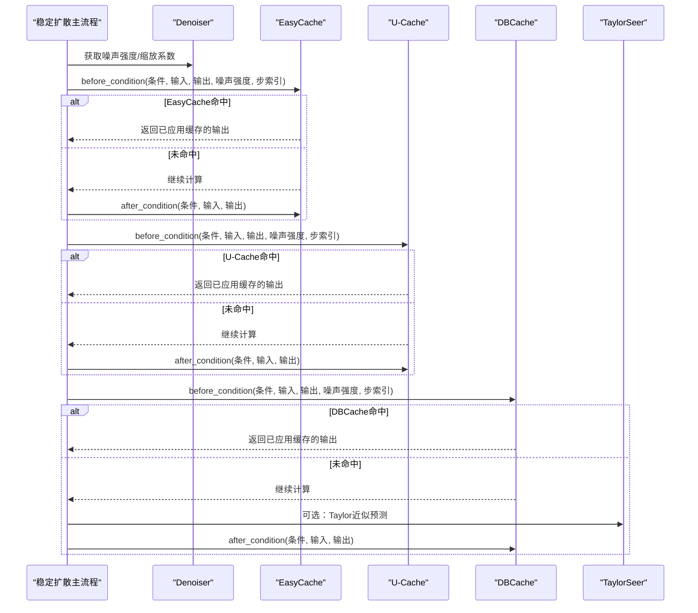
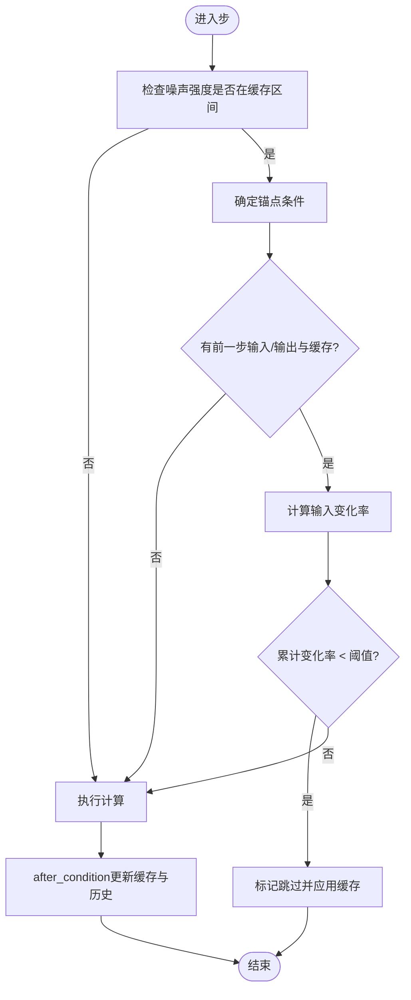
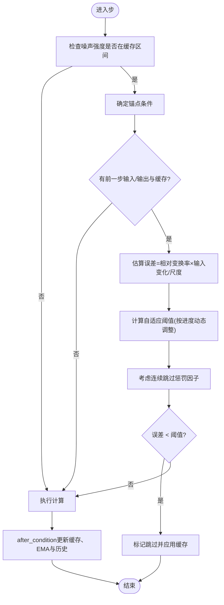
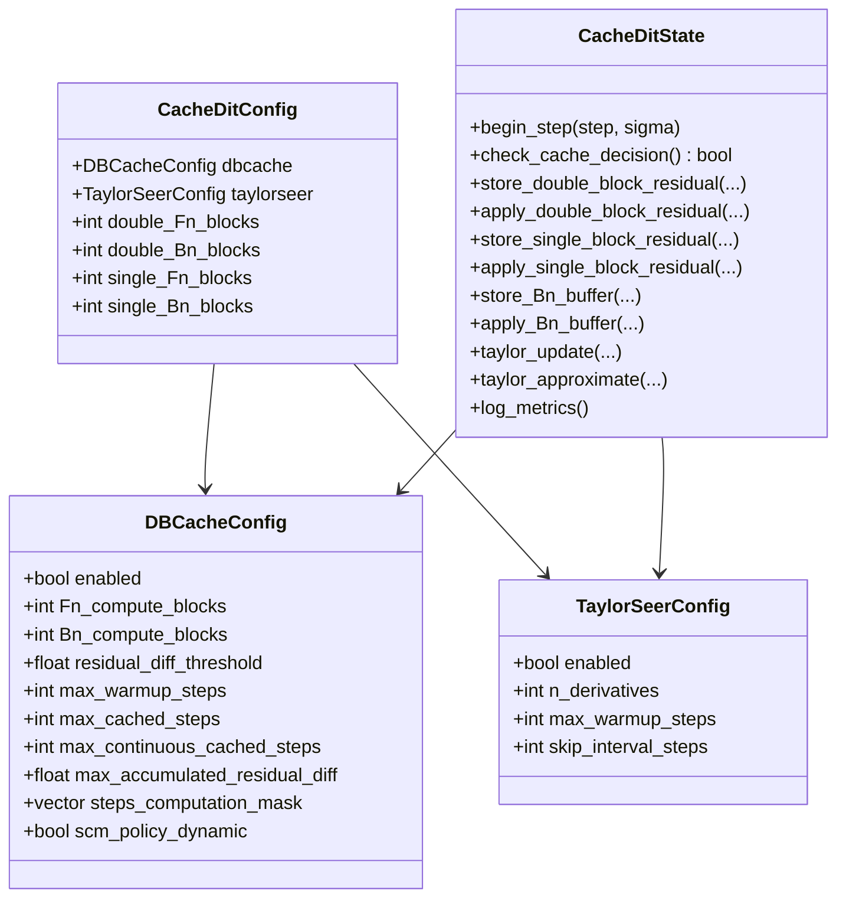
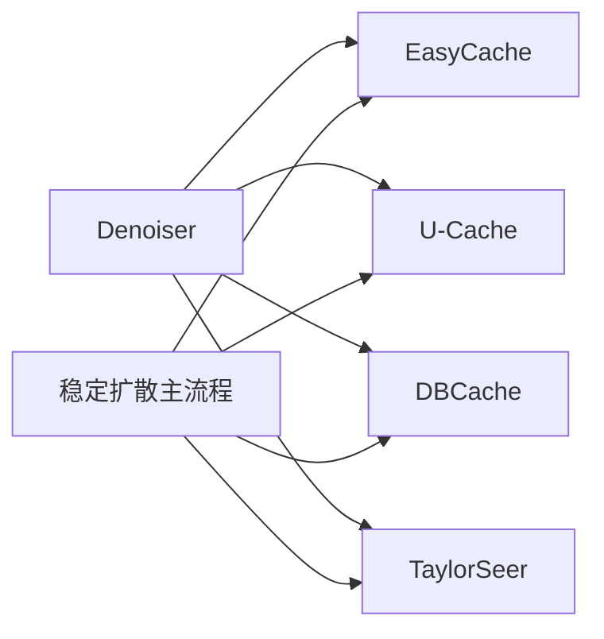

# 模型缓存系统

<cite>
**本文引用的文件**
- [easycache.hpp](file://src/easycache.hpp)
- [ucache.hpp](file://src/ucache.hpp)
- [cache_dit.hpp](file://src/cache_dit.hpp)
- [denoiser.hpp](file://src/denoiser.hpp)
- [stable-diffusion.cpp](file://src/stable-diffusion.cpp)
- [caching.md](file://docs/caching.md)
- [unet.hpp](file://src/unet.hpp)
- [vae.hpp](file://src/vae.hpp)
- [clip.hpp](file://src/clip.hpp)
- [common.hpp](file://examples/common/common.hpp)
</cite>

## 目录
1. [简介](#简介)
2. [项目结构](#项目结构)
3. [核心组件](#核心组件)
4. [架构总览](#架构总览)
5. [详细组件分析](#详细组件分析)
6. [依赖关系分析](#依赖关系分析)
7. [性能考量](#性能考量)
8. [故障排查指南](#故障排查指南)
9. [结论](#结论)
10. [附录](#附录)

## 简介
本文件系统性阐述该稳定扩散项目中的模型缓存体系，重点覆盖两种条件级缓存策略：EasyCache（适用于DiT类模型）与U-Cache（适用于UNet类模型），以及DiT专用的块级缓存与近似技术（DBCache/TaylorSeer/Cache-DIT）。文档从架构设计、数据流、生命周期管理、内存分配策略、淘汰与阈值决策、并发与一致性保障、性能监控与调优等方面进行深入解析，并结合官方文档与源码路径给出可操作的配置建议与实践案例。

## 项目结构
缓存系统主要由以下模块构成：
- 条件级缓存：EasyCache（DiT）、U-Cache（UNet）
- 块级缓存与近似：DBCache、TaylorSeer、Cache-DIT（组合）
- 调度器与采样：Denoiser（提供时间步到噪声强度映射）
- 集成入口：主推理流程在稳定扩散实现中统一接入缓存状态机
- 文档与示例：官方缓存文档与命令行参数解析

图表来源
- [easycache.hpp:1-265](file://src/easycache.hpp#L1-L265)
- [ucache.hpp:1-435](file://src/ucache.hpp#L1-L435)
- [cache_dit.hpp:1-976](file://src/cache_dit.hpp#L1-L976)
- [denoiser.hpp:1-200](file://src/denoiser.hpp#L1-L200)
- [stable-diffusion.cpp:1697-1867](file://src/stable-diffusion.cpp#L1697-L1867)

章节来源
- [easycache.hpp:1-265](file://src/easycache.hpp#L1-L265)
- [ucache.hpp:1-435](file://src/ucache.hpp#L1-L435)
- [cache_dit.hpp:1-976](file://src/cache_dit.hpp#L1-L976)
- [denoiser.hpp:1-200](file://src/denoiser.hpp#L1-L200)
- [stable-diffusion.cpp:1697-1867](file://src/stable-diffusion.cpp#L1697-L1867)

## 核心组件
- EasyCache（DiT条件级缓存）
  - 以条件对象为键缓存输出与输入的差分向量，基于输入变化阈值决定是否跳过当前步计算。
  - 关键字段：缓存表、前一步输入/输出、相对变换率、累计变化率、起止噪声阈值等。
- U-Cache（UNet条件级缓存）
  - 类似EasyCache，但引入误差累积与衰减、EMA输出变化、自适应阈值、连续跳过惩罚等机制。
  - 关键字段：误差累积、EMA输出变化、块级指标、自适应阈值、连续跳过计数等。
- DBCache（DiT块级残差缓存）
  - 基于L1残差差异阈值判断是否缓存块输出；支持预热期、最大缓存步数、连续缓存步数、累计残差阈值等约束。
  - 支持前/中/后块区域的差异化处理。
- TaylorSeer（DiT块级泰勒近似）
  - 使用导数序列与阶乘展开预测块输出，减少计算；支持导数阶数、预热步数、跳过间隔等参数。
- Cache-DIT（组合模式）
  - 同时启用DBCache与TaylorSeer，提供更灵活的块级缓存与近似策略。
- Denoiser
  - 提供时间步到噪声强度映射，用于确定缓存生效区间（起止百分比）。

章节来源
- [easycache.hpp:9-14](file://src/easycache.hpp#L9-L14)
- [ucache.hpp:12-24](file://src/ucache.hpp#L12-L24)
- [cache_dit.hpp:13-40](file://src/cache_dit.hpp#L13-L40)
- [denoiser.hpp:16-65](file://src/denoiser.hpp#L16-L65)

## 架构总览
缓存系统在推理主循环中按步骤被激活或跳过，通过条件对象锚定（anchor）与前后步对比，决定是否应用缓存或重新计算。Denoiser负责将时间步转换为噪声强度，从而确定缓存窗口。

图表来源
- [stable-diffusion.cpp:2005-2017](file://src/stable-diffusion.cpp#L2005-L2017)
- [easycache.hpp:152-212](file://src/easycache.hpp#L152-L212)
- [ucache.hpp:267-355](file://src/ucache.hpp#L267-L355)
- [cache_dit.hpp:366-389](file://src/cache_dit.hpp#L366-L389)

章节来源
- [stable-diffusion.cpp:2005-2017](file://src/stable-diffusion.cpp#L2005-L2017)
- [easycache.hpp:152-212](file://src/easycache.hpp#L152-L212)
- [ucache.hpp:267-355](file://src/ucache.hpp#L267-L355)
- [cache_dit.hpp:366-389](file://src/cache_dit.hpp#L366-L389)

## 详细组件分析

### EasyCache（DiT条件级缓存）
- 设计要点
  - 以条件对象为键缓存输出与输入的差分向量，避免重复计算。
  - 在指定噪声强度区间内启用，基于输入变化率与相对变换率累计阈值决定是否跳过。
  - 采用“锚点条件”机制，仅对锚点条件进行缓存更新，其他条件仅复用。
- 生命周期与状态
  - 初始化：读取阈值、起止百分比，转换为噪声强度边界。
  - 步开始：根据噪声强度判定是否进入活跃阶段。
  - before_condition：计算输入变化率，评估是否满足跳过条件。
  - after_condition：更新缓存与历史状态（输入/输出、变换率、均值范数）。
- 内存与分配
  - 缓存条目包含差分向量与历史向量，按张量元素数量动态分配。
  - 运行时重置函数清空缓存与历史，避免跨会话污染。
- 配置参数
  - threshold：输入变化阈值
  - start/end：缓存生效的步数百分比
- 适用场景
  - DiT类模型（如FLUX/QWEN），文本条件相近时可显著跳过计算。

图表来源
- [easycache.hpp:95-212](file://src/easycache.hpp#L95-L212)

章节来源
- [easycache.hpp:9-14](file://src/easycache.hpp#L9-L14)
- [easycache.hpp:66-75](file://src/easycache.hpp#L66-L75)
- [easycache.hpp:95-113](file://src/easycache.hpp#L95-L113)
- [easycache.hpp:152-212](file://src/easycache.hpp#L152-L212)
- [easycache.hpp:214-264](file://src/easycache.hpp#L214-L264)

### U-Cache（UNet条件级缓存）
- 设计要点
  - 引入误差累积与衰减、EMA输出变化、自适应阈值（随进度动态调整）、连续跳过惩罚。
  - 支持相对阈值（按输出范数缩放）与错误重置策略。
- 生命周期与状态
  - 初始化：读取阈值、衰减率、相对阈值开关、重置策略等。
  - set_sigmas：根据采样步序列确定起止噪声强度与期望总步数。
  - before_condition：计算估计误差，结合自适应阈值与连续跳过惩罚决定跳过。
  - after_condition：更新缓存、历史状态与EMA。
- 内存与分配
  - 与EasyCache类似，按元素数分配差分与历史向量。
  - 增加块级指标统计，便于日志输出。
- 配置参数
  - threshold、start、end、decay、relative、reset、adaptive、early/late倍率、相对增益等。
- 适用场景
  - UNet类模型，尤其对稳定性要求更高的采样器（如euler_a）可选择不重置误差。

图表来源
- [ucache.hpp:178-355](file://src/ucache.hpp#L178-L355)

章节来源
- [ucache.hpp:12-24](file://src/ucache.hpp#L12-L24)
- [ucache.hpp:126-135](file://src/ucache.hpp#L126-L135)
- [ucache.hpp:137-158](file://src/ucache.hpp#L137-L158)
- [ucache.hpp:267-355](file://src/ucache.hpp#L267-L355)
- [ucache.hpp:357-420](file://src/ucache.hpp#L357-L420)

### DBCache/TaylorSeer/Cache-DIT（DiT块级缓存与近似）
- DBCache（块级残差缓存）
  - 以L1残差差异阈值作为缓存决策依据，支持预热期、最大缓存步数、连续缓存步数、累计残差阈值等约束。
  - 区分前/Fn、中间/Mn、后/Bn块区域，分别设定计算/缓存策略。
- TaylorSeer（块级泰勒近似）
  - 基于导数序列与阶乘展开预测块输出，减少计算；支持导数阶数、预热步数、跳过间隔等。
- Cache-DIT（组合）
  - 同时启用DBCache与TaylorSeer，提供更灵活的块级缓存与近似策略；支持预设（slow/medium/fast/ultra）与SCM（Steps Computation Mask）策略。
- 生命周期与状态
  - 初始化：读取阈值、预热步数、块数配置等。
  - begin_step/end_step：记录步状态与缓存步列表。
  - check_cache_decision：计算残差差异并决定是否缓存。
  - store/apply_block_cache：存储与应用块级残差缓存。
  - taylor_update/approximate：更新与预测导数序列。
- 配置参数
  - Fn/Bn：前/后块始终计算的数量
  - threshold：L1残差差异阈值
  - warmup：预热步数
  - 预设与SCM策略（动态/静态）

图表来源
- [cache_dit.hpp:13-40](file://src/cache_dit.hpp#L13-L40)
- [cache_dit.hpp:175-195](file://src/cache_dit.hpp#L175-L195)
- [cache_dit.hpp:366-389](file://src/cache_dit.hpp#L366-L389)
- [cache_dit.hpp:397-472](file://src/cache_dit.hpp#L397-L472)
- [cache_dit.hpp:501-515](file://src/cache_dit.hpp#L501-L515)

章节来源
- [cache_dit.hpp:13-40](file://src/cache_dit.hpp#L13-L40)
- [cache_dit.hpp:175-195](file://src/cache_dit.hpp#L175-L195)
- [cache_dit.hpp:366-389](file://src/cache_dit.hpp#L366-L389)
- [cache_dit.hpp:397-472](file://src/cache_dit.hpp#L397-L472)
- [cache_dit.hpp:501-515](file://src/cache_dit.hpp#L501-L515)

### Denoiser与缓存区间映射
- Denoiser提供时间步到噪声强度的映射，缓存策略据此将“步数百分比”转换为“噪声强度区间”，确保缓存在合适的去噪阶段生效。
- EasyCache/U-Cache/Cache-DIT均通过此映射确定起止sigma，从而限定缓存窗口。

章节来源
- [denoiser.hpp:16-65](file://src/denoiser.hpp#L16-L65)
- [easycache.hpp:81-93](file://src/easycache.hpp#L81-L93)
- [ucache.hpp:164-176](file://src/ucache.hpp#L164-L176)
- [cache_dit.hpp:773-795](file://src/cache_dit.hpp#L773-L795)

## 依赖关系分析
- 缓存策略依赖Denoiser提供的噪声强度映射，以确定缓存窗口。
- 主流程在每步调用before_condition/after_condition接口，实现条件级缓存的统一接入。
- 不同模型类型（UNet/DiT）对应不同的缓存策略：UNet使用U-Cache，DiT使用EasyCache或Cache-DIT（含DBCache/TaylorSeer）。

图表来源
- [stable-diffusion.cpp:1697-1867](file://src/stable-diffusion.cpp#L1697-L1867)
- [easycache.hpp:66-75](file://src/easycache.hpp#L66-L75)
- [ucache.hpp:126-135](file://src/ucache.hpp#L126-L135)
- [cache_dit.hpp:175-195](file://src/cache_dit.hpp#L175-L195)

章节来源
- [stable-diffusion.cpp:1697-1867](file://src/stable-diffusion.cpp#L1697-L1867)
- [easycache.hpp:66-75](file://src/easycache.hpp#L66-L75)
- [ucache.hpp:126-135](file://src/ucache.hpp#L126-L135)
- [cache_dit.hpp:175-195](file://src/cache_dit.hpp#L175-L195)

## 性能考量
- 缓存命中率与速度提升
  - EasyCache：在DiT模型上，若输入变化小则可跳过计算，显著降低算力消耗。
  - U-Cache：通过误差累积与自适应阈值，平衡质量与速度；相对阈值与重置策略影响稳定性。
  - Cache-DIT：结合DBCache与TaylorSeer，适合复杂DiT模型，预设与SCM策略可进一步优化。
- 内存占用
  - 条件级缓存按元素数分配差分与历史向量；块级缓存按块数与隐藏维度分配残差缓冲。
  - 建议在长序列或高分辨率下谨慎设置最大缓存步数与连续缓存步数，避免内存膨胀。
- 并发与一致性
  - 当前实现为单线程推理流程，缓存状态在每步更新，无需显式锁保护。
  - 若扩展至多线程，需在before_condition/after_condition之间增加互斥保护，防止竞态。

章节来源
- [easycache.hpp:128-150](file://src/easycache.hpp#L128-L150)
- [ucache.hpp:241-265](file://src/ucache.hpp#L241-L265)
- [cache_dit.hpp:397-472](file://src/cache_dit.hpp#L397-L472)
- [stable-diffusion.cpp:2271-2331](file://src/stable-diffusion.cpp#L2271-L2331)

## 故障排查指南
- 参数校验失败
  - EasyCache/U-Cache：阈值必须非负，起止百分比需满足范围与顺序要求。
  - 命令行参数解析会在非法时返回错误并禁用缓存。
- 缓存不生效
  - 检查模型类型是否匹配：EasyCache仅适用于DiT模型，U-Cache仅适用于UNet模型。
  - 检查缓存区间（start/end）是否与采样步数匹配；可通过日志确认缓存启用状态。
- 质量问题
  - 降低阈值可提高质量但减少跳过机会；提高阈值可加速但可能引入伪影。
  - 对euler_a等采样器，建议关闭误差重置以增强稳定性。
- 性能瓶颈定位
  - 观察日志中的跳过步数与估计加速比，评估缓存收益。
  - Cache-DIT提供块级缓存比例与累计残差差异，辅助优化阈值与预设。

章节来源
- [common.hpp:1749-1884](file://examples/common/common.hpp#L1749-L1884)
- [stable-diffusion.cpp:1697-1705](file://src/stable-diffusion.cpp#L1697-L1705)
- [stable-diffusion.cpp:1711-1758](file://src/stable-diffusion.cpp#L1711-L1758)
- [stable-diffusion.cpp:2271-2331](file://src/stable-diffusion.cpp#L2271-L2331)
- [caching.md:1-150](file://docs/caching.md#L1-L150)

## 结论
该缓存系统通过条件级与块级策略，针对不同模型架构实现了高效且可控的推理加速。EasyCache与U-Cache分别面向DiT与UNet，具备明确的阈值与区间控制；Cache-DIT则在DiT上提供了更精细的块级缓存与近似能力。通过合理的参数配置与日志监控，可在保证质量的前提下获得显著的性能收益。

## 附录

### 缓存配置参数详解
- EasyCache（DiT）
  - threshold：输入变化阈值
  - start/end：缓存生效的步数百分比
- U-Cache（UNet）
  - threshold：误差阈值
  - start/end：缓存生效的步数百分比
  - decay：误差衰减率（0-1）
  - relative：是否按输出范数缩放阈值
  - reset：计算后是否重置误差
  - adaptive/early/late倍率：按进度动态调整阈值
  - relative_norm_gain：相对范数增益因子
- Cache-DIT（DiT）
  - Fn/Bn：前/后块始终计算数量
  - threshold：L1残差差异阈值
  - warmup：预热步数
  - 预设：slow/medium/fast/ultra
  - SCM策略：dynamic/static

章节来源
- [caching.md:24-120](file://docs/caching.md#L24-L120)
- [easycache.hpp:9-14](file://src/easycache.hpp#L9-L14)
- [ucache.hpp:12-24](file://src/ucache.hpp#L12-L24)
- [cache_dit.hpp:13-40](file://src/cache_dit.hpp#L13-L40)

### 实际使用示例与优化案例
- 命令行示例
  - EasyCache：--cache-mode easycache --cache-option "threshold=0.3"
  - U-Cache：--cache-mode ucache --cache-option "threshold=1.5"
  - Cache-DIT：--cache-mode cache-dit --cache-preset fast
- 优化建议
  - 先以默认阈值运行，再根据输出质量微调。
  - 更多步数通常带来更多缓存机会；适当提高阈值可进一步提速。
  - 对euler_a等采样器，建议关闭误差重置以提升稳定性。

章节来源
- [caching.md:20-128](file://docs/caching.md#L20-L128)
- [common.hpp:1749-1884](file://examples/common/common.hpp#L1749-L1884)

### 不同模型组件的缓存机制
- UNet
  - 适用U-Cache；通过条件级差分缓存实现跳过。
- VAE
  - 未见专门的VAE缓存策略实现；推理流程中未见缓存相关逻辑。
- CLIP
  - 未见专门的CLIP缓存策略实现；推理流程中未见缓存相关逻辑。
- DiT（FLUX/QWEN等）
  - 可使用EasyCache或Cache-DIT（含DBCache/TaylorSeer）；块级策略更适合复杂结构。

章节来源
- [unet.hpp:1-200](file://src/unet.hpp#L1-L200)
- [vae.hpp:1-200](file://src/vae.hpp#L1-L200)
- [clip.hpp:1-200](file://src/clip.hpp#L1-L200)
- [cache_dit.hpp:1-976](file://src/cache_dit.hpp#L1-L976)