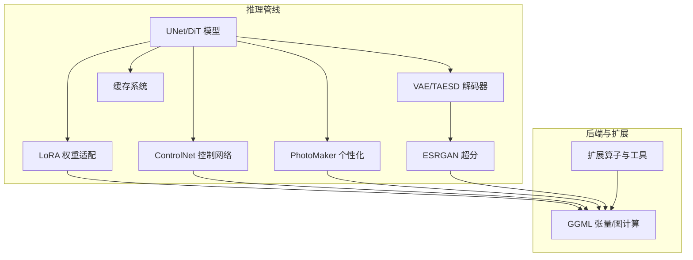
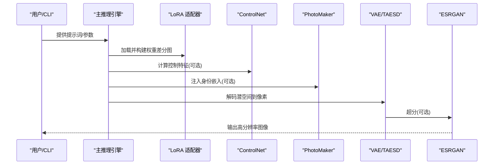
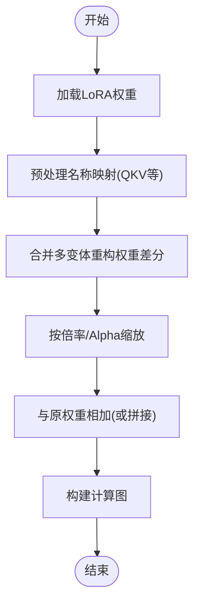
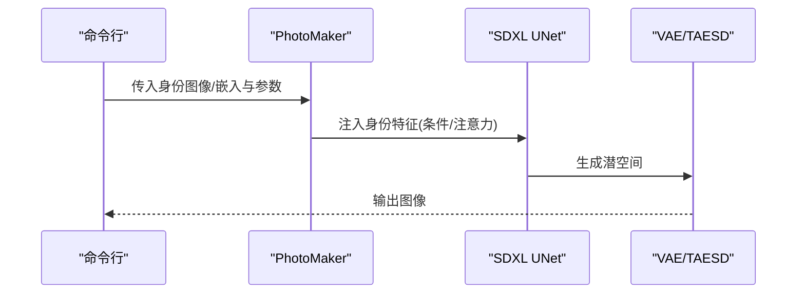
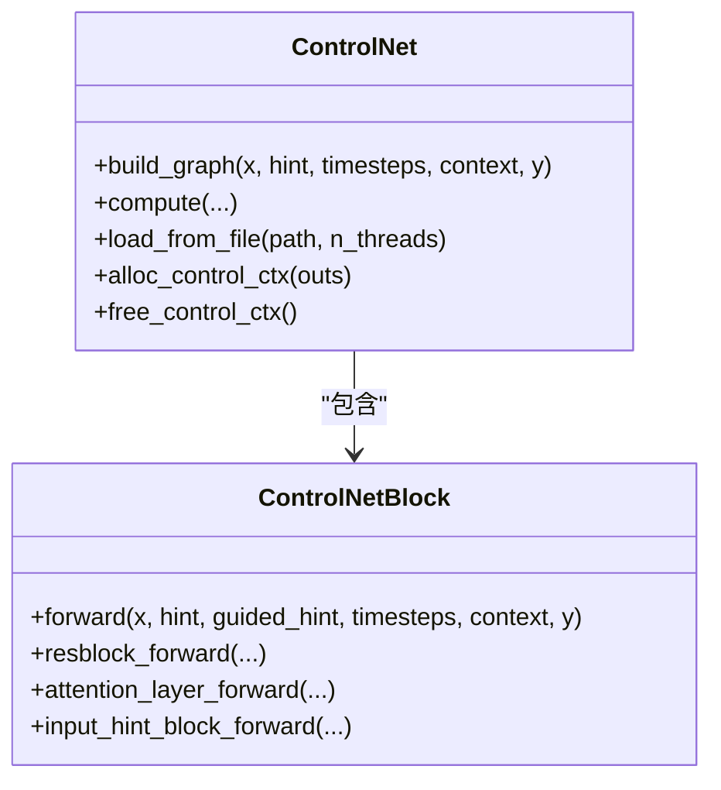
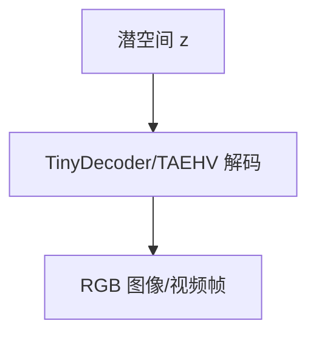
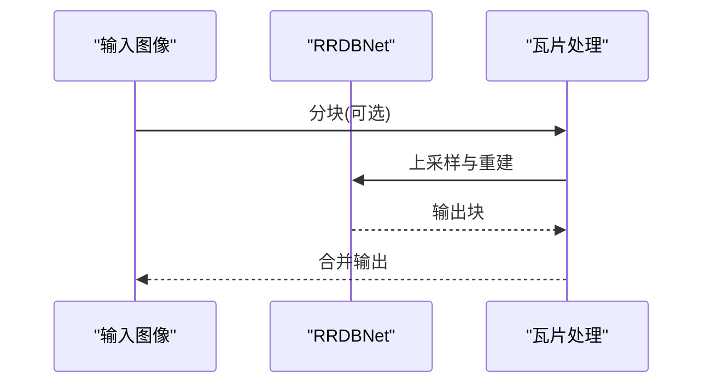
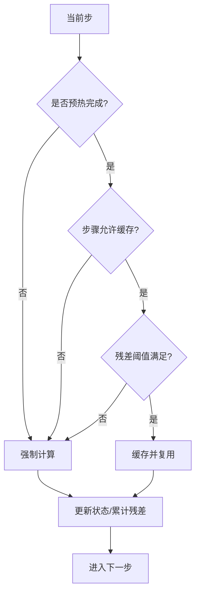
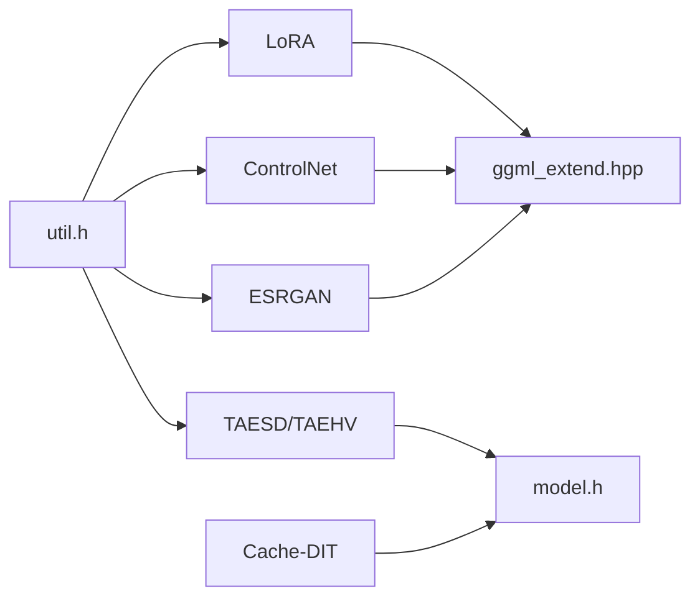

# 高级特性

<cite>
**本文引用的文件**
- [lora.hpp](file://src/lora.hpp)
- [control.hpp](file://src/control.hpp)
- [tae.hpp](file://src/tae.hpp)
- [esrgan.hpp](file://src/esrgan.hpp)
- [cache_dit.hpp](file://src/cache_dit.hpp)
- [model.h](file://src/model.h)
- [ggml_extend.hpp](file://src/ggml_extend.hpp)
- [upscaler.cpp](file://src/upscaler.cpp)
- [util.h](file://src/util.h)
- [lora.md](file://docs/lora.md)
- [photo_maker.md](file://docs/photo_maker.md)
- [taesd.md](file://docs/taesd.md)
- [esrgan.md](file://docs/esrgan.md)
- [caching.md](file://docs/caching.md)
</cite>

## 目录
1. [简介](#简介)
2. [项目结构](#项目结构)
3. [核心组件](#核心组件)
4. [架构总览](#架构总览)
5. [详细组件分析](#详细组件分析)
6. [依赖关系分析](#依赖关系分析)
7. [性能考量](#性能考量)
8. [故障排查指南](#故障排查指南)
9. [结论](#结论)
10. [附录](#附录)

## 简介
本文件面向高级用户与开发者，系统化梳理稳定扩散.cpp中的高级特性：LoRA微调（含多种变体）、PhotoMaker个性化、ControlNet控制网络、TAESD加速解码、ESRGAN图像超分、以及模型缓存系统（含多种缓存策略）。文档在不直接展示源码的前提下，通过文件路径与行号定位关键实现，辅以图示帮助理解数据流与控制流，并提供参数配置与最佳实践建议。

## 项目结构
围绕高级特性，相关代码主要分布在以下模块：
- LoRA与权重适配：src/lora.hpp
- ControlNet控制网络：src/control.hpp
- VAE/TAESD与视频自动编码器：src/tae.hpp
- ESRGAN超分：src/esrgan.hpp 与 src/upscaler.cpp
- 缓存系统（DiT/UNet）：src/cache_dit.hpp
- 模型版本与通用类型：src/model.h
- 扩展算子与工具：src/ggml_extend.hpp
- 工具与日志：src/util.h
- 文档与使用说明：docs/*.md

**图表来源**
- [lora.hpp:750-800](file://src/lora.hpp#L750-L800)
- [control.hpp:309-463](file://src/control.hpp#L309-L463)
- [tae.hpp:536-620](file://src/tae.hpp#L536-L620)
- [esrgan.hpp:152-367](file://src/esrgan.hpp#L152-L367)
- [cache_dit.hpp:138-554](file://src/cache_dit.hpp#L138-L554)
- [ggml_extend.hpp:117-160](file://src/ggml_extend.hpp#L117-L160)

**章节来源**
- [model.h:23-54](file://src/model.h#L23-L54)

## 核心组件
- LoRA权重适配与多变体融合：支持LoRA、LoHa、LoKr等多种适配方式，动态构建权重差分图，按需缩放与拼接。
- ControlNet控制网络：可对输入latent叠加控制特征，输出多阶段引导张量，加速推理。
- TAESD/TAEHV：轻量VAE解码器，显著降低解码延迟；支持视频模式。
- ESRGAN：基于RRDB的超分网络，支持瓦片推理避免显存不足。
- 缓存系统：针对DiT/UNet提供条件级与块级缓存、误差阈值判断、泰勒近似等策略组合。

**章节来源**
- [lora.hpp:97-502](file://src/lora.hpp#L97-L502)
- [control.hpp:14-307](file://src/control.hpp#L14-L307)
- [tae.hpp:492-534](file://src/tae.hpp#L492-L534)
- [esrgan.hpp:152-367](file://src/esrgan.hpp#L152-L367)
- [cache_dit.hpp:138-554](file://src/cache_dit.hpp#L138-L554)

## 架构总览
下图展示高级特性在推理中的交互关系与数据通路。

**图表来源**
- [lora.hpp:750-800](file://src/lora.hpp#L750-L800)
- [control.hpp:377-438](file://src/control.hpp#L377-L438)
- [tae.hpp:569-620](file://src/tae.hpp#L569-L620)
- [esrgan.hpp:344-367](file://src/esrgan.hpp#L344-L367)

## 详细组件分析

### LoRA 微调
- 实现要点
  - 支持立即应用与运行时应用两种模式，自动根据量化参数选择更优模式。
  - 多变体权重合并：LoRA、LoHa、LoKr，统一通过权重差分图参与前向。
  - 动态名称映射与预处理（如QKV拆分），兼容不同模型结构。
  - 可按通道或卷积分支进行线性/卷积路径的LoRA前向。
- 关键接口
  - 构建LoRA图：build_lora_graph
  - 获取权重差分：get_weight_diff/get_lora_weight_diff/get_loha_weight_diff/get_lokr_weight_diff
  - 运行时前向：get_out_diff
- 使用参考
  - 命令行参数与模式说明见文档。

**图表来源**
- [lora.hpp:97-130](file://src/lora.hpp#L97-L130)
- [lora.hpp:471-502](file://src/lora.hpp#L471-L502)
- [lora.hpp:504-748](file://src/lora.hpp#L504-L748)

**章节来源**
- [lora.hpp:9-95](file://src/lora.hpp#L9-L95)
- [lora.hpp:750-800](file://src/lora.hpp#L750-L800)
- [lora.md:1-27](file://docs/lora.md#L1-L27)

### PhotoMaker 个性化
- 工作机制
  - 仅支持SDXL系列模型。
  - 支持V1/V2两个版本：V2需要先用Python脚本生成id_embeds，再在推理中复用。
  - 在提示词中使用“类词+触发词”格式，配合风格强度参数控制个性化程度。
- 关键参数
  - --photo-maker 指定模型路径
  - --pm-id-images-dir 或 --pm-id-embed-path 指定身份图像或嵌入
  - --pm-style-strength 控制风格强度
  - 推荐CFG/尺寸参数以获得更佳质量
- 注意事项
  - 低显存GPU建议开启VAE CPU卸载以避免伪影。

**图表来源**
- [photo_maker.md:1-54](file://docs/photo_maker.md#L1-L54)

**章节来源**
- [photo_maker.md:1-54](file://docs/photo_maker.md#L1-L54)

### ControlNet 控制
- 结构与前向
  - 内置ControlNetBlock，包含时间嵌入、残差块、注意力层、下采样与零卷积等。
  - 输入latent与hint图像，输出多阶段引导张量，用于后续UNet各层的条件注入。
  - 支持缓存guided_hint以提升重复推理效率。
- 关键接口
  - build_graph/compute：构建与执行控制网络图
  - load_from_file：从权重文件加载参数

**图表来源**
- [control.hpp:14-307](file://src/control.hpp#L14-L307)
- [control.hpp:309-463](file://src/control.hpp#L309-L463)

**章节来源**
- [control.hpp:14-307](file://src/control.hpp#L14-L307)
- [control.hpp:309-463](file://src/control.hpp#L309-L463)

### TAESD/TAEHV 加速解码
- TAESD（图像）
  - 轻量解码器，显著减少解码时间；支持Flux2等模型的patchified latent。
- TAEHV（视频）
  - 支持视频帧序列的编码/解码，可选patch大小，适合长视频或TI2V任务。
- 使用建议
  - 将原有VAE替换为TAESD/TAEHV；若显存仍不足，可启用直通卷积或降精度。

**图表来源**
- [tae.hpp:492-534](file://src/tae.hpp#L492-L534)
- [tae.hpp:622-693](file://src/tae.hpp#L622-L693)

**章节来源**
- [tae.hpp:492-534](file://src/tae.hpp#L492-L534)
- [tae.hpp:622-693](file://src/tae.hpp#L622-L693)
- [taesd.md:1-40](file://docs/taesd.md#L1-L40)

### ESRGAN 图像超分
- 网络结构
  - RRDBNet由多个RRDB组成，采用密集连接与残差块，支持多尺度上采样。
  - 自动检测模型规模与层数，兼容不同格式权重。
- 推理流程
  - 瓦片推理避免显存溢出；支持直通卷积优化。
  - 输出裁剪到[0,1]范围。

**图表来源**
- [esrgan.hpp:152-367](file://src/esrgan.hpp#L152-L367)
- [upscaler.cpp:67-110](file://src/upscaler.cpp#L67-L110)

**章节来源**
- [esrgan.hpp:152-367](file://src/esrgan.hpp#L152-L367)
- [upscaler.cpp:67-110](file://src/upscaler.cpp#L67-L110)
- [esrgan.md:1-10](file://docs/esrgan.md#L1-L10)

### 缓存系统（DiT/UNet）
- 组合策略
  - DBCache：基于块级L1残差阈值的块级缓存
  - TaylorSeer：基于泰勒展开的预测缓存
  - Cache-DIT：二者的组合，支持步进掩码与预设
- 关键指标
  - 阈值、预热步数、累计残差、连续缓存步数、缓存命中率等
- 参数与预设
  - 支持阈值、Fn/Bn块数量、预热步数、步进掩码策略等
  - 提供slow/medium/fast/ultra预设

**图表来源**
- [cache_dit.hpp:243-289](file://src/cache_dit.hpp#L243-L289)
- [cache_dit.hpp:366-389](file://src/cache_dit.hpp#L366-L389)
- [caching.md:58-121](file://docs/caching.md#L58-L121)

**章节来源**
- [cache_dit.hpp:138-554](file://src/cache_dit.hpp#L138-L554)
- [caching.md:1-150](file://docs/caching.md#L1-L150)

## 依赖关系分析
- LoRA依赖GGML扩展算子进行权重合并、缩放与拼接。
- ControlNet依赖GGML图构建与后端执行。
- TAESD/TAEHV依赖模型版本判定与张量形状变换。
- ESRGAN依赖瓦片工具与后端选择。
- 缓存系统与模型版本、采样步数密切相关。

**图表来源**
- [ggml_extend.hpp:117-160](file://src/ggml_extend.hpp#L117-L160)
- [model.h:23-54](file://src/model.h#L23-L54)
- [util.h:1-94](file://src/util.h#L1-L94)

**章节来源**
- [ggml_extend.hpp:117-160](file://src/ggml_extend.hpp#L117-L160)
- [model.h:23-54](file://src/model.h#L23-L54)
- [util.h:1-94](file://src/util.h#L1-L94)

## 性能考量
- LoRA
  - 立即应用模式在量化参数下可能存在精度/兼容问题，但通常更快且内存占用更低；运行时应用模式更稳健。
- ControlNet
  - 缓存guided_hint可减少重复计算；注意hint输入的内存占用。
- TAESD/TAEHV
  - 显存紧张时可启用直通卷积或降低精度；视频模式需关注patch大小与帧数。
- ESRGAN
  - 瓦片大小与重叠因子影响显存与速度平衡；直通卷积可能牺牲速度换取稳定性。
- 缓存
  - 阈值越低质量越高但缓存机会越少；预设fast/ultra在速度与质量间折中。

[本节为通用指导，无需特定文件引用]

## 故障排查指南
- LoRA
  - 若出现维度不匹配或权重缺失，检查LoRA名称映射与模型版本；确认multiplier与alpha/scale设置。
- PhotoMaker
  - 确认仅使用SDXL模型；V2需先生成id_embeds；低显存建议开启VAE CPU卸载。
- ControlNet
  - 确保hint尺寸与输入latent一致；若显存不足，尝试禁用guided_hint缓存或降低批度。
- TAESD/TAEHV
  - 若解码异常，检查latent形状与patch大小；必要时启用直通卷积。
- ESRGAN
  - 瓦片推理失败时减小tile_size或关闭直通卷积；确保输出裁剪至[0,1]。
- 缓存
  - 若缓存导致质量下降，提高阈值或禁用缓存；检查步进掩码与预热步数。

**章节来源**
- [lora.hpp:97-130](file://src/lora.hpp#L97-L130)
- [photo_maker.md:1-54](file://docs/photo_maker.md#L1-L54)
- [control.hpp:331-367](file://src/control.hpp#L331-L367)
- [tae.hpp:518-533](file://src/tae.hpp#L518-L533)
- [upscaler.cpp:67-110](file://src/upscaler.cpp#L67-L110)
- [caching.md:144-150](file://docs/caching.md#L144-L150)

## 结论
本文系统梳理了稳定扩散.cpp中的LoRA、PhotoMaker、ControlNet、TAESD/TAEHV、ESRGAN与缓存系统的实现与使用方法。通过合理配置参数与选择合适策略，可在保证质量的前提下显著提升推理效率与用户体验。建议结合具体硬件与任务需求，优先尝试fast/ultra预设与TAESD/ESRGAN等加速方案，并在LoRA与ControlNet上充分利用名称映射与缓存能力。

[本节为总结，无需特定文件引用]

## 附录
- 命令行与参数参考
  - LoRA：参见文档说明与立即/运行时应用模式选择。
  - PhotoMaker：V1/V2使用差异与推荐参数。
  - TAESD/TAEHV：模型下载与替换VAE的步骤。
  - ESRGAN：超分模型选择与使用示例。
  - 缓存：多种模式与参数详解及预设。

**章节来源**
- [lora.md:1-27](file://docs/lora.md#L1-L27)
- [photo_maker.md:1-54](file://docs/photo_maker.md#L1-L54)
- [taesd.md:1-40](file://docs/taesd.md#L1-L40)
- [esrgan.md:1-10](file://docs/esrgan.md#L1-L10)
- [caching.md:1-150](file://docs/caching.md#L1-L150)